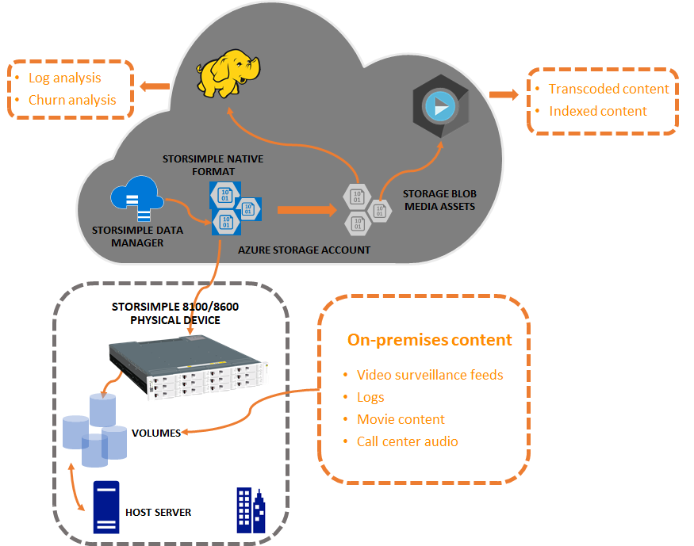

# StorSimple Data Manager overview

## Overview

Microsoft Azure StorSimple is a hybrid cloud storage solution that addresses the complexities of unstructured data commonly associated with file shares. StorSimple uses cloud storage as an extension of the on-premises solution and automatically tiers data across the on-premises storage and cloud storage. Integrated data protection, with local and cloud snapshots, eliminates the need for a sprawling storage infrastructure. Archival and disaster recovery is also seamless with the cloud acting as an offsite location.

The StorSimple Data Manager service allows you to seamlessly access the StorSimmple data in the cloud. The Data Transformation service then converts the StorSimple data and presents it to other Azure services such as Azure Media Services, Azure HDInsight that readily consume this data.

This article provides an overview of the StorSimple Data Manager solution. It also explains how you can use this service to write applications that use StorSimple data and other Azure services in the cloud.

## How does it work?

The StorSimple Data Manager service identifies the StorSimple data in the cloud from a StorSimple 8000 series on-premises device. The StorSimple data in the cloud is in native HCS format. The Data Manager service provides APIs to extract the native format data and convert it into other formats such as Azure blobs and Azure media assets. This converted data is then readily consumed by Azure HDInsight and Azure Media services. The data transformation thus enables these services to operate upon the converted StorSimple data from StorSimple 8000 series on-premises device. A high-level block diagram illustrating this is shown below.

## Data Manager components

The StorSimple Data Manager solution consists of the following components: 

## Data Manager usecases

## Security considerations

Your data stays secure when using the Data Manager service. The StorSimple data in cloud 

## Region availability

## 

## Next steps

[Use StorSimple Data Manager UI to transform your data](storsimple-data-manager-ui.md).