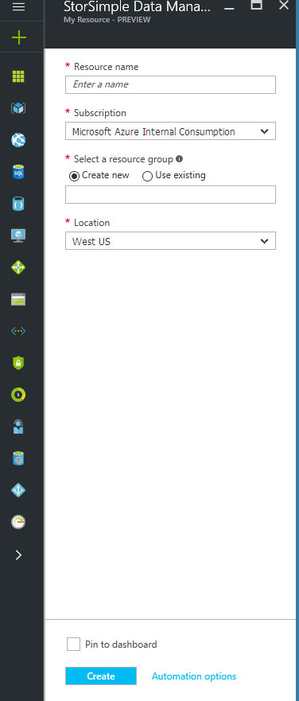
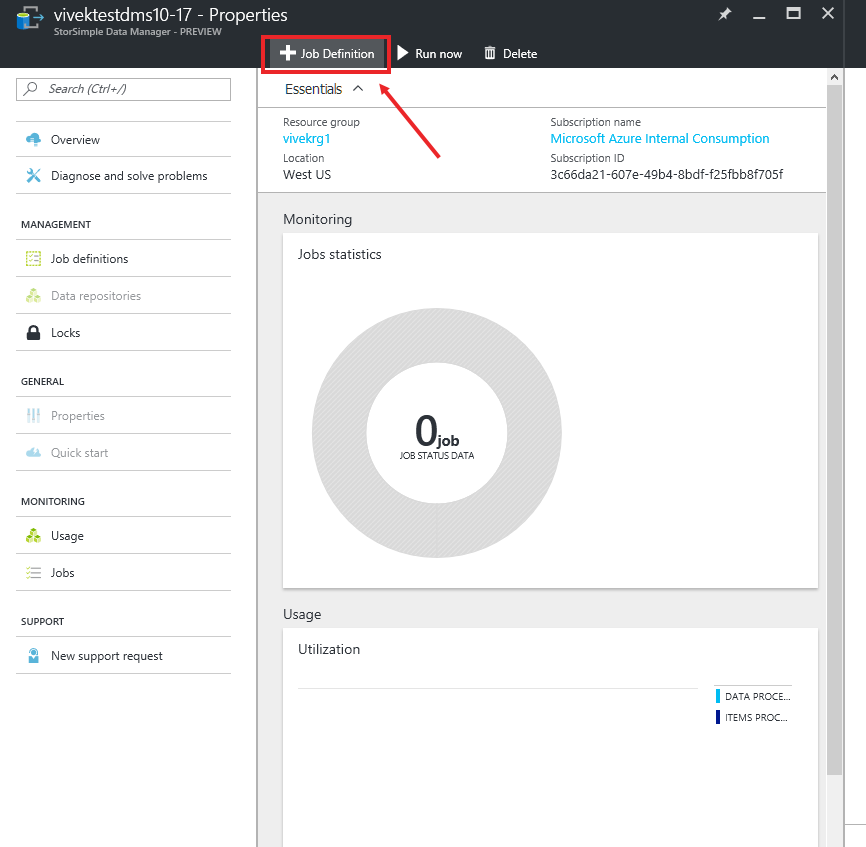
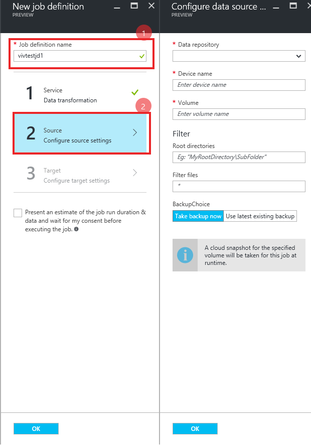
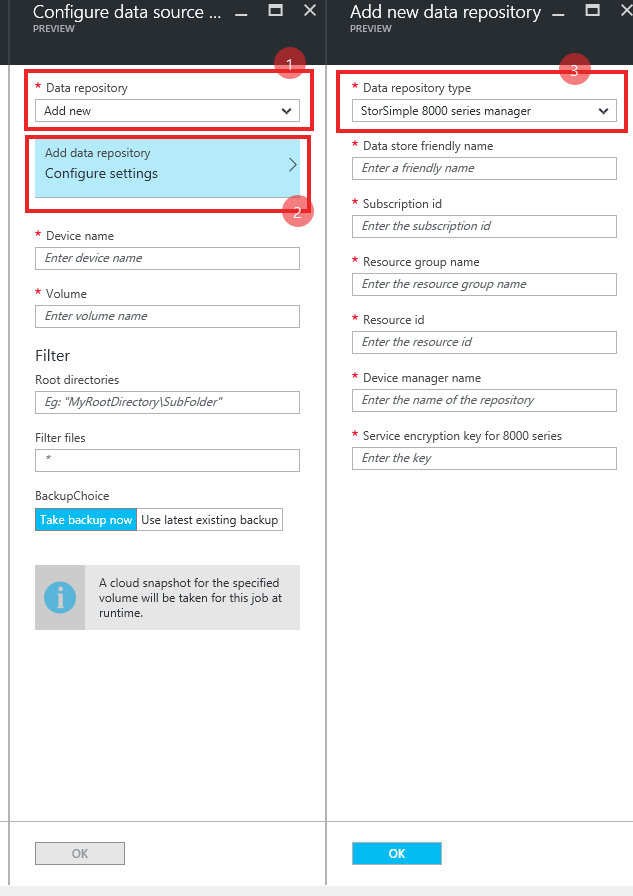
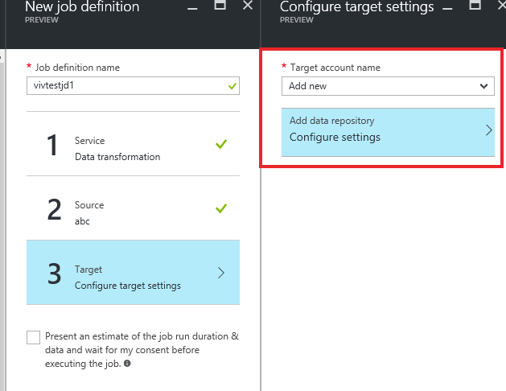
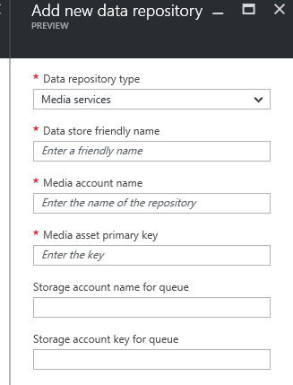
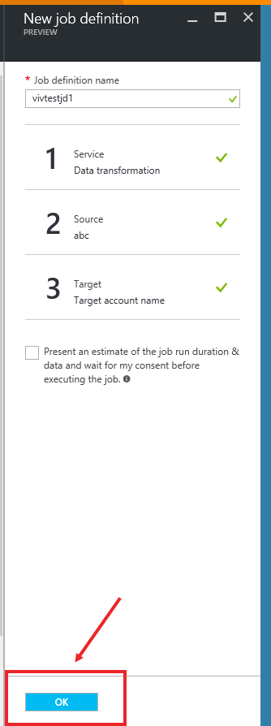
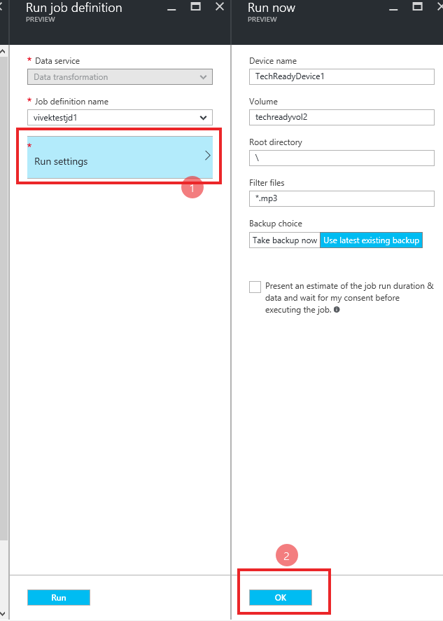
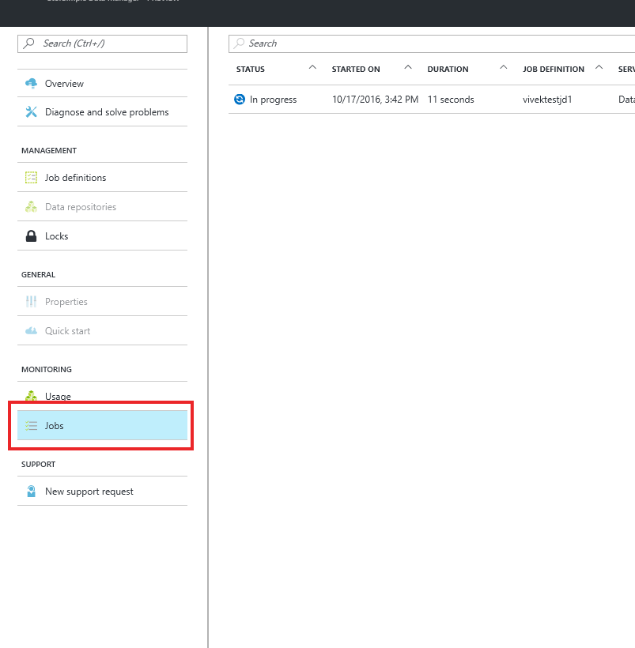

# Manage using the StorSimple Data Manager service UI (Private Preview)

This article explains how you can use the StorSimple Data Manager UI to perform data transformation on data residing on the StorSimple 8000 series devices. The transformed data can then be consumed by other Azure services such as Azure Media Services, Azure HDInsight, Azure Machine Learning, and Azure Search. 

## Use StorSimple Data Transformation

The StorSimple Data Manager is the resource within which Data Transformation can be instantiated. The Data Transformation service lets you move data from your StorSimple on-premises device to blobs in Azure storage. Hence, in workflow you need to specify the details about your StorSimple device and the data of interest that you want to move to the storage account.

### Create a StorSimple Data Manager service

Perform the following steps to create a StorSimple Data Manager service.

1. To create a StorSimple Data Manager service, go to [https://aka.ms/HybridDataManager](https://aka.ms/HybridDataManager)

2. Click the **+** icon and search for StorSimple Data Manager. Click your StorSimple Data Manager service and then click **Create**.

3. If your subscription is enabled for creating this service, you see the following blade.

    

4. Enter the inputs and click **Create**. The specified location should be the one that houses your storage accounts and your StorSimple Manager service. Currently, only West US and West Europe regions are supported. Hence, your StorSimple Manager service, Data Manager service, and the associated storage account should all be in the preceding supported regions. It takes about a minute to create the service.

### Create a data transformation job definition

Within a StorSimple Data Manager service, you need to create a data transformation job definition. A job definition specifies details of the data that you are interested in moving into a storage account in the native format. 

Perform the following steps to create a new data transformation job definition.

1.	Navigate to the service that you created. Click **+ Job Definition**.

    

2. The new job definition blade opens up. Give your job definition a name and click **Source**. In the **Configure data source** blade, specify the details of your StorSimple device and the data of interest.

    

3. Since this is a new Data Manager service, no data repositories are configured. To add your StorSimple Manager as a data repository, click **Add new** in the data repository dropdown and then click **Add Data Repository**.

4. Choose **StorSimple 8000 series Manager** as the repository type and enter the properties of your **StorSimple Manager**. For the **Resource Id** field, you need to enter the number before the **:** in the registration key of your StorSimple manager.

    

5.	Click **OK** when done. This saves your data repository and this StorSimple Manager can be reused in other job definitions without entering these parameters again. It takes a few seconds after you click **OK** for the StorSimple Manager to show up in the dropdown.

6.	In the **Configure data source** blade, enter the device name and the volume name that has your data of interest.

7.	In the **Filter** subsection, enter the root directory that contains your data of interest (this field should start with a `\`). You can also add any file filters here.

8.	The data transformation service works on the data that is pushed up to the Azure via snapshots. When running this job, you can choose to take a backup every time this job is run (to work on latest data) or to use the last existing backup in the cloud (if you are working on some archived data).

    

9. Next, the Target settings need to be configured. There are 2 types of supported targets – Azure Storage accounts and Azure Media Services accounts. Choose storage accounts to put files into blobs in that account. Choose media services account to put files into assets in that account. Again, we need to add a repository. In the dropdown, select **Add new** and then **Configure settings**.

    

10. Here, you can select the type of repository you want to add and the other parameters associated with the repository. In both cases, a storage queue is created when the job runs. This queue is populated with messages about transformed blobs as they are ready. The name of this queue is the same as the name of the job definition. If you select **Media Services** as the repo type, then you can also enter storage account credentials where the queue is created.

    

11.	After adding the data repository (which takes a few seconds), you will find the repo in the dropdown in the **Target account name**.  Choose the target that you need.

12.	Click **OK** to create the job definition. Your job definition is now set up. You can use this job definition multiple times via the UI.

    

### Run the job definition

Whenever you need to move data from StorSimple to the storage account that you have specified in the job definition, you will need to invoke it. There is some flexibility in changing the parameters every time you invoke the job. The steps are as follows:

1. Select your StorSimple Data Manager service and go to **Monitoring**. Click **Run Now**.

    

2. Choose the job definition that you want to run. Click **Run settings** to modify any settings that you might want to change for this job run.

    

3. Click **OK** and then click **Run** to launch your job. To monitor this job, go to the **Jobs** page in your StorSimple Data Manager.

    

4. In addition to monitoring in the **Jobs** blade, you can also listen on the storage queue where a message is added every time a file is moved from StorSimple to the storage account.

## Next steps

[Use .NET SDK to launch StorSimple Data Manager jobs](storsimple-data-manager-dotnet-jobs.md).