# Manage the StorSimple Data Manager service in Azure portal

This article explains how you can use the StorSimple Data Manager UI to transform the data residing on the StorSimple 8000 series devices. The transformed data can then be consumed by other Azure services such as Azure Media Services, Azure HDInsight, Azure Machine Learning, and Azure Cognitive Search.

## Use StorSimple Data Transformation

The StorSimple Data Manager is the resource within which data transformation is instantiated. The Data Transformation service lets you transform data from the StorSimple format to native format in blobs or Azure Files. To transform the StorSimple native format data, you need to specify the details about your StorSimple 8000 series device and the data of interest that you want to transform.

### Create a StorSimple Data Manager service

Perform the following steps to create a StorSimple Data Manager service.

1. Use your Microsoft account credentials to log on to the [Azure portal](https://portal.azure.com/).

2. Click **+ Create a resource** and search for StorSimple Data Manager.

    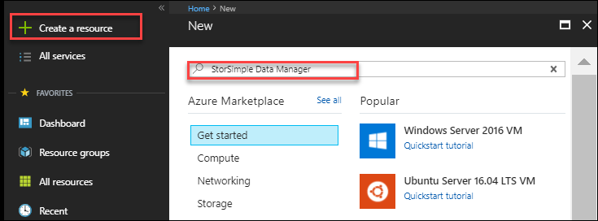

3. Click StorSimple Data Manager and then click **Create**.
    
    

3. For the new service, specify the following:

   1. Provide a unique **Service name** for your StorSimple Data Manager. This is a friendly name that can be used to identify the service. The name can have between 3 and 24 characters that can be letters, numbers, and hyphens. The name must start and end with a letter or a number.

   2. Choose a **Subscription** from the dropdown list. The subscription is linked to your billing account. This field is automatically populated (and not selectable) if you have only one subscription.

   3. Select an existing resource group or create a new group. For more information, see [Azure resource groups](https://azure.microsoft.com/documentation/articles/virtual-machines-windows-infrastructure-resource-groups-guidelines/).

   4. Specify the **Location** for your service that houses your storage accounts and your StorSimple Data Manager service. Your StorSimple Device Manager service, Data Manager service, and the associated storage account should all be in the supported regions.
    
   5. To get a link to this service on your dashboard, select **Pin to dashboard**.
    
   6. Click **Create**.

      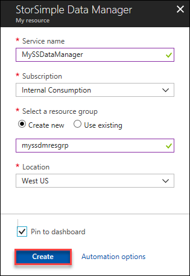

The service creation takes a few minutes. You see a notification after the service is successfully created and the new service is displayed.

### Create a data transformation job definition

Within a StorSimple Data Manager service, you need to create a data transformation job definition. A job definition specifies details of the StorSimple data that you are interested in moving into a storage account in the native format. Once you create a job definition, then you can run this job again with different runtime settings.

Perform the following steps to create a job definition.

1. Navigate to the service that you created. Go to **Management > Job definitions**.

2. Click **+ Job definition**.

    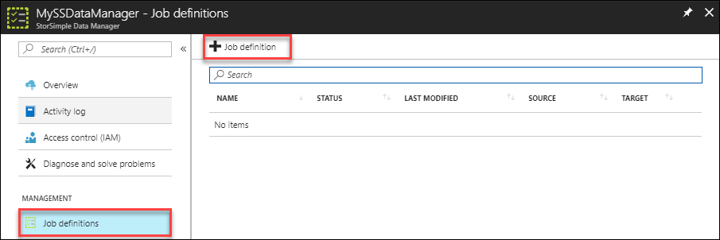

3. Provide a name for your job definition. The name can be between 3 and 63 characters. The name can contain uppercase and lowercase letters, numbers, and hyphens.

4. Specify a location where your job runs. This location can be different than the location where the service is deployed.

5. Click **Source** to specify the source data repository.

    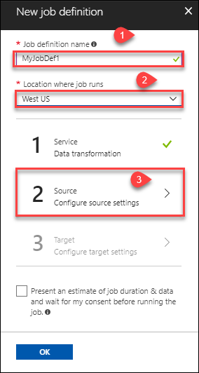

6. Since this is a new Data Manager service, no data repositories are configured. In **Configure data source**, specify the details of your StorSimple 8000 series device and the data of interest.

   To add your StorSimple Device Manager as a data repository, click **Add new** in the data repository dropdown and then click **Add Data Repository**.

    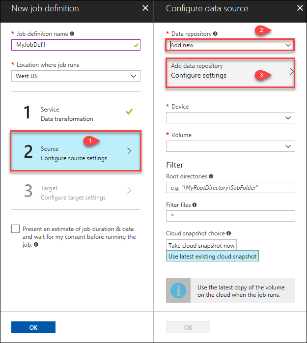
  
   1. Choose **StorSimple 8000 series Manager** as the data repository type.
    
   2. Enter a friendly name for your source data repository.
    
   3. From the dropdown list, choose a subscription associated with your StorSimple Device Manager service.
    
   4. Provide the name of the StorSimple Device Manager for the **Resource**.

   5. Enter the **Service data encryption** key for the StorSimple Device Manager service. 

      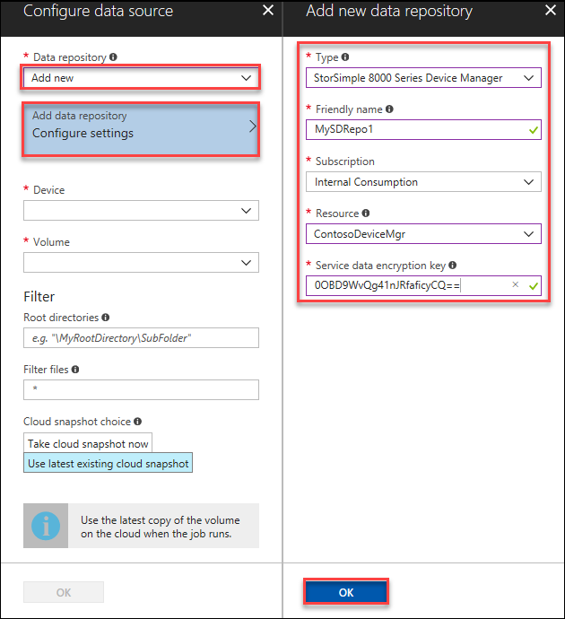

      Click **OK** when done. This saves your data repository. Reuse this StorSimple Device Manager in other job definitions without entering these parameters again. It takes a few seconds after you click **OK** for the newly created source data repository to show up in the dropdown.

7. From the dropdown list for **Data repository**, select the data repository you created. 

   1. Enter the name of the StorSimple 8000 series device that contains the data of interest.

   2. Specify the name of the volume residing on the StorSimple device that has your data of interest.

   3. In the **Filter** subsection, enter the root directory that contains your data of interest in _\MyRootDirectory\Data_ format. Drive letters such _\C:\Data_ are not supported. You can also add any file filters here.

   4. The data transformation service works on the data that is pushed up to the Azure via snapshots. When you run this job, you can choose to take a backup every time this job is run (to work on latest data) or use the last existing backup in the cloud (if you are working on some archived data).

   5. Click **OK**.

      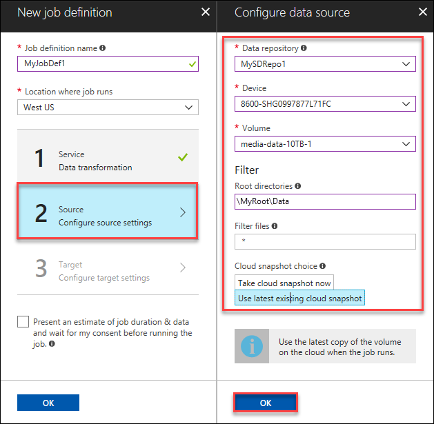

8. Next, the target data repository needs to be configured. Choose storage accounts to put files into blobs in that account. In the dropdown, select **Add new** and then **Configure settings**.

9. Select the type of target repository you want to add and the other parameters associated with the repository.

    If you select a Storage account type target, you can specify a friendly name, subscription (choose the same as that of the service or other), and a storage account.
        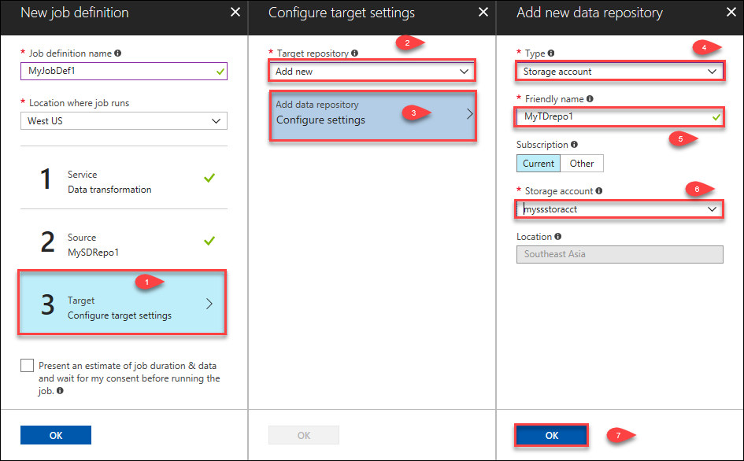

    A storage queue is created when the job runs. This queue is populated with messages about transformed blobs as they are ready. The name of this queue is the same as the name of the job definition.
    
10.	After you add the data repository, wait a couple minutes.
    
    1. Select the repository you created as the target from the dropdown list in the **Target account name**.

    2. Choose the storage type as blobs or files. Specify the name of the storage container where the transformed data resides. Click **OK**.

        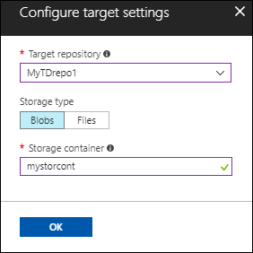

11. You can also check the option to present an estimate of job duration before you run the job. Click **OK** to create the job definition. Your job definition is now complete. You can use this job definition multiple times via the UI with different runtime settings.

    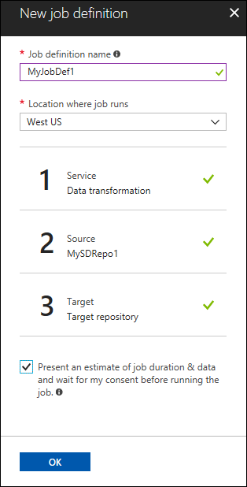

    The newly created job definition is added to the list of job definitions for this service.

### Run the job definition

Whenever you need to move data from StorSimple to the storage account that you have specified in the job definition, you need to run it. At runtime, some parameters can be specified differently. The steps are as follows:

1. Select your StorSimple Data Manager service and go to **Management > Job definitions**. Select and click the job definition that you want to run.
     
     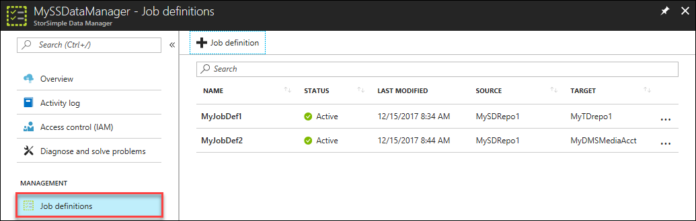

2. Click **Run Now**.
     
     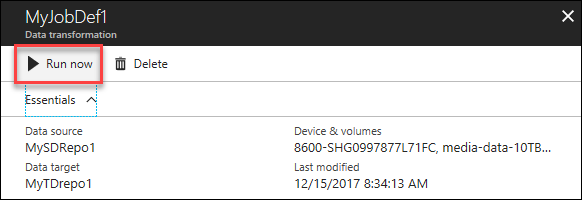

3. Click **Run settings** to modify any settings that you might want to change for this job run. Click **OK** and then click **Run** to launch your job.

    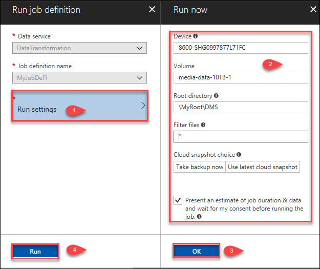

4. To monitor this job, go to **Jobs** in your StorSimple Data Manager. In addition to monitoring in the **Jobs** blade, you can also listen on the storage queue where a message is added every time a file is moved from StorSimple to the storage account.

    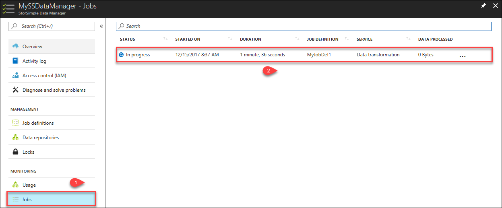

## Next steps

[Use .NET SDK to launch StorSimple Data Manager jobs](storsimple-data-manager-dotnet-jobs.md).
