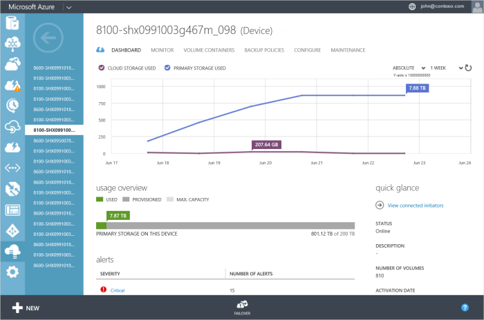

<properties 
   pageTitle="Use the StorSimple Manager device dashboard | Microsoft Azure"
   description="Describes the StorSimple Manager service device dashboard and how to use it to view storage metrics and connected initiators and find the serial number and IQN."
   services="storsimple"
   documentationCenter="NA"
   authors="alkohli"
   manager="carolz"
   editor="" />
<tags 
   ms.service="storsimple"
   ms.devlang="NA"
   ms.topic="article"
   ms.tgt_pltfrm="NA"
   ms.workload="TBD"
   ms.date="09/01/2015"
   ms.author="alkohli" />

# Use the StorSimple Manager device dashboard

## Overview

The StorSimple Manager device dashboard gives you an overview of information for a specific  StorSimple device, in contrast to the service dashboard, which gives you information about all of the devices included in your Microsoft Azure StorSimple solution.

The dashboard contains the following information:

- **Chart area** – You can see the relevant storage metrics in the chart area at the top of the dashboard. In this chart, you can view metrics for the total primary storage (the amount of data written by hosts to your device) and the total cloud storage consumed by your device over a period of time.

     In this context, *primary storage* refers to the total amount of data written by the host. It can include both locally stored data and data tiered to the cloud. *Cloud storage*, on the other hand, is a measurement of the total amount of data stored in the cloud. This includes tiered data and backups. Note that data stored in the cloud is deduplicated and compressed, whereas primary storage indicates the amount of storage used before the data is deduplicated and compressed. (You can compare these two numbers to get an idea of the compression rate.) For both primary and cloud storage, the amounts shown will be based on the tracking frequency you configure. For example, if you choose a one week frequency, then the chart will show data for each day in the previous week.
 
	 You can configure the chart as follows:

	 - To see the amount of cloud storage consumed over time, select the **CLOUD STORAGE USED** option. To see the total storage that has been written by the host, select the **PRIMARY STORAGE USED** option. In the illustration, both options are selected; therefore, the chart shows storage amounts for both cloud and primary storage. 
	 - Use the drop-down menu in the top-right corner of the chart to specify a 1-week, 1-month, 3-month, or 1-year time period. Note that the top-level chart is refreshed only one time per day, and therefore will reflect the previous day's totals.

     For more information, see [Use the StorSimple Manager service to monitor your StorSimple device](storsimple-monitor-device.md).

- **Usage overview** – In the **usage overview** area, you can see the amount of primary storage used, the amount of provisioned storage, and the maximum storage capacity for your device. By comparing these usage numbers to the maximum amount of storage that is available, you can see at a glance if you need to obtain additional storage. Note that this overview is updated every 15 minutes and, because of the difference in update frequency, may show different numbers than those shown in the chart area above, which is updated daily. For more information, see [Use the StorSimple Manager service to monitor your StorSimple device](storsimple-monitor-device.md).

- **Alerts** – The **alerts** area contains an overview of the alerts for your device. Alerts are grouped by severity, and a count is provided of the number of alerts at each severity level. Clicking the alert severity opens a scoped view of the alerts tab to show you only the alerts of that severity level for this device.

- **Jobs** – The **jobs** area shows you the outcome of recent job activity. This can assure you that the system is operating as expected, or it can let you know that you need to take corrective action. To see more information about recently completed jobs, click **Jobs succeeded in the last 24 hours**.

- The **quick glance** area on the right of the dashboard provides useful information such as device model, serial number, status, description, and number of volumes.

You can also configure failover and view connected initiators from the device dashboard.

The common tasks that can be performed on this page are:

- View connected initiators

- Find the device serial number

- Find the device target IQN

## View connected initiators

You can view the iSCSI initiators that are connected to your device by clicking the **View connected initiators** link provided in the **quick glance** area of your device dashboard. This page provides a tabular listing of the initiators that have successfully connected to your device. For each initiator, you can see:

- The iSCSI Qualified Name (IQN) of the connected initiator.

- The name of the access control record (ACR) that allows this connected initiator.

- The IP address of the connected initiator.

- The network interfaces that the initiator is connected to on your storage device. These can range from DATA 0 to DATA 5.

- All the volumes that the connected initiator is allowed to access according to the current ACR configuration.

If you see unexpected initiators in this list or do not see the expected ones, review your ACR configuration. A maximum of 512 initiators can connect to your device.

## Find the device serial number

You may need the device serial number when you configure Microsoft Multipath I/O (MPIO) on the device. Perform the following steps to find the device serial number.

#### To find the device serial number

1. Navigate to **Devices** > **Dashboard**.

2. In the right pane of the dashboard, locate the **quick glance** area.

3. Scroll down and locate the serial number.

## Find the device target IQN

You may need the device target IQN when you configure the Challenge Handshake Authentication Protocol (CHAP) on your StorSimple device. Perform the following steps to find the device target IQN.

### To find the device target IQN

1. Navigate to **Devices** > **Dashboard**.

1. In the right pane of the dashboard, locate the **quick glance** area.

1. Scroll down and locate the target IQN.

## Next steps

[Learn more about the StorSimple Manager service dashboard](storsimple-service-dashboard.md).
