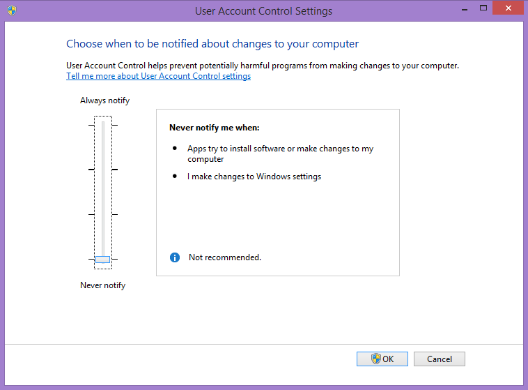
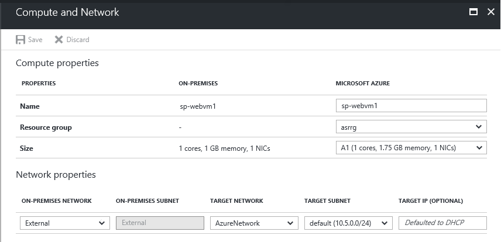
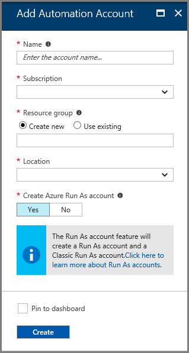
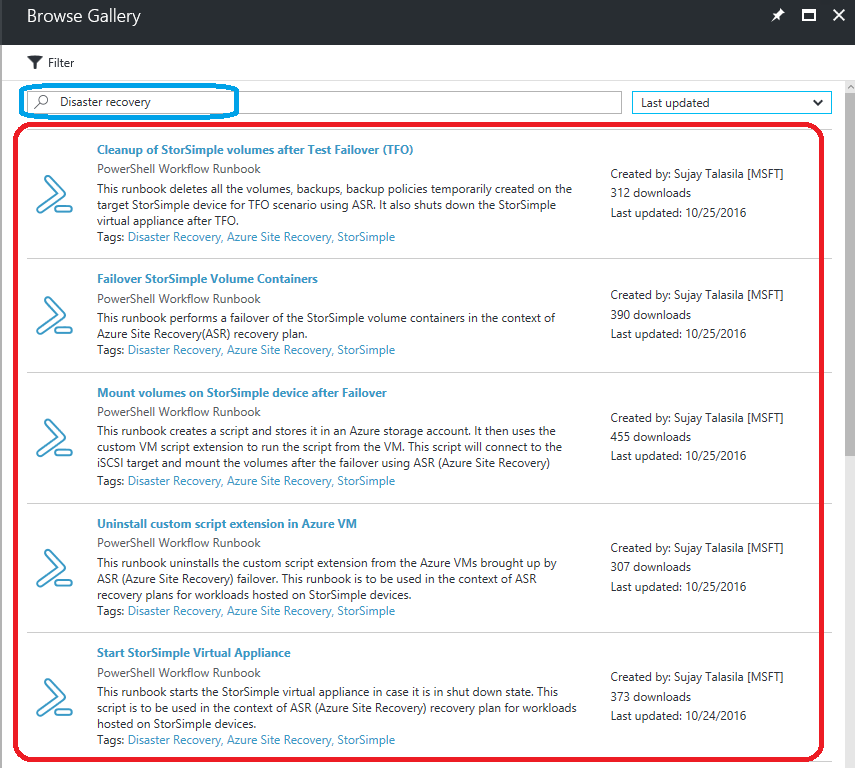
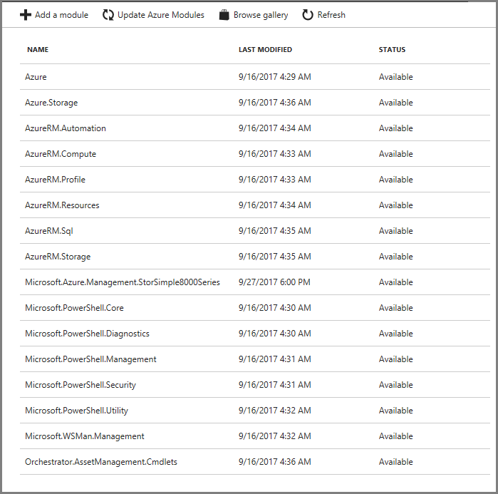
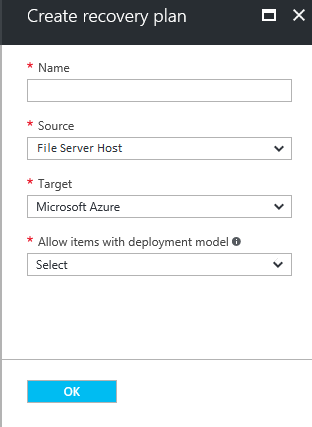
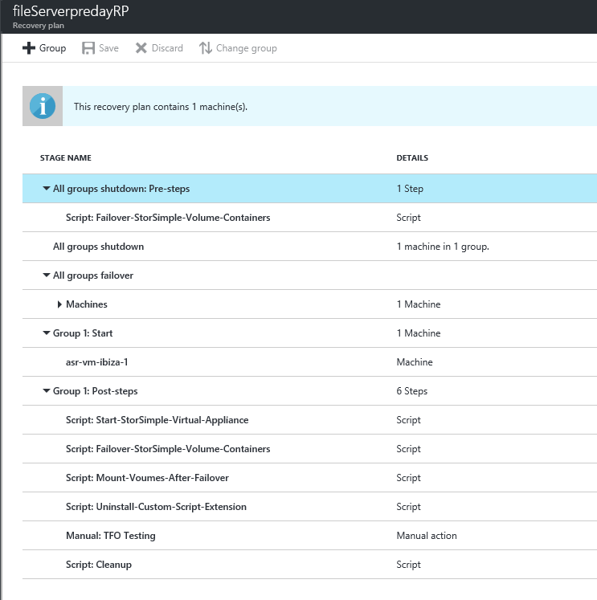
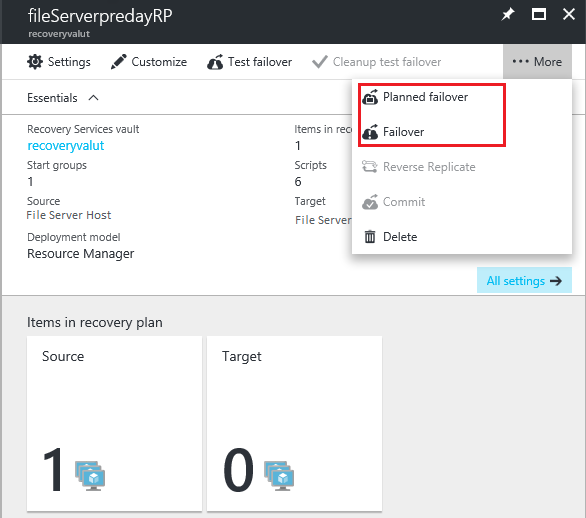

# Automated Disaster Recovery solution using Azure Site Recovery for file shares hosted on StorSimple

[!INCLUDE [updated-for-az](../../includes/updated-for-az.md)]

## Overview
Microsoft Azure StorSimple is a hybrid cloud storage solution that addresses the complexities of unstructured data commonly associated with file shares. StorSimple uses cloud storage as an extension of the on-premises solution and automatically tiers data across on-premises storage and cloud storage. Integrated data protection, with local and cloud snapshots, eliminates the need for a sprawling storage infrastructure.

[Azure Site Recovery](../site-recovery/site-recovery-overview.md) is an Azure-based service that provides disaster recovery (DR) capabilities by orchestrating replication, failover, and recovery of virtual machines. Azure Site Recovery supports a number of replication technologies to consistently replicate, protect, and seamlessly fail over virtual machines and applications to private/public or hosted clouds.

Using Azure Site Recovery, virtual machine replication, and StorSimple cloud snapshot capabilities, you can protect the complete file server environment. In the event of a disruption, you can use a single click to bring your file shares online in Azure in just a few minutes.

This document explains in detail how you can create a disaster recovery solution for your file shares hosted on StorSimple storage, and perform planned, unplanned, and test failovers using a one-click recovery plan. In essence, it shows how you can modify the Recovery Plan in your Azure Site Recovery vault to enable StorSimple failovers during disaster scenarios. In addition, it describes supported configurations and prerequisites. This document assumes that you are familiar with the basics of Azure Site Recovery and StorSimple architectures.

## Supported Azure Site Recovery deployment options
Customers can deploy file servers as physical servers or virtual machines (VMs) running on Hyper-V or VMware, and then create file shares from volumes carved out of StorSimple storage. Azure Site Recovery can protect both physical and virtual deployments to either a secondary site or to Azure. This document covers details of a DR solution with Azure as the recovery site for a file server VM hosted on Hyper-V and with file shares on StorSimple storage. Other scenarios in which the file server VM is on a VMware VM or a physical machine can be implemented similarly.

## Prerequisites
Implementing a one-click disaster recovery solution that uses Azure Site Recovery for file shares hosted on StorSimple storage has the following prerequisites:

   - On-premises Windows Server 2012 R2 File server VM hosted on Hyper-V or VMware or a physical machine
   - StorSimple storage device on-premises registered with Azure StorSimple manager
   - StorSimple Cloud Appliance created in the Azure StorSimple manager. The appliance can be kept in a shut-down state.
   - File shares hosted on the volumes configured on the StorSimple storage device
   - [Azure Site Recovery services vault](../site-recovery/site-recovery-vmm-to-vmm.md) created in a Microsoft Azure subscription

In addition, if Azure is your recovery site, run the [Azure Virtual Machine Readiness Assessment tool](https://azure.microsoft.com/downloads/vm-readiness-assessment/) on VMs to ensure that they are compatible with Azure VMs and Azure Site Recovery services.

To avoid latency issues (which might result in higher costs), make sure that you create your StorSimple Cloud Appliance, automation account, and storage account(s) in the same region.

## Enable DR for StorSimple file shares
Each component of the on-premises environment needs to be protected to enable complete replication and recovery. This section describes how to:
    
   - Set up Active Directory and DNS replication (optional)
   - Use Azure Site Recovery to enable protection of the file server VM
   - Enable protection of StorSimple volumes
   - Configure the network

### Set up Active Directory and DNS replication (optional)
If you want to protect the machines running Active Directory and DNS so that they are available on the DR site, you need to explicitly protect them (so that the file servers are accessible after failover with authentication). There are two recommended options based on the complexity of the customer’s on-premises environment.

#### Option 1
If the customer has a small number of applications, a single domain controller for the entire on-premises site, and will be failing over the entire site, then we recommend using Azure Site Recovery replication to replicate the domain controller machine to a secondary site (this is applicable for both site-to-site and site-to-Azure).

#### Option 2
If the customer has a large number of applications, is running an Active Directory forest, and will be failing over a few applications at a time, then we recommend setting up an additional domain controller on the DR site (either a secondary site or in Azure).

Refer to [Automated DR solution for Active Directory and DNS using Azure Site Recovery](../site-recovery/site-recovery-active-directory.md) for instructions when making a domain controller available on the DR site. For the rest of this document, we assume a domain controller is available on the DR site.

### Use Azure Site Recovery to enable protection of the file server VM
This step requires that you prepare the on-premises file server environment, create and prepare an Azure Site Recovery vault, and enable file protection of the VM.

#### To prepare the on-premises file server environment
1. Set the **User Account Control** to **Never Notify**. This is required so that you can use Azure automation scripts to connect the iSCSI targets after failover by Azure Site Recovery.
   
   1. Press the Windows key +Q and search for **UAC**.  
   1. Select **Change User Account Control settings**.  
   1. Drag the bar to the bottom towards **Never Notify**.  
   1. Click **OK** and then select **Yes** when prompted.  
   
       

1. Install the VM Agent on each of the file server VMs. This is required so that you can run Azure automation scripts on the failed over VMs.
   
   1. [Download the agent](https://aka.ms/vmagentwin) to `C:\\Users\\<username>\\Downloads`.
   1. Open Windows PowerShell in Administrator mode (Run as Administrator), and then enter the following command to navigate to the download location:  
         `cd C:\\Users\\<username>\\Downloads\\WindowsAzureVmAgent.2.6.1198.718.rd\_art\_stable.150415-1739.fre.msi`
         
         > [!NOTE]
         > The file name may change depending on the version.
      
1. Click **Next**.
1. Accept the **Terms of Agreement** and then click **Next**.
1. Click **Finish**.
1. Create file shares using volumes carved out of StorSimple storage. For more information, see [Use the StorSimple Manager service to manage volumes](storsimple-manage-volumes.md).
   
   1. On your on-premises VMs, press the Windows key +Q and search for **iSCSI**.
   1. Select **iSCSI initiator**.
   1. Select the **Configuration** tab and copy the initiator name.
   1. Log in to the [Azure portal](https://portal.azure.com/).
   1. Select the **StorSimple** tab and then select the StorSimple Manager Service that contains the physical device.
   1. Create volume container(s) and then create volume(s). (These volumes are for the file share(s) on the file server VMs). Copy the initiator name and give an appropriate name for the Access Control Records when you create the volumes.
   1. Select the **Configure** tab and note down the IP address of the device.
   1. On your on-premises VMs, go to the **iSCSI initiator** again and enter the IP in the Quick Connect section. Click **Quick Connect** (the device should now be connected).
   1. Open the Azure portal and select the **Volumes and Devices** tab. Click **Auto Configure**. The volume that you created should appear.
   1. In the portal, select the **Devices** tab and then select **Create a New Virtual Device.** (This virtual device will be used if a failover occurs). This new virtual device can be kept in an offline state to avoid extra costs. To take the virtual device offline, go to the **Virtual Machines** section on the Portal and shut it down.
   1. Go back to the on-premises VMs and open Disk Management (press the Windows key + X and select **Disk Management**).
   1. You will notice some extra disks (depending on the number of volumes you have created). Right-click the first one, select **Initialize Disk**, and select **OK**. Right-click the **Unallocated** section, select **New Simple Volume**, assign it a drive letter, and finish the wizard.
   1. Repeat step l for all the disks. You can now see all the disks on **This PC** in the Windows Explorer.
   1. Use the File and Storage Services role to create file shares on these volumes.

#### To create and prepare an Azure Site Recovery vault
Refer to the [Azure Site Recovery documentation](../site-recovery/site-recovery-hyper-v-site-to-azure.md) to get started with Azure Site Recovery before protecting the file server VM.

#### To enable protection
1. Disconnect the iSCSI target(s) from the on-premises VMs that you want to protect through Azure Site Recovery:
   
   1. Press Windows key + Q and search for **iSCSI**.
   1. Select **Set up iSCSI initiator**.
   1. Disconnect the StorSimple device that you connected previously. Alternatively, you can switch off the file server for a few minutes when enabling protection.
      
   > [!NOTE]
   > This will cause the file shares to be temporarily unavailable.
   
1. [Enable virtual machine protection](../site-recovery/site-recovery-hyper-v-site-to-azure.md) of the file server VM from the Azure Site Recovery portal.
1. When the initial synchronization begins, you can reconnect the target again. Go to the iSCSI initiator, select the StorSimple device, and click **Connect**.
1. When the synchronization is complete and the status of the VM is **Protected**, select the VM, select the **Configure** tab, and update the network of the VM accordingly (this is the network that the failed over VM(s) will be a part of). If the network doesn’t show up, it means that the sync is still going on.

### Enable protection of StorSimple volumes
If you have not selected the **Enable a default backup for this volume** option for the StorSimple volumes, go to **Backup Policies** in the StorSimple Manager service, and create a suitable backup policy for all the volumes. We recommend that you set the frequency of backups to the recovery point objective (RPO) that you would like to see for the application.

### Configure the network
For the file server VM, configure network settings in Azure Site Recovery so that the VM networks are attached to the correct DR network after failover.

You can select the VM in the **Replicated items** tab to configure the network settings, as shown in the following illustration.



## Create a recovery plan
You can create a recovery plan in ASR to automate the failover process of the file shares. If a disruption occurs, you can bring the file shares up in a few minutes with just a single click. To enable this automation, you will need an Azure automation account.

#### To create an Automation account
1. Go to the Azure portal &gt; **Automation** section.
1. Click **+ Add** button, opens below blade.
   
   
   
   - Name - Enter a new automation account
   - Subscription - Choose subscription
   - Resource group - Create new/choose existing resource group
   - Location - Choose location, keep it in the same geo/region in which the StorSimple Cloud Appliance and Storage Accounts were created.
   - Create Azure Run As account - Select **Yes** option.
   
1. Go to the Automation account, click **Runbooks** &gt; **Browse Gallery** to import all the required runbooks into the automation account.
1. Add the following runbooks by finding **Disaster Recovery** tag in the gallery:
   
   - Clean up of StorSimple volumes after Test Failover (TFO)
   - Failover StorSimple volume containers
   - Mount volumes on StorSimple device after failover
   - Uninstall custom script extension in Azure VM
   - Start StorSimple Virtual Appliance
   
      
   
1. Publish all the scripts by selecting the runbook in the automation account and click **Edit** &gt; **Publish** and then **Yes** to the verification message. After this step, the **Runbooks** tab will appear as follows:
   
   
   
1. In the automation account, click **Variables** &gt; **Add a variable** and add the following variables. You can choose to encrypt these assets. These variables are recovery plan specific. If your recovery plan, which you will create in the next step, name is TestPlan, then your variables should be TestPlan-StorSimRegKey, TestPlan-AzureSubscriptionName, and so on.

   - **BaseUrl**: The Resource Manager url for the Azure cloud. Get using **Get-AzEnvironment | Select-Object Name, ResourceManagerUrl** cmdlet.
   - _RecoveryPlanName_**-ResourceGroupName**: The Resource Manager group that has the StorSimple resource.
   - _RecoveryPlanName_**-ManagerName**: The StorSimple resource that has the StorSimple device.
   - _RecoveryPlanName_**-DeviceName**: The StorSimple Device that has to be failed over.
   - _RecoveryPlanName_**-DeviceIpAddress**: The IP address of the device (this can be found in the **Devices** tab under StorSimple Device Manager section &gt; **Settings** &gt; **Network** &gt; **DNS Settings** group).
   - _RecoveryPlanName_**-VolumeContainers**: A comma-separated string of volume containers present on the device that need to be failed over; for example: volcon1, volcon2, volcon3.
   - _RecoveryPlanName_**-TargetDeviceName**: The StorSimple Cloud Appliance on which the containers are to be failed over.
   - _RecoveryPlanName_**-TargetDeviceIpAddress**: The IP address of the target device (this can be found in the **Virtual Machine** section &gt; **Settings** group &gt; **Networking** tab).
   - _RecoveryPlanName_**-StorageAccountName**: The storage account name in which the script (which has to run on the failed over VM) will be stored. This can be any storage account that has some space to store the script temporarily.
   - _RecoveryPlanName_**-StorageAccountKey**: The access key for the above storage account.
   - _RecoveryPlanName_**-VMGUIDS**: Upon protecting a VM, Azure Site Recovery assigns every VM a unique ID that gives the details of the failed over VM. To obtain the VMGUID, select the **Recovery Services** tab and click **Protected Item** &gt; **Protection Groups** &gt; **Machines** &gt; **Properties**. If you have multiple VMs, then add the GUIDs as a comma-separated string.

     For example, if the name of the recovery plan is fileServerpredayRP, then your **Variables**, **Connections** and **Certificates** tab should appear as follows after you add all the assets.

      

1. Upload StorSimple 8000 series Runbook module in your Automation account. Use the below steps to add a module:
   
   1. Open powershell, create a new folder & change directory to the folder.
      
      ```
            mkdir C:\scripts\StorSimpleSDKTools
            cd C:\scripts\StorSimpleSDKTools
      ```
   1. Download nuget CLI under the same folder in Step1.
      Various versions of nuget.exe are available on [nuget downloads](https://www.nuget.org/downloads). Each download link points directly to an .exe file, so be sure to right-click and save the file to your computer rather than running it from the browser.
      
      ```
            wget https://dist.nuget.org/win-x86-commandline/latest/nuget.exe -Out C:\scripts\StorSimpleSDKTools\nuget.exe
      ```
      
   1. Download the dependent SDK
      
      ```
            C:\scripts\StorSimpleSDKTools\nuget.exe install Microsoft.Azure.Management.Storsimple8000series
            C:\scripts\StorSimpleSDKTools\nuget.exe install Microsoft.IdentityModel.Clients.ActiveDirectory -Version 2.28.3
            C:\scripts\StorSimpleSDKTools\nuget.exe install Microsoft.Rest.ClientRuntime.Azure.Authentication -Version 2.2.9-preview
      ```
      
   1. Create an Azure Automation Runbook Module for StorSimple 8000 Series device management. Use the below commands to create an Automation module zip file.
         
      ```powershell
            # set path variables
            $downloadDir = "C:\scripts\StorSimpleSDKTools"
            $moduleDir = "$downloadDir\AutomationModule\Microsoft.Azure.Management.StorSimple8000Series"

            #don't change the folder name "Microsoft.Azure.Management.StorSimple8000Series"
            mkdir "$moduleDir"

            copy "$downloadDir\Microsoft.IdentityModel.Clients.ActiveDirectory.2.28.3\lib\net45\Microsoft.IdentityModel.Clients.ActiveDirectory*.dll" $moduleDir
            copy "$downloadDir\Microsoft.Rest.ClientRuntime.Azure.3.3.7\lib\net452\Microsoft.Rest.ClientRuntime.Azure*.dll" $moduleDir
            copy "$downloadDir\Microsoft.Rest.ClientRuntime.2.3.8\lib\net452\Microsoft.Rest.ClientRuntime*.dll" $moduleDir
            copy "$downloadDir\Newtonsoft.Json.6.0.8\lib\net45\Newtonsoft.Json*.dll" $moduleDir
            copy "$downloadDir\Microsoft.Rest.ClientRuntime.Azure.Authentication.2.2.9-preview\lib\net45\Microsoft.Rest.ClientRuntime.Azure.Authentication*.dll" $moduleDir
            copy "$downloadDir\Microsoft.Azure.Management.Storsimple8000series.1.0.0\lib\net452\Microsoft.Azure.Management.Storsimple8000series*.dll" $moduleDir

            #Don't change the name of the Archive
            compress-Archive -Path "$moduleDir" -DestinationPath Microsoft.Azure.Management.StorSimple8000Series.zip
      ```
         
   1. Import the Azure Automation module zip file (Microsoft.Azure.Management.StorSimple8000Series.zip) created in above step. This can be done by selecting the Automation Account, click **Modules** under SHARED RESOURCES and then click **Add a module**.
   
   After you import the StorSimple 8000 series module, the **Modules** tab should appear as follows:
   
      

1. Go to the **Recovery Services** section and select the Azure Site Recovery vault that you created earlier.
1. Select the **Recovery Plans (Site Recovery)** option from **Manage** group and create a new recovery plan as follows:
   
   - Click **+ Recover plan** button, opens below blade.
      
      
      
   - Enter a recovery plan name, choose Source, Target & Deployment model values.
   
   - Select the VMs from the protection group that you want to include in the recovery plan and click **OK** button.
   
   - Select Recovery plan that you created earlier, click **Customize** button to open the Recovery plan customization view.
   
   - Right click on **All groups shutdown** and click **Add pre action**.
   
   - Opens Insert action blade, enter a name, select **Primary side** option in Where to run option, select Automation account (in which you added the runbooks) and then select the **Failover-StorSimple-Volume-Containers** runbook.
   
   - Right click on **Group 1: Start** and click **Add protected items** option then select the VMs that are to be protected in the recovery plan and Click **Ok** button. Optional, if it's already selected VMs.
   
   - Right click on **Group 1: Start** and click **Post action** option then add all the following scripts:  
      
      - Start-StorSimple-Virtual-Appliance runbook  
      - Fail over-StorSimple-volume-containers runbook  
      - Mount-volumes-after-failover runbook  
      - Uninstall-custom-script-extension runbook  
        
   - Add a manual action after the above 4 scripts in the same **Group 1: Post-steps** section. This action is the point at which you can verify that everything is working correctly. This action needs to be added only as a part of Test failover (so only select the **Test Failover** checkbox).
    
   - After the manual action, add the **Cleanup** script using the same procedure that you used for the other runbooks. **Save** the recovery plan.
    
   > [!NOTE]
   > When running a test failover, you should verify everything at the manual action step because the StorSimple volumes that had been cloned on the target device will be deleted as a part of the cleanup after the manual action is completed.
       
      

## Perform a test failover
Refer to the [Active Directory DR Solution](../site-recovery/site-recovery-active-directory.md) companion guide for considerations specific to Active Directory during the test failover. The on-premises setup is not disturbed at all when the test failover occurs. The StorSimple volumes that were attached to the on-premises VM are cloned to the StorSimple Cloud Appliance on Azure. A VM for test purposes is brought up in Azure and the cloned volumes are attached to the VM.

#### To perform the test failover
1. In the Azure portal, select your Site Recovery vault.
1. Click the recovery plan created for the file server VM.
1. Click **Test Failover**.
1. Select the Azure virtual network to which Azure VMs will be connected after failover occurs.
   
   
   
1. Click **OK** to begin the failover. You can track progress by clicking on the VM to open its properties, or on the **Test failover job** in vault name &gt; **Jobs** &gt; **Site Recovery jobs**.
1. After the failover completes, you should also be able to see the replica Azure machine appear in the Azure portal &gt; **Virtual Machines**. You can perform your validations.
1. After the validations are done, click **Validations Complete**. This will remove the StorSimple Volumes and shut down the StorSimple Cloud Appliance.
1. Once you're done, click **Cleanup test failover** on the recovery plan. In Notes record and save any observations associated with the test failover. This will delete the virtual machine that were created during test failover.

## Perform a planned failover
   During a planned failover, the on-premises file server VM is shut down gracefully and a cloud backup snapshot of the volumes on StorSimple device is taken. The StorSimple volumes are failed over to the virtual device, a replica VM is brought up on Azure, and the volumes are attached to the VM.

#### To perform a planned failover
1. In the Azure portal, select **Recovery services** vault &gt; **Recovery plans (Site Recovery)** &gt; **recoveryplan_name** created for the file server VM.
1. On the Recovery plan blade, Click **More** &gt;  **Planned failover**.

   
1. On the **Confirm Planned Failover** blade, choose the source and target locations and select target network and click the check icon ✓ to start the failover process.
1. After replica virtual machines are created they're in a commit pending state. Click **Commit** to commit the failover.
1. After replication is complete, the virtual machines start up at the secondary location.

## Perform a failover
During an unplanned failover, the StorSimple volumes are failed over to the virtual device, a replica VM will be brought up on Azure, and the volumes are attached to the VM.

#### To perform a failover
1. In the Azure portal, select **Recovery services** vault &gt; **Recovery plans (Site Recovery)** &gt; **recoveryplan_name** created for the file server VM.
1. On the Recovery plan blade, Click **More** &gt;  **Failover**.
1. On the **Confirm Failover** blade, choose the source and target locations.
1. Select **Shut down virtual machines and synchronize the latest data** to specify that Site Recovery should try to shut down the protected virtual machine and synchronize the data so that the latest version of the data will be failed over.
1. After the failover, the virtual machines are in a commit pending state. Click **Commit** to commit the failover.


## Perform a failback
During a failback, StorSimple volume containers are failed over back to the physical device after a backup is taken.

#### To perform a failback
1. In the Azure portal, select **Recovery services** vault &gt; **Recovery plans (Site Recovery)** &gt; **recoveryplan_name** created for the file server VM.
1. On the Recovery plan blade, Click **More** &gt;  **Planned Failover**.
1. Choose the source and target locations, select the appropriate Data synchronization and VM creation options.
1. Click **OK** button to start the failback process.
   
   

## Best Practices
### Capacity planning and readiness assessment
#### Hyper-V site
Use the [User Capacity planner tool](https://www.microsoft.com/download/details.aspx?id=39057) to design the server, storage, and network infrastructure for your Hyper-V replica environment.

#### Azure
You can run the [Azure Virtual Machine Readiness Assessment tool](https://azure.microsoft.com/downloads/vm-readiness-assessment/) on VMs to ensure that they are compatible with Azure VMs and Azure Site Recovery Services. The Readiness Assessment Tool checks VM configurations and warns when configurations are incompatible with Azure. For example, it issues a warning if a C: drive is larger than 127 GB.

Capacity planning is made up of at least two important processes:

   - Mapping on-premises Hyper-V VMs to Azure VM sizes (such as A6, A7, A8, and A9).
   - Determining the required Internet bandwidth.

## Limitations
- Currently, only 1 StorSimple device can be failed over (to a single StorSimple Cloud Appliance). The scenario of a file server that spans several StorSimple devices is not yet supported.
- If you get an error while enabling protection for a VM, make sure that you have disconnected the iSCSI targets.
- All the volume containers that have been grouped together because of backup policies spanning across volume containers will be failed over together.
- All the volumes in the volume containers you have chosen will be failed over.
- Volumes that add up to more than 64 TB can’t be failed over because the maximum capacity of a single StorSimple Cloud Appliance is 64 TB.
- If the planned/unplanned failover fails and the VMs are created in Azure, then do not clean up the VMs. Instead, do a failback. If you delete the VMs then the on-premises VMs cannot be turned on again.
- After a failover, if you are not able to see the volumes, go to the VMs, open Disk Management, rescan the disks, and then bring them online.
- In some instances, the drive letters in the DR site might be different than the letters on-premises. If this occurs, you will need to manually correct the problem after the failover is finished.
- Failover job timeout: The StorSimple script will time out if the failover of volume containers takes more time than the Azure Site Recovery limit per script (currently 120 minutes).
- Backup job timeout: The StorSimple script times out if the backup of volumes takes more time than the Azure Site Recovery limit per script (currently 120 minutes).
   
  > [!IMPORTANT]
  > Run the backup manually from the Azure portal and then run the recovery plan again.
   
- Clone job timeout: The StorSimple script times out if the cloning of volumes takes more time than the Azure Site Recovery limit per script (currently 120 minutes).
- Time synchronization error: The StorSimple scripts errors out saying that the backups were unsuccessful even though the backup is successful in the portal. A possible cause for this might be that the StorSimple appliance’s time might be out of sync with the current time in the time zone.
   
  > [!IMPORTANT]
  > Sync the appliance time with the current time in the time zone.
   
- Appliance failover error: The StorSimple script might fail if there is an appliance failover when the recovery plan is running.
   
  > [!IMPORTANT]
  > Rerun the recovery plan after the appliance failover is complete.


## Summary
Using Azure Site Recovery, you can create a complete automated disaster recovery plan for a file server VM having file shares hosted on StorSimple storage. You can initiate the failover within seconds from anywhere in the event of a disruption and get the application up and running in a few minutes.
