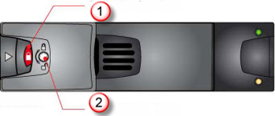
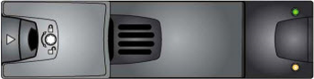
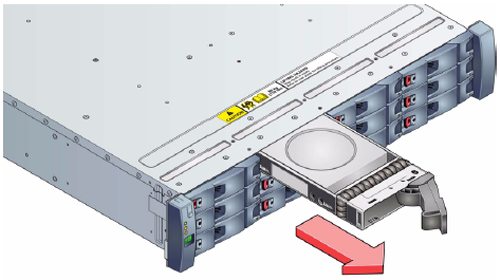
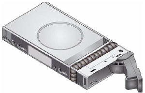
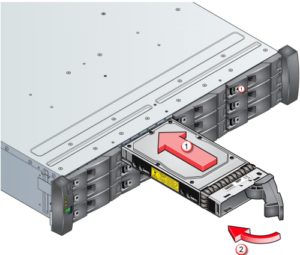

<properties 
   pageTitle="Replace a disk drive on a StorSimple device | Microsoft Azure"
   description="Explains how to replace a disk drive on a StorSimple primary enclosure or an EBOD enclosure."
   services="storsimple"
   documentationCenter=""
   authors="alkohli"
   manager="carmonm"
   editor="" />
<tags 
   ms.service="storsimple"
   ms.devlang="NA"
   ms.topic="article"
   ms.tgt_pltfrm="NA"
   ms.workload="TBD"
   ms.date="03/28/2016"
   ms.author="alkohli" />

# Replace a disk drive on your StorSimple device

## Overview

This tutorial explains how you can remove and replace a malfunctioning or failed hard disk drive on a Microsoft Azure StorSimple device. To replace a disk drive, you need to:

- Disengage the antitamper lock

- Remove the disk drive

- Install the replacement disk drive

>[AZURE.IMPORTANT] Before removing and replacing a disk drive, review the safety information in [StorSimple hardware component replacement](storsimple-hardware-component-replacement.md).

## Disengage the antitamper lock

This procedure explains how the antitamper locks on your StorSimple device can be engaged or disengaged when you replace the disk drives. The antitamper locks are fitted in the drive carrier handles, and they are accessed through a small aperture in the latch section of the handle. Drives are supplied with the locks set to the locked position.

#### To unlock the antitamper lock

1. Carefully insert the lock key (a "tamperproof" T10 screwdriver that Microsoft provided) into the aperture in the handle and into its socket. 

    >[AZURE.NOTE] If the antitamper lock is activated, the red indicator is visible in the aperture.

    

    **Figure 1** Anti-tamper lock engaged

    |Label|Description|
    |:----|:----------|
    |1|Indicator aperture|
    |2|Antitamper lock|

2. Rotate the key in an anticlockwise direction until the red indicator is not visible in the aperture above the key.

3. Remove the key.

    

    **Figure 2** Unlocked disk drive

4. The disk drive can now be removed.

Follow the steps in reverse to engage the lock.

## Remove the disk drive

Your StorSimple device supports a RAID 10-like storage spaces configuration. This implies that it can operate normally with one failed disk, solid-state drive (SSD), or hard disk drive (HDD). 

>[AZURE.IMPORTANT]
>
>- If your system has more than one failed disk, do not remove more than one SSD or HDD from the system at any point in time. Doing so could result in loss of data.
>
>- Make sure that you place a replacement SSD in a slot that previously contained an SSD. Similarly, place a replacement HDD in a slot that previously contained an HDD.
>
>- In the Azure classic portal, slots are numbered from 0 – 11. Therefore, if the portal shows that a disk in slot 2 has failed, on the device, look for the failed disk in the third slot from the top left.

Drives can be removed and replaced while the system is operating.

#### To remove a drive

1. To identify the failed disk, in the Azure classic portal, go to **Devices** > **Maintenance** > **Hardware Status**. Because a disk can fail in the primary enclosure and/or in an EBOD enclosure (if you are using a 8600 model), look at the status of the disks under **Shared Components** and under **EBOD enclosure Shared Components**. A failed disk in either enclosure will be shown with a red status.

2. Locate the drives in the front of the primary enclosure or the EBOD enclosure. 

3. If the disk is unlocked, proceed to the next step. If the disk is locked, unlock it by following the procedure in [Disengage the antitamper lock](#disengage-the-antitamper-lock).

4. Press the black latch on the drive carrier module and pull the drive carrier handle out and away from the front of the chassis. 

    

    **Figure 3** Releasing the drive handle

5. When the drive carrier handle is fully extended, slide the drive carrier out of the chassis. 

    
    
    **Figure 4** Sliding the disk drive out of the carrier

## Install the replacement disk drive

After a drive has failed in your StorSimple device and you have removed it, follow this procedure to replace it with a new drive.

#### To insert a drive

1. Ensure the drive carrier handle is fully extended, as shown in the following image.

    

    **Figure 5** Drive with handle extended

2. Slide the drive carrier all the way into the chassis. 

    

    **Figure 6**  Sliding the drive carrier into the chassis

3. With the drive carrier inserted, close the drive carrier handle while continuing to push the drive carrier into the chassis, until the drive carrier handle snaps into a locked position.

4. Use the lock key that was provided by Microsoft (tamperproof Torx screwdriver) to secure the carrier handle into place by turning the lock screw a quarter turn clockwise.

5. Verify that the replacement was successful and the drive is operational by accessing the Azure classic portal and navigating to **Maintenance** > **Hardware Status**. Under **Shared Components** or **EBOD enclosure Shared Components**, the drive status should be green, indicating that it is healthy.

    >[AZURE.NOTE] It may take several hours for the disk status to turn green after the replacement.

## Next steps

Learn more about [StorSimple hardware component replacement](storsimple-hardware-component-replacement.md).
