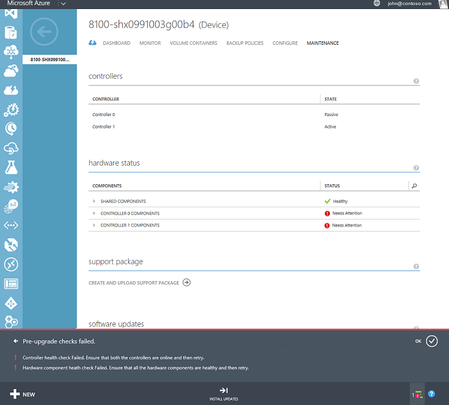

<properties 
   pageTitle="Install Update 1.2 on your StorSimple device | Microsoft Azure"
   description="Explains how to install StorSimple 8000 Series Update 1.2 on your StorSimple 8000 series device."
   services="storsimple"
   documentationCenter="NA"
   authors="alkohli"
   manager="carolz"
   editor="" />
<tags 
   ms.service="storsimple"
   ms.devlang="NA"
   ms.topic="article"
   ms.tgt_pltfrm="NA"
   ms.workload="TBD"
   ms.date="09/28/2015"
   ms.author="alkohli" />

# Install Update 1.2 on your StorSimple device

## Overview

This tutorial explains how to install Update 1.2 on a StorSimple device that is running a software version prior to Update 1. The tutorial also covers the additional steps required for the update when a gateway is configured on a network interface other than DATA 0 of the StorSimple device. 

Update 1.2 includes device software updates, LSI driver updates and disk firmware updates. The software and LSI driver updates are non-disruptive updates and can be applied via the Management Portal. The disk firmware updates are disruptive updates and can only be applied via the Windows PowerShell interface of the device. 

Depending upon which version your device is running, you can determine if Update 1.2 will be applied. You can check the software version of your device by navigating to the **quick glance** section of your device **Dashboard**.

 

| If running software version …   | What happens in the portal?                              |
|---------------------------------|--------------------------------------------------------------|
| Release - GA 				   	  | If you are running Release version (GA), do not apply this update. Please [contact Microsoft Support](storsimple-contact-microsoft-support.md) to update your device.|
| Update 0.1 					  | Portal applies Update 1.2.                                |
| Update 0.2 					  | Portal applies Update 1.2.                                |
| Update 0.3                      | Portal applies Update 1.2.                                |
| Update 1                        | This update will not be available.                           |
| Update 1.1                      | This update will not be available.                           |

 

> [AZURE.IMPORTANT]
 
> -  You may not see Update 1.2 immediately because we do a phased rollout of the updates. Scan for updates in a few days again as this Update will become available soon.
> - This update includes a set of manual and automatic pre-checks to determine the device health in terms of hardware state and network connectivity. These pre-checks are performed only if you apply the updates from the Azure portal. 
> - We recommend that you install the software and driver updates via the Azure Management portal. You should only go to the Windows PowerShell interface of the device (to install updates) if the pre-update gateway check fails in the Portal. The updates may take 5-10 hours to install (including the Windows Updates). The maintenance mode updates must be installed via the Windows PowerShell interface of the device. As maintenance mode updates are disruptive updates, these will result in a down time for your device.

## Preparing for updates
You will need to perform the following steps before you scan and apply the update:

1. Take a cloud snapshot of the device data.

1. Ensure that your controller fixed IPs are routable and can connect to the Internet. These fixed IPs will be used to service updates to your device. You can test this by running the following cmdlet on each controller from the Windows PowerShell interface of the device:

 	`Test-Connection -Source <Fixed IP of your device controller> -Destination <Any IP or computer name outside of datacenter network> `
 
	**Sample output for Test-Connection when fixed IPs can connect to the Internet**

	    
		Controller0>Test-Connection -Source 10.126.173.91 -Destination bing.com
	    
	    Source	  Destination 	IPV4Address      IPV6Address
	    ----------------- -----------  -----------
	    HCSNODE0  bing.com		204.79.197.200
	    HCSNODE0  bing.com		204.79.197.200
	    HCSNODE0  bing.com		204.79.197.200
	    HCSNODE0  bing.com		204.79.197.200
	
		Controller0>Test-Connection -Source 10.126.173.91 -Destination  204.79.197.200

	    Source	  Destination 	  IPV4Address    IPV6Address
	    ----------------- -----------  -----------
	    HCSNODE0  204.79.197.200  204.79.197.200
	    HCSNODE0  204.79.197.200  204.79.197.200
	    HCSNODE0  204.79.197.200  204.79.197.200
	    HCSNODE0  204.79.197.200  204.79.197.200

After you have successfully completed these manual pre-checks, you can proceed to scan and install the updates.

## Install Update 1.2 via the Management Portal 

Use this procedure only if you have a gateway configured on DATA 0 network interface on your device. Perform the following steps to update your device.

[AZURE.INCLUDE [storsimple-install-update-via-portal](../../includes/storsimple-install-update-via-portal.md)]

## Install Update 1.2 on a device that has a gateway configured for a non-DATA 0 network interface 

You should use this procedure only if you fail the gateway check when trying to install the updates through the Management Portal. The check fails as you have a gateway assigned to a non-DATA 0 network interface and your device is running a software version prior to Update 1. If your device does not have a gateway on a non-DATA 0 network interface, you can update your device directly from the Management Portal. See [Use the Management Portal to install Update 1](#install-update-12-via-the-management-portal).

The software versions that can be upgraded using this method are Update 0.1, Update 0.2, and Update 0.3. 

> [AZURE.IMPORTANT] 
> 
> - If your device is running Release (GA) version, please contact [Microsoft Support](storsimple-contact-microsoft-support.md) to assist you with the update.
> - This procedure needs to be performed only once to apply Update 1.2. You can use the Azure Management Portal to apply subsequent updates.

If your device is running pre-Update 1 software and it has a gateway set for a network interface other than DATA 0, you can apply Update 1.2 in the following two ways:

- **Option 1**: Download the update and apply it by using the `Start-HcsHotfix` cmdlet from the Windows PowerShell interface of the device. This is the recommended method. **Do not use this method to apply Update 1.2 if your device is running Update 1.0 or Update 1.1.** 

- **Option 2**: Remove the gateway configuration and install the update directly from the Management Portal.

Detailed instructions for each of these are provided in the following sections.

## Option 1: Use Windows PowerShell for StorSimple to apply Update 1.2 as a hotfix

You should use this procedure only if you are running Update 0.1, 0.2, 0.3 and if your gateway check has failed when trying to install updates from the Management Portal. If you are running Release (GA) software, please [Microsoft Support](storsimple-contact-microsoft-support.md) to update your device. 

Before using this procedure to apply the update, make sure that:

- Both device controllers are online.

Perform the following steps to apply Update 1.2. **The updates could take around 2 hours to complete (approximately 30 minutes for software, 30 minutes for driver, 45 minutes for disk firmware).**

[AZURE.INCLUDE [storsimple-install-update-option1](../../includes/storsimple-install-update-option1.md)]

## Option 2: Use the Azure Portal to apply Update 1.2 after removing the gateway configuration

This procedure applies only to StorSimple devices that are running a software version prior to Update 1 and have a gateway set on a network interface other than DATA 0. You will need to clear the gateway setting prior to applying the update.
 
The update may take a few hours to complete. If your hosts are in different subnets, removing the gateway configuration on the iSCSI interfaces could result in downtime. We recommend that you configure DATA 0 for iSCSI traffic to reduce the downtime.
 
Perform the following steps to disable the network interface with the gateway and then apply the update.
 
[AZURE.INCLUDE [storsimple-install-update-option2](../../includes/storsimple-install-update-option2.md)]

## Troubleshooting update failures

**What if you see a notification that the pre-upgrade checks have failed?**

If a pre-check fails, make sure that you have looked at the detailed notification bar at the bottom of the page. This provides guidance as to which pre-check has failed. The following illustration shows an instance in which such a notification appears. In this case, the controller health check and hardware component health check have failed. Under the **Hardware Status** section, you can see that both **Controller 0** and **Controller 1** components need attention. 
 
  

You will need to make sure that both controllers are healthy and online. You will also need to make sure that all the hardware components in the StorSimple device are shown to be healthy on the Maintenance page. You can then try to install updates. If you are not able to fix the hardware component issues, then you will need to contact Microsoft Support for next steps.

**What if you receive a "Could not install updates" error message, and the recommendation is to refer to the update troubleshooting guide to determine the cause of the failure?**

One likely cause for this could be that you do not have connectivity to the Microsoft Update servers. This is a manual check that needs to be performed. If you lose connectivity to the update server, your update job would fail. You can check the connectivity by running the following cmdlet from the Windows PowerShell interface of your StorSimple device:

 `Test-Connection -Source <Fixed IP of your device controller> -Destination <Any IP or computer name outside of datacenter>`

Run the cmdlet on both controllers.
 
If you have verified the connectivity exists, and you continue to see this issue, please contact Microsoft Support for next steps.

## Next steps

Learn more about [Update 1.2 release](storsimple-update1-release-notes.md) 
