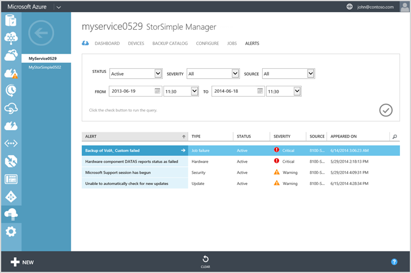
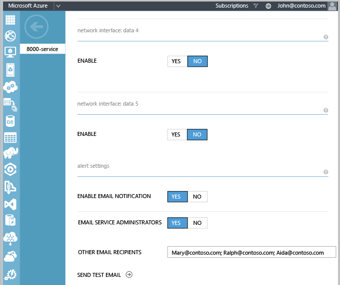
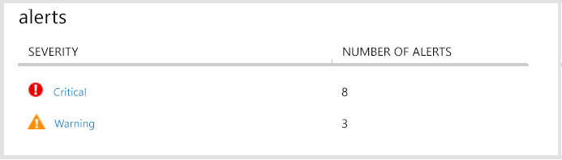
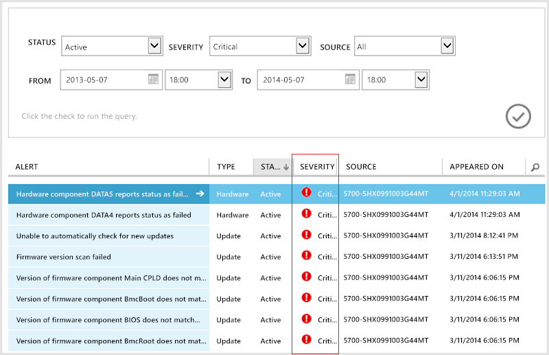
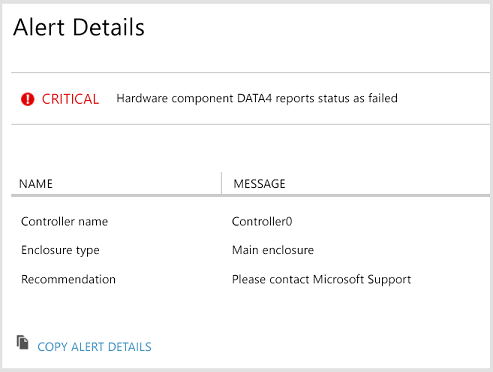

<properties 
   pageTitle="View and manage StorSimple alerts | Microsoft Azure"
   description="Describes StorSimple alert conditions and severity, how to configure alert notifications, and how to use the StorSimple Manager service to manage alerts."
   services="storsimple"
   documentationCenter="NA"
   authors="SharS"
   manager="carolz"
   editor="" />
<tags 
   ms.service="storsimple"
   ms.devlang="NA"
   ms.topic="article"
   ms.tgt_pltfrm="NA"
   ms.workload="TBD"
   ms.date="09/01/2015"
   ms.author="v-sharos" />

# Use the StorSimple Manager service to view and manage StorSimple alerts

## Overview

The **Alerts** tab in the StorSimple Manager service provides a way for you to review and clear StorSimple device–related alerts on a real-time basis. From this tab, you can centrally monitor the health of your StorSimple devices and the overall Microsoft Azure StorSimple solution.

This tutorial describes common alert conditions, alert severity levels, and how to configure alert notifications. Additionally, it includes alert quick reference tables, which enable you to quickly locate a specific alert and respond appropriately.

## Common alert conditions

Your StorSimple device generates alerts in response to a variety of conditions. The following are the most common types of alert conditions:

- **Hardware issues** – These alerts tell you about the health of your hardware. They let you know if firmware upgrades are needed, if a network interface has issues, or if there is a problem with one of your data drives.

- **Connectivity issues** – These alerts occur when there is difficulty in transferring data between data sources. Communication issues can occur during transfer of data to and from the Azure storage account or due to lack of connectivity between the devices and the StorSimple Manager service. They can occur during configuration, backup, or restore processes. Communication issues are some of the hardest to fix because there are so many points of failure. You should always first verify that network connectivity and Internet access are available before continuing on to more advanced troubleshooting.

- **Performance issues** – These alerts are caused when your system isn’t performing optimally, such as when it is under a heavy load.

In addition, you might see alerts related to security, updates, or job failures.

## Alert severity levels

Alerts have different severity levels, depending on the impact that the alert situation will have and the need for a response to the alert. The severity levels are:

- **Critical** – This alert is in response to a condition that is affecting the successful performance of your system. Action is required to ensure that the StorSimple service is not interrupted.

- **Warning** – This condition could become critical if not resolved. You should investigate the situation and take any action required to clear the issue.

- **Information** – This alert contains information that can be useful in tracking and managing your system.

## Configure alert settings

You can choose whether you want to be notified by email of alert conditions for each of your StorSimple devices. Additionally, you can identify other alert notification recipients by entering their email addresses in the **OTHER EMAIL RECIPIENTS** box, separated by semicolons.

>[AZURE.NOTE] You can enter a maximum of 20 email addresses per device.

After you enable email notification for a device, members of the notification list will receive an email message each time a critical alert occurs. The messages will be sent from *storsimple-alerts-noreply@mail.windowsazure.com* and will describe the alert condition. Recipients can click **Unsubscribe** to remove themselves from the email notification list.

#### To enable email notification of alerts for a device

1. Go to **Devices** > **Configure** for the device.

2. Under **Alert Settings**, set the following:

    1. In the **SEND EMAIL NOTIFICATION** field, select **YES**.

    2. In the **EMAIL SERVICE ADMINISTRATORS** field, select **YES** if you wish to have the service administrator and all co-administrators receive the alert notifications.

    3. In the **OTHER EMAIL RECIPIENTS** field, enter the email addresses of all other recipients who should receive the alert notifications. Enter names in the format *someone@somewhere.com*. Use semicolons to separate the email addresses. You can configure a maximum of 20 email addresses per device. 

    

3. To send a test email notification, click the arrow icon next to **SEND TEST EMAIL**. The StorSimple Manager service will display status messages as it forwards the test notification. 

4. When the following message appears, click **OK**. 

    

    >[AZURE.NOTE] If the test notification message can't be sent, the StorSimple Manager service will display an appropriate message. This can occur because of traffic or other network issues. Click **OK**, wait a few minutes, and then try to send your test notification message again. 

## View and track alerts

The StorSimple Manager service dashboard provides you with a quick glance at the number of alerts on your devices, broken down by severity level.

Clicking the severity level opens the **Alerts** tab. The results include only the alerts that match that severity level.

Clicking an alert in the list provides you with additional details for the alert, including the last time the alert was reported, the number of occurrences of the alert on the device, and the recommended action to resolve the alert. If it is a hardware alert, it will also identify the hardware component.

You can copy the alert details to a text file if you want to track the alert resolution in a separate file or if you need to send the information to Microsoft Support. After you have resolved the alert condition, you should clear the alert from the device by selecting the alert in the **Alerts** tab and clicking **Clear**. To clear multiple alerts, press the Ctrl key while you select the alerts, and then click **Clear**. Note that some alerts are automatically cleared when the issue is resolved or when the system updates the alert with new information.

When you click **Clear**, you will have the opportunity to provide comments about the alert and the steps that you took to resolve the issue. Some events will be cleared by the system if another event is triggered with new information. In that case, you will see the following message.

## Sort and review alerts

You may find it more efficient to run reports on alerts so that you can review and clear them in groups. Additionally, the **Alerts** tab can display up to 250 alerts. If you have exceeded that number of alerts, not all alerts will be displayed in the default view. You can combine the following fields to customize which alerts are displayed:

- **Status** – You can display either **Active** or **Cleared** alerts. Active alerts are still being triggered on your system, while cleared alerts have been either manually cleared by an administrator or programmatically cleared because the system updated the alert condition with new information.

- **Severity** – You can display alerts of all severity levels (critical, warning, information), or just a certain severity, such as only critical alerts.

- **Source** – You can display alerts from all sources, or limit the alerts to those that come from either the service or one or all of the devices.

- **Time range** – By specifying the **From** and **To** dates and time stamps, you can look at alerts during the time period that you are interested in.

## Alerts quick reference

The following tables list some of the Microsoft Azure StorSimple alerts that you might encounter, as well as additional information and recommendations where available. StorSimple device alerts fall into one of the following categories:

- [Cloud connectivity alerts](#cloud-connectivity-alerts)

- [Cluster alerts](#cluster-alerts)

- [Disaster recovery alerts](#disaster-recovery-alerts)

- [Hardware alerts](#hardware-alerts)

- [Job failure alerts](#job-failure-alerts)

- [Performance alerts](#performance-alerts)

- [Security alerts](#security-alerts)

- [Support package alerts](#support-package-alerts)

- [Test alerts](#test-alerts)

- [Update alerts](#update-alerts)

### Cloud connectivity alerts

|Alert text|Event|More information / recommended actions|
|:---|:---|:---|
|Connectivity to <*cloud credential name*> cannot be established.|Cannot connect to the storage account.|It looks like there might be a connectivity issue with your device. Please run the `Test-HcsmConnection` cmdlet from the Windows PowerShell Interface for StorSimple on your device to identify and fix the issue. If the settings are correct, the issue might be with the credentials of the storage account for which the alert was raised. In this case, use the `Test-HcsStorageAccountCredential` cmdlet to determine if there are issues that you can resolve.<ul><li>Check your network settings.</li><li>Check your storage account credentials.</li></ul>|
|We have not received a heartbeat from your device for the last <*number*> minutes.|Cannot connect to device.|It looks like there is a connectivity issue with your device. Please use the `Test-HcsmConnection` cmdlet from the Windows PowerShell Interface for StorSimple on your device to identify and fix the issue or contact your network administrator.|

### StorSimple behavior when cloud connectivity fails

What happens if cloud connectivity fails for my StorSimple device running in production?

If cloud connectivity fails on your StorSimple production device, then depending on the state of your device, the following can occur: 

- **For the local data on your device**: There will be no disruption and reads will continue to be served. However, as the number of outstanding IOs increases and exceeds a limit, the reads could start to fail. 

	Depending on the amount of data on the local tiers of your device, the writes will also continue to occur for the first few hours after the disruption in the cloud connectivity. The writes will then slow down and eventually start to fail if the cloud connectivity is disrupted for several hours. 

 
- **For the data in the cloud**: For most cloud connectivity errors, an error is returned. Once the connectivity is restored, the IOs are resumed without the user having to bring the volume online. In rare instances, user intervention may be required to bring back the volume online from the Azure Portal. 
 
- **For cloud snapshots in progress**: The operation is retried a few times within 4-5 hours and if the connectivity is not restored, the cloud snapshots will fail.

### Cluster alerts

|Alert text|Event|More information / recommended actions|
|:---|:---|:---|
|Device failed over to <*device name*>.|Device is in maintenance mode.|Device failed over due to entering or exiting maintenance mode. This is normal and no action is needed. After you have acknowledged this alert, please clear it from the alerts page.|
|Device failed over to <*device name*>.|Device firmware or software was just updated.|There was a cluster failover due to an update. This is normal and no action is needed. After you have acknowledged this alert, please clear it from the alerts page.|
|Device failed over to <*device name*>.|Controller was shut down or restarted.|Device failed over because the active controller was shut down or restarted by an administrator. No action is needed. After you have acknowledged this alert, please clear it from the alerts page.|
|Device failed over to <*device name*>.|Planned failover.|Verify that this was a planned failover. After you have taken appropriate action, please clear this alert from the alerts page.|
|Device failed over to <*device name*>.|Unplanned failover.|StorSimple is built to automatically recover from unplanned failovers. If you see a large number of these alerts, please contact Microsoft Support.|
|Device failed over to <*device name*>.|Other/unknown cause.|If you see a large number of these alerts, please contact Microsoft Support. After the issue is resolved, please clear this alert from the alerts page.|

### Disaster recovery alerts

|Alert text|Event|More information / recommended actions|
|:---|:---|:---|
|Recovery operations could not restore all of the settings for this service. Device configuration data is in an inconsistent state for some devices.|Data inconsistency detected after disaster recovery.|Encrypted data on the service is not synchronized with that on the device. Authorize the device <*device name*> from StorSimple Manager to start the synchronization process. Use the Windows PowerShell Interface for StorSimple to run the `Restore-HcsmEncryptedServiceData` on device <*device name*> cmdlet, providing the old password as an input to this cmdlet to restore the security profile. Then run the `Invoke-HcsmServiceDataEncryptionKeyChange` cmdlet to update the service data encryption key. After you have taken appropriate action, please clear this alert from the alerts page.|
|The service has failed over to a secondary data center due to an unexpected failure.|Other/unknown cause.|You need to verify your configuration settings in StorSimple Manager to continue. After you have taken appropriate action, please clear this alert from the alerts page. For more information about StorSimple Manager see the [Use StorSimple Manager service to administer your StorSimple device](storsimple-manager-service-administration.md).|

### Hardware alerts

|Alert text|Event|More information / recommended actions|
|:---|:---|:---|
|Hardware component <*component ID*> reports status as <*status*>.||Sometimes temporary conditions can cause these alerts. If so, this alert will be automatically cleared after some time. If the issue persists, please contact Microsoft Support.|
|Passive controller malfunctioning.|The passive (secondary) controller is not functioning.|Your device is operational, but one of your controllers is malfunctioning. Try restarting that controller. If the issue is not resolved, contact Microsoft Support.|

### Job failure alerts

|Alert text|Event|More information / recommended actions|
|:---|:---|:---|
|Backup of <*source volume group ID*> failed.|Backup job failed.|Connectivity issues could be preventing the backup operation from successfully completing. If there are no connectivity issues, you may have reached the maximum number of backups. Delete any backups that are no longer needed and retry the operation. After you have taken appropriate action, please clear this alert from the alerts page.|
|Clone of <*source backup element IDs*> to <*destination volume serial numbers*> failed.|Clone job failed.|Refresh the backup list to verify that the backup is still valid. If the backup is valid, it is possible that cloud connectivity issues are preventing the clone operation from successfully completing. If there are no connectivity issues, you may have reached the storage limit. Delete any backups that are no longer needed and retry the operation. After you have taken appropriate action to resolve the issue, please clear this alert from the alerts page.|
|Restore of <*source backup element IDs*> failed.|Restore job failed.|Refresh the backup list to verify that the backup is still valid. If the backup is valid, it is possible that cloud connectivity issues are preventing the restore operation from successfully completing. If there are no connectivity issues, you may have reached the storage limit. Delete any backups that are no longer needed and retry the operation. After you have taken appropriate action to resolve the issue, please clear this alert from the alerts page.|

### Performance alerts

|Alert text|Event|More information / recommended actions|
|:---|:---|:---|
|The device load has exceeded <*threshold*>.|Slower than expected response times.|Your device reports utilization under a heavy input/output load. This could cause your device to not work as well as it should. Please review the workloads that you have attached to the device and determine if there are any that could be moved to another device or that are no longer necessary.|

### Security alerts

|Alert text|Event|More information / recommended actions|
|:---|:---|:---|
|Microsoft Support session has begun.|Third-party accessed support session.|Please confirm this access is authorized. After you have taken appropriate action, please clear this alert from the alerts page.|
|Password for <*element*> will expire in <*length of time*>.||Change your password before it expires.|
|Security configuration information missing for <*element ID*>.||The volumes associated with this volume container cannot be used to replicate your StorSimple configuration. To ensure that your data is safely stored, we recommend that you delete the volume container and any volumes associated with the volume container. After you have taken appropriate action, please clear this alert from the alerts page.|
|<*number*> login attempts failed for <*element ID*>.|Multiple failed logon attempts.|Your device might be under attack or an authorized user is attempting to connect with an incorrect password.<ul><li>Contact your authorized users and verify that these attempts were from a legitimate source. If you continue to see large numbers of failed login attempts, consider disabling remote management and contacting your network administrator. After you have taken appropriate action, please clear this alert from the alerts page.</li><li>Check that your Snapshot Manager instances are configured with the correct password. After you have taken appropriate action, please clear this alert from the alerts page.</li></ul>|
|One or more failures occurred while changing the service data encryption key.||There were errors encountered while changing the service data encryption key. After you have addressed the error conditions, run the `Invoke-HcsmServiceDataEncryptionKeyChange` cmdlet from the Windows PowerShell Interface for StorSimple on your device to update the service. If this issue persists, please contact Microsoft support. After you resolve the issue, please clear this alert from the alerts page.|

### Support package alerts

|Alert text|Event|More information / recommended actions|
|:---|:---|:---|
|Creation of support package failed.|StorSimple couldn't generate the package.|Retry this operation. If the issue persists, please contact Microsoft Support. After you have resolved the issue, please clear this alert from the alerts page.|

### Test alerts

|Alert text|Event|More information / recommended actions|
|:---|:---|:---|
|This is a test message sent from your StorSimple device. Your StorSimple administrator has added you as a recipient of alert notifications for the device: <*device name*>.|Test alert notification email.|If you feel that you received this message in error, please contact your StorSimple administrator.|

### Update alerts

|Alert text|Event|More information / recommended actions|
|:---|:---|:---|
|Hotfix installed.|Software/firmware update completed.|The hotfix has been successfully installed on your device.|
|Manual updates available.|Notification of available updates.|Please use the Windows PowerShell Interface for StorSimple on your device to install these updates.|
|New updates available.|Notification of available updates.|You can install these updates either from the **Maintenance** page or by using the Windows PowerShell Interface for StorSimple on your device.|
|Failed to install updates.|Updates were not successfully installed.|Your system was not able to install the updates. You can install these updates either from the **Maintenance** page or by using the Windows PowerShell Interface for StorSimple on your device. If the issue persists, please contact Microsoft Support.|
|Unable to automatically check for new updates.|Automatic check failed.|You can manually check for new updates from the **Maintenance** page.|
|New WUA agent available.|Notification of available update.|Download the latest Windows Update Agent and install it from the Windows PowerShell interface.|
|Version of firmware component <*component ID*> does not match with hardware.|Firmware update(s) were not successfully installed.|Please contact Microsoft Support.|

## Next steps

[Learn more about StorSimple errors](storsimple-troubleshoot-operational-device.md).
