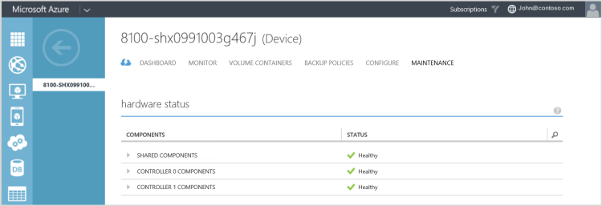
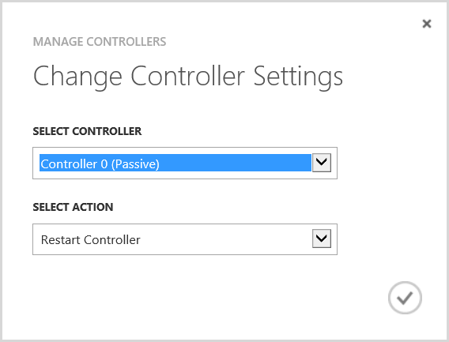

<properties 
   pageTitle="Manage your StorSimple device controllers"
   description="Learn how to stop, restart, shut down or reset your StorSimple device controllers."
   services="storsimple"
   documentationCenter=""
   authors="alkohli"
   manager="carolz"
   editor="tysonn" />
<tags 
   ms.service="storsimple"
   ms.devlang="na"
   ms.topic="article"
   ms.tgt_pltfrm="na"
   ms.workload="na"
   ms.date="07/22/2015"
   ms.author="alkohli" />

#Overview
This tutorial describes the different operations that can be performed on your StorSimple device controllers. The controllers in your StorSimple device are redundant (peer) controllers in an active-passive configuration. At a given time, only one controller is active, and is processing all the disk and network operations. The other controller is in a passive mode. If the active controller fails, the passive controller becomes active automatically.

This tutorial includes step-by-step instructions to manage the device controllers by using the:

- Controller section of the Maintenance page in the StorSimple Manager service
- Windows PowerShell for StorSimple. 

We recommend that the user manage the device controllers via the StorSimple Manager service. If an action can only be performed using the Windows PowerShell for StorSimple, the tutorial makes a note of it.

After reading this tutorial, you will be able to:

- Restart or shut down a StorSimple device controller
- Shut down a StorSimple device
- Reset your StorSimple device to factory defaults

## Restart or shut down a single controller

A controller restart or shut down is not required as a part of normal system operation. Shutdown operations for a single device controller are common only in cases in which a failed device hardware component requires replacement. A controller restart may also be required in a situation in which performance is affected by excessive memory usage or a malfunctioning controller. You may also need to restart a controller after a successful controller replacement, if you wish to enable and test the replaced controller.

Restarting a device is not disruptive to connected initiators, assuming the passive controller is available. If a passive controller is not available or turned off, then restarting the active controller may result in the disruption of service and downtime.

>[AZURE.IMPORTANT] **A running controller should never be physically removed as this would result in a loss of redundancy and an increased risk of downtime.**

>[AZURE.IMPORTANT] **The following procedure applies only to the StorSimple physical device. For information about how to start, stop, and restart the virtual device, see [Work with the virtual device](storsimple-virtual-device-u1.md#work-with-the-storsimple-virtual-device).**

You can restart or shut down a single device controller by using the:

- Management Portal of StorSimple Manager service
- Windows PowerShell for StorSimple. 

To manage your device controllers from the Management Portal, perform the following steps.

#### To restart or shut down a controller in Management Portal

1. Navigate to **Devices > Maintenance**.

1. Go to **Hardware Status** and verify that the status of both the controllers on your device is **Healthy**.

	

1. From the bottom of the Maintenance page, click **Manage Controllers**.

	

	>[AZURE.NOTE] **If you cannot see Manage Controllers, you need to install updates. For more information, see Install updates and hotfixes**

1. In the Change Controller Settings dialog box, do the following:
											
	a. From the Select Controller drop-down list, select the controller that you want to manage. The options are Controller 0 and Controller 1. These controllers are also identified as active or passive.
	
	>[AZURE.NOTE] **A controller cannot be managed if it is unavailable or turned off, and it will not appear in the drop-down list.**
	
	b. From the Select Action drop-down list, choose **Restart controller** or **Shut down controller**.
	
	
	
	c. Click the check icon .

This will restart or shut down the controller. The table below summarizes the details of what happens depending on the selections you have made in the Change Controller Settings dialog box.  
													

	|Selection #|If you choose to...|This will happen.|
	|---|---|---|
	|1.|Restart the passive controller.|A job will be created to restart the controller, and you will be notified after the job is successfully created. This will initiate the controller restart. You can monitor the restart process by accessing **Service > Dashboard > View operation logs** and then filtering by parameters specific to your service.|
	|2.|Restart the active controller.|You will see the following warning: "If you restart the active controller, the device will fail over to the passive controller. Do you want to continue?"  If you choose to proceed with this operation, the next steps will be identical to those used to restart the passive controller (see selection 1).|
	|3.|Shut down the passive controller.|You will see the following message: "After shutdown is complete, you will need to push the power button on your controller to turn it on. Are you sure you want to shut down this controller?"  If you choose to proceed with this operation, the next steps will be identical to those used to restart the passive controller (see selection 1).|
	|4.|Shut down the active controller.|You will see the following message: "After shutdown is complete, you will need to push the power button on your controller to turn it on. Are you sure you want to shut down this controller?"  If you choose to proceed with this operation, the next steps will be identical to those used to restart the passive controller (see selection 1).|

#### To restart or shut down a controller in Windows PowerShell for StorSimple
Perform the following steps to shut down or restart a single controller on your StorSimple device from the Management Portal. 

1. Access the device by using the serial console or a telnet session from a remote computer. Connect to Controller 0 or Controller 1 by following the steps in [Use PuTTY to connect to the device serial console](https://msdn.microsoft.com/en-us/library/dn757808.aspx).

1. In the serial console menu, choose option 1, **Log in with full access**.

1. In the banner message, make a note of the controller you are connected to (Controller 0 or Controller 1) and whether it is the active or the passive (standby) controller.
	

	- To shut down a single controller, at the prompt, type:

		`Stop-HcsController`

		This will shut down the controller that you are connected to. If you stop the active controller, then it will fail over to the passive controller before it shuts down.

	- To restart a controller, at the prompt, type:

		`Restart-HcsController`

		This will restart the controller that you are connected to. If you restart the active controller, it will fail over to the passive controller before the restart.

## Shut down a StorSimple device

This section explains how to shut down a running or a failed StorSimple device from a remote computer. A device is turned off after shutting down both the device controllers. A device shut down is done when the device is being physically moved, or is taken out of service. 

>[AZURE.IMPORTANT] **Before shutting down the device, check the health of the device components. Navigate to **Devices > Maintenance > Hardware Status** and verify that the LED status of all the components is green. Only a healthy device will have a green status. If the device is being shut down to replace a malfunctioning component, you will see a failed (red) or a degraded (yellow) status for the respective component(s).**

#### To shut down a StorSimple device

1. Use the [restart or shut down a controller](#restart-or-shut-down-a-single-controller) procedure to identify and shut down the passive controller on your device. You can perform this operation in the Management Portal or in the the Windows PowerShell for StorSimple.
2. Repeat the above step to shut down the active controller.
3. You will now need to look at the back plane of the device. After the two controllers are completely shut down, the status LEDs on both the controllers should be blinking red. If you need to turn off the device completely at this time, flip the power switches on both Power and Cooling Modules (PCMs) to the OFF position. This should shut down the device.

<!--#### To shut down a StorSimple device in Windows PowerShell for StorSimple

1. Connect to the serial console of the StorSimple device by following the steps in [Use PuTTY to connect to the device serial console](https://msdn.microsoft.com/library/azure/dn757808.aspx).

1. In the serial console menu, verify from the banner message that the controller you are connected to is the passive controller. If you are connected to the active controller, disconnect from this controller and connect to the other controller.

1. In the serial console menu, choose option 1, **log in with full access**.

1. At the prompt, type:

	`Stop-HCSController`

	This should shut down the current controller. To verify whether the shutdown has finished, check the back of the device. The controller status LED should be solid red.

1. Repeat steps 1 through 4 to connect to the active controller and then shut it down.

1. After both the controllers are completely shut down, the status LEDs on both should be blinking red. If you need to turn off the device completely at this time, flip the power switches on both Power and Cooling Modules (PCMs) to the OFF position.-->

## Reset the device to factory default settings

This procedure contains the detailed steps required to reset your Microsoft Azure StorSimple device to factory default settings using the Windows PowerShell for StorSimple.

Perform the following steps to reset your Microsoft Azure StorSimple device to factory default settings:

### To reset the device to default settings in Windows PowerShell for StorSimple

1. Access the device through its serial console. Check the banner message to ensure that you are connected to the Active controller.

1. In the serial console menu, choose option 1, **Log in with full access**.

1. At the prompt, type the following command:

	`Reset-HcsFactoryDefault`

	The system will reboot multiple times. You will be notified when the reset has successfully completed. Depending on the system model, it can take 45-60 minutes for an 8100 device and 60-90 minutes for an 8600 to finish this process.

>[AZURE.NOTE] **For more information on how to use this cmdlet, go to the [cmdlet reference for Windows PowerShell for StorSimple](https://technet.microsoft.com/library/azure/dn688132(v=wps.630).aspx).**

>[AZURE.TIP] Use the `Reset-HcsFactoryDefault –SkipFirmwareVersionCheck` command to skip the firmware version check if the factory reset cmdlet (as used above) reports a firmware mismatch error: Factory reset cannot continue due to a mismatch in the firmware versions. You must skip the firmware check (by using `–SkipFirmwareCheck` option) when performing a factory reset on a device that was previously updated using Microsoft Update or a hotfix mechanism.

## Questions and answers about managing device controllers

In this section, we have summarized some of the frequently asked questions regarding managing StorSimple device controllers.

**Q.** What happens if both the controllers on my device are healthy and turned on and I restart or shut down the active controller?

**A.** If both the controllers on your device are healthy and turned on, you will be prompted for confirmation. You may choose to:

- **Restart the active controller** – You will be notified that restarting an active controller will cause the device to failover to the passive controller. The controller will restart.

- **Shut down an active controller** – You will be notified that shutting down an active controller will result in downtime. You will also need to push the power button on the device to turn on the controller.

**Q.** What happens if the passive controller on my device is unavailable or turned off and I restart or shut down the active controller?

**A.** If the passive controller on your device is unavailable or turned off, and you choose to:

- **Restart the active controller** – You will be notified that continuing the operation will result in a temporary disruption of the service, and you will be prompted for confirmation.

- **Shut down an active controller** – You will be notified that continuing the operation will result in downtime, and that you will need to push the power button on one or both controllers to turn on the device. You will be prompted for confirmation.

**Q.** When would the controller restart or shutdown fail to progress?

**A.** Restarting or shutting down a controller may fail if:

- A device update is in progress.

- A controller restart is already in progress.

- A controller shutdown is already in progress.

**Q.** How can you figure out if a controller was restarted or shut down?

**A.** You can check the controller status on the Maintenance page. The controller status will indicate whether a controller has been restarted or shut down. Additionally, the Alerts page will contain an informational alert if the controller was restarted or shut down. The controller restart and shutdown operations are also recorded in the operation logs. For more information about operation logs, go to [View operation logs](https://msdn.microsoft.com/library/azure/8158cbe9-1f26-4513-a031-49f88bb3d481#sec03).

**Q.** Is there any impact to the I/Os as a result of controller failover?

**A.** The TCP connections between initiators and active controller will be reset as a result of controller failover, but will be reestablished when the passive controller assumes operation. There may be a temporary (less than 30 second) pause in I/O activity between initiators and the device during the course of this operation.

**Q.** How do I return my controller to service after it has been shut down and removed from service?

A. To return a controller to service, you must insert it into the chassis as described in [Hardware Component Replacement Guide](https://msdn.microsoft.com/library/azure/dn757736.aspx).

## Next steps

If you encounter any issues with your StorSimple device controllers that you cannot resolve by using the procedures listed in thsi tutorial, [Contact Microsoft Support](https://msdn.microsoft.com/en-us/library/azure/dn757750.aspx).