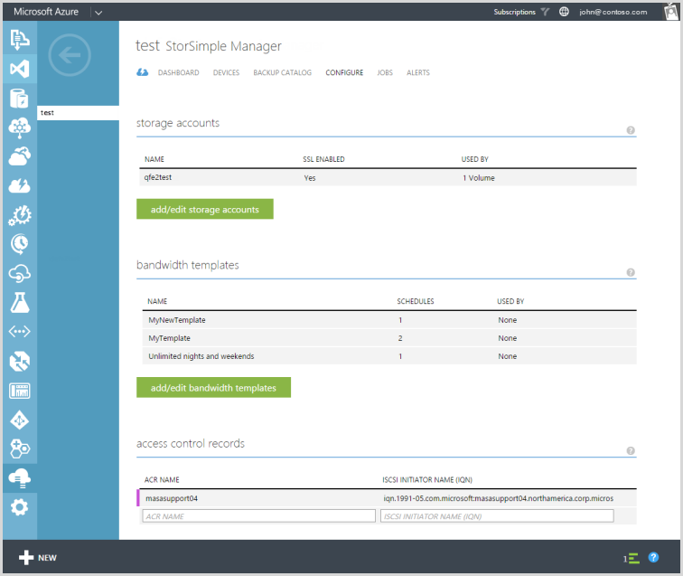
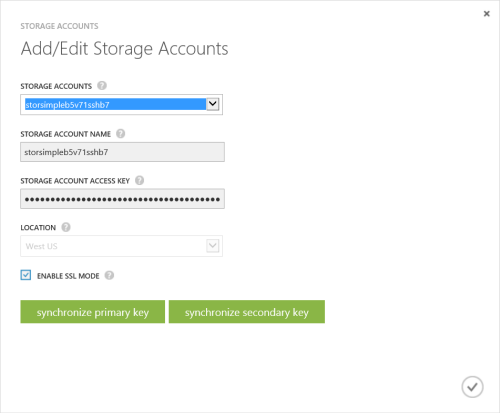
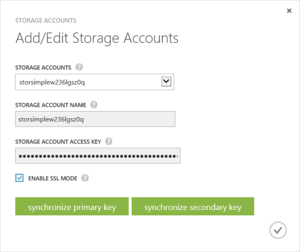

<properties 
   pageTitle="Manage your StorSimple storage account | Microsoft Azure"
   description="Explains how you can use the StorSimple Manager Configure page to add, edit, delete, or rotate the security keys for a storage account."
   services="storsimple"
   documentationCenter="NA"
   authors="SharS"
   manager="carmonm"
   editor="" />
<tags 
   ms.service="storsimple"
   ms.devlang="NA"
   ms.topic="article"
   ms.tgt_pltfrm="NA"
   ms.workload="TBD"
   ms.date="04/29/2016"
   ms.author="v-sharos" />

# Use the StorSimple Manager service to manage your storage account

## Overview

The **Configure** page presents all the global service parameters that can be created in the StorSimple Manager service. These parameters can be applied to all the devices connected to the service, and include:

- Storage accounts 
- Bandwidth templates 
- Access control records 

This tutorial explains how you can use the **Configure** page to add, edit, or delete storage accounts, or rotate the security keys for a storage account.

   

Storage accounts contain the credentials that the device uses to access your storage account with your cloud service provider. For Microsoft Azure storage accounts, these are credentials such as the account name and the primary access key. 

On the **Configure** page, all storage accounts that are created for the billing subscription are displayed in a tabular format containing the following information:

- **Name** – The unique name assigned to the account when it was created.
- **SSL enabled** – Whether the SSL is enabled and device-to-cloud communication is over the secure channel.
- **Used by** – The number of volumes using the storage account.

The most common tasks related to storage accounts that can be performed on the **Configure** page are:

- Add a storage account 
- Edit a storage account 
- Delete a storage account 
- Key rotation of storage accounts 

## Types of storage accounts

There are three types of storage accounts that can be used with your StorSimple device.

- **Auto-generated storage accounts** – As the name suggests, this type of storage account is automatically generated when the service is first created. To learn more about how this storage account is created, see [Step 1: Create a new service](storsimple-deployment-walkthrough-u1.md#step-1-create-a-new-service) in [Deploy your on-premises StorSimple device](storsimple-deployment-walkthrough.md). 
- **Storage accounts in the service subscription** – These are the Azure storage accounts that are associated with the same subscription as that of the service. To learn more about how these storage accounts are created, see [About Azure Storage Accounts](../storage/storage-create-storage-account.md). 
- **Storage accounts outside of the service subscription** – These are the Azure storage accounts that are not associated with your service and likely existed before the service was created.

## Add a storage account

You can add a storage account by providing a unique friendly name and access credentials that are linked to the storage account (with the specified cloud service provider). You also have the option of enabling the secure sockets layer (SSL) mode to create a secure channel for network communication between your device and the cloud.

You can create multiple accounts for a given cloud service provider. Be aware, however, that after a storage account is created, you cannot change the cloud service provider.

While the storage account is being saved, the service attempts to communicate with your cloud service provider. The credentials and the access material that you supplied will be authenticated at this time. A storage account is created only if the authentication succeeds. If the authentication fails, then an appropriate error message will be displayed.

Resource Manager storage accounts created in Azure portal are also supported with StorSimple. The Resource Manager storage accounts will not show up in the drop-down list for selection when trying to create a volume container, only the storage accounts created in the Azure classic portal will be displayed. Resource Manager storage accounts will need to be added using the procedure to add a storage account described below.

> [AZURE.NOTE] The procedure for adding a storage account differs based on the StorSimple software version you are using. Be sure to follow the correct procedure for your StorSimple version.

[AZURE.INCLUDE [add-a-storage-account-update1](../../includes/storsimple-configure-new-storage-account-u1.md)]

[AZURE.INCLUDE [add-a-storage-account](../../includes/storsimple-configure-new-storage-account.md)]

## Edit a storage account

You can edit a storage account that is used by a volume container. If you edit a storage account that is currently in use, the only field available to modify is the access key for the storage account. You can supply the new storage access key and save the updated settings.

#### To edit a storage account

1. On the service landing page, select your service, double-click the service name, and then click **Configure**.

2. Click **Add/Edit Storage Accounts**.

3. In the **Add/Edit Storage Accounts** dialog box:

  1. In the drop-down list of **Storage Accounts**, choose an existing account that you would like to modify. This could also include the storage accounts that were automatically generated when the service was first created.
  2. If necessary, you can modify the **Enable SSL Mode** selection.
  3. You can choose to rotate your storage account access keys. See [Key rotation of storage accounts](#key-rotation-of-storage-accounts) for more information about how to perform key rotation.
  4. Click the check icon  to save the settings. The settings will be updated on the **Configure** page. Click **Save** to save the newly updated settings.

     
  
## Delete a storage account

> [AZURE.IMPORTANT] You can delete a storage account only if it is not used by a volume container. If a storage account is being used by a volume container, first delete the volume container and then delete the associated storage account.

#### To delete a storage account

1. On the StorSimple Manager service landing page, select your service, double-click the service name, and then click **Configure**.

2. In the tabular list of storage accounts, hover over the account that you wish to delete.

3. A delete icon (**x**) will appear in the extreme right column for that storage account. Click the **x** icon to delete the credentials.

4. When prompted for confirmation, click **Yes** to continue with the deletion. The tabular listing will be updated to reflect the changes.

## Key rotation of storage accounts

For security reasons, key rotation is often a requirement in data centers. 

> [AZURE.NOTE] The following key rotation information and the rotation procedure apply to Microsoft Azure storage accounts only. If you are using another cloud service provider, you can manage storage account keys through that provider's dashboard.
 
Each Microsoft Azure subscription can have one or more associated storage accounts. The access to these accounts is controlled by the subscription and access keys for each storage account. 

When you create a storage account, Microsoft Azure generates two 512-bit storage access keys that are used for authentication when the storage account is accessed. Having two storage access keys allows you to regenerate the keys with no interruption to your storage service or access to that service. The key that is currently in use is the *primary* key and the backup key is referred to as the *secondary* key. One of these two keys must be supplied when your Microsoft Azure StorSimple device accesses your cloud storage service provider.

## What is key rotation?

Typically, applications use only one of the keys to access your data. After a certain period of time, you can have your applications switch over to using the second key. After you have switched your applications to the secondary key, you can retire the first key and then generate a new key. Using the two keys this way allows your applications access to the data without incurring any downtime.

The storage account keys are always stored in the service in an encrypted form. However, these can be reset via the StorSimple Manager service. The service can get the primary key and secondary key for all the storage accounts in the same subscription, including accounts created in the Storage service as well as the default storage accounts generated when the StorSimple Manager service service was first created. The StorSimple Manager service service will always get these keys from the Azure classic portal and then store them in an encrypted manner.

## Rotation workflow

A Microsoft Azure administrator can regenerate or change the primary or secondary key by directly accessing the storage account (via the Microsoft Azure Storage service). The StorSimple Manager service does not see this change automatically.

To inform the StorSimple Manager service of the change, you will need to access the StorSimple Manager service, access the storage account, and then synchronize the primary or secondary key (depending on which one was changed). The service then gets the latest key, encrypts the keys, and sends the encrypted key to the device.

#### To synchronize keys for storage accounts in the same subscription as the service (Azure only)

1. On the **Services** page, click the **Configure** tab.

2. Click **Add/Edit Storage Accounts**.

3. In the dialog box, do the following:

  1. Select the storage account with the key that you want to synchronize. The storage account keys are encrypted when they are displayed.
  2. In the StorSimple Manager service, you need to update the key that was previously changed in the Microsoft Azure Storage service. If the primary access key was changed (regenerated), click **synchronize primary key**. If the secondary key was changed, click **synchronize secondary key**.

    

#### To synchronize keys for storage accounts outside of the service subscription

1. On the **Services** page, click the **Configure** tab.

2. Click **Add/Edit Storage Accounts**.

3. In the dialog box, do the following:

  1. Select the storage account with the access key that you want to update.
  2. You will need to update the storage access key in the StorSimple Manager service. In this case, you can see the storage access key. Enter the new key in the **Storage Account Access Key**y box. 
  3. Save your changes. Your storage account access key should now be updated.

## Next steps

- Learn more about [StorSimple security](storsimple-security.md).
- Learn more about [using the StorSimple Manager service to administer your StorSimple device](storsimple-manager-service-administration.md).
