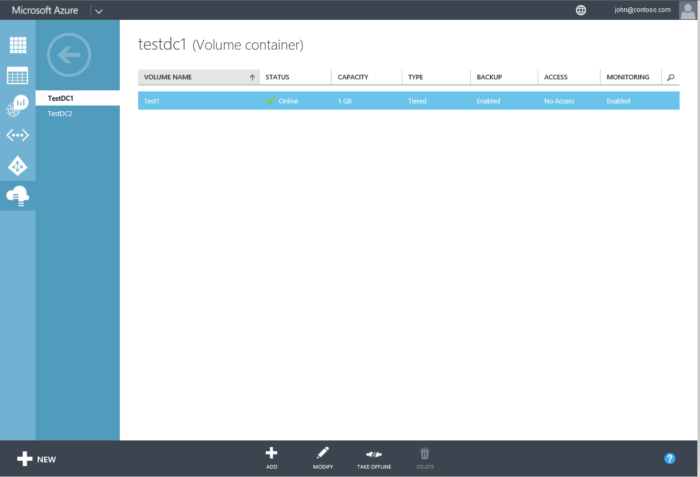
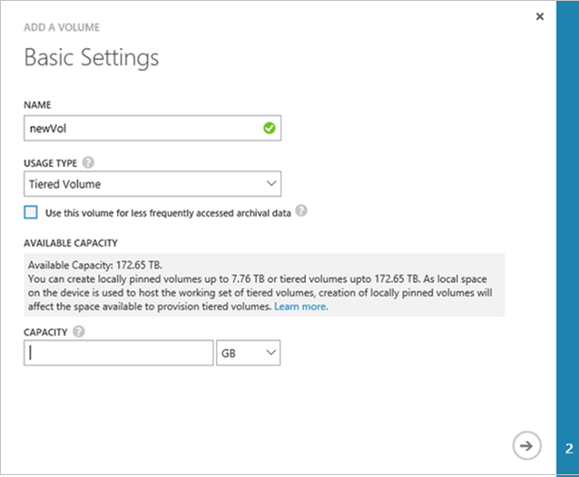
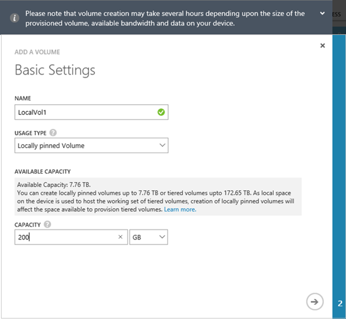
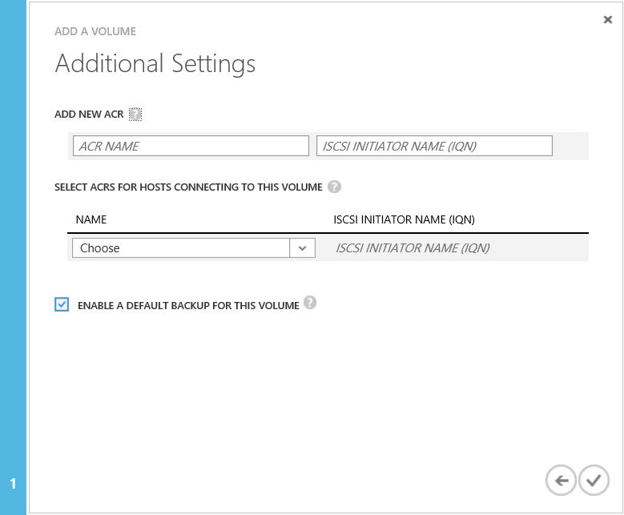
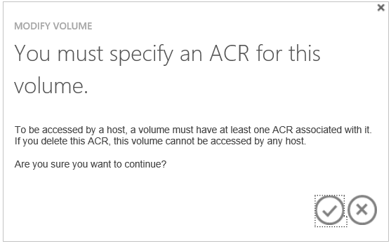
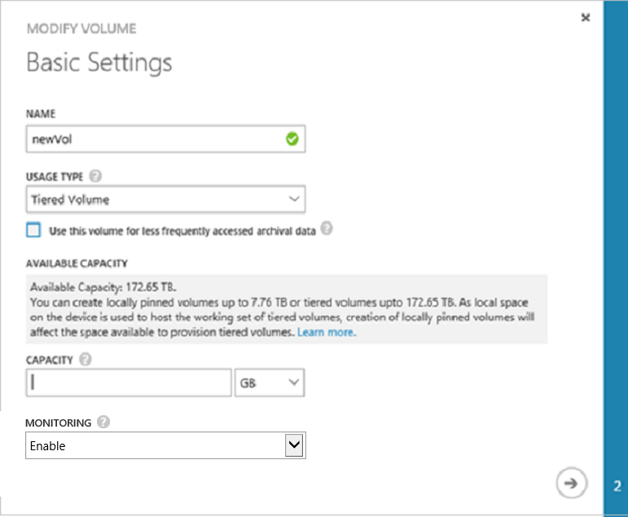
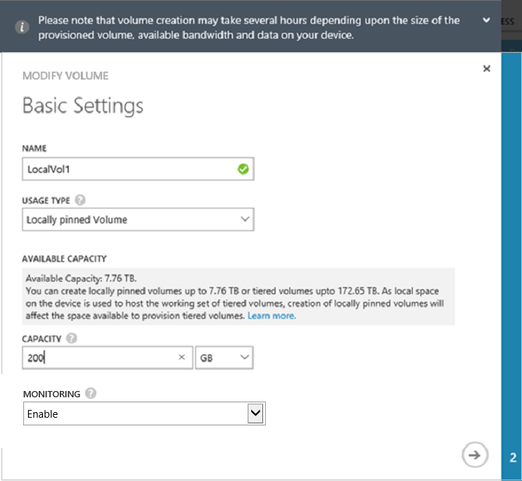

<properties
   pageTitle="Manage your StorSimple volumes (U2) | Microsoft Azure"
   description="Explains how to add, modify, monitor, and delete StorSimple volumes, and how to take them offline if necessary."
   services="storsimple"
   documentationCenter="NA"
   authors="alkohli"
   manager="carmonm"
   editor="" />
<tags 
   ms.service="storsimple"
   ms.devlang="NA"
   ms.topic="article"
   ms.tgt_pltfrm="NA"
   ms.workload="NA"
   ms.date="06/10/2016"
   ms.author="alkohli" />

# Use the StorSimple Manager service to manage volumes (Update 2)

[AZURE.INCLUDE [storsimple-version-selector-manage-volumes](../../includes/storsimple-version-selector-manage-volumes.md)]

## Overview

This tutorial explains how to use the StorSimple Manager service to create and manage volumes on the StorSimple device and StorSimple virtual device with Update 2 installed.

The StorSimple Manager service is an extension in the Azure classic portal that lets you manage your StorSimple solution from a single web interface. In addition to managing volumes, you can use the StorSimple Manager service to create and manage StorSimple services, view and manage devices, view alerts, and view and manage backup policies and the backup catalog.

## Volume types

StorSimple volumes can be:

- **Locally pinned volumes**: Data in these volumes remains on the local StorSimple device at all times.
- **Tiered volumes**: Data in these volumes can spill to the cloud.

An archival volume is a type of tiered volume. The larger deduplication chunk size used for archival volumes allows the device to transfer larger segments of data to the cloud. 

If necessary, you can change the volume type from local to tiered or from tiered to local. For more information, go to [Change the volume type](#change-the-volume-type).

### Locally pinned volumes

Locally pinned volumes are fully provisioned volumes that do not tier data to the cloud, thereby ensuring local guarantees for primary data, independent of cloud connectivity. Data on locally pinned volumes is not deduplicated and compressed; however, snapshots of locally pinned volumes are deduplicated. 

Locally pinned volumes are fully provisioned; therefore, you must have sufficient space on your device when you create them. You can provision locally pinned volumes up to a maximum size of 8 TB on the StorSimple 8100 device and 20 TB on the 8600 device. StorSimple reserves the remaining local space on the device for snapshots, metadata, and data processing. You can increase the size of a locally pinned volume to the maximum space available, but you cannot decrease the size of a volume once created.

When you create a locally pinned volume, the available space for creation of tiered volumes is reduced. The reverse is also true: if you have existing tiered volumes, the space available for creating locally pinned volumes will be lower than the maximum limits stated above. For more information on local volumes, refer to the [frequently asked questions on locally pinned volumes](storsimple-local-volume-faq.md).   

### Tiered volumes

Tiered volumes are thinly provisioned volumes in which the frequently accessed data stays local on the device and less frequently used data is automatically tiered to the cloud. Thin provisioning is a virtualization technology in which available storage appears to exceed physical resources. Instead of reserving sufficient storage in advance, StorSimple uses thin provisioning to allocate just enough space to meet current requirements. The elastic nature of cloud storage facilitates this approach because StorSimple can increase or decrease cloud storage to meet changing demands.

If you are using the tiered volume for archival data, selecting the **Use this volume for less frequently accessed archival data** check box changes the deduplication chunk size for your volume to 512 KB. If you do not select this option, the corresponding tiered volume will use a chunk size of 64 KB. A larger deduplication chunk size allows the device to expedite the transfer of large archival data to the cloud.

>[AZURE.NOTE] Archival volumes created with a pre-Update 2 version of StorSimple will be imported as tiered with the archival check box selected.

### Provisioned capacity

Refer to the following table for maximum provisioned capacity for each device and volume type. (Note that locally pinned volumes are not available on a virtual device.)

|             | Maximum tiered volume size | Maximum locally pinned volume size |
|-------------|----------------------------|------------------------------------|
| **Physical devices** |       |       |
| 8100                 | 64 TB | 8 TB |
| 8600                 | 64 TB | 20 TB |
| **Virtual devices**  |       |       |
| 8010                | 30 TB | N/A   |
| 8020               | 64 TB | N/A   |

## The Volumes page

The **Volumes** page allows you to manage the storage volumes that are provisioned on the Microsoft Azure StorSimple device for your initiators (servers). It displays the list of volumes on your StorSimple device.

 

A volume consists of a series of attributes:

- **Volume Name** – A descriptive name that must be unique and helps identify the volume. This name is also used in monitoring reports when you filter on a specific volume.

- **Status** – Can be online or offline. If a volume if offline, it is not visible to initiators (servers) that are allowed access to use the volume.

- **Capacity** – specifies the total amount of data that can be stored by the initiator (server). Locally-pinned volumes are fully provisioned and reside on the StorSimple device. Tiered volumes are thinly provisioned and the data is deduplicated. With thinly provisioned volumes, your device doesn’t pre-allocate physical storage capacity internally or on the cloud according to configured volume capacity. The volume capacity is allocated and consumed on demand.

- **Type** – Indicates whether the volume is **Tiered** (the default) or **Locally pinned**.

- **Backup** – Indicates whether a default backup policy exists for the volume.

- **Access** – Specifies the initiators (servers) that are allowed access to this volume. Initiators that are not members of access control record (ACR) that is associated with the volume will not see the volume.

- **Monitoring** – Specifies whether or not a volume is being monitored. A volume will have monitoring enabled by default when it is created. Monitoring will, however, be disabled for a volume clone. To enable monitoring for a volume, follow the instructions in [Monitor a volume](#monitor-a-volume). 

Use the instructions in this tutorial to perform the following tasks:

- Add a volume 
- Modify a volume 
- Change the volume type
- Delete a volume 
- Take a volume offline 
- Monitor a volume 

## Add a volume

You [created a volume](storsimple-deployment-walkthrough-u2.md#step-6-create-a-volume) during deployment of your StorSimple solution. Adding a volume is a similar procedure.

#### To add a volume

1. On the **Devices** page, select the device, double-click it, and then click the **Volume Containers** tab.

2. Select a volume container from the list and double-click it to access the volumes associated with the container.

3. Click **Add** at the bottom of the page. The Add a volume wizard starts.

     

4. In the Add a volume wizard, under **Basic Settings**, do the following:

  1. Supply a **Name** for your volume.
  2. Select a **Usage Type** from the drop-down list. For workloads that require data to be available locally on the device at all times, select **Locally Pinned**. For all other types of data, select **Tiered**. (**Tiered** is the default.)
  3. If you selected **Tiered** in step 2, you can select the **Use this volume for less frequently accessed archival data** check box to configure an archival volume.
  4. Enter the **Provisioned Capacity** for your volume in GB or TB. See [Provisioned capacity](#provisioned-capacity) for maximum sizes for each device and volume type. Look at the **Available Capacity** to determine how much storage is actually available on your device.

5. Click the arrow icon. If you are configuring a locally pinned volume, you will see the following message.

    
   
5. Click the arrow icon again to go to the **Additional Settings** page.

     

6. Under **Additional Settings**, add a new access control record (ACR):
  
  1. Select an access control record (ACR) from the drop-down list. Alternatively, you can add a new ACR. ACRs determine which hosts can access your volumes by matching the host IQN with that listed in the record. If you do not specify an ACR, you will see the following message.

        

  2. We recommend that you select the **Enable a default backup for this volume** checkbox.
  3. Click the check icon  to create the volume with the specified settings.

Your new volume is now ready to use.

>[AZURE.NOTE] If you create a locally pinned volume and then create another locally pinned volume immediately afterwards, the volume creation jobs run sequentially. The first volume creation job must finish before the next volume creation job can begin.

## Modify a volume

Modify a volume when you need to expand it or change the hosts that access the volume.

> [AZURE.IMPORTANT] 
>
> - If you modify the volume size on the device, the volume size needs to be changed on the host as well. 
> - The host-side steps described here are for Windows Server 2012 (2012R2). Procedures for Linux or other host operating systems will be different. Refer to your host operating system instructions when modifying the volume on a host running another operating system. 

#### To modify a volume

1. On the **Devices** page, select the device, double-click it, and then click the **Volume Containers** tab.

2. Select a volume container from the list and double-click it to view the volumes associated with the container.

3. Select a volume, and at the bottom of the page, click **Modify**. The Modify volume wizard starts.

4. In the Modify volume wizard, under **Basic Settings**, you can do the following:

  - Edit the **Name**.
  - Convert the **Usage Type** from locally pinned to tiered or from tiered to locally pinned (see [Change the volume type](#change-the-volume-type) for more information).
  - Increase the **Provisioned Capacity**. The **Provisioned Capacity** can only be increased. You cannot shrink a volume after it is created.

5. Under **Additional Settings**, you can modify the ACR, provided that the volume is offline. If the volume is online, you will need to take it offline first. Refer to the steps in [Take a volume offline](#take-a-volume-offline) prior to modifying the ACR.

    > [AZURE.NOTE] You cannot change the **Enable a default backup** option for the volume.

6. Save your changes by clicking the check icon . The Azure classic portal will display an updating volume message. It will display a success message when the volume has been successfully updated.

7. If you are expanding a volume, complete the following steps on your Windows host computer:

   1. Go to **Computer Management** ->**Disk Management**.
   2. Right-click **Disk Management** and select **Rescan Disks**.
   3. In the list of disks, select the volume that you updated, right-click, and then select **Extend Volume**. The Extend Volume wizard starts. Click **Next**.
   4. Complete the wizard, accepting the default values. After the wizard is finished, the volume should show the increased size.

    >[AZURE.NOTE] If you expand a locally pinned volume and then expand another locally pinned volume immediately afterwards, the volume expansion jobs run sequentially. The first volume expansion job must finish before the next volume expansion job can begin.

 **Video available**

To watch a video that demonstrates how to expand a volume, click [here](https://azure.microsoft.com/documentation/videos/expand-a-storsimple-volume/).

## Change the volume type

You can change the volume type from tiered to locally pinned or from locally pinned to tiered. However, this conversion should not be a frequent occurrence. Some reasons for converting a volume from tiered to locally pinned are:

- Local guarantees regarding data availability and performance
- Elimination of cloud latencies and cloud connectivity issues.

Typically, these are small existing volumes that you want to access frequently. A locally pinned volume is fully provisioned when it is created. If you are converting a tiered volume to a locally pinned volume, StorSimple verifies that you have sufficient space on your device before it starts the conversion. If you have insufficient space, you will receive an error and the operation will be canceled. 

> [AZURE.NOTE] Before you begin a conversion from tiered to locally pinned, make sure that you consider the space requirements of your other workloads. 

You might want to change a locally pinned volume to a tiered volume if you need additional space to provision other volumes. When you convert the locally pinned volume to tiered, the available capacity on the device increases by the size of the released capacity. If connectivity issues prevent the conversion of a volume from the local type to the tiered type, the local volume will exhibit properties of a tiered volume until the conversion is completed. This is because some data might have spilled to the cloud. This spilled data will continue to occupy local space on the device that cannot be freed until the operation is restarted and completed.

>[AZURE.NOTE] Converting a volume can take some time and you cannot cancel a conversion after it starts. The volume remains online during the conversion, and you can take backups, but you cannot expand or restore the volume while the conversion is taking place.  

Conversion from a tiered to a locally pinned volume can adversely affect device performance. Additionally, the following factors might increase the time it takes to complete the conversion:

- There is insufficient bandwidth.

- There is no current backup.

To minimize the effects that these factors may have:

- Review your bandwidth throttling policies and make sure that a dedicated 40 Mbps bandwidth is available.
- Schedule the conversion for off-peak hours.
- Take a cloud snapshot before you start the conversion.

If you are converting multiple volumes (supporting different workloads), then you should prioritize the volume conversion so that higher priority volumes are converted first. For example, you should convert volumes that host virtual machines (VMs) or volumes with SQL workloads before you convert volumes with file share workloads.

#### To change the volume type

1. On the **Devices** page, select the device, double-click it, and then click the **Volume Containers** tab.

2. Select a volume container from the list and double-click it to view the volumes associated with the container.

3. Select a volume, and at the bottom of the page, click **Modify**. The Modify volume wizard starts.

4. On the **Basic Settings** page, change the usage type by selecting the new type from the **Usage Type** drop-down list.

    - If you are changing the type to **Locally pinned**, StorSimple will check to see if there is sufficient capacity.
    - If you are changing the type to **Tiered** and this volume will be used for archival data, select the **Use this volume for less frequently accessed archival data** check box.

        

5. Click the arrow icon  to go to the **Additional Settings** page. If you are configuring a locally pinned volume, the following message appears.

    

6. Click the arrow icon  again to continue.

7. Click the check icon  to start the conversion process. The Azure portal will display an updating volume message. It will display a success message when the volume has been successfully updated.

## Take a volume offline

You may need to take a volume offline when you are planning to modify it or delete it. When a volume is offline, it is not available for read-write access. You will need to take the volume offline on the host as well as on the device. 

#### To take a volume offline

1. Make sure that the volume in question is not in use before taking it offline.

2. Take the volume offline on the host first. This eliminates any potential risk of data corruption on the volume. For specific steps, refer to the instructions for your host operating system.

3. After the host is offline, take the volume on the device offline by performing the following steps:

  1. On the **Devices** page, select the device, double-click it, and then click the **Volume Containers** tab. The **Volume Containers** tab lists in a tabular format all the volume containers that are associated with the device.
  2. Select a volume container and click it to display the list of all the volumes within the container.
  3. Select a volume and click **Take offline**.
  4. When prompted for confirmation, click **Yes**. The volume should now be offline.

    After a volume is offline, the **Bring Online** option becomes available.

> [AZURE.NOTE] The **Take Offline** command sends a request to the device to take the volume offline. If hosts are still using the volume, this results in broken connections, but taking the volume offline will not fail. 

## Delete a volume

> [AZURE.IMPORTANT] You can delete a volume only if it is offline.

Complete the following steps to delete a volume.

#### To delete a volume

1. On the **Devices** page, select the device, double-click it, and then click the **Volume Containers** tab.

2. Select the volume container that has the volume you want to delete. Click the volume container to access the **Volumes** page.

3. All the volumes associated with this container are displayed in a tabular format. Check the status of the volume you want to delete. If the volume you want to delete is not offline, take it offline first, following the steps in [Take a volume offline](#take-a-volume-offline).

4. After the volume is offline, click **Delete** at the bottom of the page.

5. When prompted for confirmation, click **Yes**. The volume will now be deleted and the **Volumes** page will show the updated list of volumes within the container.

    >[AZURE.NOTE] If you delete a locally pinned volume, the space available for new volumes may not be updated immediately. The StorSimple Manager Service updates the local space available periodically. We suggest you wait for a few minutes before you try to create the new volume.  Additionally, if you delete a locally pinned volume and then delete another locally pinned volume immediately afterwards, the volume deletion jobs run sequentially. The first volume deletion job must finish before the next volume deletion job can begin.
 
## Monitor a volume

Volume monitoring allows you to collect I/O-related statistics for a volume. Monitoring is enabled by default for the first 32 volumes that you create. Monitoring of additional volumes is disabled by default. Monitoring of cloned volumes is also disabled by default.

Perform the following steps to enable or disable monitoring for a volume.

#### To enable or disable volume monitoring

1. On the **Devices** page, select the device, double-click it, and then click the **Volume Containers** tab.

2. Select the volume container in which the volume resides, and then click the volume container to access the **Volumes** page.

3. All the volumes associated with this container are listed in the tabular display. Click and select the volume or volume clone.

4. At the bottom of the page, click **Modify**.

5. In the Modify Volume wizard, under **Basic Settings**, select **Enable** or **Disable** from the **Monitoring** drop-down list.

## Next steps

- Learn how to [clone a StorSimple volume](storsimple-clone-volume.md).

- Learn how to [use the StorSimple Manager service to administer your StorSimple device](storsimple-manager-service-administration.md).

 
