<properties 
   pageTitle="Monitor your StorSimple device | Microsoft Azure"
   description="Describes how to use the StorSimple Manager service to monitor I/O performance, capacity utilization, network throughput, and device performance."
   services="storsimple"
   documentationCenter="NA"
   authors="alkohli"
   manager="carolz"
   editor="" />
<tags 
   ms.service="storsimple"
   ms.devlang="NA"
   ms.topic="article"
   ms.tgt_pltfrm="NA"
   ms.workload="TBD"
   ms.date="09/02/2015"
   ms.author="alkohli" />

# Use the StorSimple Manager service to monitor your StorSimple device 

## Overview

You can use the StorSimple Manager service to monitor specific devices within your StorSimple solution. You can create custom charts based on I/O performance, capacity utilization, network throughput, and device performance metrics. 

To view the monitoring information for a specific device, in the Azure Portal, select the StorSimple Manager service, click the **Monitor** tab, and then select from the list of devices. The **Monitor** page contains the following information.

## I/O performance 

**I/O performance** tracks metrics related to the number of read and write operations between either the iSCSI initiator interfaces on the host server and the device or the device and the cloud. This performance can be measured for a specific volume, a specific volume container, or all volume containers.

The chart below shows the IOs for the initiator to your device for all the volumes for a production device. The metrics plotted are read and write bytes per second, read and write IO operations per second, and read and write latencies.

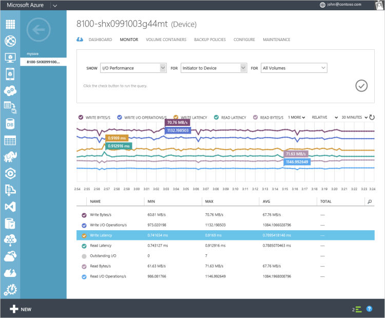

For the same device, the IOs are plotted for data from the device to the cloud for all the volume containers. On this device, the data is only in the linear tier and nothing has spilled to the cloud. There are no read-write operations occurring from device to the cloud. Consequently, the peaks in the chart are at an interval of 5 minutes that corresponds to the frequency at which the heartbeat is checked between the device and the service. 

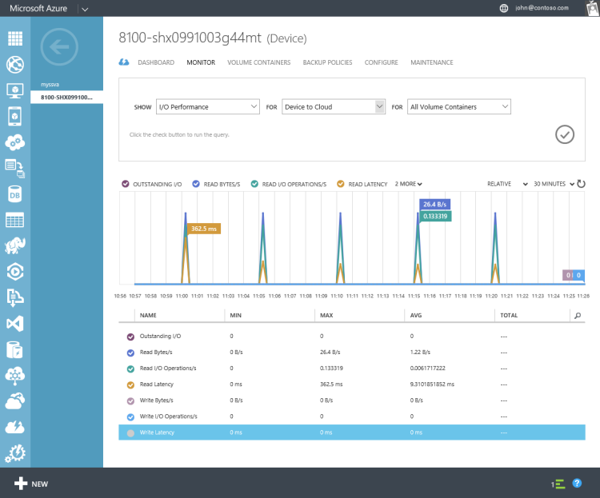

For the same device, a cloud snapshot was taken for volume data starting at 2:00 pm. This resulted in data flowing from the device to the cloud. Reads-writes were served to the cloud in this duration. The IO chart shows a peak in the various metrics corresponding to the time when the snapshot was taken. 

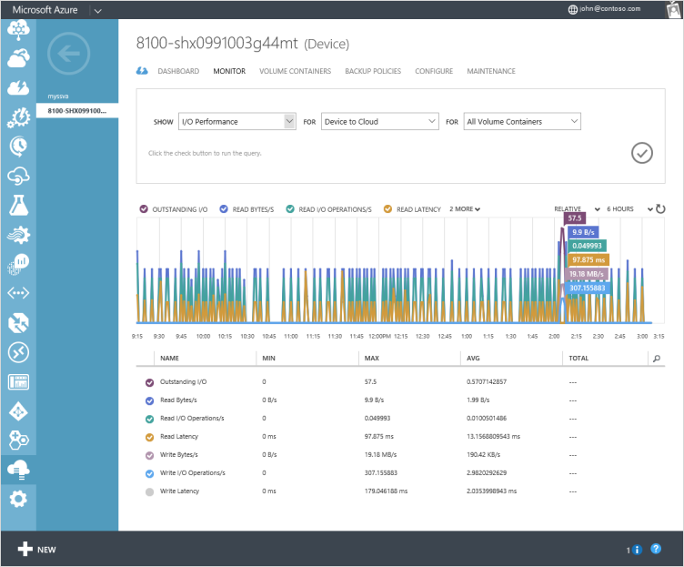

## Capacity utilization 

**Capacity utilization** tracks metrics related to the amount of data storage space that is used by the volumes, volume containers, or device. You can create reports based on the capacity utilization of your primary storage, your cloud storage, or your device storage. Capacity utilization can be measured on a specific volume, a specific volume container, or all volume containers.

The primary, cloud and device storage capacity can be described as follows:

- **Primary storage capacity utilization** shows the amount of data written to StorSimple volumes before the data is deduplicated and compressed. The following charts show the primary storage capacity utilization of a StorSimple device before and after a cloud snapshot was taken. Given that this is just volume data, a cloud snapshot should not change the primary storage. As you can see, the chart shows no difference in the primary capacity utilization as a result of taking a cloud snapshot. Note that the cloud snapshot started at around 2:00 pm on that device.

	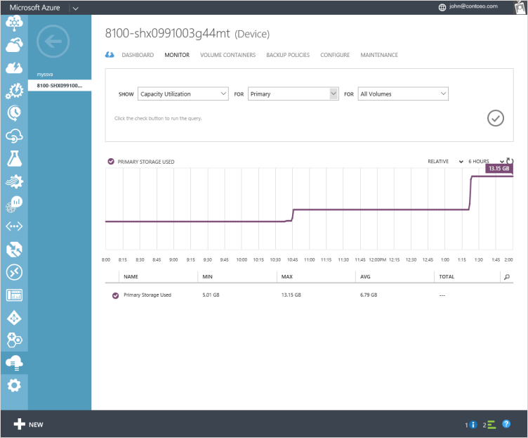
	
	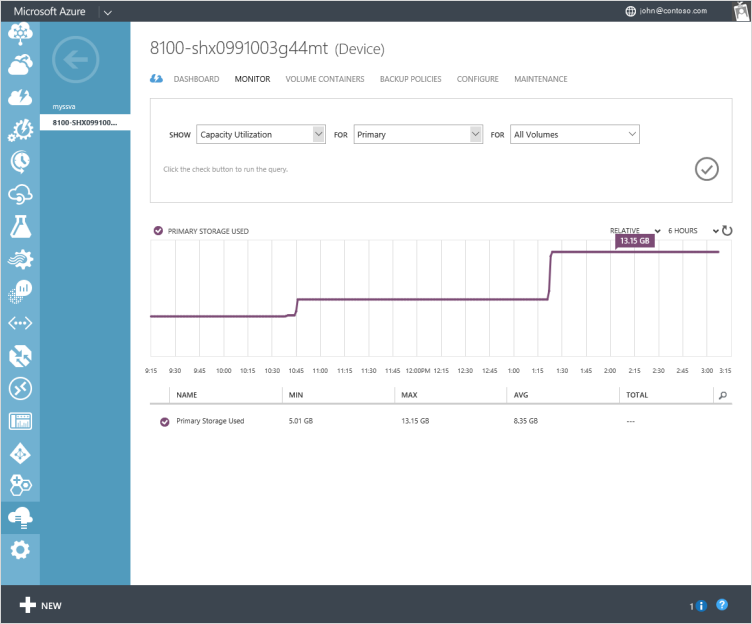

- **Cloud storage capacity utilization** shows the amount of cloud storage used. This data is deduplicated and compressed. This amount includes cloud snapshots which might contain data that isn't reflected in any primary volume and is kept for legacy or required retention purposes. You can compare the primary and cloud storage consumption figures to get an idea of the data reduction rate, although the number will not be exact. The following charts show the cloud storage capacity utilization of a StorSimple device before and after a cloud snapshot was taken. The cloud snapshot started at around 2:00 pm on that device and you can see the cloud capacity utilization shot up at the same time, increasing from 5.73 MB to 4.04 GB.

	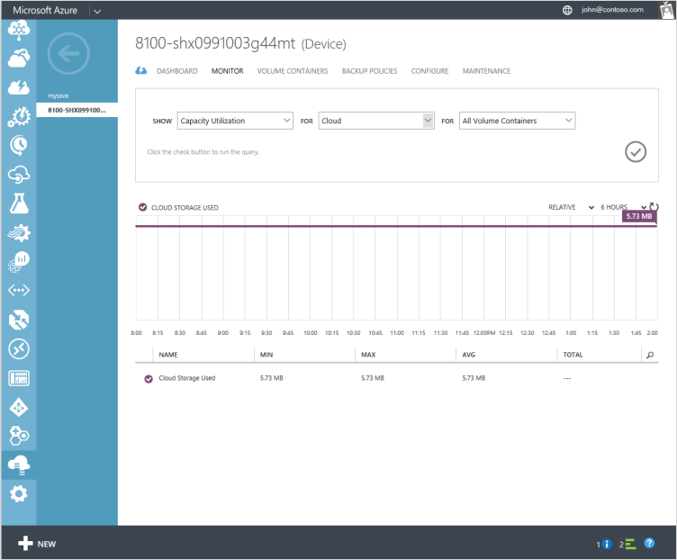

	

- **Device storage capacity utilization** shows the total utilization for the device, which will be more than primary storage utilization because it includes the SSD linear tier. This tier contains an amount of data that also exists on the device's other tiers. The capacity in the SSD linear tier is cycled so that when new data comes in, the old data is moved to the HDD tier (at which time it is deduplicated and compressed) and subsequently to the cloud.

	Over time, primary capacity utilization and device capacity utilization will most likely increase together until the data begins to be tiered to the cloud. At that point, the device capacity utilization will probably begin to plateau, but the primary capacity utilization will increase as more data is written.

	The following charts show the primary storage capacity utilization of a StorSimple device before and after a cloud snapshot was taken. The cloud snapshot started at 2:00 pm and the device capacity utilization started decreasing at that time. The device storage capacity utilization went down from 11.58 GB to 7.48 GB. This indicates that most likely the uncompressed data in the linear SSD tier was deduplicated, compressed, and moved into the HDD tier. Note that if the device already has a large amount of data in both the SSD and HDD tiers, you may not see this decrease. In this example, the device has a small amount of data.

	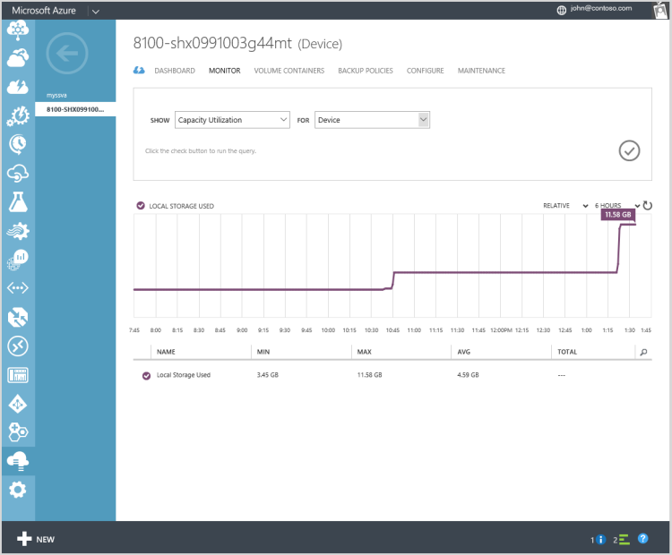

	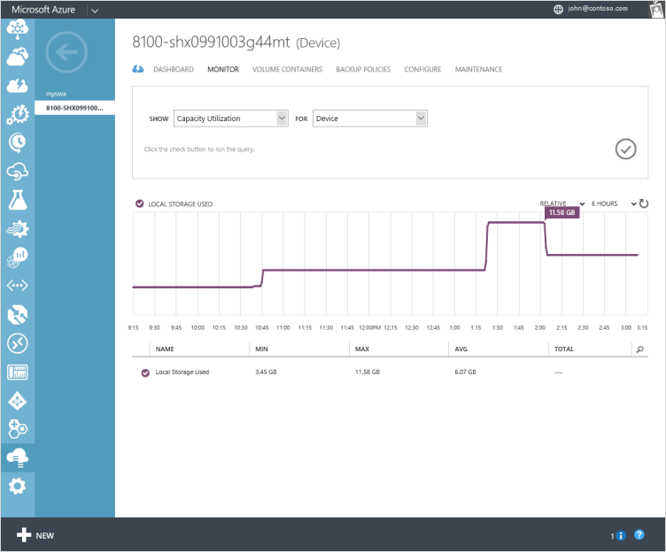

## Network throughput

**Network throughput** tracks metrics related to the amount of data transferred from the iSCSI initiator network interfaces on the host server and the device and between the device and the cloud. You can monitor this metric for each of the iSCSI network interfaces on your device.

The charts below show the network throughput for the Data 0 and Data 4, both 1 GbE network interfaces on your device. In this instance, Data 0 was cloud-enabled whereas Data 4 was iSCSI-enabled. You can see both the inbound and the outbound traffic for your StorSimple device. Note that the flat line in the chart starting from 3:24 pm is owing to the fact that we gather data only every 5 minutes and should be ignored. 

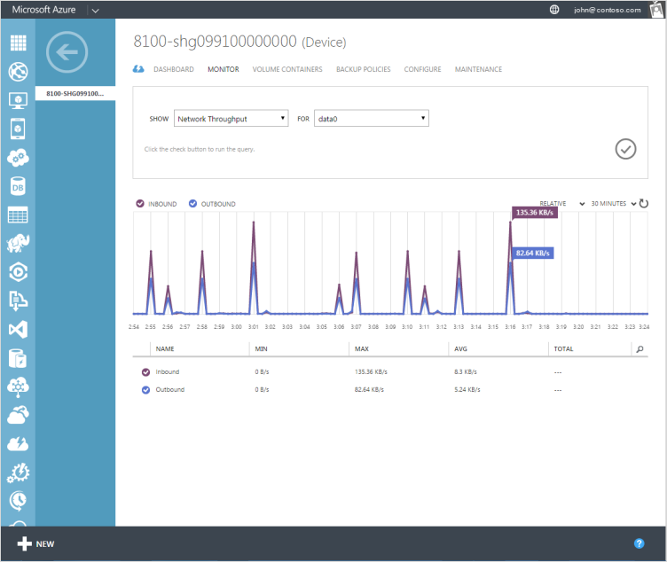

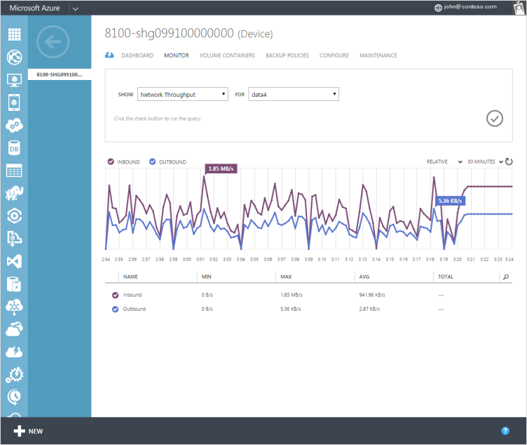

## Device performance 

**Device performance** tracks metrics related to the performance of your device. The chart below shows the CPU utilization stats for a device in production.

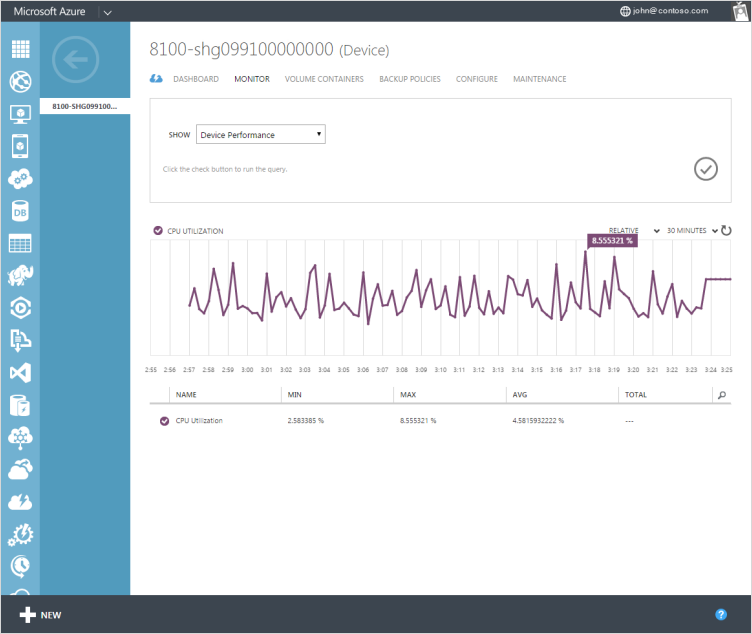

## Next steps

[Learn how to use the StorSimple Manager service device dashboard](storsimple-device-dashboard.md).
