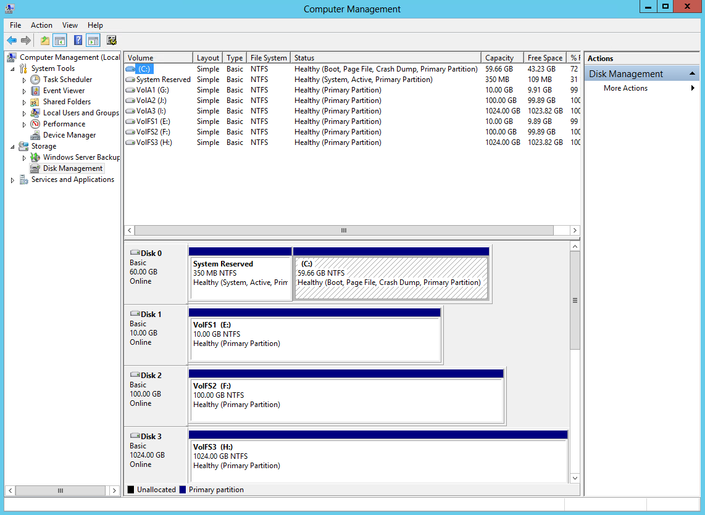
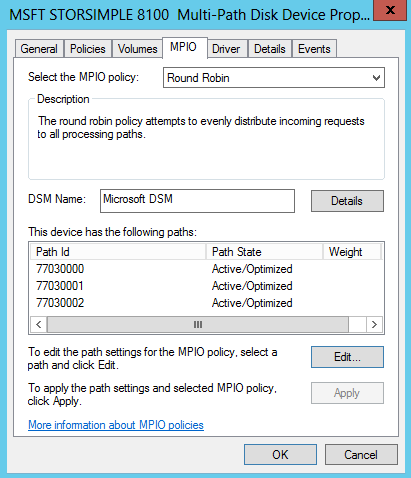

<properties 
   pageTitle="Configure MPIO for your StorSimple virtual array | Microsoft Azure"
   description="Describes how to configure Multipath I/O (MPIO) for your StorSimple virtual array connected to a host running Windows Server 2012 R2."
   services="storsimple"
   documentationCenter=""
   authors="alkohli"
   manager="carmonm"
   editor="" />
<tags 
   ms.service="storsimple"
   ms.devlang="NA"
   ms.topic="article"
   ms.tgt_pltfrm="NA"
   ms.workload="NA"
   ms.date="03/15/2016"
   ms.author="alkohli" />

# Configure Multipath I/O for your StorSimple device

Microsoft built support for the Multipath I/O (MPIO) feature in Windows Server to help build highly available, fault-tolerant SAN configurations. MPIO uses redundant physical path components — adapters, cables, and switches — to create logical paths between the server and the storage device. If there is a component failure, causing a logical path to fail, multipathing logic uses an alternate path for I/O so that applications can still access their data. Additionally depending on your configuration, MPIO can also improve performance by re-balancing the load across all these paths. For more information, see [MPIO overview](https://technet.microsoft.com/library/cc725907.aspx "MPIO overview and features").  

For the high-availability of your StorSimple solution, MPIO should be configured on your StorSimple 1200 Virtual Array (also known as the on-premises virtual device). When MPIO is installed on your host servers running Windows Server 2012 R2, the servers can then tolerate a link, network, or interface failure. MPIO is an optional feature on Windows Server and is not installed by default. It should be installed as a feature through Server Manager.

A StorSimple 1200 virtual device connected to a Windows Server host can be configured for high availability and load balancing. The following procedure describes how to install MPIO on your host, apply specific configuration settings for StorSimple-only volumes, and then enable and verify multipathing or StorSimple volumes. The procedure assumes that your StorSimple 1200 virtual device with two network interfaces is connected to a Windows Server host with two network interfaces. 

You will need to follow these steps to configure MPIO on your virtual device:

- Prerequisites

- Step 1: Install MPIO on the Windows Server host

- Step 2: Configure MPIO for StorSimple volumes

- Step 3: Mount StorSimple volumes on the host

Each of the above steps is discussed in the following sections.

## Prerequisites

This section details the configuration prerequisites for the Windows Server host and your virtual device.

### On Windows Server host

1. Make sure that your Windows Server host has 2 network interfaces enabled. Verify:

### On StorSimple device

Your StorSimple device should have:

- If using a 1200 virtual device, it should be configured as an iSCSI server with a minimum of two network interfaces enabled on the device. Note the IPv4 addresses of the enabled network interfaces (Ethernet, Ethernet2 by default) and save for later use on the host. 
	To verify that two network interfaces are enabled, perform the following steps for a device provisioned in a Hyper-V environment:

- The network interfaces on your virtual array should be reachable from the Windows Server host.

- A minimum of one volume should be created on your StorSimple Virtual Array. To learn more, see Add a volume on your StorSimple 1200 virtual device.

### Hardware configuration for StorSimple device

The figure below shows the recommended hardware configuration for high availability and load-balancing multipathing for your Windows Server host and StorSimple  virtual device.  

As shown in the preceding figure:

- Your StorSimple device is a single node active device.

- Two network interfaces are enabled on your virtual device. In the local web UI of your 1200 virtual device, verify that two network interfaces are enabled by navigating to Network Settings as shown below:

- Two network interfaces are enabled on your Windows Server host.

If the connected interfaces are on the same subnet, then there will be 4 paths available. However, if each network interface on the device and host interface are on a different IP subnet (and not routable), then only 2 paths will be available.

## Step 1: Install MPIO on the Windows Server host

To install this feature on your Windows Server host, complete the following procedure.

[AZURE.INCLUDE [storsimple-install-mpio-windows-server-host](../../includes/storsimple-install-mpio-windows-server-host.md)]

## Step 2: Configure MPIO for StorSimple volumes

MPIO needs to be configured to identify StorSimple volumes. To configure MPIO to recognize StorSimple volumes, perform the following steps.

[AZURE.INCLUDE [storsimple-configure-mpio-volumes](../../includes/storsimple-configure-mpio-volumes.md)]

## Step 3: Mount StorSimple volumes on the host

After MPIO is configured on Windows Server, volume(s) created on the StorSimple device can be mounted and can then take advantage of MPIO for redundancy. To mount a volume, perform the following steps.

#### To mount volumes on the host

1. Open the **iSCSI Initiator Properties** window on the Windows Server host. Click **Server Manager > Dashboard > Tools > iSCSI Initiator**.
2. In the **iSCSI Initiator Properties** dialog box, click the Discovery tab, and then click **Discover Target Portal**.
3. In the **Discover Target Portal** dialog box, do the following:
	
	- Enter the IP address of the first enabled network interface on your StorSimple virtual device. By default, this would be **ETHERNET**. 
	- Click **OK** to return to the **iSCSI Initiator Properties** dialog box.

	>[AZURE.IMPORTANT] **If you are using a private network for iSCSI connections, enter the IP address of the DATA port that is connected to the private network.**

4. Repeat steps 2-3 for a second network interface (for example, Ethernet2) on your device. 
5. Select the **Targets** tab in the **iSCSI Initiator Properties** dialog box. For your virtual array, you should see each volume surface as a target under **Discovered Targets**.
 
6. Click **Connect** to establish an iSCSI session with your StorSimple device. A **Connect to Target** dialog box will appear.

7. In the **Connect to Target** dialog box, select the **Enable multi-path** check box. Click **Advanced**.

8. In the **Advanced Settings** dialog box, do the following:										
	- 	 On the **Local Adapter** drop-down list, select **Microsoft iSCSI Initiator**.
	- 	 On the **Initiator IP** drop-down list, select the IP address of the host.
	- 	 On the **Target Portal** IP drop-down list, select the IP of device interface.
	- 	 Click **OK** to return to the **iSCSI Initiator Properties** dialog box.

9. Click **Properties**. In the **Properties** dialog box, click **Add Session**.
10. In the **Connect to Target** dialog box, select the **Enable multi-path** check box. Click **Advanced**.
11. In the **Advanced Settings** dialog box:										
	-  On the **Local adapter** drop-down list, select Microsoft iSCSI Initiator.
	-  On the **Initiator IP** drop-down list, select the IP address corresponding to the host. In this case, you are connecting two network interfaces on the device to a single network interface on the host. Therefore, this interface is the same as that provided for the first session.
	-  On the **Target Portal IP** drop-down list, select the IP address for the second data interface enabled on the device.
	-  Click **OK** to return to the iSCSI Initiator Properties dialog box. You have added a second session to the target.

10. Repeat Steps 8-11 to add additional sessions (paths) to the target. With two interfaces on the host and two on the device, you can add a total of four sessions for each target. You will need to repeat these steps for each volume (surfaces as a target).

	1. After adding the desired sessions (paths), in the **iSCSI Initiator Properties** dialog box, select the target and click **Properties**. On the Sessions tab of the **Properties** dialog box, note the four session identifiers that correspond to the possible path permutations. To cancel a session, select the check box next to a session identifier, and then click **Disconnect**.

	1. To view devices presented within sessions, select the **Devices** tab. To configure the MPIO policy for a selected device, click **MPIO**. The **Device Details** dialog box will appear. On the **MPIO** tab, you can select the appropriate **Load Balance Policy** settings. You can also view the **Active** or **Standby** path type.

12. Open **Computer Management** by navigating to **Server Manager > Dashboard > Computer Management**. In the left pane, click **Storage > Disk Management**. The volume(s) created on the StorSimple device that are visible to this host will appear under **Disk Management** as new disk(s).

13. Initialize the disk and create a new volume. During the format process, select an allocation unit size (AUS) of 64 KB.

14. Under **Disk Management**, right-click the **Disk** and select **Properties**.
15. In the StorSimple Model #### **Multi-Path Disk Device Properties** dialog box, click the **MPIO** tab.

16. In the **DSM Name** section, click **Details** and verify that the parameters are set to the default parameters. The default parameters are:

	- Path Verify Period = 30
	- Retry Count = 3
	- PDO Remove Period = 20
	- Retry Interval = 1
	- Path Verify Enabled = Unchecked.

>[AZURE.NOTE] **Do not modify the default parameters.**

## Next steps

Learn more about [using the StorSimple Manager service to modify your StorSimple device configuration](storsimple-modify-device-config.md).
 
