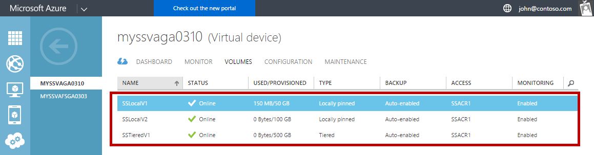
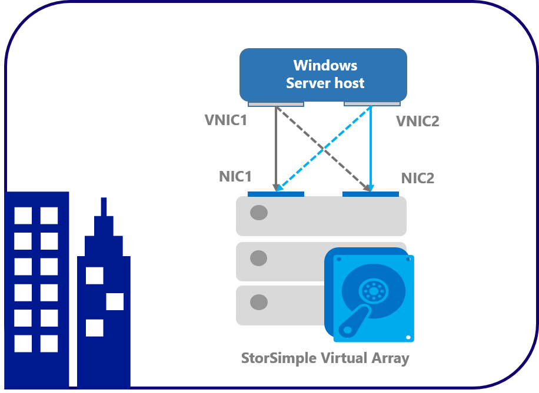
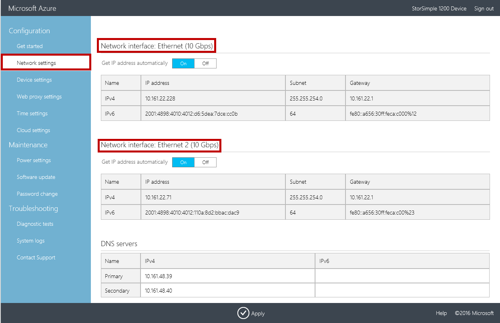
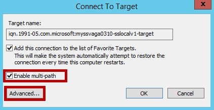
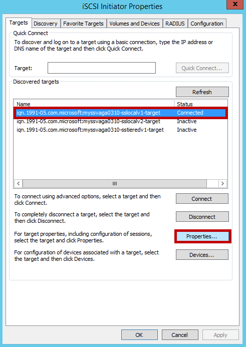
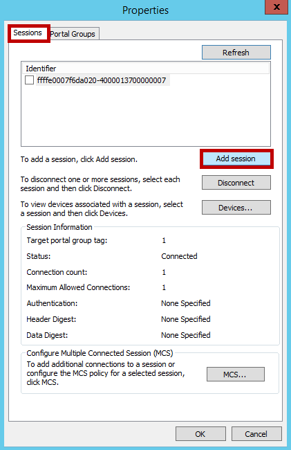
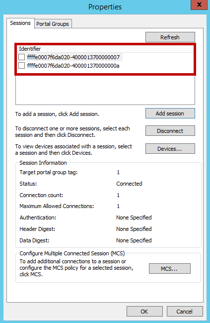
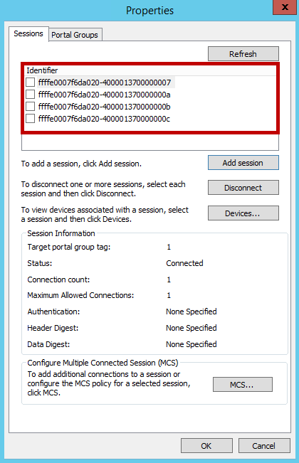
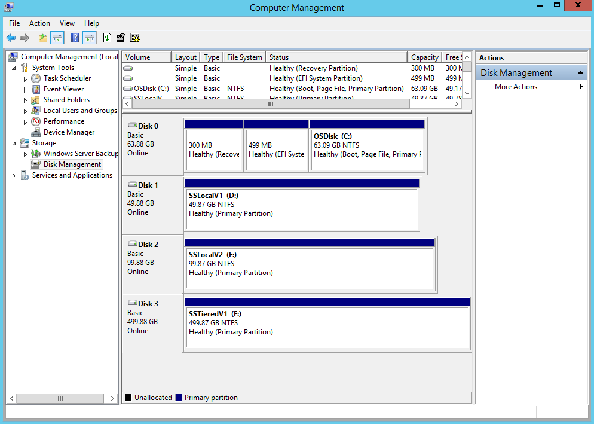
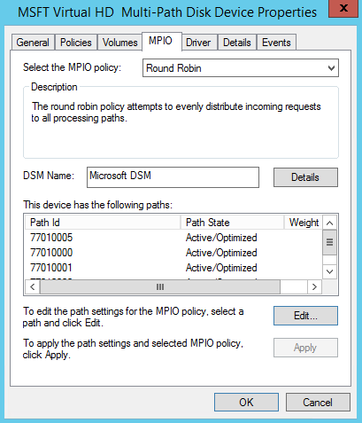

<properties 
   pageTitle="Configure MPIO on your StorSimple virtual array host| Microsoft Azure"
   description="Describes how to configure Multipath I/O (MPIO) for your StorSimple virtual array connected to a host running Windows Server 2012 R2."
   services="storsimple"
   documentationCenter=""
   authors="alkohli"
   manager="carmonm"
   editor="" />
<tags 
   ms.service="storsimple"
   ms.devlang="NA"
   ms.topic="article"
   ms.tgt_pltfrm="NA"
   ms.workload="NA"
   ms.date="06/20/2016"
   ms.author="alkohli" />

# Configure Multipath I/O on Windows Server host for the StorSimple Virtual Array

## Overview

This article describes how to install Multipath I/O feature (MPIO) on your Windows Server host, apply specific configuration settings for StorSimple-only volumes, and then verify MPIO for StorSimple volumes. The procedure assumes that your StorSimple 1200 Virtual Array with two network interfaces is connected to a Windows Server host with two network interfaces. The information contained in this article applies only to the virtual array. For information on StorSimple 8000 series devices, go to [Configure MPIO for StorSimple host](storsimple-configure-mpio-windows-server.md). 

The MPIO feature in Windows Server helps build highly available, fault-tolerant storage configurations. MPIO uses redundant physical path components — adapters, cables, and switches — to create logical paths between the server and the storage device. If there is a component failure, causing a logical path to fail, multipathing logic uses an alternate path for I/O so that applications can still access their data. Additionally depending on your configuration, MPIO can also improve performance by re-balancing the load across all these paths. For more information, see [MPIO overview](https://technet.microsoft.com/library/cc725907.aspx "MPIO overview and features").  

For the high-availability of your StorSimple solution, configure MPIO on the Windows Server hosts connected to your StorSimple 1200 Virtual Array (also known as the on-premises virtual device). The host servers can then tolerate a link, network, or interface failure. 

You will need to follow these steps to configure MPIO: 

- Configuration prerequisites

- Step 1: Install MPIO on the Windows Server host

- Step 2: Configure MPIO for StorSimple volumes

- Step 3: Mount StorSimple volumes on the host

Each of the above steps is discussed in the following sections.

## Prerequisites

This section details the configuration prerequisites for the Windows Server host and your virtual array.

### On Windows Server host

-  Make sure that your Windows Server host has 2 network interfaces enabled.

### On StorSimple virtual array

- The virtual array should be configured as an iSCSI server. To learn more, see [set up virtual array as an iSCSI server](storsimple-ova-deploy3-iscsi-setup.md). One or more network interfaces should be enabled on the array.   

- The network interfaces on your virtual array should be reachable from the Windows Server host.

- One or more volumes should be created on your StorSimple Virtual Array. To learn more, see [Add a volume](storsimple-ova-deploy3-iscsi-setup.md#step-3-add-a-volume) on your StorSimple 1200 virtual array. In this procedure, we created 3 volumes (2 locally pinned and 1 tiered volume as shown below) on the virtual array.
	
	

### Hardware configuration for StorSimple virtual array

The figure below shows the hardware configuration for high availability and load-balancing multipathing for your Windows Server host and StorSimple  virtual array used in this procedure.  

As shown in the preceding figure:

- Your StorSimple virtual array provisioned on Hyper-V is a single node active device configured as an iSCSI server.

- Two virtual network interfaces are enabled on your array. In the local web UI of your 1200 virtual array, verify that two network interfaces are enabled by navigating to **Network Settings** as shown below:

	
	
	Note the IPv4 addresses of the enabled network interfaces (Ethernet, Ethernet 2 by default) and save for later use on the host.

- Two network interfaces are enabled on your Windows Server host. If the connected interfaces for host and array are on the same subnet, then there will be 4 paths available. This was the case in this procedure. However, if each network interface on the array and host interface are on a different IP subnet (and not routable), then only 2 paths will be available.

## Step 1: Install MPIO on the Windows Server host

MPIO is an optional feature on Windows Server and is not installed by default. It should be installed as a feature through Server Manager. To install this feature on your Windows Server host, complete the following procedure.

[AZURE.INCLUDE [storsimple-install-mpio-windows-server-host](../../includes/storsimple-install-mpio-windows-server-host.md)]

## Step 2: Configure MPIO for StorSimple volumes

MPIO needs to be configured to identify StorSimple volumes. To configure MPIO to recognize StorSimple volumes, perform the following steps.

[AZURE.INCLUDE [storsimple-configure-mpio-volumes](../../includes/storsimple-configure-mpio-volumes.md)]

## Step 3: Mount StorSimple volumes on the host

After MPIO is configured on Windows Server, volume(s) created on the StorSimple array can be mounted and can then take advantage of MPIO for redundancy. To mount a volume, perform the following steps.

#### To mount volumes on the host

1. Open the **iSCSI Initiator Properties** window on the Windows Server host. Click **Server Manager > Dashboard > Tools > iSCSI Initiator**.
2. In the **iSCSI Initiator Properties** dialog box, click the Discovery tab, and then click **Discover Target Portal**.
3. In the **Discover Target Portal** dialog box, do the following:
	
	- Enter the IP address of the first enabled network interface on your StorSimple virtual array. By default, this would be **Ethernet**. 
	- Click **OK** to return to the **iSCSI Initiator Properties** dialog box.

	>[AZURE.IMPORTANT] **If you are using a private network for iSCSI connections, enter the IP address of the DATA port that is connected to the private network.**

4. Repeat steps 2-3 for a second network interface (for example, Ethernet 2) on your array. 

5. Select the **Targets** tab in the **iSCSI Initiator Properties** dialog box. For your virtual array, you should see each volume surface as a target under **Discovered Targets**. In this case, three targets (corresponding to three volumes) would be discovered.

	

6. Click **Connect** to establish an iSCSI session with your StorSimple array. A **Connect to Target** dialog box will appear. Select the **Enable multi-path** check box. Click **Advanced**.

	

8. In the **Advanced Settings** dialog box, do the following:										
	- 	 On the **Local Adapter** drop-down list, select **Microsoft iSCSI Initiator**.
	- 	 On the **Initiator IP** drop-down list, select the IP address of the host.
	- 	 On the **Target Portal** IP drop-down list, select the IP of array interface.
	- 	 Click **OK** to return to the **iSCSI Initiator Properties** dialog box.

	

9. Click **Properties**. 

	
10. In the **Properties** dialog box, click **Add Session**.

	

10. In the **Connect to Target** dialog box, select the **Enable multi-path** check box. Click **Advanced**.
11. In the **Advanced Settings** dialog box:										
	-  On the **Local adapter** drop-down list, select Microsoft iSCSI Initiator.
	-  On the **Initiator IP** drop-down list, select the IP address corresponding to the host. In this case, you are connecting two network interfaces on the array to a single network interface on the host. Therefore, this interface is the same as that provided for the first session.
	-  On the **Target Portal IP** drop-down list, select the IP address for the second data interface enabled on the array.
	-  Click **OK** to return to the iSCSI Initiator Properties dialog box. You have added a second session to the target.

		

	- After adding the desired sessions (paths), in the **iSCSI Initiator Properties** dialog box, select the target and click **Properties**. On the Sessions tab of the **Properties** dialog box, note the four session identifiers that correspond to the possible path permutations. To cancel a session, select the check box next to a session identifier, and then click **Disconnect**.
 
	- To view devices presented within sessions, select the **Devices** tab. To configure the MPIO policy for a selected device, click **MPIO**. The **
	-  Details** dialog box will appear. On the **MPIO** tab, you can select the appropriate **Load Balance Policy** settings. You can also view the **Active** or **Standby** path type.

10. Repeat steps 8-11 to add additional sessions (paths) to the target. With two interfaces on the host and two on the virtual array, you can add a total of four sessions for each target. 

	

11. You will need to repeat these steps for each volume (surfaces as a target).

	

12. Open **Computer Management** by navigating to **Server Manager > Dashboard > Computer Management**. In the left pane, click **Storage > Disk Management**. The volume(s) created on the StorSimple virtual array that are visible to this host will appear under **Disk Management** as new disk(s).

13. Initialize the disk and create a new volume. During the format process, select an allocation unit size (AUS) of 64 KB. Repeat the process for all the available volumes.

	

14. Under **Disk Management**, right-click the **Disk** and select **Properties**.

15. In the **Multi-Path Disk Device Properties** dialog box, click the **MPIO** tab.

	

16. In the **DSM Name** section, click **Details** and verify that the parameters are set to the default parameters. The default parameters are:

	- Path Verify Period = 30
	- Retry Count = 3
	- PDO Remove Period = 20
	- Retry Interval = 1
	- Path Verify Enabled = Unchecked.

	>[AZURE.NOTE] **Do not modify the default parameters.**

## Next steps

Learn more about [using the StorSimple Manager service to administer your StorSimple Virtual Array](storsimple-ova-manager-service-administration.md).
 
