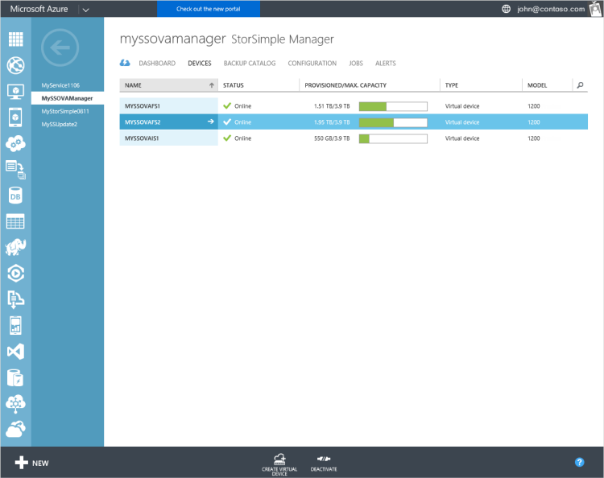
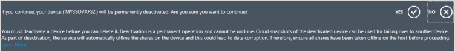
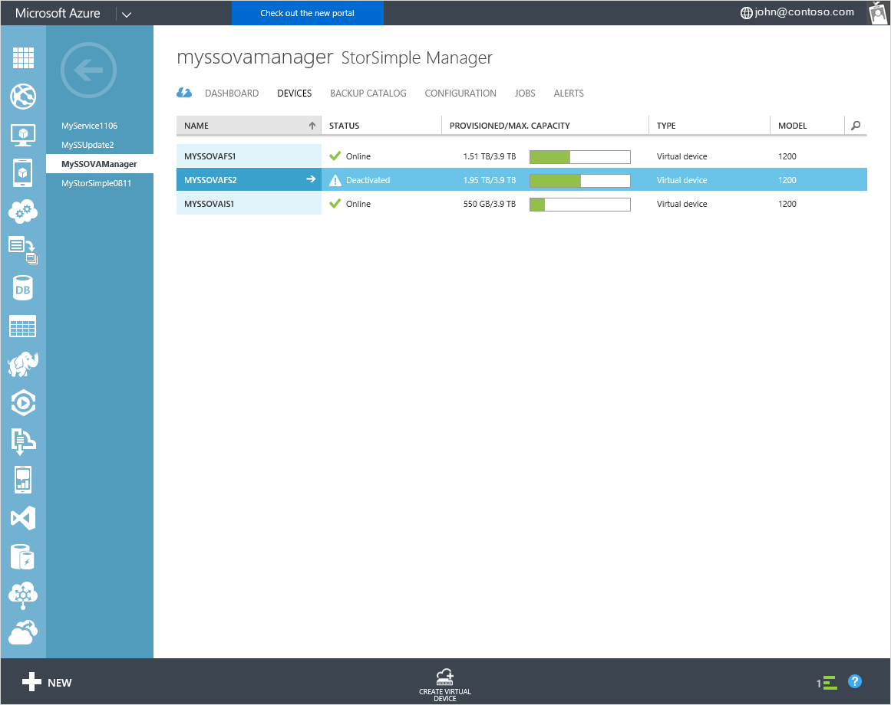
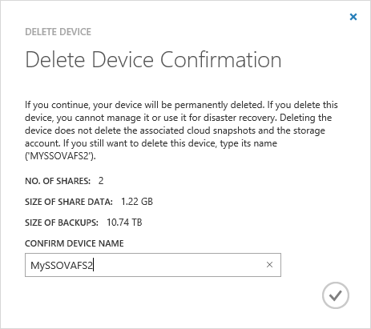
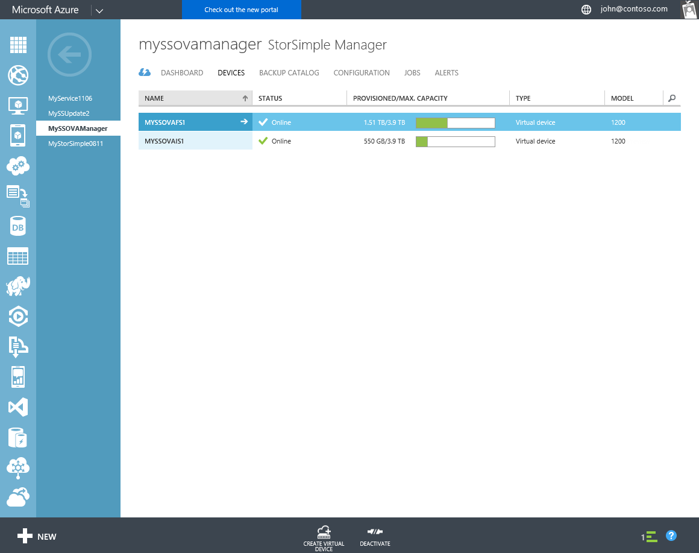

<properties 
   pageTitle="Deactivate and delete a StorSimple Virtual Array | Microsoft Azure"
   description="Describes how to remove StorSimple device from service by  first deactivating it and then deleting it."
   services="storsimple"
   documentationCenter=""
   authors="alkohli"
   manager="carmonm"
   editor="" />
<tags 
   ms.service="storsimple"
   ms.devlang="na"
   ms.topic="article"
   ms.tgt_pltfrm="na"
   ms.workload="na"
   ms.date="02/01/2016"
   ms.author="alkohli" />

# Deactivate and delete a StorSimple Virtual Array

## Overview

You will need to deactivate a StorSimple Virtual Array if you are performing a device failover to a secondary device in case of disaster recovery (DR). After the device data is transferred and the failover is complete, you can delete the device. When you deactivate a device, the connection between the device and the corresponding StorSimple Manager service is severed. This tutorial explains how to deactivate a StorSimple Virtual Array and then delete it. 

When you deactivate a device, any data that was stored locally on the device will no longer be accessible. Only the data associated with the device that was stored in the cloud can be recovered. If you plan to keep the device data after deactivation, then you should take a cloud snapshot of all your data before you deactivate a device. This will allow you to recover all the data at a later stage.

>[AZURE.WARNING] Deactivation is a PERMANENT operation and cannot be undone. A deactivated device cannot be registered with the StorSimple Manager service again. 
>

This tutorial explains how to:

- Deactivate a device 
- Delete a deactivated device

## Deactivate a device

Perform the following steps to deactivate your device.

#### To deactivate the device   

1. Go to **Devices** page. Select the device that you wish to deactivate.

	

3. At the bottom of the page, click **Deactivate**.

	

4. A confirmation message will appear. Click **Yes** to continue. 

	

	The deactivate process will start and take a few minutes to complete.

	

3. After deactivation, the list of the devices will be refreshed. 

	

	You can now delete this device. 

## Delete the device

Deleting a device removes it from the list of devices connected to the service. The service can then no longer manage the deleted device. Complete the following steps to delete the device:

#### To delete the device 

 1. On the StorSimple Manager service **Devices** page, select a deactivated device that you wish to delete.

	

 2. On the bottom on the page, click **Delete**.
 
	

 3. You will be prompted for confirmation. Type the device name to confirm device deletion. Click the check icon to continue.
 
	 

 5. It may take a few minutes for the device to be deleted. 

	

 	After the device is deleted, the list of devices will be refreshed.

	

## Next steps

- To learn more about how to use the StorSimple Manager service, go to [Use the StorSimple Manager service to administer your StorSimple Virtual Array](storsimple-ova-manager-service-administration.md). 