<properties 
   pageTitle="StorSimple Virtual Array iSCSI server setup | Microsoft Azure"
   description="Describes how to perform initial setup, register your StorSimple iSCSI server, and complete device setup."
   services="storsimple"
   documentationCenter="NA"
   authors="alkohli"
   manager="carmonm"
   editor="" />
<tags 
   ms.service="storsimple"
   ms.devlang="NA"
   ms.topic="article"
   ms.tgt_pltfrm="NA"
   ms.workload="TBD"
   ms.date="07/18/2016"
   ms.author="alkohli" />

# Deploy StorSimple Virtual Array – Set up your virtual device as an iSCSI server

## Overview

This deployment tutorial applies to the Microsoft Azure StorSimple Virtual Array (also known as the StorSimple on-premises virtual device or the StorSimple virtual device) running March 2016 general availability (GA) release. This tutorial describes how to perform initial setup, register your StorSimple iSCSI server, complete the device setup, and then create, mount, initialize, and format volumes on your StorSimple virtual device iSCSI server. The StorSimple setup information in this article applies to StorSimple Virtual Arrays only. 

The procedures described here take approximately 30 minutes to 1 hour to complete. The information published in this article applies to StorSimple Virtual Arrays only.

## Setup prerequisites

Before you configure and set up your StorSimple virtual device, make sure that:

- You have provisioned a virtual device and connected to it as described in [Deploy StorSimple Virtual Array - Provision a virtual array in Hyper-V](storsimple-ova-deploy2-provision-hyperv.md) or [Deploy StorSimple Virtual Array  - Provision a virtual array in VMware](storsimple-ova-deploy2-provision-vmware.md).

- You have the service registration key from the StorSimple Manager service that you created to manage StorSimple virtual devices. For more information, see **Step 2: Get the service registration key** in [Deploy StorSimple Virtual Array - Prepare the portal](storsimple-ova-deploy1-portal-prep.md#step-2-get-the-service-registration-key).

- If this is the second or subsequent virtual device that you are registering with an existing StorSimple Manager service, you should have the service data encryption key. This key was generated when the first device was successfully registered with this service. If you have lost this key, see **Get the service data encryption key** in [Use the Web UI to administer your StorSimple Virtual Array](storsimple-ova-web-ui-admin.md#get-the-service-data-encryption-key).

## Step-by-step setup 

Use the following step-by-step instructions to set up and configure your StorSimple virtual device:

-  [Step 1: Complete the local web UI setup and register your device](#step-1-complete-the-local-web-ui-setup-and-register-your-device)
-  [Step 2: Complete the required device setup](#step-2-complete-the-required-device-setup)
-  [Step 3: Add a volume](#step-3-add-a-volume)
-  [Step 4: Mount, initialize, and format a volume](#step-4-mount-initialize-and-format-a-volume)  

## Step 1: Complete the local web UI setup and register your device 

#### To complete the setup and register the device

1. Open a browser window and connect to the web UI by typing:

    `https://<ip-address of network interface>`

    Use the connection URL noted in the previous step. You will see an error notifying you that there is a problem with the website’s security certificate. Click **Continue to this web page**.

    

2. Sign in to the web UI of your virtual device as **StorSimpleAdmin**. Enter the device administrator password that you changed in Step 3: Start the virtual device in [Deploy StorSimple Virtual Array - Provision a virtual device in Hyper-V](storsimple-ova-deploy2-provision-hyperv.md) or [Deploy StorSimple Virtual Array - Provision a virtual device in VMware](storsimple-ova-deploy2-provision-vmware.md).

    

3. You will be taken to the **Home** page. This page describes the various settings required to configure and register the virtual device with the StorSimple Manager service. Note that the **Network settings**, **Web proxy settings**, and **Time settings** are optional. The only required settings are **Device settings** and **Cloud settings**.

    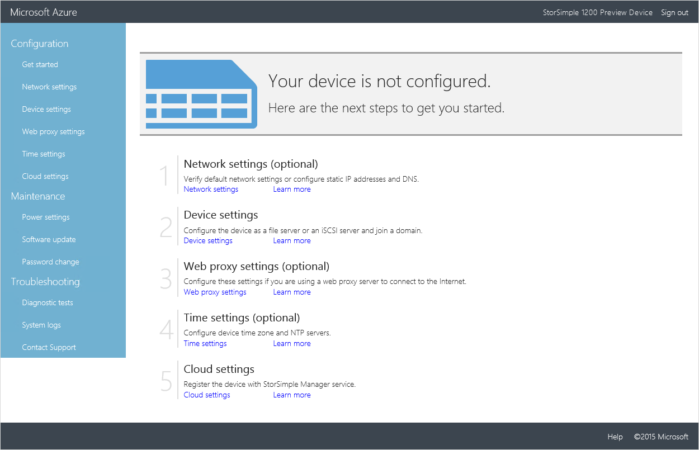

4. On the **Network settings** page under **Network interfaces**, DATA 0 will be automatically configured for you. Each network interface is set by default to get an IP address automatically (DHCP). Therefore, an IP address, subnet, and gateway will be automatically assigned (for both IPv4 and IPv6).

    As you plan to deploy your device as an iSCSI server (to provision block storage), we recommend that you disable the **Get IP address automatically** option and configure static IP addresses.

    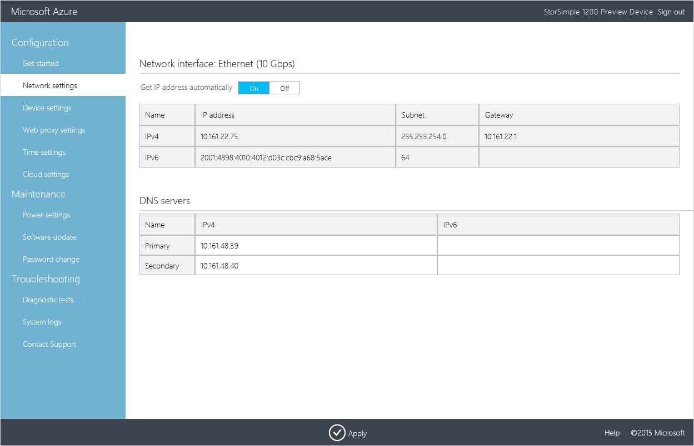

    If you added more than one network interface during the provisioning of the device, you can configure them here. Note you can configure your network interface as IPv4 only or as both IPv4 and IPv6. IPv6 only configurations are not supported.

5. DNS servers are required because they are used when your device attempts to communicate with your cloud storage service providers or to resolve your device by name if it is configured as a file server. On the **Network settings** page under the **DNS servers**:

    1. A primary and secondary DNS server will be automatically configured. If you choose to configure static IP addresses, you can specify DNS servers. For high availability, we recommend that you configure a primary and a secondary DNS server.

    2. Click **Apply**. This will apply and validate the network settings.

6. On the **Device settings** page:

    1. Assign a unique **Name** to your device. This name can be 1-15 characters and can contain letter, numbers and hyphens.

    2. Click the **iSCSI server** icon  for the **Type** of device that you are creating. An iSCSI server will allow you to provision block storage.

    3. Specify if you want this device to be domain-joined. If your device is an iSCSI server, then joining the domain is optional. If you decide to not join your iSCSI server to a domain, click **Apply**, wait for the settings to be applied and then skip to the next step.

        If you want to join the device to a domain. Enter a **Domain name**, and then click **Apply**.

        > [AZURE.NOTE] If joining your iSCSI server to a domain, ensure that your virtual  array is in its own organizational unit (OU) for Microsoft Azure Active Directory and no group policy objects (GPO) are applied to it.

    5. A dialog box will appear. Enter your domain credentials in the specified format. Click the check icon . The domain credentials will be verified. You will see an error message if the credentials are incorrect.

        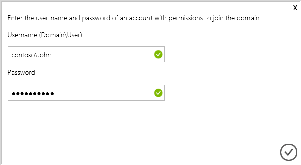

    6. Click **Apply**. This will apply and validate the device settings.
 
7. (Optionally) configure your web proxy server. Although web proxy configuration is optional, be aware that if you use a web proxy, you can only configure it here.

    

    On the **Web proxy** page:

    1. Supply the **Web proxy URL** in this format: *http://host-IP address* or *FDQN:Port number*. Note that HTTPS URLs are not supported.

    2. Specify **Authentication** as **Basic** or **None**.

    3. If you are using authentication, you will also need to provide a **Username** and **Password**.

    4. Click **Apply**. This will validate and apply the configured web proxy settings.
 
8. (Optionally) configure the time settings for your device, such as time zone and the primary and secondary NTP servers. NTP servers are required because your device must synchronize time so that it can authenticate with your cloud service providers.

    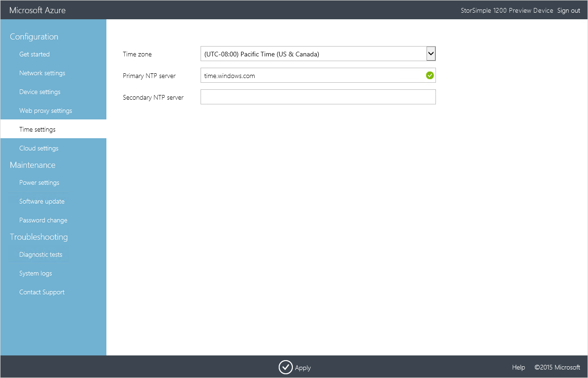

    On the **Time settings** page:

    1. From the drop-down list, select the **Time zone** based on the geographic location in which the device is being deployed. The default time zone for your device is PST. Your device will use this time zone for all scheduled operations.

    2. Specify a **Primary NTP server** for your device or accept the default value of time.windows.com. Ensure that your network allows NTP traffic to pass from your datacenter to the Internet.

    3. Optionally specify a **Secondary NTP server** for your device.

    4. Click **Apply**. This will validate and apply the configured time settings.

9. Configure the cloud settings for your device. In this step, you will complete the local device configuration and then register the device with your StorSimple Manager service.

    1. Enter the **Service registration key** that you got in **Step 2: Get the service registration key** in [Deploy StorSimple Virtual Array - Prepare the Portal](storsimple-ova-deploy1-portal-prep.md#step-2-get-the-service-registration-key).

    2. If this is not the first device that you are registering with this service, you will need to provide the **Service data encryption key**. This key is required with the service registration key to register additional devices with the StorSimple Manager service. For more information, refer to [Get the service data encryption key](storsimple-ova-web-ui-admin.md#get-the-service-data-encryption-key) on your local web UI.

    3. Click **Register**. This will restart the device. You may need to wait for 2-3 minutes before the device is successfully registered. After the device has restarted, you will be taken to the sign in page.

       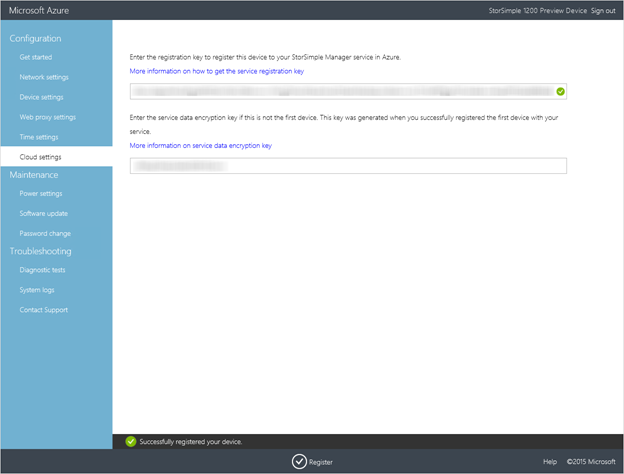

10. Return to the Azure classic portal. On the **Devices** page, verify that the device has successfully connected to the service by looking up the status. The device status should be **Active**.

    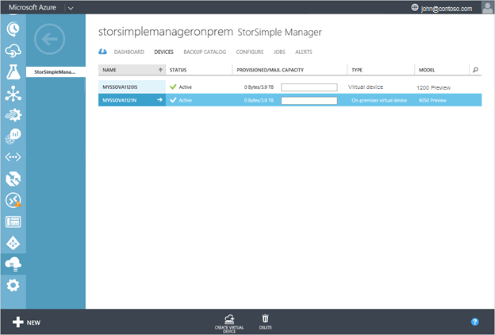

## Step 2: Complete the required device setup

To complete the device configuration of your StorSimple device, you need to:

- Select a storage account to associate with your device.

- Choose encryption settings for the data that is sent to cloud.

Perform the following steps in the Azure classic portal to complete the required device setup.

#### To complete the minimum device setup

1. On the **Devices** page, select the device that you just created. This device would show up as **Active**. Click the arrow next the device name and then click **Quick Start**.

    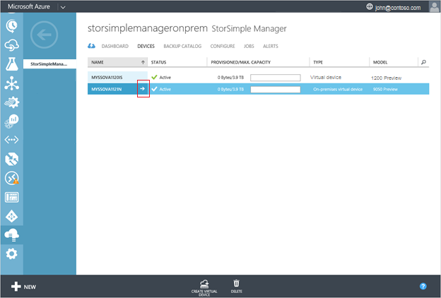

2. Click **complete device setup** to start the Configure device wizard.

    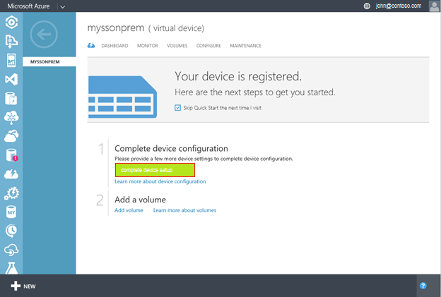

3. In the  Configure device wizard, on the **Basic Settings** page, do the following:

   1. Specify a storage account to be used with your device. In this subscription, you can select an existing storage account from the drop-down list, or you can specify **Add more** to choose an account from a different subscription.

   2. Define the encryption settings for all the data at rest that will be sent to the cloud. (StorSimple uses AES-256 encryption.) To encrypt your data, select the **Enable cloud storage encryption** check box. Enter a cloud storage encryption that contains 32 characters. Reenter the key to confirm it.

   3. Click the check icon .

    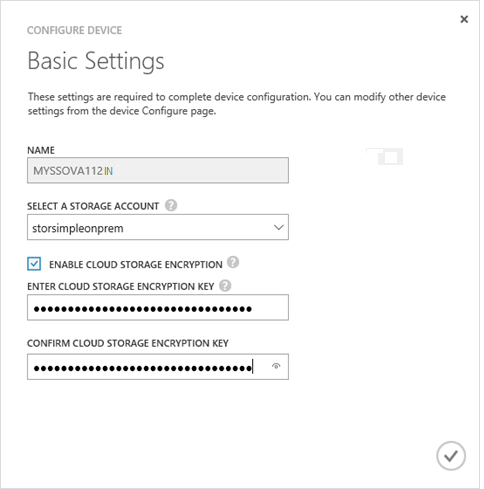

    The settings will now be updated. After settings are updated successfully, the complete device setup button will be unavailable. You will return to the device **Quick Start** page.                                                        

>[AZURE.NOTE]You can modify all the other device settings at any time by accessing the **Configure** page.

## Step 3: Add a volume

Perform the following steps in the Azure classic portal to create a volume.

#### To create a volume

1. On the device **Quick Start** page, click **Add a volume**. This starts the Add a volume wizard.

2. In the Add a volume wizard, under **Basic Settings**, do the following:

    1. Supply a unique name for your volume. The name must be a string that contains 3 to 127 characters.

    2. Provide a description for the volume. The description will help identify the volume owners.

    3. Select a usage type for the volume. The usage type can be **Tiered volume** or **Locally pinned volume.** (**Tiered volume** is the default.) For workloads that require local guarantees, low latencies, and higher performance, select **Locally pinned** **volume**. For all other data, select **Tiered** **volume**.

        A locally pinned volume is thickly provisioned and ensures that the primary data in the volume stays on the device and does not spill to the cloud. If you create a locally pinned volume, the device will check for available space on the local tiers to provision a volume of the requested size. Creating a locally pinned volume may require spilling existing data from the device to the cloud, and the time taken to create the volume may be long. The total time depends on the size of the provisioned volume, available network bandwidth, and the data on your device.

        A tiered volume on the other hand is thinly provisioned and can be created very quickly. When you create a tiered volume, approximately 10% of the space is provisioned on the local tier and 90% of the space is provisioned in the cloud. For example, if you provisioned a 1 TB volume, 100 GB would reside in the local space and 900 GB would be used in the cloud when the data tiers. This in turn implies is that if you run out of all the local space on the device, you cannot provision a tiered share (because the 10% will not be available).

    4. Specify the provisioned capacity for your volume. Note that the specified capacity should be smaller than the available capacity. If you are creating a tiered volume, the size should be between 500 GB and 5 TB. For a locally pinned volume, specify a volume size between 50 GB and 500 GB. Use the available capacity as a guide to provisioning a volume. If the available local capacity is 0 GB, then you will not be allowed to provision a locally pinned or a tiered volume.

        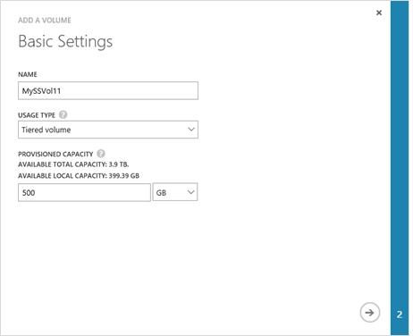

    5. Click the arrow icon  to go to the next page.

3. On the **Additional Settings** page, add a new access control record (ACR):

    1. Supply a **Name** for your ACR.

    2. Under **iSCSI Initiator Name**, provide the iSCSI Qualified Name (IQN) of your Windows host. If you don't have the IQN, go to [Appendix A: Get the IQN of a Windows Server host](#appendix-a-get-the-iqn-of-a-windows-server-host).

    3. We recommend that you enable a default backup by selecting the **Enable a default backup for this volume** check box. The default backup will create a policy that executes at 22:30 each day (device time) and creates a cloud snapshot of this volume.

        

    4. Click the check icon . This starts the volume creation job. You will see a progress message similar to the following.

        

        A volume will be created with the specified settings. By default, monitoring and backup will be enabled for the volume.

    5. To confirm that the volume was successfully created, go to the **Volumes** page. You should see the volume listed.

        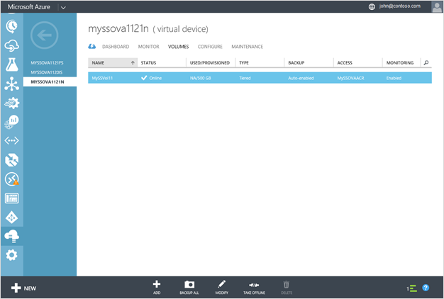

## Step 4: Mount, initialize, and format a volume

Perform the following steps to mount, initialize, and format your StorSimple volumes on a Windows Server host.

#### To mount, initialize, and format a volume

1. Start the Microsoft iSCSI initiator.

2. In the **iSCSI Initiator Properties** window, on the **Discovery** tab, click **Discover Portal**.

    

3. In the **Discover Target Portal** dialog box, supply the IP address of your iSCSI-enabled network interface, and then click **OK**.

    

4. In the **iSCSI Initiator Properties** window, on the **Targets** tab, locate the **Discovered targets**. (Each volume will be a discovered target.) The device status should appear as **Inactive**.

    

5. Select a target device and then click **Connect**. After the device is connected, the status should change to **Connected**. (For more information about using the Microsoft iSCSI initiator, see [Installing and Configuring Microsoft iSCSI Initiator] [1].

    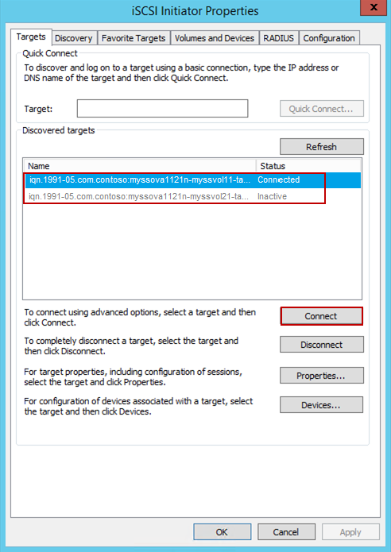

6. On your Windows host, press the Windows Logo key + X, and then click **Run**.

7. In the **Run** dialog box, type **Diskmgmt.msc**. Click **OK**, and the **Disk Management** dialog box will appear. The right pane will show the volumes on your host.

8. In the **Disk Management** window, the mounted volumes will appear as shown in the following illustration. Right-click the discovered volume (click the disk name), and then click **Online**.

    

9. Right-click and select **Initialize Disk**.

    

10. In the dialog box, select the disk(s) to initialize, and then click **OK**.

    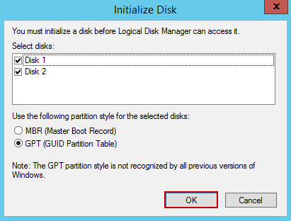

11. The New Simple Volume wizard starts. Select a disk size, and then click **Next**.

    

12. Assign a drive letter to the volume, and then click **Next**.

    

13. Enter the parameters to format the volume. **On Windows Server, only NTFS is supported.** Set the AUS to 64K. Provide a label for your volume. It is a recommended best practice for this name to be identical to the volume name you provided on your StorSimple virtual device. Click **Next**.

    

14. Check the values for your volume, and then click **Finish**.

    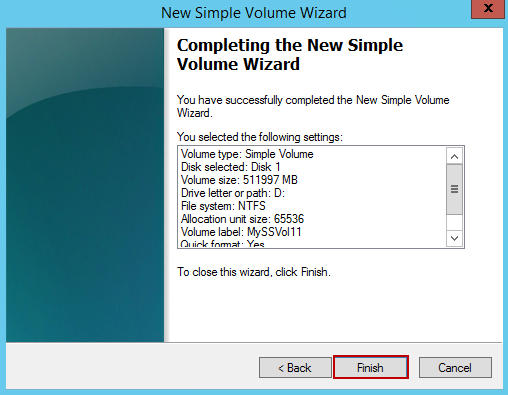

    The volumes will appear as **Online** on the **Disk Management** page.

    

## Next steps

Learn how to use the local web UI to [administer your StorSimple Virtual Array](storsimple-ova-web-ui-admin.md).

## Appendix A: Get the IQN of a Windows Server host

Perform the following steps to get the iSCSI Qualified Name (IQN) of a Windows host that is running Windows Server 2012.

#### To get the IQN of a Windows host

1. Start the Microsoft iSCSI initiator on your Windows host.

2. In the **iSCSI Initiator Properties** window, on the **Configuration** tab, select and copy the string from the **Initiator Name** field.

    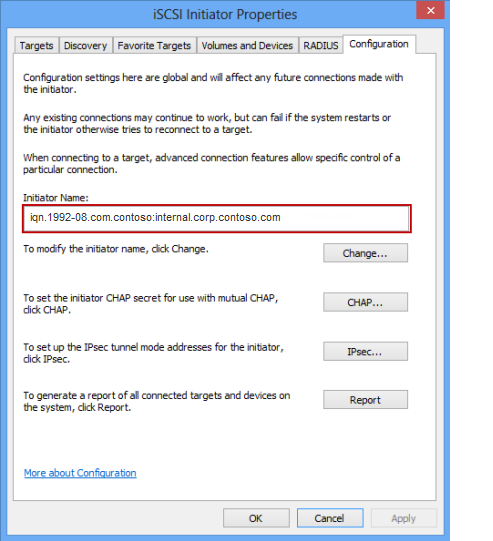

2. Save this string.

<!--Reference link-->
[1]: https://technet.microsoft.com/library/ee338480(WS.10).aspx

