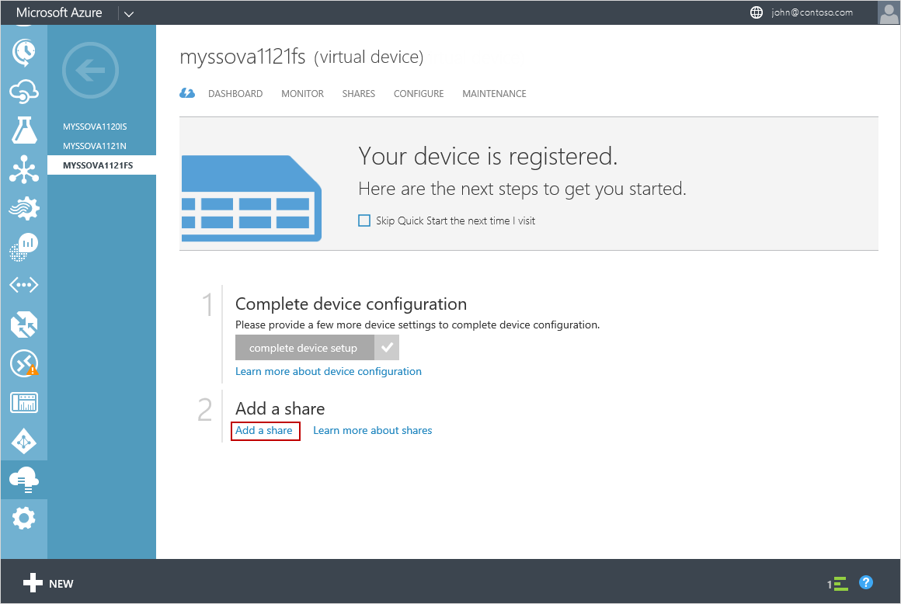

<properties
   pageTitle="Deploy StorSimple Virtual Array 4 - Connect to the virtual device file server"
   description="This fourth tutorial in StorSimple Virtual Array deployment series instructs you to connect to your virtual device file server."
   services="storsimple"
   documentationCenter="NA"
   authors="alkohli"
   manager="carmon"
   editor=""/>

<tags
   ms.service="storsimple"
   ms.devlang="NA"
   ms.topic="article"
   ms.tgt_pltfrm="NA"
   ms.workload="NA"
   ms.date="12/30/2015"
   ms.author="alkohli"/>

# Deploy StorSimple Virtual Array 4 - Connect to the virtual device file server (Preview)

## Overview

This article applies to Microsoft Azure StorSimple Virtual Array (also known as the StorSimple on-premises virtual device also known as the StorSimple virtual device) running December 2015 Public Preview release. This article describes how to create shares and map and connect to those on your StorSimple virtual device file server.

The procedure described here takes approximately 15 minutes to implement. The StorSimple deployment information published in this article applies to StorSimple Virtual Arrays only.

## Prerequisites

Before you begin, make sure that:

-   You have completed all the device configuration as required in the [Set up a StorSimple Virtual Array file server](storsimple-ova-deploy3-fs-setup.md).

## Step-by-step 

Use the following steps to create shares and connect to the shares on your StorSimple virtual device file server.

## Step 1: Add a share

Perform the following steps in the [Azure classic portal](https://manage.windowsazure.com/) to create a share.

#### To create a share

1.  On the device **Quick Start** page, click **Add a share**. This starts the Add a share wizard.

	

1.  On the **Basic Settings** page, do the following:

    1.  Specify a unique name for your share. The name must be a string that contains 3 to 127 characters.

    2.  (Optional) Provide a description for the share. The description will help identify the share owners.

    3.  Select a usage type for the share. The usage type can be **Tiered** or **Locally pinned**, with tiered being the default. For workloads that require local guarantees, low latencies, and higher performance, select a **Locally pinned** share. For all other data, select a **Tiered** share.

	A locally pinned share is thickly provisioned and ensures that the primary data on the share stays local to the device and does not spill to the cloud. A tiered share on the other hand is thinly provisioned and can be created very quickly. When you create a tiered share, 10% of the space is provisioned on the local tier and 90% of the space is provisioned in the cloud. For instance, if you provisioned a 1 TB volume, 100 GB would reside in the local space and 900 GB would be used in the cloud when the data tiers. This in turn implies that if you run out of all the local space on the device, you cannot provision a tiered share.

1.  Specify the provisioned capacity for your share. Note that the specified capacity should be smaller than the available capacity. If using a tiered share, the share size should be between 500 GB and 20 TB. For a locally pinned share, specify a share size between 50 GB and 2 TB. Use the available capacity as a guide to provision a share. If the available local capacity is 0 GB, then you will not be allowed to provision local or tiered shares.

	

1.  Click the arrow icon  to go to the next page.

1.  In the **Additional Settings** page, assign the permissions to the user or the group that will be accessing this share. Specify the name of the user or the user group in *<john@contoso.com>* format. We recommend that you use a user group (instead of a single user) to allow admin privileges to access these shares. After you have assigned the permissions here, you can then use Windows Explorer to modify these permissions.

	

1.  Click the check icon . A share will be created with the specified settings. By default, monitoring and backup will be enabled for the share.

## Step 2: Map and connect to the share

You will now need to connect to the share(s) that you created in the previous step. Perform these steps on your Windows Server host.

#### To map and connect to the share

1.  Press  + R. In the Run window, specify the *\\<file server name>* as the path, replacing *file server name* with the device name that you assigned to your file server. Click **OK**.

	

2.  This will open up Explorer. You should now be able to see the shares that you created as folders. Select and double-click a share (folder) to view the content.

	

3.  You can now add files to these shares and take a backup.

## Next step

Manage your StorSimple virtual device using the [Administer your StorSimple Virtual Array](storsimple-ova-manager-service-admin.md).
