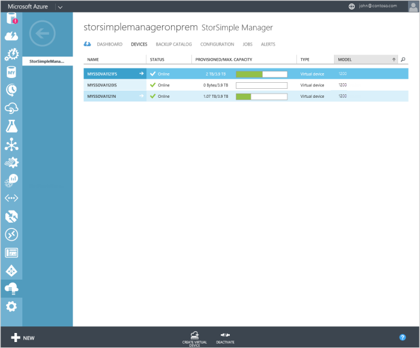
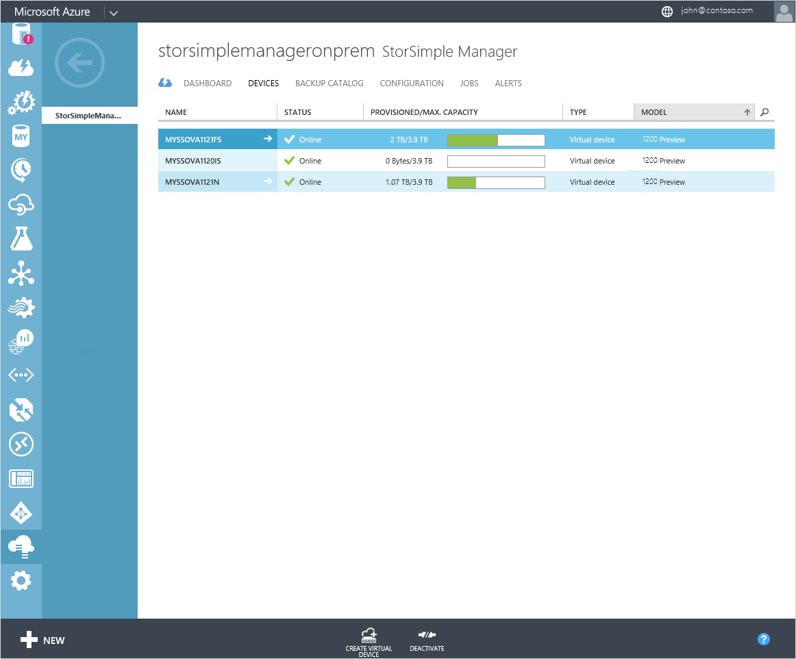
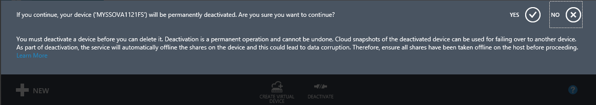
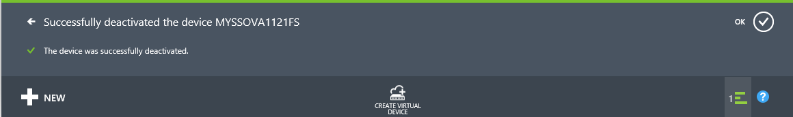
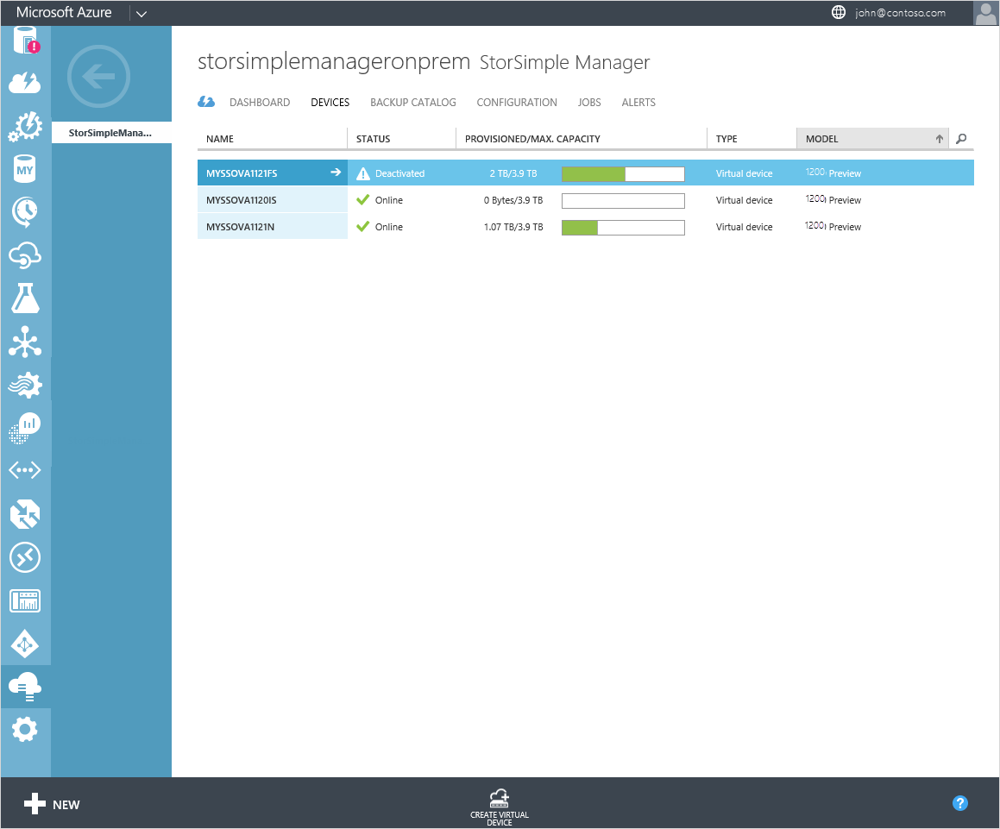
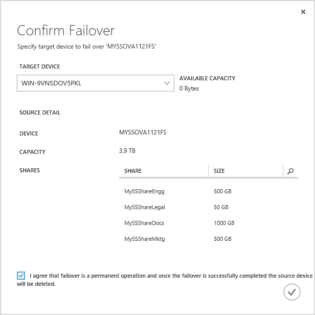
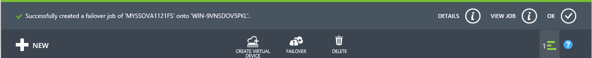
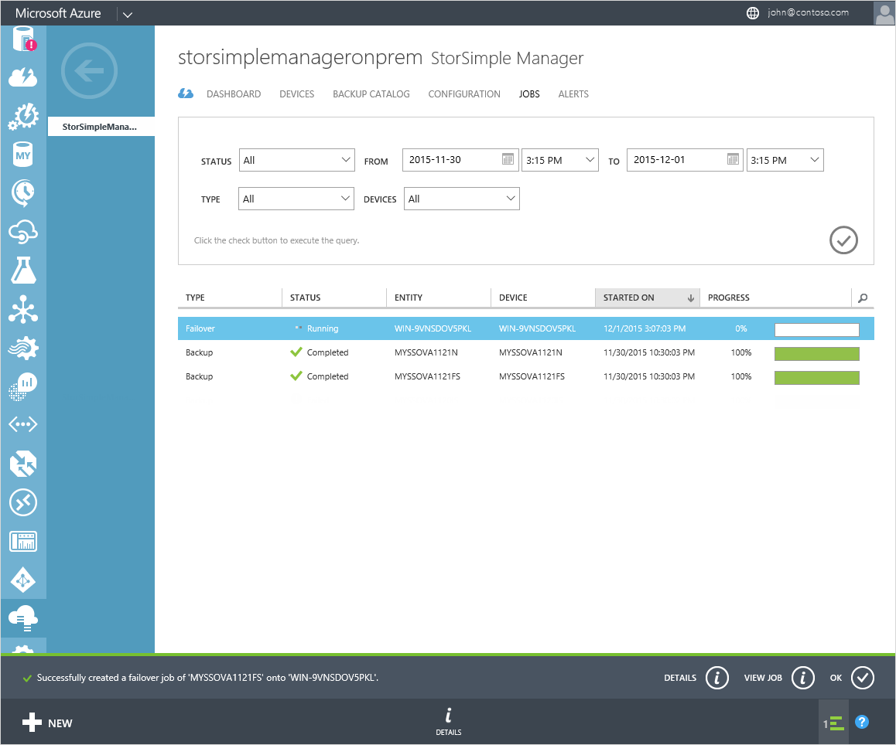
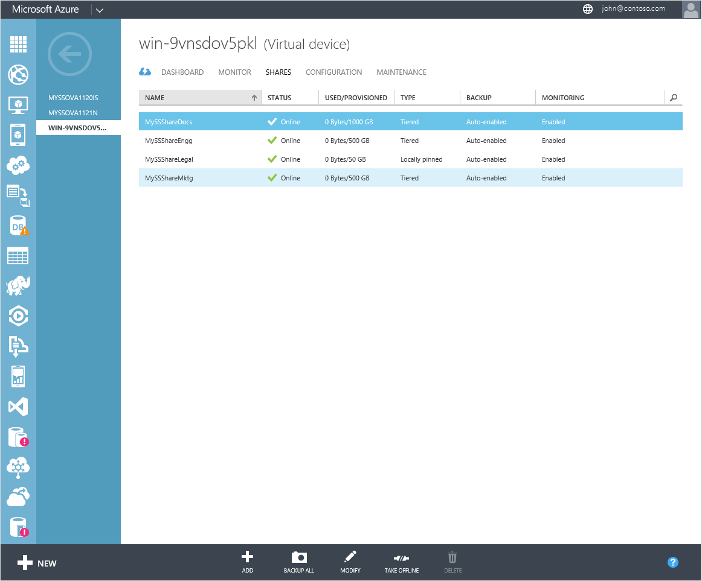

<properties
   pageTitle="Disaster recovery and device failover for your StorSimple Virtual Array"
   description="Learn more about how to failover your StorSimple Virtual Array."
   services="storsimple"
   documentationCenter="NA"
   authors="alkohli"
   manager="carmonm"
   editor=""/>

<tags
   ms.service="storsimple"
   ms.devlang="NA"
   ms.topic="article"
   ms.tgt_pltfrm="NA"
   ms.workload="NA"
   ms.date="06/07/2016"
   ms.author="alkohli"/>

# Disaster recovery and device failover for your StorSimple Virtual Array

## Overview

This article describes the disaster recovery for your Microsoft Azure StorSimple Virtual Array (also known as the StorSimple on-premises virtual device) including the detailed steps required to fail over to another virtual device in the event of a disaster. A failover allows you to migrate your data from a *source* device in the datacenter to another *target* device located in the same or a different geographical location. The device failover is for the entire device. During failover, the cloud data for the source device changes ownership to that of the target device.

Device failover is orchestrated via the disaster recovery (DR) feature and is initiated from the **Devices** page. This page tabulates all the StorSimple devices connected to your StorSimple Manager service. For each device, the friendly name, status, provisioned and maximum capacity, type, and model are displayed.

This article is applicable to StorSimple Virtual Arrays only. To fail over an 8000 series device, go to [Failover and Disaster Recovery of your StorSimple device](storsimple-device-failover-disaster-recovery.md).

## What is disaster recovery?

In a disaster recovery (DR) scenario, the primary device stops functioning. In this situation, you can move the cloud data associated with the failed device to another device by using the primary device as the *source* and specifying another device as the *target*. This process is referred to as the *failover*. During failover, all the volumes or the shares from the source device change ownership and are transferred to the target device. No filtering of the data is allowed.

DR is modeled as a full device restore using the heat map–based tiering and tracking. A heat map is defined by assigning a heat value to the data based on read and write patterns. This heat map then tiers the lowest heat data chunks to the cloud first while keeping the high heat (most used) data chunks in the local tier. During a DR, the heat map is used to restore and rehydrate the data from the cloud. The device fetches all the volumes/shares in the last recent backup (as determined internally) and performs a restore from that backup. The entire DR process is orchestrated by the device.

## Prerequisites for device failover

### Prerequisites

For any device failover, the following prerequisites should be satisfied:

- The source device needs to be in a **Deactivated** state.

- The target device needs to show up as **Active** in the Azure classic portal. You will need to provision a target virtual device of the same or higher capacity. You should then use the local web UI to configure and successfully register the virtual device.

	> [AZURE.IMPORTANT] Do not attempt to configure the registered virtual device through the service by clicking **complete device setup**. No device configuration should be performed through the service.

- The source and target device have to be the same type. You can only fail over a virtual device configured as a file server to another file server. The same is true for an iSCSI server.

- For a file server DR, we recommend that you join the target device to the same domain as that of the source so that the share permissions are automatically resolved. Only the failover to a target device in the same domain is supported in this release.

### Other considerations

- We recommend that you take all the volumes or shares on the source device offline.

- If it is a planned failover, we recommend that you take a backup of the device and then proceed with the failover to minimize data loss. If it is an unplanned failover, the most recent backup will be used to restore the device.

- The available target devices for DR are devices that have the same or larger capacity compared to the source device. The devices that are connected to your service but do not meet the criteria of sufficient space will not be available as target devices.

### DR prechecks

Before the DR begins, prechecks are performed on the device. These checks help ensure that no errors will occur when DR commences. The prechecks include:

- Validating the storage account

- Checking the cloud connectivity to Azure

- Checking available space on the target device

- Checking if an iSCSI server source device has valid ACR names, IQN (not exceeding 220 characters in length), and CHAP password (12 and 16 characters in length) associated with the volumes

If any of the above prechecks fail, you cannot proceed with the DR. You need to resolve those issues and then retry DR.

After the DR is successfully completed, the ownership of the cloud data on the source device is transferred to the target device. The source device is then no longer available in the portal. Access to all the volumes/shares on the source device is blocked and the target device becomes active.

> [AZURE.IMPORTANT]
> 
> Though the device is no longer available, the virtual machine that you provisioned on the host system is still consuming resources. Once the DR is successfully complete, you can delete this virtual machine from your host system.

## Fail over to a virtual array

We recommend that you have another StorSimple Virtual Array provisioned, configured via the local web UI, and registered with the StorSimple Manager service prior to running this procedure.

> [AZURE.IMPORTANT]
> 
> - You are not allowed to fail over from a StorSimple 8000 series device to a 1200 virtual device.
> - You can fail over from a Federal Information Processing Standard (FIPS) enabled virtual device deployed in Government portal to a virtual device in Azure classic portal. The reverse is also true.

Perform the following steps to restore the device to a target StorSimple virtual device.

1. Take volumes/shares offline on the host. Refer to the operating system–specific instructions on the host to take the volumes/shares offline. If not already offline, you will need to take all the volumes/shares offline on the device by going to **Devices > Shares** (or **Device > Volumes**). Select a share/volume and click **Take offline** on the bottom of the page. When prompted for confirmation, click **Yes**. Repeat this process for all the shares/volumes on the device.

2. On the **Devices** page, select the source device for failover and click **Deactivate**. 
	

3. You will be prompted for confirmation. Device deactivation is a permanent process that cannot be undone. You will also be reminded to take your shares/volumes offline on the host.

	

3. Upon confirmation, the deactivation will start. After the deactivation is successfully completed, you will be notified.

	

4. On the **Devices** page, the device state will now change to **Deactivated**.

	

5. Select the deactivated device and at the bottom of the page, click **Failover**.

6. In the Confirm failover wizard that opens up, do the following:

    1. From the dropdown list of available devices, choose a **Target device.** Only the devices that have sufficient capacity are displayed in the dropdown list.

    2. Review the details associated with the source device such as device name, total capacity, and the names of the shares that will be failed over.

		

7. Check **I agree that failover is a permanent operation and once the failover is successfully completed, the source device will be deleted**.

8. Click the check icon .

9. A failover job will be initiated and you will be notified. Click **View job** to monitor the failover.

	

10. In the **Jobs** page, you will see a failover job created for the source device. This job performs the DR prechecks.

	

 	After the DR prechecks are successful, the failover job will spawn restore jobs for each share/volume that exists on your source device.

	

11. After the failover is completed, go to the **Devices** page.

	a. Select the StorSimple virtual device that was used as the target device for the failover process.

	b. Go to **Shares** page (or **Volumes** if iSCSI server). All the shares (volumes) from the old device should now be listed.
 	
	

 **Video available**

This video demonstrates how you can fail over a StorSimple on-premises virtual device to another virtual device.

> [AZURE.VIDEO storsimple-virtual-array-disaster-recovery]

## Business continuity disaster recovery (BCDR)

A business continuity disaster recovery (BCDR) scenario occurs when the entire Azure datacenter stops functioning. This can affect your StorSimple Manager service and the associated StorSimple devices.

If there are StorSimple devices that were registered just before a disaster occurred, then these StorSimple devices may need to be deleted. After the disaster, you can recreate and configure those devices.

## Errors during DR

**Cloud connectivity outage during DR**

If the cloud connectivity is disrupted after DR has started and before the device restore is complete, the DR will fail and you will be notified. The target device that was used for DR is then marked as *unusable.* The same target device cannot be then used for future DRs.

**No compatible target devices**

If the available target devices do not have sufficient space, you will see an error to the effect that there are no compatible target devices.

**Precheck failures**

If one of the prechecks is not satisfied, then you will see precheck failures.

## Next steps

Learn more about how to [administer your StorSimple Virtual Array using the local web UI](storsimple-ova-web-ui-admin.md).
