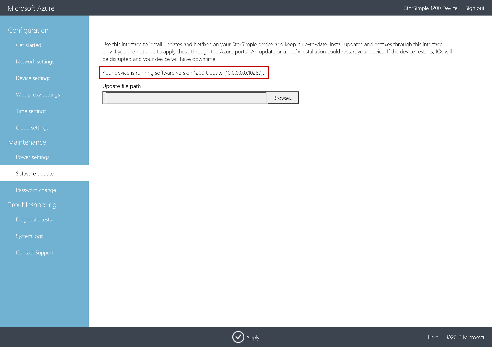
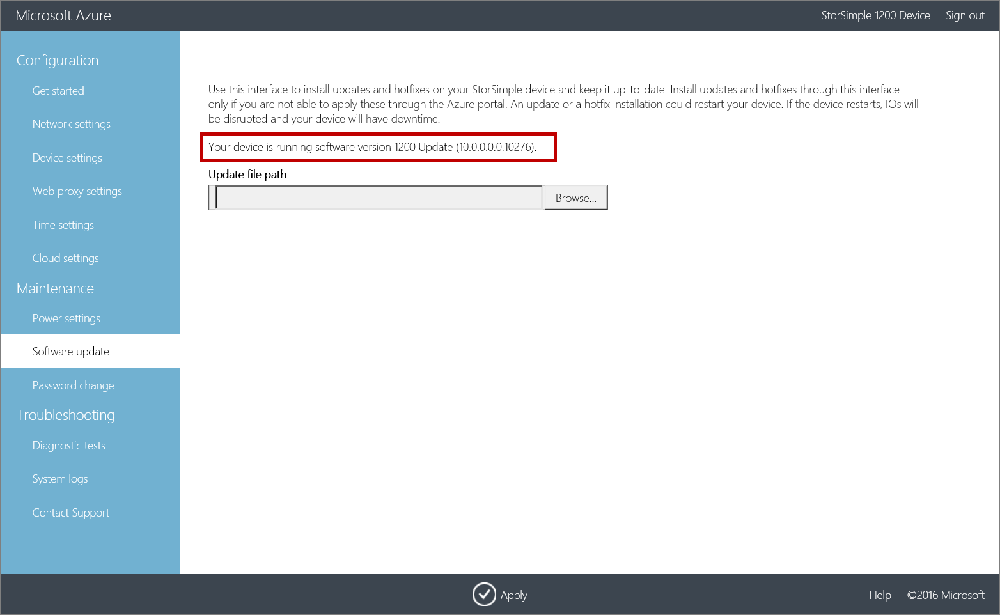

<properties 
   pageTitle="Install Updates on a StorSimple Virtual Array | Microsoft Azure"
   description="Describes how to use the StorSimple Virtual Array web UI to apply updates using the portal and hotfix method"
   services="storsimple"
   documentationCenter="NA"
   authors="alkohli"
   manager="carmonm"
   editor="" />
<tags 
   ms.service="storsimple"
   ms.devlang="NA"
   ms.topic="article"
   ms.tgt_pltfrm="NA"
   ms.workload="TBD"
   ms.date="06/16/2016"
   ms.author="alkohli" />

# Install Updates on your StorSimple Virtual Array

## Overview

This article describes the steps required to install updates on your StorSimple Virtual Array using the local web UI. This procedure takes less than 2 minutes to complete. You need to apply software updates or hotfixes to keep your StorSimple Virtual Array up-to-date. 

Keep in mind that installing an update or hotfix restarts your device. Given that the StorSimple Virtual Array is a single node device, any I/O in progress is disrupted and your device experiences downtime. 

Before you apply an update, we recommend that you take the volumes or shares offline on the host first and then the device. This will minimize any possibility of data corruption.

## Use the local web UI 
To install the latest update, you must use the local web UI to apply hotfixes or updates (you can't use the Azure classic portal to install the update at this time).  

There are two steps when using the local web UI:

- Download the update or the hotfix
- Install the update or the hotfix

### Download the update or the hotfix

Perform the following steps to download the software update from the Microsoft Update Catalog.

#### To download the update or the hotfix

1. Start Internet Explorer and navigate to [http://catalog.update.microsoft.com](http://catalog.update.microsoft.com).

2. If this is your first time using the Microsoft Update Catalog on this computer, click **Install** when prompted to install the Microsoft Update Catalog add-on.
   
	

3. In the search box of the Microsoft Update Catalog, enter the Knowledge Base (KB) number of the hotfix you want to download. Enter **3160441** for Update 0.2, or **3160441** for Update 0.1, and then click **Search**.

    The hotfix listing appears, for example, **StorSimple Virtual Array Update 0.1**.

    

4. Click **Add**. The update is added to the basket.

5. Click **View Basket**.

6. Click **Download**. Specify or **Browse** to a local location where you want the downloads to appear. The updates are downloaded to the specified location and placed in a subfolder with the same name as the update. The folder can also be copied to a network share that is reachable from the device.

### Install the update or the hotfix

Prior to the update or hotfix installation, make sure that you have the update or the hotfix downloaded either locally on your host or accessible via a network share. Perform the following steps to install the update or hotfix.

#### To install the update or the hotfix

1. In the local web UI, go to **Maintenance** > **Software Update**.

2. In **Update file path**, enter the file name for the update or the hotfix. You can also browse to the update or hotfix installation file if placed on a network share. Click **Apply**.

	

3.  A warning will show up. Given this is a single node device, after the update is applied, the device will restart and there will be downtime. Click the check icon.

	

4. The update will start. After the device is successfully updated, it will restart. The local UI will not be accessible in this duration.

    

4. After the restart is complete, you will be taken to the sign in page. You can then verify the software version. Go to **Maintenance** > **Software Update**. The displayed software version should be **10.0.10280.0** for Update 0.2, or **10.0.10279.0** for Update 0.1.

	> [AZURE.NOTE] We report the software versions in a slightly different way in the local web UI and the Azure classic portal. For example, the local web UI reports **10.0.0.0.10279** and the Azure classic portal reports **10.0.10279.0** for the same version. 

	

## Next steps

Learn more about [administering your StorSimple Virtual Array](storsimple-ova-web-ui-admin.md).
