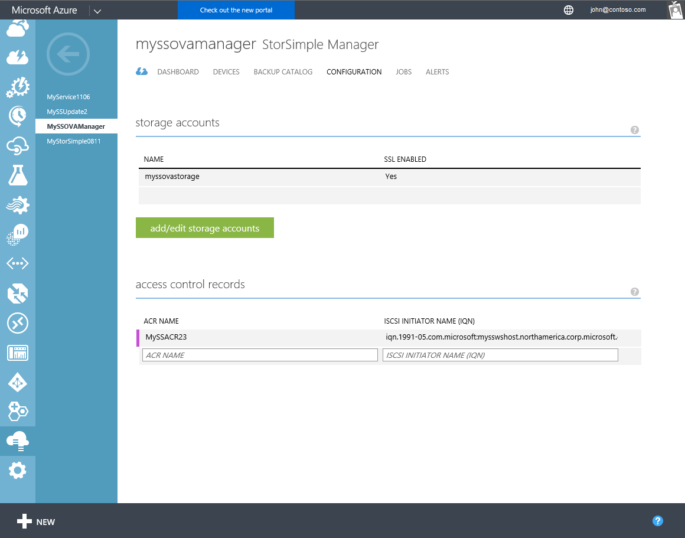

<properties 
   pageTitle="Manage access control records for the StorSimple Virtual Array | Microsoft Azure"
   description="Describes how to manage access control records (ACRs) to determine which hosts can connect to a volume on the StorSimple Virtual Array."
   services="storsimple"
   documentationCenter=""
   authors="alkohli"
   manager="carmonm"
   editor="" />
<tags 
   ms.service="storsimple"
   ms.devlang="na"
   ms.topic="article"
   ms.tgt_pltfrm="na"
   ms.workload="na"
   ms.date="05/03/2016"
   ms.author="alkohli" />

# Use the StorSimple Manager service to manage access control records for the StorSimple Virtual Array 

## Overview

Access control records (ACRs) allow you to specify which hosts can connect to a volume on the StorSimple Virtual Array (also known as the StorSimple on-premises virtual device). ACRs are set to a specific volume and contain the iSCSI Qualified Names (IQNs) of the hosts. When a host tries to connect to a volume, the device checks the ACR associated with that volume for the IQN name, and if there is a match, then the connection is established. The **access control records** section on the **Configure** page displays all the access control records with the corresponding IQNs of the hosts.

This tutorial explains the following common ACR-related tasks:

- Get the IQN
- Add an access control record 
- Edit an access control record 
- Delete an access control record 

> [AZURE.IMPORTANT] 
> 
> - When assigning an ACR to a volume, take care that the volume is not concurrently accessed by more than one non-clustered host because this could corrupt the volume. 
> - When deleting an ACR from a volume, make sure that the corresponding host is not accessing the volume because the deletion could result in a read-write disruption.

## Get the IQN

Perform the following steps to get the IQN of a Windows host that is running Windows Server 2012.

[AZURE.INCLUDE [storsimple-get-iqn](../../includes/storsimple-get-iqn.md)]

## Add an ACR

You use the StorSimple Manager service **Configuration** page to add ACRs. Typically, you will associate one ACR with one volume.

For information about associating an ACR with a volume, go to [add a volume](storsimple-ova-deploy3-iscsi-setup.md#step-3-add-a-volume).

>[AZURE.IMPORTANT] 
> 
>When assigning an ACR to a volume, take care that the volume is not concurrently accessed by more than one non-clustered host because this could corrupt the volume.
 
Perform the following steps to add an ACR.

#### To add an ACR

1. On the service landing page, select your service, double-click the service name, and then click the **Configuration** tab.

    

2. In the tabular listing under **Access control records**, supply a **Name** for your ACR.

3. Under **iSCSI Initiator Name**, provide the IQN name of your Windows host. 

4. Click **Save** at the bottom of the page to save the newly created ACR. You will see the following confirmation message.

    

5. Click the check icon . The tabular listing will be updated to reflect this addition.

## Edit an ACR

You use the **Configuration** page in the Azure classic portal to edit ACRs. 

> [AZURE.NOTE] You should modify only those ACRs that are currently not in use. To edit an ACR associated with a volume that is currently in use, you should first take the volume offline.

Perform the following steps to edit an ACR.

#### To edit an ACR

1. On the service landing page, select your service, double-click the service name, and then click the **Configuration** tab.

2. In the tabular listing of the access control records, hover over the ACR that you wish to modify.

3. Supply a new name and/or IQN for the ACR.

4. Click **Save** at the bottom of the page to save the modified ACR. You will see a confirmation message. 

5. Click the check icon . The tabular listing will be updated to reflect this change.

## Delete an access control record

You use the **Configuration** page in the Azure classic portal to delete ACRs. 

> [AZURE.NOTE] 
> 
> - You should delete only those ACRs that are currently not in use. To delete an ACR associated with a volume that is currently in use, you should first take the volume offline.
> - When deleting an ACR from a volume, make sure that the corresponding host is not accessing the volume because the deletion could result in a read-write disruption.

Perform the following steps to delete an access control record.

#### To delete an access control record

1. On the service landing page, select your service, double-click the service name, and then click the **Configuration** tab.

2. In the tabular listing of the access control records (ACRs), hover over the ACR that you wish to delete.

3. A delete icon (**x**) will appear in the extreme right column for the ACR that you select. Click the **x** icon to delete the ACR. You will see the following confirmation message.

    

5. Click the check icon . The tabular listing will be updated to reflect the deletion.

## Next steps

- Learn more about [adding volumes and configuring ACRs](storsimple-ova-deploy3-iscsi-setup.md#step-3-add-a-volume).
