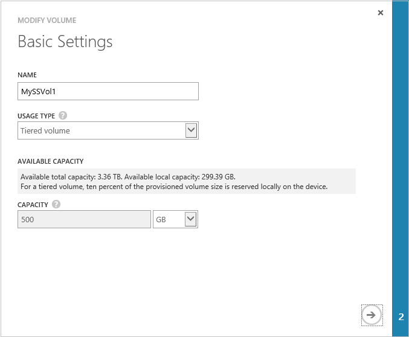
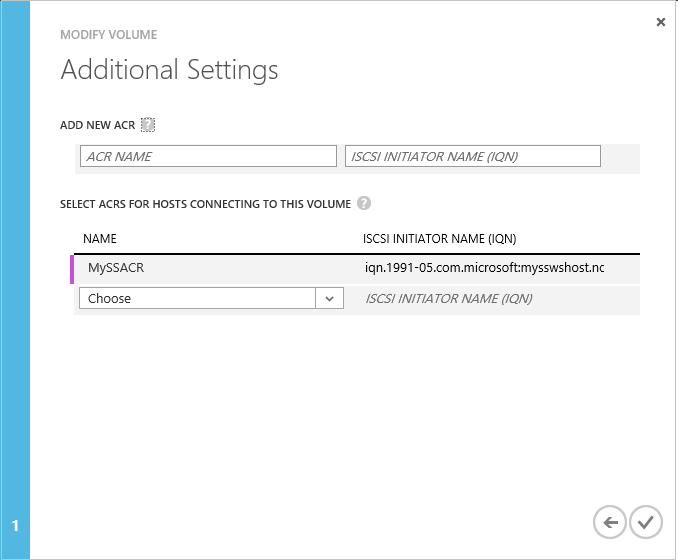

<properties 
   pageTitle="Manage access control records for the StorSimple Virtual Array | Microsoft Azure"
   description="Describes how to manage access control records (ACRs) to determine which hosts can connect to a volume on the StorSimple Virtual Array."
   services="storsimple"
   documentationCenter=""
   authors="SharS"
   manager="carmonm"
   editor="" />
<tags 
   ms.service="storsimple"
   ms.devlang="na"
   ms.topic="article"
   ms.tgt_pltfrm="na"
   ms.workload="na"
   ms.date="01/27/2016"
   ms.author="v-sharos" />

# Use the StorSimple Manager service to manage access control records for the StorSimple Virtual Array

## Overview

Access control records (ACRs) allow you to specify which hosts can connect to a volume on the StorSimple Virtual Array (also known as the StorSimple on-premises virtual device). ACRs are set to a specific volume and contain the iSCSI Qualified Names (IQNs) of the hosts. When a host tries to connect to a volume, the device checks the ACR associated with that volume for the IQN name, and if there is a match, then the connection is established. The **access control records** section on the **Configuration** page displays all the access control records with the corresponding IQNs of the hosts.

This tutorial explains the following common ACR-related tasks:

- Get the IQN
- Add or modify an access control record  
- Delete an access control record 

> [AZURE.IMPORTANT] 
> 
> - When assigning an ACR to a volume, take care that the volume is not concurrently accessed by more than one non-clustered host because this could corrupt the volume. 
> - When deleting an ACR from a volume, make sure that the corresponding host is not accessing the volume because the deletion could result in a read-write disruption.

## Get the IQN

Perform the following steps to get the iSCSI Qualified Name (IQN) of a Windows host that is running Windows Server 2012.

#### To get the IQN of a Windows host

1. Start the Microsoft iSCSI initiator on your Windows host. Click **Start** > **Administrative Tools** > **iSCSI initiator**.

2. In the **iSCSI Initiator Properties** window, on the **Configuration** tab, select and copy the string from the **Initiator Name** field.

    

3. Save this string.

## Add or modify the ACR for a volume

Typically, you add an ACR when you add a volume; however, you can add or modify the ACR at a later time if you prefer. Perform the following steps to add or modify the ACR for a volume. You need to configure an ACR and IQN for each volume because each volume is a target.

> [AZURE.NOTE] You can modify only those ACRs that are currently not in use. To edit an ACR associated with a volume that is currently in use, you must first take the volume offline.

#### To add or modify an ACR

1. Take the volume offline: 

    1. select the device and then click the **Volumes** tab. 
    2. At the bottom of the page, click **Take offline** to take the volume offline. You will see the following confirmation message.
    
    3. Click the check icon .

2. Select the volume, and at the bottom of the page, click **Modify**. The Modify a volume wizard starts.

    

3. Click the arrow icon  to go to the **Additional Settings** page.

4. On the **Additional Settings** page, configure the access control record (ACR):

    1. If you have not already done so, supply a **Name** for the ACR.

    2. Under **iSCSI Initiator Name**, provide the iSCSI Qualified Name (IQN) of your Windows host.
  
         

    3. Click the check icon . This starts the volume modification job. You will see a progress message similar to the following.

        

        Your volume will be updated with the specified settings. By default, monitoring and backup will be enabled for the volume.

        >[AZURE.NOTE] If you did not take the volume offline as instructed in step 1, you will see the following warning message. 
        >
        >
        >
        >Return to step 1, take the volume offline, and then continue adding or modifying the ACR.

5. At the bottom of the page, click **Bring online** to bring the volume online.

## Delete an access control record

You use the **Configure** page in the Azure classic portal to delete ACRs. 

> [AZURE.NOTE] You can delete only those ACRs that are currently not in use. To delete an ACR associated with a volume that is currently in use, you must first take the volume offline.

Perform the following steps to delete an access control record.

#### To delete an access control record

1. select the device and then click the **Volumes** tab. 

2. Select the volume.

3. At the bottom of the page, click **Take offline** to take the volume offline. You will see the following confirmation message.

    

4. Click the check icon .

5. Select the volume, and at the bottom of the page, click **Modify**.

6. Click the arrow icon  to go to the **Additional Settings** page.

     

7. On the **Additional Settings** page, hover over the ACR in the table. An X will appear. Click the X to delete the ACR and IQN.

    >[AZURE.NOTE] If you did not take the volume offline as instructed in step 3, you will see the following warning message. 
    >
    >
    >
    >Return to step 3, take the volume offline, and then continue with the deletion.

8. Click the check mark to confirm your changes. The tabular listing will be updated to reflect the deletion.

9. At the bottom of the page, click **Bring online** to bring the volume online.

## Next steps

Learn more about [using the StorSimple Manager service to manage your StorSimple Virtual Array](storsimple-ova-manager-service-administration).

