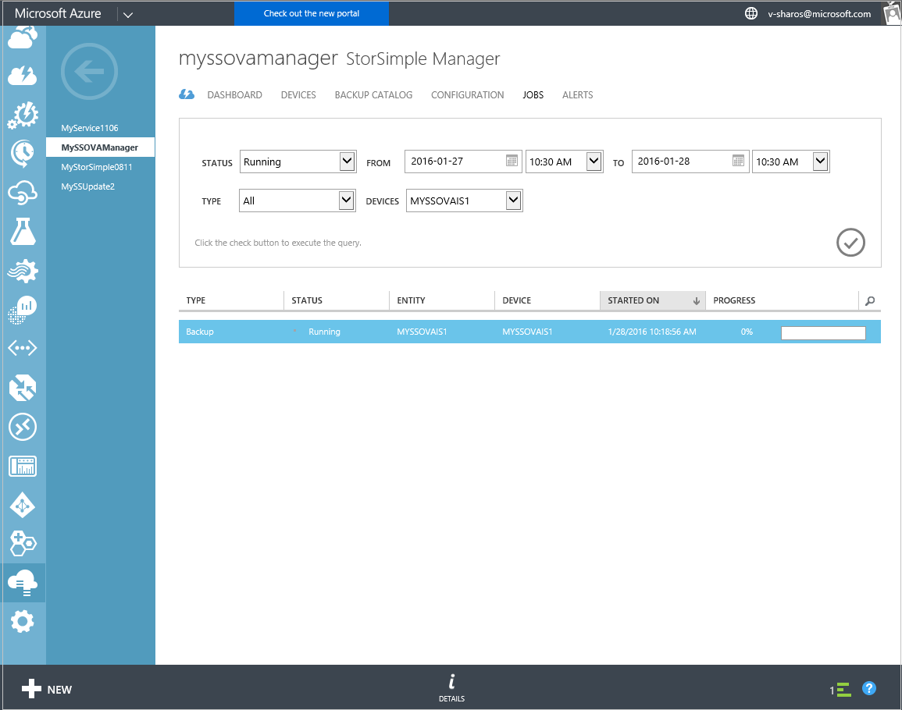
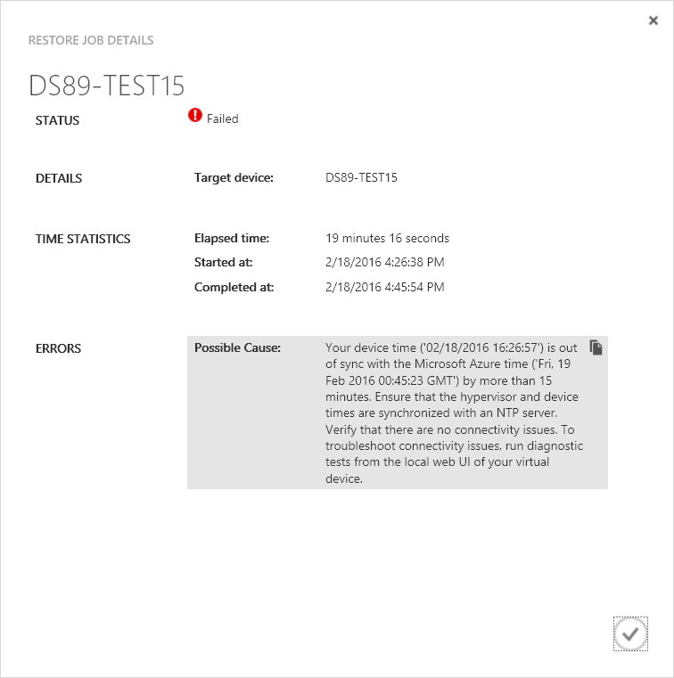

<properties 
   pageTitle="View and manage StorSimple Virtual Array jobs | Microsoft Azure"
   description="Describes the StorSimple Manager service Jobs page and how to use it to track recent and current jobs for the StorSimple Virtual Array."
   services="storsimple"
   documentationCenter="NA"
   authors="alkohli"
   manager="carmonm"
   editor=""/>
<tags 
   ms.service="storsimple"
   ms.devlang="NA"
   ms.topic="article"
   ms.tgt_pltfrm="NA"
   ms.workload="na"
   ms.date="06/07/2016"
   ms.author="alkohli" />

# Use the StorSimple Manager service to view jobs for the StorSimple Virtual Array

## Overview

The **Jobs** page provides a single central portal for viewing and managing jobs that are started on Virtual Arrays (also known as on-premises virtual devices) that are connected to your StorSimple Manager service. You can view running, completed, and failed jobs for multiple virtual devices. Results are presented in a tabular format. 

You can quickly find the jobs you are interested in by filtering on fields such as:

- **Status** – You can search for all, running, completed, or failed jobs.
- **From and To** – Jobs can be filtered based on the date and time range.
- **Type** – The job type can be all, backup, restore, failover, download updates, or install updates.
- **Devices** – Jobs are initiated on a specific device connected to your service. The filtered jobs are then tabulated on the basis of the following attributes:

    - **Type** – The job type can be all, backup, restore, failover, download updates, or install updates.

    - **Status** – Jobs can be all, running, completed, or failed.

    - **Entity** – The jobs can be associated with a volume, share, or device. 

    - **Device** – The name of the device on which the job was started.

    - **Started on** – The time when the job was started.

    - **Progress** – The percentage completion of a running job. For a completed job, this should always be 100%.

The list of jobs is refreshed every 30 seconds.

## View job details

Perform the following steps to view the details of any job.

#### To view job details

1. On the **Jobs** page, display the job(s) you are interested in by running a query with appropriate filters. You can search for completed or running jobs.

2. Select a job from the tabular list of jobs.

3. At the bottom of the page, click **Details**.

4. In the **Details** dialog box, you can view status, details,  and time statistics. The following illustration shows an example of the **Backup Job Details** dialog box.
 
    

#### Job failures when the virtual machine is paused in the hypervisor

When a job is in progress on your StorSimple Virtual Array and the device (virtual machine provisioned in hypervisor) is paused for greater than 15 minutes, the job will fail. This is due to your StorSimple Virtual Array time being out of sync with the Microsoft Azure time. An example for a restore job failure is shown in the following screenshot.

These failures will apply to backup, restore, update, and failover jobs. If your virtual machine is provisioned in Hyper-V, the machine will eventually synchronize time with your hypervisor. Once that happens, you can restart your job. 

## Next steps

[Learn how to use the local web UI to administer your StorSimple Virtual Array](storsimple-ova-web-ui-admin.md).
