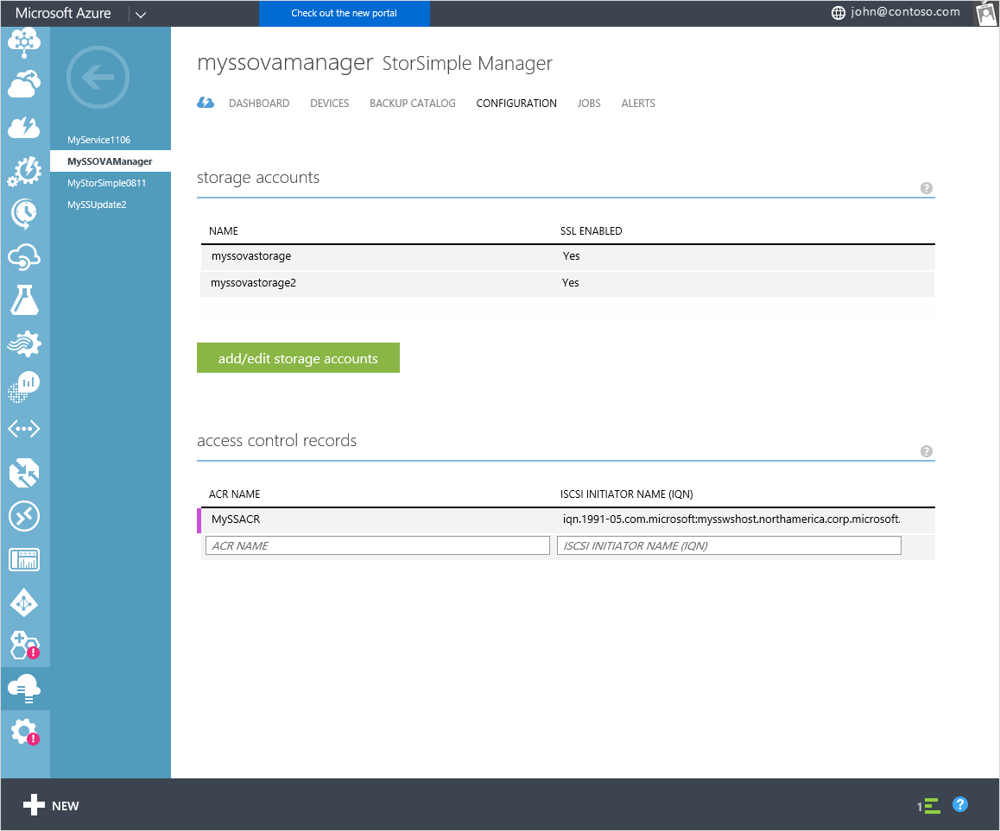
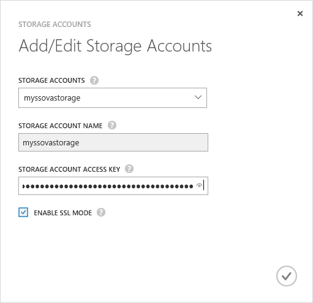

<properties 
   pageTitle="Manage your StorSimple storage account | Microsoft Azure"
   description="Explains how you can use the StorSimple Manager Configure page to add, edit, delete, or rotate the security keys for a storage account associated with the StorSimple Virtual Array."
   services="storsimple"
   documentationCenter="NA"
   authors="alkohli"
   manager="carmonm"
   editor="" />
<tags 
   ms.service="storsimple"
   ms.devlang="NA"
   ms.topic="article"
   ms.tgt_pltfrm="NA"
   ms.workload="TBD"
   ms.date="04/18/2016"
   ms.author="alkohli" />

# Use the StorSimple Manager service to manage storage accounts for StorSimple Virtual Array

## Overview

The **Configure** page presents the global service parameters that can be created in the StorSimple Manager service. These parameters can be applied to all the devices connected to the service, and include:

- Storage accounts 
- Access control records 

This tutorial explains how you can use the **Configure** page to add, edit, or delete storage accounts for your StorSimple Virtual Array. The information in this tutorial only applies to the StorSimple Virtual Array running March 2016 GA release software.

   

Storage accounts contain the credentials that the device uses to access your storage account with your cloud service provider. For Microsoft Azure storage accounts, these are credentials such as the account name and the primary access key. 

On the **Configure** page, all storage accounts that are created for the billing subscription are displayed in a tabular format containing the following information:

- **Name** – The unique name assigned to the account when it was created.
- **SSL enabled** – Whether the SSL is enabled and device-to-cloud communication is over the secure channel.

The most common tasks related to storage accounts that can be performed on the **Configure** page are:

- Add a storage account 
- Edit a storage account 
- Delete a storage account 

## Types of storage accounts

There are three types of storage accounts that can be used with your StorSimple device.

- **Auto-generated storage accounts** – As the name suggests, this type of storage account is automatically generated when the service is first created. To learn more about how this storage account is created, see [Create a new service](storsimple-ova-manage-service.md#create-a-service). 
- **Storage accounts in the service subscription** – These are the Azure storage accounts that are associated with the same subscription as that of the service. To learn more about how these storage accounts are created, see [About Azure Storage Accounts](../storage/storage-create-storage-account.md). 
- **Storage accounts outside of the service subscription** – These are the Azure storage accounts that are not associated with your service and likely existed before the service was created.

## Add a storage account

You can add a storage account to your StorSimple Manager service configuration by providing a unique friendly name and access credentials that are linked to the storage account. You also have the option of enabling the secure sockets layer (SSL) mode to create a secure channel for network communication between your device and the cloud.

You can create multiple accounts for a given cloud service provider. While the storage account is being saved, the service attempts to communicate with your cloud service provider. The credentials and the access material that you supplied will be authenticated at this time. A storage account is created only if the authentication succeeds. If the authentication fails, then an appropriate error message will be displayed.

Resource Manager storage accounts created in Azure portal are also supported with StorSimple. The Resource Manager storage accounts will not show up in the drop-down list for selection, only the storage accounts created in the Azure classic portal will be displayed. Resource Manager storage accounts will need to be added using the procedure to add a storage account as described below.

The procedure for adding an Azure classic storage account is detailed below.

[AZURE.INCLUDE [add-a-storage-account](../../includes/storsimple-ova-configure-new-storage-account.md)]

## Edit a storage account

You can edit a storage account used by your device. If you edit a storage account that is currently in use, the fields available to modify are the access key and the SSL mode for the storage account. You can supply the new storage access key or modify the **Enable SSL mode** selection and save the updated settings.

#### To edit a storage account

1. On the service landing page, select your service, double-click the service name, and then click **Configure**.

2. Click **Add/Edit Storage Accounts**.

3. In the **Add/Edit Storage Accounts** dialog box:

  1. In the drop-down list of **Storage Accounts**, choose an existing account that you would like to modify. 
  2. If necessary, you can modify the **Enable SSL Mode** selection.
  3. You can choose to regenerate your storage account access keys. For more information, see [Regenerate the storage account keys](storage-create-storage-account.md#manage-your-storage-access-keys). Supply the new storage account key. For an Azure storage account, this is the primary access key. 
  4. Click the check icon  to save the settings. The settings will be updated on the **Configure** page. 
  5. At the bottom of the page, click **Save** to save the newly updated settings. 

     
  
## Delete a storage account

> [AZURE.IMPORTANT] You can delete a storage account only if it is not in use. If a storage account is in use, you will be notified.

#### To delete a storage account

1. On the StorSimple Manager service landing page, select your service, double-click the service name, and then click **Configure**.

2. In the tabular list of storage accounts, hover over the account that you wish to delete.

3. A delete icon (**x**) will appear in the extreme right column for that storage account. Click the **x** icon to delete the credentials.

4. When prompted for confirmation, click **Yes** to continue with the deletion. The tabular listing will be updated to reflect the changes.

5. At the bottom of the page, click **Save** to save the newly updated settings.

## Next steps

- Learn how to [administer your StorSimple Virtual Array](storsimple-ova-web-ui-admin.md).
