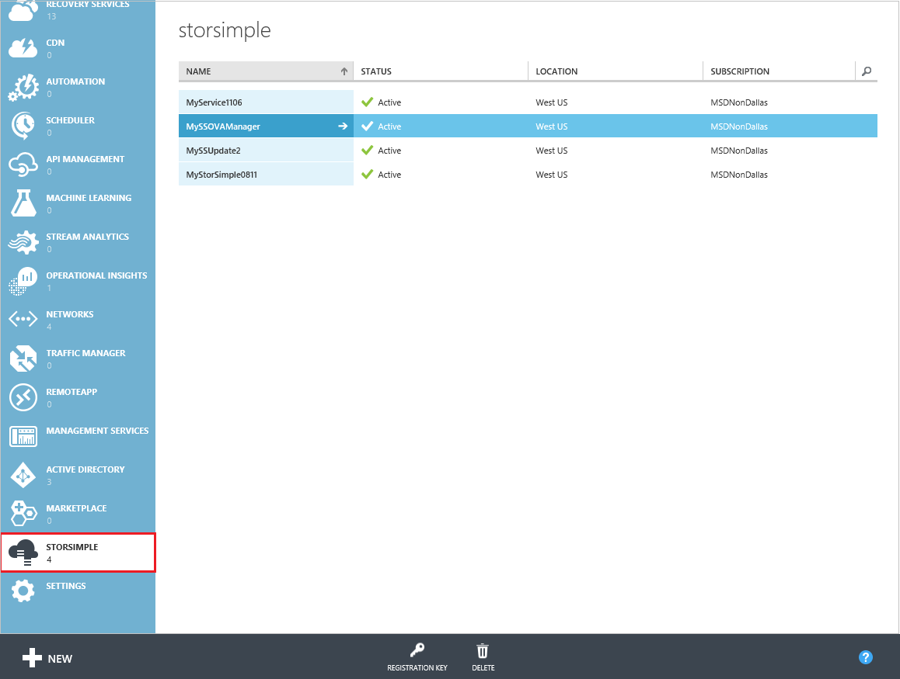

<properties 
   pageTitle="StorSimple Manager Virtual Array administration | Microsoft Azure"
   description="Learn how to manage your StorSimple on-premises Virtual Array by using the StorSimple Manager service in the Azure classic portal."
   services="storsimple"
   documentationCenter=""
   authors="alkohli"
   manager="carmonm"
   editor="" />
<tags 
   ms.service="storsimple"
   ms.devlang="na"
   ms.topic="article"
   ms.tgt_pltfrm="na"
   ms.workload="na"
   ms.date="06/17/2016"
   ms.author="alkohli" />

# Use the StorSimple Manager service to administer your StorSimple Virtual Array

## Overview

This article describes the StorSimple Manager service interface, including how to connect to it and the various options available, and provides links to the specific workflows that can be performed via this UI. 

After reading this article, you will know how to:

- Connect to the StorSimple Manager service
- Navigate the StorSimple Manager UI
- Administer your StorSimple Virtual Array via the StorSimple Manager service

> [AZURE.NOTE] To view the management options available for the StorSimple 8000 series device, go to [Use the StorSimple Manager service to administer your StorSimple device](storsimple-manager-service-administration.md).

## Connect to the StorSimple Manager service

The StorSimple Manager service runs in Microsoft Azure and connects to multiple StorSimple Virtual Arrays. You use a central Microsoft Azure classic portal running in a browser to manage these devices. To connect to the StorSimple Manager service, do the following.

#### To connect to the service

1. Go to [https://manage.windowsazure.com/](https://manage.windowsazure.com/).

2. Using your Microsoft account credentials, log on to the Microsoft Azure classic portal (located at the top-right of the pane).

3. Scroll down the left navigation pane to access the StorSimple Manager service.

    

## Navigate the StorSimple Manager service UI

The navigational hierarchy for the StorSimple Manager service UI is shown in the following table.

- The **StorSimple Manager** landing page takes you to the UI service-level pages applicable to all Virtual Arrays within a service.

- The **Devices** page takes you to the device–level UI pages applicable to a specific Virtual Array.

#### StorSimple Manager service navigational hierarchy

|Landing page|Service-level pages|Device-level pages|
|---|---|---|
|StorSimple Manager service|Dashboard (service)|Dashboard (device)|
||Devices →|Monitor|
||Backup catalog|Shares (file server) or  Volumes (iSCSI server)|
||Configure (service)|Configure (device)|
||Jobs|Maintenance|
||Alerts|

## Use the StorSimple Manager service to perform management tasks

The following table shows a summary of all the common management tasks and complex workflows that can be performed within the StorSimple Manager service UI. These tasks are organized based on the UI pages on which they are initiated.

For more information about each workflow, click the appropriate procedure in the table.

#### StorSimple Manager workflows

|If you want to do this ...|Go to this UI page ...|Use this procedure|
|---|---|---|
|Create a service Delete a service Get the service registration key Regenerate the service registration key|StorSimple Manager service|[Deploy the StorSimple Manager service](storsimple-ova-manage-service.md)|
|Change the service data encryption key View the operations logs|StorSimple Manager service → Dashboard|[Use the StorSimple service dashboard](storsimple-ova-service-dashboard.md)|
|Deactivate a Virtual Array Delete a Virtual Array|StorSimple Manager service → Devices|[Deactivate or delete a Virtual Array](storsimple-ova-deactivate-and-delete-device.md)|
|Disaster recovery and device failover Failover prerequisites Failover to a virtual device Business continuity disaster recovery (BCDR) Errors during disaster recovery|StorSimple Manager service → Devices|[Disaster recovery and device failover for your StorSimple Virtual Array](storsimple-ova-failover-dr.md)|
|Back up shares and volumes Take a manual backup Change the backup schedule View existing backups|StorSimple Manager service → Backup catalog|[Back up your StorSimple Virtual Array](storsimple-ova-backup.md)|
|Restore shares from a backup set Restore volumes from a backup set Item-level recovery (file server only)|StorSimple Manager service → Backup Catalog|[Restore from a backup of your StorSimple Virtual Array](storsimple-ova-restore.md)|
|About  storage accounts Add a storage account Edit a storage account Delete a storage account|StorSimple Manager service → Configure|[Manage storage accounts for the StorSimple Virtual Array](storsimple-ova-manage-storage-accounts.md)|
|About access control records Add or modify an access control record  Delete an access control record|StorSimple Manager service → Configure|[Manage access control records for the StorSimple Virtual Array](storsimple-ova-manage-acrs.md)|
|View job details|StorSimple Manager service → Jobs| [Manage StorSimple Virtual Array jobs](storsimple-ova-manage-jobs.md)|
|Configure alert settings Receive alert notifications Manage alerts Review alerts|StorSimple Manager service → Alerts|[View and manage alerts for the StorSimple Virtual Array](storsimple-ova-manage-alerts.md)|
|Modify the device administrator password|StorSimple Manager service → Devices → Configure|[Change the StorSimple Virtual Array device administrator password](storsimple-ova-change-device-admin-password.md)|
|Install software updates|StorSimple Manager service → Devices → Maintenance|[Update your Virtual Array](storsimple-ova-update.md)|

>[AZURE.NOTE] You must use the [local web UI](storsimple-ova-web-ui-admin.md) for the following tasks:
>
>- [Retrieve the service data encryption key](storsimple-ova-web-ui-admin.md#get-the-service-data-encryption-key)
>- [Create a support package](storsimple-ova-web-ui-admin.md#generate-a-log-package)
>- [Stop and restart a Virtual Array](storsimple-ova-web-ui-admin.md#shut-down-and-restart-your-device)

##Next steps
For information about the web UI and how to use it, go to [Use the StorSimple web UI to administer your StorSimple Virtual Array](storsimple-ova-web-ui-admin.md).
