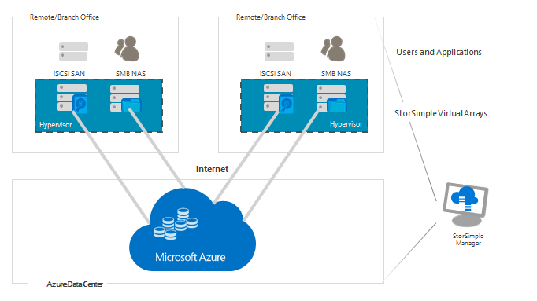

<properties
   pageTitle="StorSimple Virtual Array overview | Microsoft Azure"
   description="Describes the StorSimple Virtual Array, an integrated storage solution that manages storage tasks between an on-premises virtual device and Microsoft Azure cloud storage."
   services="storsimple"
   documentationCenter="NA"
   authors="alkohli"
   manager="carmonm"
   editor="" />
<tags 
   ms.service="storsimple"
   ms.devlang="NA"
   ms.topic="article"
   ms.tgt_pltfrm="NA"
   ms.workload="TBD"
   ms.date="06/20/2016"
   ms.author="alkohli" />

# Introduction to the StorSimple Virtual Array

## Overview

Welcome to the Microsoft Azure StorSimple Virtual Array, an integrated storage solution that manages storage tasks between an on-premises virtual device running in a hypervisor and Microsoft Azure cloud storage. The Virtual Array (also known as the StorSimple on-premises virtual device) is an efficient, cost-effective, and easily manageable file server or iSCSI server solution that eliminates many of the issues and expenses associated with enterprise storage and data protection. The Virtual Array is particularly well-suited for remote office/branch office scenarios.

This overview focuses on the Virtual Array. 

- For an overview of the StorSimple 8000 series, go to [StorSimple 8000 series: a hybrid cloud solution](storsimple-overview.md). 

- For information about the StorSimple 5000/7000 series device, go to [StorSimple Online Help](http://onlinehelp.storsimple.com/).

The Virtual Array supports the iSCSI or Server Message Block (SMB) protocol. It runs on your existing hypervisor infrastructure and provides tiering to the cloud, cloud backup, fast restore, item-level recovery, and disaster recovery features.

The following table summarizes the important features of the Virtual Array.

| Feature | Virtual Array |
| ------- | ------------- |
|Installation requirements | Uses virtualization infrastructure (Hyper-V or VMware)|
| Availability | Single node |
| Total capacity (including cloud) |Up to 64 TB usable capacity per virtual device |
| Local capacity | 390 GB to 6.4 TB usable capacity per virtual device (need to provision 500 GB to 8 TB of disk space)|
| Native protocols | iSCSI or SMB |
| Recovery time objective (RTO) | iSCSI: less than 2 minutes regardless of size |
| Recovery point objective (RPO) | Daily backups and on-demand backups |
| Storage tiering | Uses heat mapping to determine what data should be tiered in or out |
| Support | Virtualization infrastructure supported by the supplier |
| Performance | Varies depending on underlying infrastructure |
| Data mobility | Can restore to the same device or do item-level recovery (file server) |
| Storage tiers | Local hypervisor storage and cloud |
| Share or volume size |Tiered: up to 20 TB; locally pinned: up to 2 TB |
| Snapshots | Crash consistent |
| Item-level recovery | Yes; users can restore from shares |

## Why use StorSimple?

StorSimple connects users and servers to Azure storage in minutes, with no application modification.

The following table describes some of the key benefits that the Virtual Array solution provides.

| Feature | Benefit |
|---------|---------|
| Transparent integration | The Virtual Array supports the iSCSI or the SMB protocol. The data movement between the local tier and the cloud tier is seamless and transparent to the user.|
| Reduced storage costs | With StorSimple, you provision sufficient local storage to meet current demands for the most used hot data. As storage needs grow, StorSimple tiers cold data into cost-effective cloud storage. The data is deduplicated and compressed before sending to the cloud to further reduce storage requirements and expense.|
| Simplified storage management | StorSimple provides centralized management in the cloud using StorSimple Manager to manage multiple devices.| 
| Improved disaster recovery and compliance | StorSimple facilitates faster disaster recovery by restoring the metadata immediately and restoring the data as needed. This means normal operations can continue with minimal disruption.|
| Data mobility | Data tiered to the cloud can be accessed from other sites for recovery and migration purposes. Note that you can restore data only to the original Virtual Array. However, you use disaster recovery features to restore the entire Virtual Array to another Virtual Array.|

## Workflows

The StorSimple Virtual Array is particularly suitable for the following workflows:

- [Cloud-based storage management](#cloud-based-storage-management)
- [Location-independent backup](#location-independent-backup)
- [Data protection and disaster recovery](#data-protection-and-disaster-recovery)

### Cloud-based storage management

You can use the StorSimple Manager service running in the Azure classic portal to manage data stored on multiple devices and in multiple locations. This is particularly useful in distributed branch scenarios. Note that you must create separate instances of the StorSimple Manager service to manage Virtual Arrays and physical StorSimple devices. 

### Location-independent backup

With the Virtual Array, cloud snapshots provide a location-independent, point-in-time copy of a volume or share. Cloud snapshots are enabled by default and cannot be disabled. All volumes and shares are backup up at the same time through a single daily backup policy, and you can take additional adhoc backups whenever necessary.

### Data protection and disaster recovery

The Virtual Array supports the following data protection and disaster recovery scenarios:

- **Volume or share restore** – Use the restore as new workflow to recover a volume or share. Use this approach to recover the entire volume or share.
- **Item-level recovery** – Shares allow simplified access to recent backups. You can easily recover an individual file from a special .backup folder available in the cloud. This restore capability is user-driven and no administrative intervention is required.
- **Disaster recovery** – Use the failover capability to recover all volumes or shares to a new Virtual Array. You create the new Virtual Array and register it with the StorSimple Manager service, then fail over the original Virtual Array. The new Virtual Array will then assume the provisioned resources. 

## Virtual Array components

The Virtual Array includes the following components:

- [Virtual Array](#virtual-array) – a hybrid cloud storage device based on a virtual machine provisioned in your virtualized environment or hypervisor.  
- [StorSimple Manager service](#storsimple-manager-service) – an extension of the Azure classic portal that lets you manage one or more StorSimple devices from a single web interface that you can access from different geographical locations. You can use the StorSimple Manager service to create and manage services, view and manage devices and alerts, and manage volumes, shares, and existing snapshots.
- [Local web user interface](#local-web-user-interface) – a web-based UI that is used to configure the device so that it can connect to the local network, and then register the device with the StorSimple Manager service. 
- [Command-line interface](#command-line-interface) – a Windows PowerShell interface that you can use to start a support session on the Virtual Array.
The following sections describe each of these components in greater detail and explain how the solution arranges data, allocates storage, and facilitates storage management and data protection.

### Virtual Array

The Virtual Array is a single-node storage solution that provides primary storage, manages communication with cloud storage, and helps to ensure the security and confidentiality of all data that is stored on the device.

The Virtual Array is available in one model that is available for download. The Storage Array has a maximum capacity of 6.4 TB on the device (with an underlying storage requirement of 8 TB) and 64 TB including cloud storage. 

The Virtual Array has the following features:

- It is cost effective. It makes use of your existing virtualization infrastructure and can be deployed on your existing Hyper-V or VMware hypervisor.
- It resides in the datacenter and can be configured as an iSCSI server or a file server. 
- It is integrated with the cloud.
- Backups are stored in the cloud, which can facilitate disaster recovery and simplify item-level recovery (ILR). 
- You can apply updates to the Virtual Array, just as you would apply them to a physical device.

>[AZURE.NOTE] A Virtual Array cannot be expanded. Therefore, it's important to provision adequate storage when you create the virtual device. 

### StorSimple Manager service

Microsoft Azure StorSimple provides a web-based user interface (the StorSimple Manager service) that enables you to centrally manage datacenter and cloud storage. You can use the StorSimple Manager service to perform the following tasks:

- Manage multiple StorSimple Virtual Arrays from a single service. 
- Configure and manage security settings for StorSimple devices. (Encryption in the cloud is dependent on Microsoft Azure APIs.)
- Configure storage account credentials and properties.
- Configure and manage volumes or shares.
- Back up and restore data on volumes or shares.
- Monitor performance.
- Review system settings and identify possible problems.

You use the StorSimple Manager service to perform daily administration of your Virtual Array.

For more information, go to [Use the StorSimple Manager service to administer your StorSimple device](storsimple-manager-service-administration.md).

### Local web user interface

The Virtual Array includes a web-based UI that is used for one-time configuration and registration of the device with the StorSimple Manager service. You can use it to shut down and restart the Virtual Array, run diagnostic tests, update software, change the device administrator password, view system logs, and contact Microsoft Support to file a service request. 

For information about using the web-based UI, go to [Use the web-based UI to administer your StorSimple Virtual Array](storsimple-ova-web-ui-admin.md).

### Command-line interface

The included Windows PowerShell interface enables you to initiate a support session with Microsoft Support so that they can help you troubleshoot and resolve issues that you might encounter on your virtual device.

## Storage management technologies

In addition to the Virtual Array and other components, the StorSimple solution uses the following software technologies to provide quick access to important data, reduce storage consumption, and protect data stored on your Virtual Array:

- [Automatic storage tiering](#automatic-storage-tiering) 
- [Locally pinned shares and volumes](#locally-pinned-shares-and-volumes)
- [Deduplication and compression for data tiered or backed up to the cloud](#deduplication-and-compression-for-data-tiered/backed-up-to-the-cloud) 
- [Scheduled and on-demand backups](#scheduled-and-on-demand-backups)

### Automatic storage tiering

The Virtual Array uses a new tiering mechanism to manage stored data across the Virtual Array and the cloud. There are only two tiers: the local Virtual Array and Azure cloud storage. The StorSimple Virtual Array automatically arranges data into the tiers based on a heat map, which tracks current usage, age, and relationships to other data. Data that is most active (hottest) is stored locally, while less active and inactive data is automatically migrated to the cloud. (All backups are stored in the cloud.) StorSimple adjusts and rearranges data and storage assignments as usage patterns change. For example, some information might become less active over time. As it becomes progressively less active, it is tiered out to the cloud. If that same data becomes active again, it is tiered in to the Storage Array.

Data for a particular tiered share or volume is guaranteed its own local tier space. (approximately 10% of the total provisioned space for that share or volume). While this reduces the available storage on the virtual device for that share or volume, it ensures that tiering for one share or volume will not be affected by the tiering needs of other shares or volumes. Thus a very busy workload on one share or volume cannot force all other workloads to the cloud. 

>[AZURE.NOTE] You can specify a volume as locally pinned, in which case the data remains on the Virtual Array and is never tiered to the cloud. For more information, go to [Locally pinned shares and volumes](#locally-pinned-shares-and-volumes).

### Locally pinned shares and volumes

You can create appropriate shares and volumes as locally pinned. This capability ensures that data required by critical applications remains in the Virtual Array and is never tiered to the cloud. Locally pinned shares and volumes have the following features: 

- They are not subject to cloud latencies or connectivity issues.
- They still benefit from StorSimple cloud backup and disaster recovery features.

You can restore a locally pinned share or volume as tiered or a tiered share or volume as locally pinned. 

For more information about locally pinned volumes, go to [Use the StorSimple Manager service to manage volumes](storsimple-manage-volumes-u2.md).

### Deduplication and compression for data tiered or backed up to the cloud

StorSimple uses deduplication and data compression to further reduce storage requirements in the cloud. Deduplication reduces the overall amount of data stored by eliminating redundancy in the stored data set. As information changes, StorSimple ignores the unchanged data and captures only the changes. In addition, StorSimple reduces the amount of stored data by identifying and removing duplicate information. 

>[AZURE.NOTE] Data stored on the Virtual Array is not deduplicated or compressed. All deduplication and compression occurs just before the data is sent to the cloud.

### Scheduled and on-demand backups

StorSimple data protection features enable you to create on-demand backups. Additionally, a default backup schedule ensures that data is backed up daily. Backups are taken in the form of incremental snapshots, which are stored in the cloud. Snapshots, which record only the changes since the last backup, can be created and restored quickly. These snapshots can be critically important in disaster recovery scenarios because they replace secondary storage systems (such as tape backup), and allow you to restore data to your datacenter or to alternate sites if necessary.

## Next steps

Learn how to [prepare the Virtual Array portal](storsimple-ova-deploy1-portal-prep.md).

