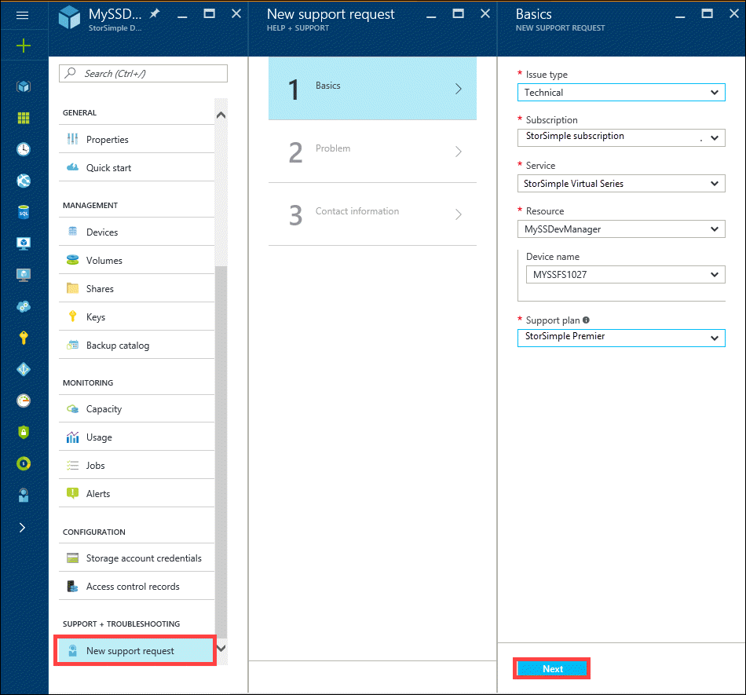
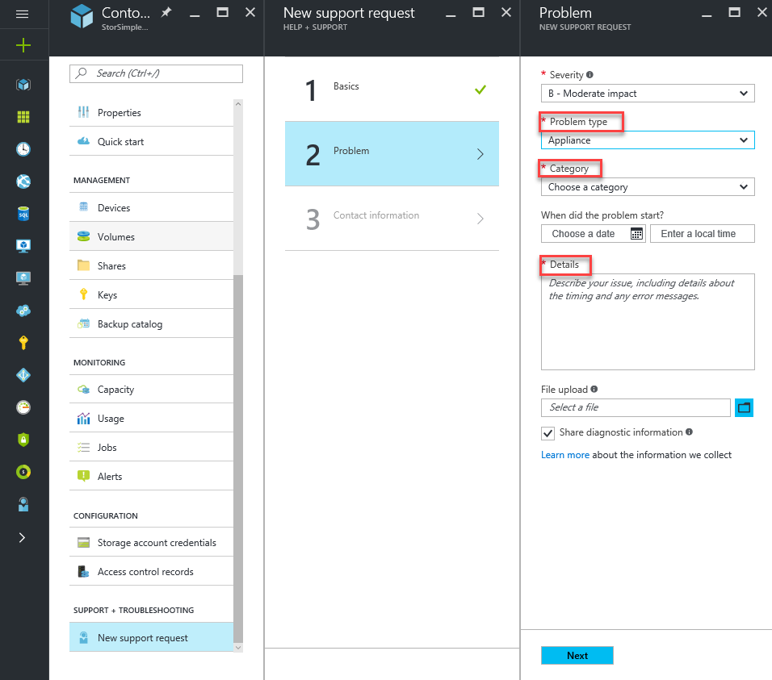
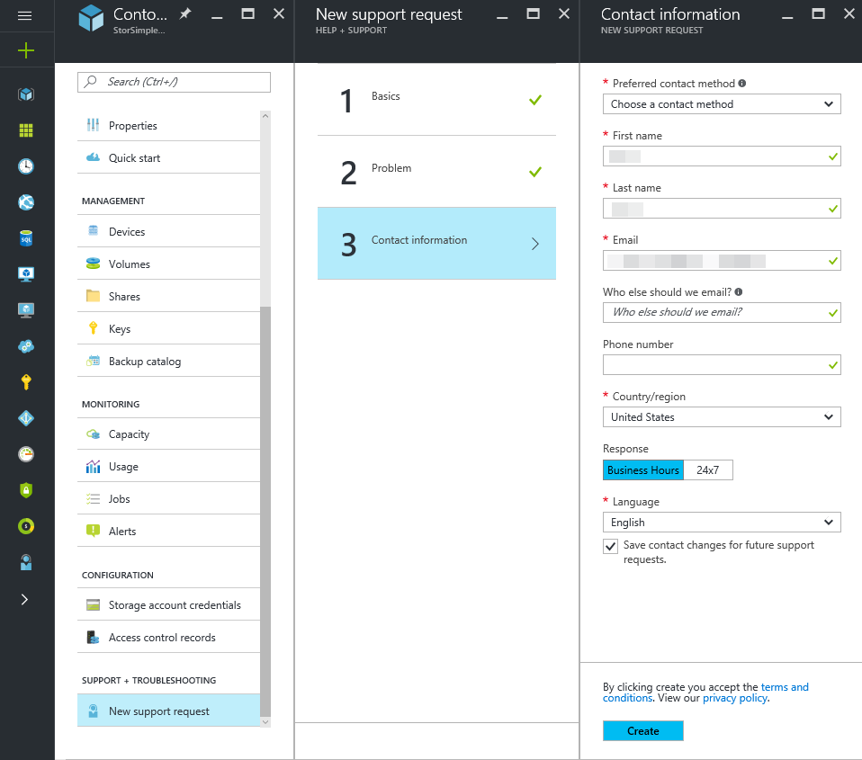
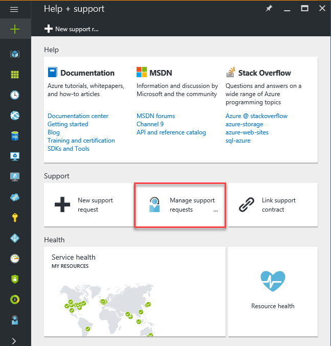

# Use the StorSimple Manager service to log a Support request for the StorSimple Virtual Array
## Overview
The StorSimple Manager provides the capability to **log a new support request** within the service summary blade. This article explains how you can log a new support request and manage its lifecycle from within the portal.

## New support request
Depending upon your [support plan](https://azure.microsoft.com/en-us/support/plans/), you can create support tickets for an issue on your StorSimple Virtual array directly from the StorSimple Manager service summary blade.

#### To log a new request
1. Click **New support ticket** under the **SUPPORT+TROUBLESHOOTING** section of your StorSimple Manager service summary blade settings.
   
    
2. The current subscription and the StorSimple Manager service are automatically chosen for you. **Choose** an appropriate support plan if you have multiple plans associated with your subscription.
3. In **Step 2**, choose the **Severity** and specify if the issue is related to the array or the StorSimple Manager service. Also, select the **Category** of the issue and provide more **Details** about the issue.
   
    
4. In **Step 3**, provide your contact information, so Microsoft Support can reach out to you further information, diagnosis and resolution.
   
    

## Manage a support request
After creating a support ticket, you can manage the lifecycle of the ticket from within the portal.

#### To manage your support requests
To get to the help and support page, navigate to **Browse > Help + support**.

## Next steps
Learn how to [diagnose and solve problems related to your StorSimple Virtual array](storsimple-ova-rm-diagnose-problems.md)

