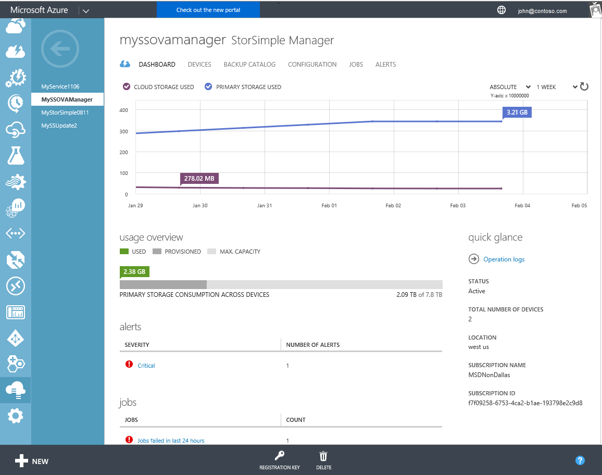
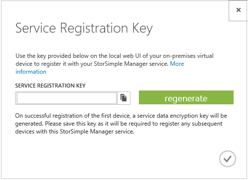
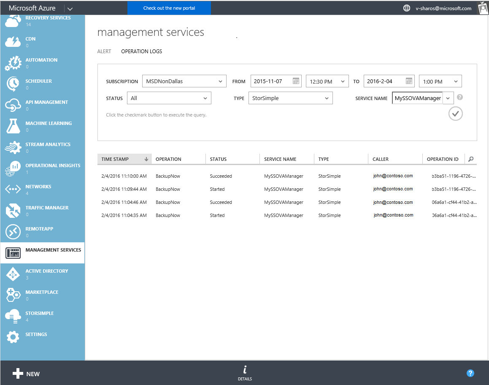

<properties 
   pageTitle="StorSimple Manager service dashboard - Virtual Array | Microsoft Azure"
   description="Describes the StorSimple Manager service dashboard and explains how to use it to monitor the health of your StorSimple Virtual Array."
   services="storsimple"
   documentationCenter=""
   authors="alkohli"
   manager="carmonm"
   editor="" />
<tags 
   ms.service="storsimple"
   ms.devlang="na"
   ms.topic="article"
   ms.tgt_pltfrm="na"
   ms.workload="na"
   ms.date="04/07/2016"
   ms.author="alkohli" />

# Use the StorSimple Manager service dashboard for the StorSimple Virtual Array

## Overview

The StorSimple Manager service dashboard page provides a summary view of the StorSimple Virtual Arrays (also known as StorSimple on-premises virtual devices or virtual devices) that are connected to the StorSimple Manager service, highlighting those that need a system administrator's attention. This tutorial introduces the dashboard page, explains the dashboard content and function, and describes the tasks that you can perform from this page.

The StorSimple Manager service dashboard displays the following information:

- In the **chart** area at the top of the page, you can see the relevant metrics for your virtual devices. You can view the primary storage used across all virtual devices, as well as the cloud storage consumed by virtual devices over a period of time. Use the controls in the top-right corner of the chart to specify relative or absolute usage and to see a 1-week, 1-month, 3-month, or 1-year time scale. Use the refresh control  to refresh the chart.

- The **usage overview** shows the primary storage that is provisioned and consumed by all virtual devices relative to the total storage available across all virtual devices. **Provisioned** refers to the amount of storage that is prepared and allocated for use, **Used** refers to usage of shares or volumes as viewed by the initiators that are connected to the virtual devices, and **Max. capacity** shows the maximum capacity of all virtual devices.

- The **alerts** area provides a snapshot of all the active alerts across all virtual devices, grouped by alert severity. Clicking the severity level opens the **Alerts** page, scoped to show those alerts. On the **Alerts** page, you can click an individual alert to view additional details about that alert, including any recommended actions. You can also clear the alert if the issue has been resolved.

- The **jobs** area provides a snapshot of recent jobs across all virtual devices that are connected to your service. There are links that you can use to look at jobs that are currently in progress and those that succeeded or failed in the last 24 hours. 

- The **quick glance** area on the right of the page provides useful information such as service status, total number of virtual devices connected to the service, location of the service, and details of the subscription that is associated with the service. There is also a link to the operations log. Click the link to see a list of all completed StorSimple Manager service operations. 

You can use the StorSimple Manager service dashboard page to initiate the following tasks:

- Get the service registration key.
- View the operation logs.

## Get the service registration key

The service registration key is used to register a StorSimple virtual device with the StorSimple Manager service, so that the device appears in the Azure classic portal for further management actions. The key is created on the first virtual device and shared with the remaining virtual devices. 

Clicking **Registration Key** (at the bottom of the page) opens the **Service Registration Key** dialog box, where you can either copy the current service registration key to the clipboard or regenerate the service registration key.

Regenerating the key does not affect previously registered virtual devices: it affects only the virtual devices that are registered with the service after the key is regenerated.

For more information about getting the service registration key, go to [Get the service registration key](storsimple-ova-manage-service.md#get-the-service-registration-key).

## View the operations logs

You can view the operation logs by clicking the operation logs link available in the **quick glance** pane of the dashboard. This will take you to the management services page, where you can filter and see the logs specific to your StorSimple Manager service.

## Next steps

Learn how to [use the local web UI to administer your StorSimple Virtual Array](storsimple-ova-web-ui-admin.md).