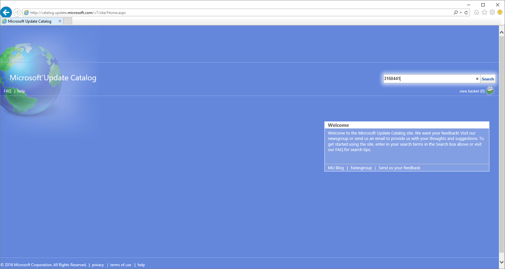

<properties 
   pageTitle="Apply StorSimple Virtual Array updates | Microsoft Azure"
   description="Describes how to use the StorSimple Virtual Array web UI to apply updates and hotfixes"
   services="storsimple"
   documentationCenter="NA"
   authors="alkohli"
   manager="carmonm"
   editor="" />
<tags 
   ms.service="storsimple"
   ms.devlang="NA"
   ms.topic="article"
   ms.tgt_pltfrm="NA"
   ms.workload="TBD"
   ms.date="05/18/2016"
   ms.author="alkohli" />

# Apply updates and hotfixes to the StorSimple Virtual Array

## Overview

You may need to apply software updates or hotfixes to keep your StorSimple Virtual Array up-to-date. In general, we recommend that you install updates through the Azure classic portal. However, in instances where the portal is not available, you can use the local web UI to apply hotfixes or updates. This tutorial describes how to use the Azure classic portal or the local web UI to apply an update or hotfix.

Keep in mind that an update or hotfix installation could restart your device. Given that the StorSimple Virtual Array is a single node device, any IOs that were in progress will be disrupted and your device will have some down time. We also recommend that prior to applying an update, take the volumes or shares offline on the host first and then the device. This will minimize any possibility of data corruption.

## Use the Azure classic portal

We recommend that you install updates through the Azure classic portal. Perform the following steps to install the update or hotfix.

For procedures when installing updates via the classic portal, go to [Install regular updates via the Azure classic portal](storsimple-update-device.md#install-regular-updates-via-the-azure-classic-portal).) 

## Use the local web UI 

Use the local web UI to apply updates when the Azure classic portal is not available. There are two steps when using the local web UI:

- Download update or hotfix
- Install update or hotfix

### Download update or hotfix

Perform the following steps to download the software update from the Microsoft Update Catalog.

#### To download update or hotfix

1. Start Internet Explorer and navigate to [http://catalog.update.microsoft.com](http://catalog.update.microsoft.com).

2. If this is your first time using the Microsoft Update Catalog on this computer, click **Install** when prompted to install the Microsoft Update Catalog add-on.
   
	

3. In the search box of the Microsoft Update Catalog, enter the Knowledge Base (KB) number of the hotfix you want to download, for example **3160441**, and then click **Search**.

    The hotfix listing appears, for example, **Cumulative Software Bundle Update 0.1 for StorSimple Virtual Array**.

    

4. Click **Add**. The update is added to the basket.

5. Click **View Basket**.

6. Click **Download**. Specify or **Browse** to a local location where you want the downloads to appear. The updates are downloaded to the specified location and placed in a subfolder with the same name as the update. The folder can also be copied to a network share that is reachable from the device.

### Install update or hotfix

Prior to the update or hotfix installation, make sure that you have the update or the hotfix downloaded either locally on your host or accessible via a network share. Perform the following steps to install the update or hotfix.

#### To install update or hotfix

1. In the local web UI, go to **Maintenance** > **Software Update**.

2. In **Update file path**, enter the file name for the update or the hotfix. You can also browse to the update or hotfix installation file if placed on a network share. 

	

3. A warning will show up. Given this is single node device, after the update is applied, the device will restart and there will be downtime. Click the check icon.

	

4. Click **Apply**.The update will start. After the device is successfully updated, it will restart. The local UI will not be accessible in this duration.

    

4. After the restart is complete, you can verify the software version. Go to **Maintenance** > **Software Update**. The build number should be **10.0.0.0.10276**.

	

## Next steps

Learn more about [administering your StorSimple Virtual Array](storsimple-ova-web-ui-admin.md).
