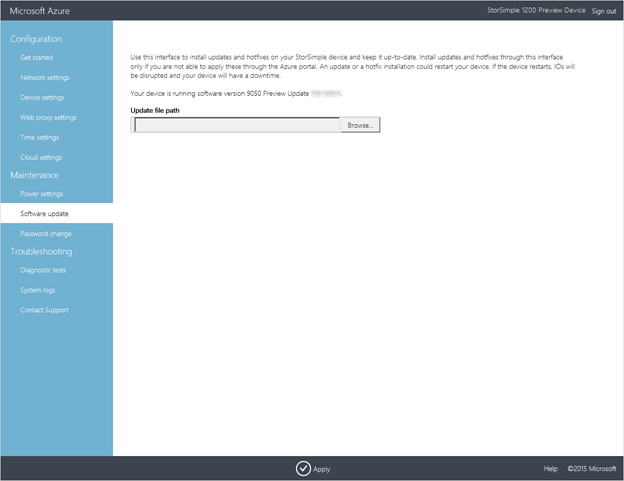

<properties 
   pageTitle="Apply StorSimple Virtual Array updates | Microsoft Azure"
   description="Describes how to use the StorSimple Virtual Array web UI to apply updates and hotfixes"
   services="storsimple"
   documentationCenter="NA"
   authors="alkohli"
   manager="carmonm"
   editor="" />
<tags 
   ms.service="storsimple"
   ms.devlang="NA"
   ms.topic="article"
   ms.tgt_pltfrm="NA"
   ms.workload="TBD"
   ms.date="04/07/2016"
   ms.author="alkohli" />

# Apply updates and hotfixes to the StorSimple Virtual Array

## Overview

You may need to apply software updates or hotfixes to keep your StorSimple Virtual Array up-to-date. In general, we recommend that you install updates through the Azure classic portal. However, in instances where the portal is not available, you can use the local web UI to apply hotfixes or updates. This tutorial describes how to use the local web UI to apply an update or hotfix.(For procedures when installing updates via the classic portal, go to [Install regular updates via the Azure classic portal](storsimple-update-device.md#install-regular-updates-via-the-azure-classic-portal).) 

Keep in mind that an update or hotfix installation could restart your device. Given that the StorSimple Virtual Array is a single node device, any IOs that were in progress will be disrupted and your device will have some down time. We also recommend that prior to applying an update, take the volumes or shares offline on the host first and then the device. This will minimize any possibility of data corruption.

## Use the local web UI to apply an update or hotfix

Prior to the update or hotfix installation, make sure that you have the update or the hotfix downloaded either locally on your host or accessible via a network share.

#### To install the update or the hotfix

1. In the local web UI, go to **Maintenance** > **Software Update**.

2. In **Update file path**, enter the file name for the update or the hotfix. You can also browse to the update or hotfix installation file if placed on a network share. The update will start. After it is complete, you will be notified.

    

## Next steps

Learn more about [administering your StorSimple Virtual Array](storsimple-ova-web-ui-admin.md).
