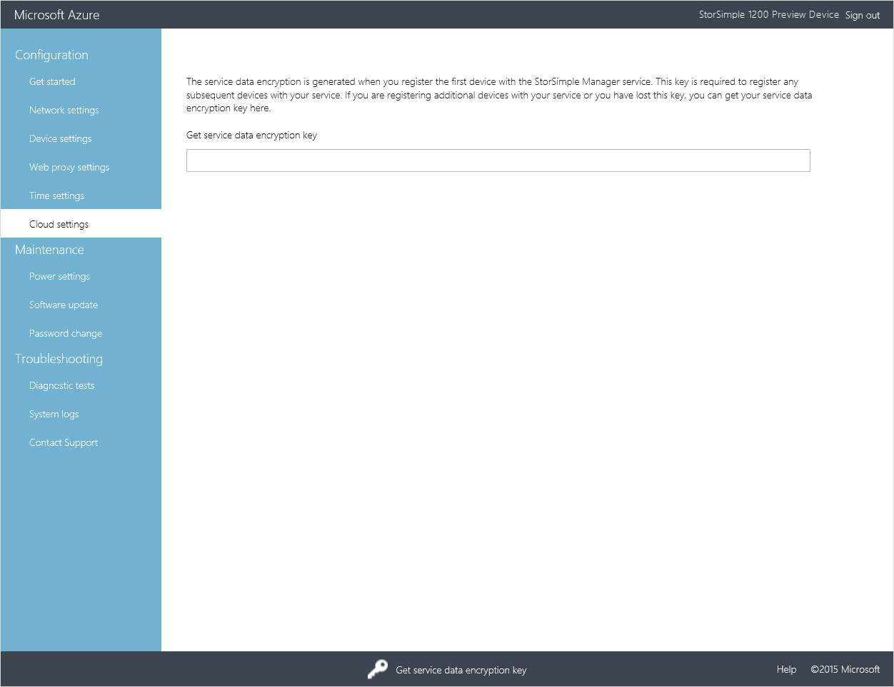
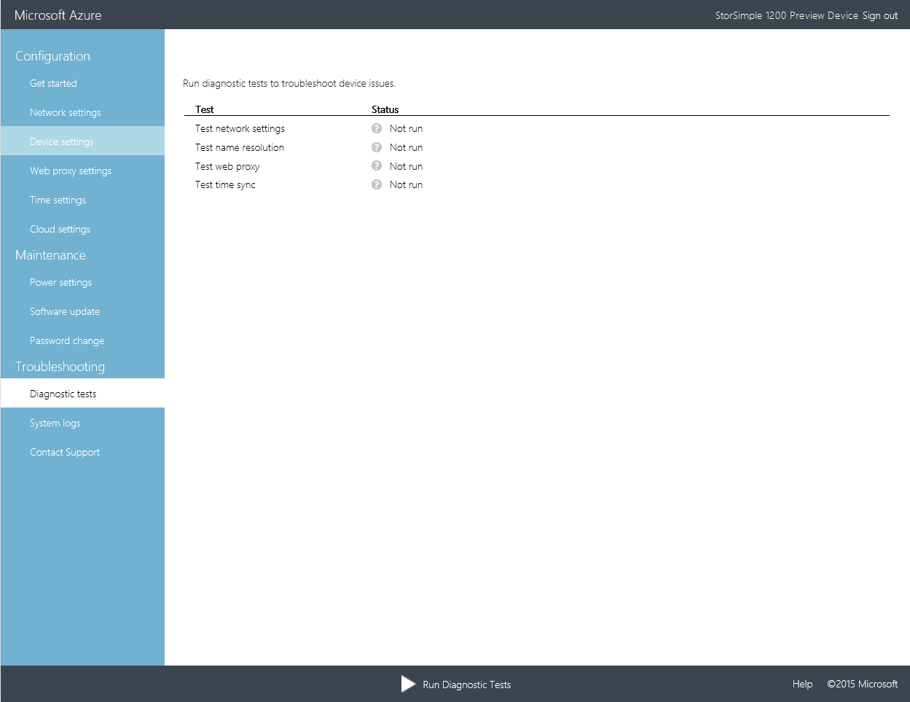
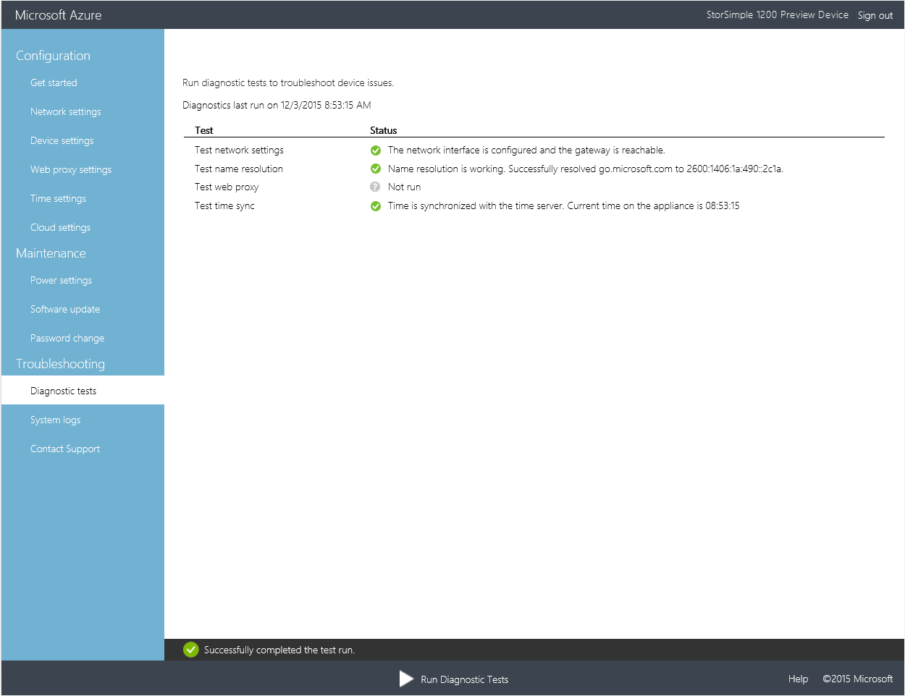
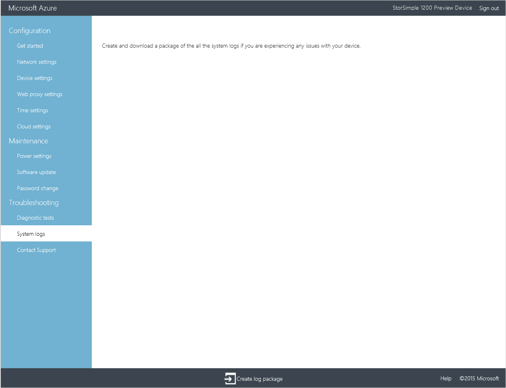
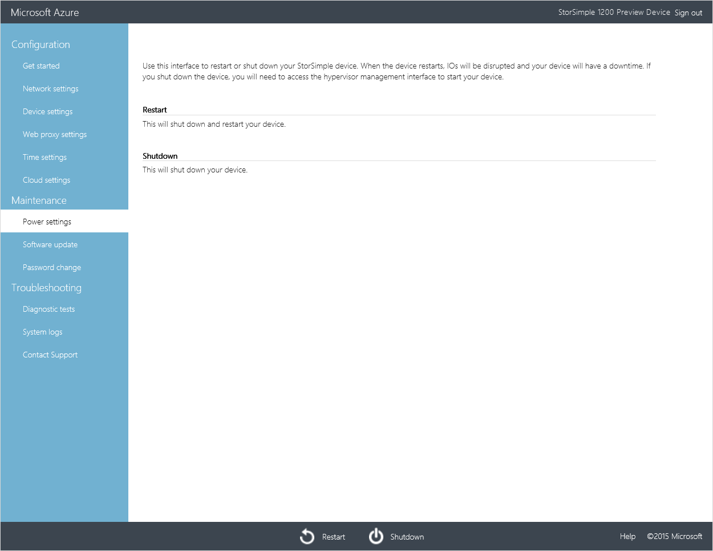
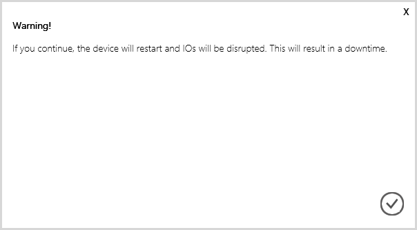

# Use the Web UI to administer your StorSimple Virtual Array

## Overview
The tutorials in this article apply to the Microsoft Azure StorSimple Virtual Array (also known as the StorSimple on-premises virtual device) running March 2016 general availability (GA) release. This article describes some of the complex workflows and management tasks that can be performed on the StorSimple Virtual Array. You can manage the StorSimple Virtual Array using the StorSimple Manager service UI (referred to as the portal UI) and the local web UI for the device. This article focuses on the tasks that you can perform using the web UI.

This article includes the following tutorials:

* Get the service data encryption key
* Troubleshoot web UI setup errors
* Generate a log package
* Shut down or restart your device

## Get the service data encryption key
A service data encryption key is generated when you register your first device with the StorSimple Manager service. This key is then required with the service registration key to register additional devices with the StorSimple Manager service.

If you have misplaced your service data encryption key and need to retrieve it, perform the following steps in the local web UI of the device registered with your service.

#### To get the service data encryption key
1. Connect to the local web UI. Go to **Configuration** > **Cloud Settings**.
2. At the bottom of the page, click **Get service data encryption key**. A key will appear. Copy and save this key.
   
    

## Troubleshoot web UI setup errors
In some instances when you configure the device through the local web UI, you might run into errors. To diagnose and troubleshoot such errors, you can run the diagnostics tests.

#### To run the diagnostic tests
1. In the local web UI, go to **Troubleshooting** > **Diagnostic tests**.
   
    
2. At the bottom of the page, click **Run Diagnostic Tests**. This will initiate tests to diagnose any possible issues with your network, device, web proxy, time, or cloud settings. You will be notified that the device is running tests.
3. After the tests have completed, the results will be displayed. The following example shows the results of diagnostic tests. Note that the web proxy settings were not configured on this device, and therefore, the web proxy test was not run. All the other tests for network settings, DNS server, and time settings were successful.
   
    

## Generate a log package
A log package is comprised of all the relevant logs that can assist Microsoft Support with troubleshooting any device issues. In this release, a log package can be generated via the local web UI.

#### To generate the log package
1. In the local web UI, go to **Troubleshooting** > **System logs**.
   
    
2. At the bottom of the page, click **Create log package**. A package of the system logs will be created. This will take a couple of minutes.
   
    
   
    You will be notified after the package is successfully created, and the page will be updated to indicate the time and date when the package was created.
   
    
3. Click **Download log package**. A zipped package will be downloaded on your system.
   
    
4. You can unzip the downloaded log package and view the system log files.

## Shut down and restart your device
You can shut down or restart your virtual device using the local web UI. We recommend that before you restart, take the volumes or shares offline on the host and then the device. This will minimize any possibility of data corruption. 

#### To shut down your virtual device
1. In the local web UI, go to **Maintenance** > **Power settings**.
2. At the bottom of the page, click **Shutdown**.
   
    
3. A warning will appear stating that a shutdown of the device will interrupt any IO that were in progress, resulting in a downtime. Click the check icon .
   
    
   
    You will be notified that the shutdown has been initiated.
   
    
   
    The device will now shut down. If you want to start your device, you will need to do that through the Hyper-V Manager.

#### To restart your virtual device
1. In the local web UI, go to **Maintenance** > **Power settings**.
2. At the bottom of the page, click **Restart**.
   
    
3. A warning will appear stating that restarting the device will interrupt any IOs that were in progress, resulting in a downtime. Click the check icon .
   
    
   
    You will be notified that the restart has been initiated.
   
    
   
    While the restart is in progress, you will lose the connection to the UI. You can monitor the restart by refreshing the UI periodically. Alternatively, you can monitor the device restart status through the Hyper-V Manager.

## Next steps
Learn how to [use the StorSimple Manager service to manage your device](storsimple-virtual-array-manager-service-administration.md).

