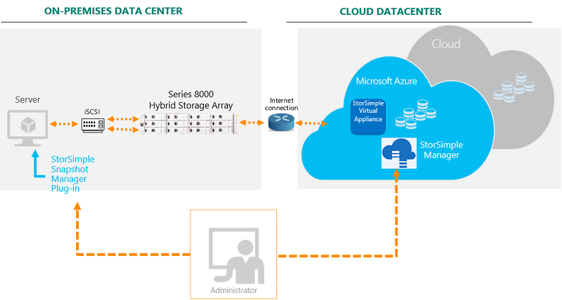
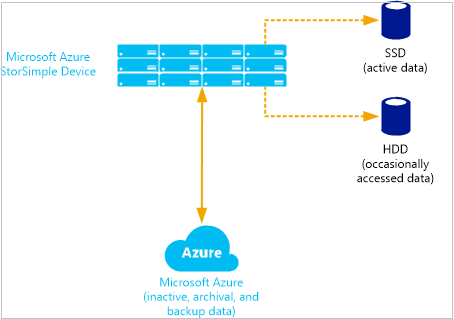

# StorSimple 8000 series: a hybrid cloud storage solution

[!INCLUDE [storsimple-8000-eol-banner](../../includes/storsimple-8000-eol-banner-2.md)]

## Overview
Welcome to Microsoft Azure StorSimple, an integrated storage solution that manages storage tasks between on-premises devices and Microsoft Azure cloud storage. StorSimple is an efficient, cost-effective, and easy to manage storage area network (SAN) solution that eliminates many of the issues and expenses that are associated with enterprise storage and data protection. It uses the proprietary StorSimple 8000 series device, integrates with cloud services, and provides a set of management tools for a seamless view of all enterprise storage, including cloud storage. The StorSimple deployment information published on the Microsoft Azure website applies to StorSimple 8000 series devices only.

StorSimple uses [storage tiering](#automatic-storage-tiering) to manage stored data across various storage media. The current working set is stored on-premises on solid state drives (SSDs). Data that is used less frequently is stored on hard disk drives (HDDs), and archival data is pushed to the cloud. Moreover, StorSimple uses deduplication and compression to reduce the amount of storage that the data consumes. For more information, go to [Deduplication and compression](#deduplication-and-compression). For definitions of other key terms and concepts that are used in the StorSimple 8000 series documentation, go to [StorSimple terminology](#storsimple-terminology) at the end of this article.

In addition to storage management, StorSimple data protection features enable you to create on-demand and scheduled backups, and then store them locally or in the cloud. Backups are taken in the form of incremental snapshots, which means that they can be created and restored quickly. Cloud snapshots can be critically important in disaster recovery scenarios because they replace secondary storage systems (such as tape backup), and allow you to restore data to your datacenter or to alternate sites if necessary.

## Why use StorSimple?
The following table describes some of the key benefits that Microsoft Azure StorSimple provides.

| Feature | Benefit |
| --- | --- |
| Transparent integration |Uses the iSCSI protocol to invisibly link data storage facilities. Data stored in the cloud, at the datacenter, or on remote servers appear to be stored at a single location. |
| Reduced storage costs |Allocates sufficient local or cloud storage to meet current demands and extends cloud storage only when necessary. It further reduces storage requirements and expense by eliminating redundant versions of the same data (deduplication) and by using compression. |
| Simplified storage management |Provides system administration tools to configure and manage data stored on-premises, on a remote server, and in the cloud. Additionally, you can manage backup and restore functions from a Microsoft Management Console (MMC) snap-in.|
| Improved disaster recovery and compliance |Doesn't require extended recovery time. Instead, it restores data as it is needed so that normal operations can continue with minimal disruption. Additionally, you can configure policies to specify backup schedules and data retention. |
| Data mobility |Data uploaded to Microsoft Azure cloud services can be accessed from other sites for recovery and migration purposes. Additionally, you can use StorSimple to configure StorSimple Cloud Appliances on virtual machines (VMs) running in Microsoft Azure. The VMs can then use virtual devices to access stored data for test or recovery purposes. |
| Business continuity |Allows StorSimple 5000-7000 series users to migrate their data to a StorSimple 8000 series device. |
| Availability in the Azure Government Portal |StorSimple is available in the Azure Government Portal. For more information, see [Deploy your on-premises StorSimple device in the Government Portal](storsimple-8000-deployment-walkthrough-gov-u2.md). |
| Data protection and availability |The StorSimple 8000 series supports Zone Redundant Storage (ZRS), in addition to Locally Redundant Storage (LRS) and Geo-redundant storage (GRS). Refer to [this article on Azure Storage redundancy options](../storage/common/storage-redundancy.md) for ZRS details. |
| Support for critical applications |StorSimple lets you identify appropriate volumes as locally pinned to ensure that data that is required by critical applications isn't tiered to the cloud. Locally pinned volumes aren't subject to cloud latencies or connectivity issues. For more information about locally pinned volumes, see [Use the StorSimple Device Manager service to manage volumes](storsimple-8000-manage-volumes-u2.md). |
| Low latency and high performance |You can create cloud appliances that take advantage of the high performance, low latency features of Azure premium storage. For more information about StorSimple premium cloud appliances, see [Deploy and manage a StorSimple Cloud Appliance in Azure](storsimple-8000-cloud-appliance-u2.md). |

## StorSimple components
The Microsoft Azure StorSimple solution includes the following components:

* **Microsoft Azure StorSimple device** – an on-premises hybrid storage array that contains SSDs and HDDs, together with redundant controllers and automatic failover capabilities. The controllers manage storage tiering, placing currently used (or hot) data on local storage (in the device or on-premises servers), while moving less frequently used data to the cloud.
* **StorSimple Cloud Appliance** – also known as the StorSimple Virtual Appliance. A software version of the StorSimple device that replicates the architecture and most capabilities of the physical hybrid storage device. The StorSimple Cloud Appliance runs on a single node in an Azure virtual machine. Premium virtual devices, which take advantage of Azure premium storage, are available in Update 2 and later.
* **StorSimple Device Manager service** – an extension of the Azure portal that lets you manage a StorSimple device or StorSimple Cloud Appliance from a single web interface. You can use the StorSimple Device Manager service to create and manage services, view and manage devices, view alerts, manage volumes, and view and manage backup policies and the backup catalog.
* **Windows PowerShell for StorSimple** – a command-line interface that you can use to manage the StorSimple device. Windows PowerShell for StorSimple has features that allow you to register your StorSimple device, configure the network interface on your device, install certain types of updates, troubleshoot your device by accessing the support session, and change the device state. You can access Windows PowerShell for StorSimple by connecting to the serial console or using Windows PowerShell remoting.
* **Azure PowerShell StorSimple cmdlets** – a collection of Windows PowerShell cmdlets that allow you to automate service-level and migration tasks from the command line. For more information about the Azure PowerShell cmdlets for StorSimple, go to the [cmdlet reference](/powershell/module/servicemanagement/azure.service/#azure).
* **StorSimple Snapshot Manager** – an MMC snap-in that uses volume groups and the Windows Volume Shadow Copy Service to generate application-consistent backups. In addition, you can use StorSimple Snapshot Manager to create backup schedules and clone or restore volumes.
* **StorSimple Adapter for SharePoint** – a tool that transparently extends Microsoft Azure StorSimple storage and data protection to SharePoint Server farms, while making StorSimple storage viewable and manageable from the SharePoint Central Administration portal.

The diagram below provides a high-level view of the Microsoft Azure StorSimple architecture and components.

The following sections describe each of these components in greater detail and explain how the solution arranges data, allocates storage, and facilitates storage management and data protection. The last section provides definitions for some of the important terms and concepts that are related to StorSimple components and their management.

## StorSimple device
The Microsoft Azure StorSimple device is an on-premises hybrid storage array that provides primary storage and iSCSI access to data stored on it. It manages communication with cloud storage, and helps to ensure the security and confidentiality of all data that is stored on the Microsoft Azure StorSimple solution.

The StorSimple device includes SSDs and hard disk drives (HDDs), as well as support for clustering and automatic failover. It contains a shared processor, shared storage, and two mirrored controllers. Each controller provides the following:

* Connection to a host computer
* Up to six network ports to connect to the local area network (LAN)
* Hardware monitoring
* Non-volatile random access memory (NVRAM), which retains information even if power is interrupted
* Cluster-aware updating to manage software updates on servers in a failover cluster so that the updates have minimal or no effect on service availability
* Cluster service, which functions like a back-end cluster, providing high availability and minimizing any adverse effects that might occur if an HDD or SSD fails or is taken offline

Only one controller is active at any point in time. If the active controller fails, the second controller becomes active automatically.

For more information, go to [StorSimple hardware components and status](storsimple-8000-monitor-hardware-status.md).

## StorSimple Cloud Appliance
You can use StorSimple to create a cloud appliance that replicates the architecture and capabilities of the physical hybrid storage device. The StorSimple Cloud Appliance (also known as the StorSimple Virtual Appliance) runs on a single node in an Azure virtual machine. (A cloud appliance can only be created on an Azure virtual machine. You can't create one on a StorSimple device or an on-premises server.)

The cloud appliance has the following features:

* It behaves like a physical appliance and can offer an iSCSI interface to virtual machines in the cloud.
* You can create an unlimited number of cloud appliances in the cloud, and turn them on and off as necessary.
* It can help simulate on-premises environments in disaster recovery, development, and test scenarios, and can help with item-level retrieval from backups.

The StorSimple Cloud Appliance is available in two models: the 8010 device (formerly known as the 1100 model) and the 8020 device. The 8010 device has a maximum capacity of 30 TB. The 8020 device, which takes advantage of Azure premium storage, has a maximum capacity of 64 TB. (In local tiers, Azure premium storage stores data on SSDs whereas standard storage stores data on HDDs.) You must have an Azure premium storage account to use premium storage.

For more information about the StorSimple Cloud Appliance, go to [Deploy and manage a StorSimple Cloud Appliance in Azure](storsimple-8000-cloud-appliance-u2.md).

## StorSimple Device Manager service
Microsoft Azure StorSimple provides a web-based user interface (the StorSimple Device Manager service) that enables you to centrally manage datacenter and cloud storage. You can use the StorSimple Device Manager service to perform the following tasks:

* Configure system settings for StorSimple devices.
* Configure and manage security settings for StorSimple devices.
* Configure cloud credentials and properties.
* Configure and manage volumes on a server.
* Configure volume groups.
* Back up and restore data.
* Monitor performance.
* Review system settings and identify possible problems.

You can use the StorSimple Device Manager service to perform all administration tasks except tasks that require system down time, such as initial setup and installation of updates.

For more information, go to [Use the StorSimple Device Manager service to administer your StorSimple device](storsimple-8000-manager-service-administration.md).

## Windows PowerShell for StorSimple
Windows PowerShell for StorSimple provides a command-line interface that you can use to create and manage the Microsoft Azure StorSimple service and set up and monitor StorSimple devices. It's a Windows PowerShell–based, command-line interface that includes dedicated cmdlets for managing your StorSimple device. Windows PowerShell for StorSimple has features that allow you to:

* Register a device.
* Configure the network interface on a device.
* Install certain types of updates.
* Troubleshoot your device by accessing the support session.
* Change the device state.

You can access Windows PowerShell for StorSimple from a serial console (on a host computer connected directly to the device) or remotely by using Windows PowerShell remoting. Some Windows PowerShell for StorSimple tasks, such as initial device registration, can only be done on the serial console.

For more information, go to [Use Windows PowerShell for StorSimple to administer your device](storsimple-8000-windows-powershell-administration.md).

## Azure PowerShell StorSimple cmdlets
The Azure PowerShell StorSimple cmdlets are a collection of Windows PowerShell cmdlets that allow you to automate service-level and migration tasks from the command line. For more information about the Azure PowerShell cmdlets for StorSimple, go to the [cmdlet reference](/powershell/module/servicemanagement/azure.service/).

## StorSimple Snapshot Manager
StorSimple Snapshot Manager is a Microsoft Management Console (MMC) snap-in that you can use to create consistent, point-in-time backup copies of local and cloud data. The snap-in runs on a Windows Server–based host. You can use StorSimple Snapshot Manager to:

* Configure, back up, and delete volumes.
* Configure volume groups to ensure that backed up data is application-consistent.
* Manage backup policies so that data is backed up on a predetermined schedule and stored in a designated location (locally or in the cloud).
* Restore volumes and individual files.

Backups are captured as snapshots, which record only the changes since the last snapshot was taken and require far less storage space than full backups. You can create backup schedules or take immediate backups as needed. Additionally, you can use StorSimple Snapshot Manager to establish retention policies that control how many snapshots will be saved. If you later need to restore data from a backup, StorSimple Snapshot Manager lets you select from the catalog of local or cloud snapshots. 

If a disaster occurs or if you need to restore data for another reason, StorSimple Snapshot Manager restores it incrementally as it's needed. Data restoration doesn't require that you shut down the entire system while you restore a file, replace equipment, or move operations to another site.

For more information, go to [What is StorSimple Snapshot Manager?](storsimple-what-is-snapshot-manager.md)

## StorSimple Adapter for SharePoint
Microsoft Azure StorSimple includes the StorSimple Adapter for SharePoint, an optional component that transparently extends StorSimple storage and data protection features to SharePoint Server farms. The adapter works with a Remote Blob Storage (RBS) provider and the SQL Server RBS feature, allowing you to move BLOBs to a server backed up by the Microsoft Azure StorSimple system. Microsoft Azure StorSimple then stores the BLOB data locally or in the cloud, based on usage.

The StorSimple Adapter for SharePoint is managed from within the SharePoint Central Administration portal. So SharePoint management remains centralized, and all storage appears to be in the SharePoint farm.

For more information, go to [StorSimple Adapter for SharePoint](storsimple-adapter-for-sharepoint.md). 

## Storage management technologies
In addition to the dedicated StorSimple device, virtual device, and other components, Microsoft Azure StorSimple uses the following software technologies to provide quick access to data and to reduce storage consumption:

* [Automatic storage tiering](#automatic-storage-tiering) 
* [Thin provisioning](#thin-provisioning) 
* [Deduplication and compression](#deduplication-and-compression) 

### Automatic storage tiering
Microsoft Azure StorSimple automatically arranges data in logical tiers based on current usage, age, and relationship to other data. Data that is most active is stored locally, while less active and inactive data is automatically migrated to the cloud. The following diagram illustrates this storage approach.

To enable quick access, StorSimple stores very active data (hot data) on SSDs in the StorSimple device. It stores data that is used occasionally (warm data) on HDDs in the device or on servers at the datacenter. It moves inactive data, backup data, and data retained for archival or compliance purposes to the cloud. 

> [!NOTE]
> In Update 2 or later, you can specify a volume as locally pinned, in which case the data remains on the local device and is not tiered to the cloud. 

StorSimple adjusts and rearranges data and storage assignments as usage patterns change. For example, some information might become less active over time. As it becomes progressively less active, it's migrated from SSDs to HDDs and then to the cloud. If that same data becomes active again, it's migrated back to the storage device.

The storage tiering process occurs as follows:

1. A system administrator sets up a Microsoft Azure cloud storage account.
2. The administrator uses the serial console and the StorSimple Device Manager service (running in the Azure portal) to configure the device and file server, creating volumes and data protection policies. On-premises machines (such as file servers) use the Internet Small Computer System Interface (iSCSI) to access the StorSimple device.
3. Initially, StorSimple stores data on the fast SSD tier of the device.
4. As the SSD tier approaches capacity, StorSimple deduplicates and compresses the oldest data blocks, and moves them to the HDD tier.
5. As the HDD tier approaches capacity, StorSimple encrypts the oldest data blocks and sends them securely to the Microsoft Azure storage account via HTTPS.
6. Microsoft Azure creates multiple replicas of the data in its datacenter and in a remote datacenter, ensuring that the data can be recovered if a disaster occurs.
7. When the file server requests data stored in the cloud, StorSimple returns it seamlessly and stores a copy on the SSD tier of the StorSimple device.

> [!IMPORTANT]
> When using StorSimple, do not convert blobs to archival, even if your device is being phased out. To retrieve data from the device, you'll need to rehydrate the blobs from archival to the hot or cool type, which results in significant costs.

#### How StorSimple manages cloud data

StorSimple deduplicates customer data across all the snapshots and the primary data (data written by hosts). While deduplication is great for storage efficiency, it makes the question of “what is in the cloud” complicated. The tiered primary data and the snapshot data overlap with each other. A single chunk of data in the cloud could be used as tiered primary data and also be referenced by several snapshots. Every cloud snapshot ensures that a copy of all the point-in-time data is locked into the cloud until that snapshot is deleted.

Data is only deleted from the cloud when there are no references to that data. For example, if we took a cloud snapshot of all the data that is in the StorSimple device and then deleted some primary data, we would see the _primary data_ drop immediately. The _cloud data_, which includes the tiered data and the backups, stays the same because a snapshot is still referencing the cloud data. After the cloud snapshot is deleted (and any other snapshot that referenced the same data), cloud consumption drops. Before we remove cloud data, we check that no snapshots still reference that data. This process is called _garbage collection_ and is a background service running on the device. Removal of cloud data isn't immediate as the garbage collection service checks for other references to that data before the deletion. The speed of garbage collection depends on the total number of snapshots and the total data. Typically, the cloud data is cleaned up in less than a week.

### Thin provisioning
Thin provisioning is a virtualization technology in which available storage appears to exceed physical resources. Instead of reserving sufficient storage in advance,  StorSimple uses thin provisioning to allocate just enough space to meet current requirements. The elastic nature of cloud storage facilitates this approach because  StorSimple can increase or decrease cloud storage to meet changing demands.

> [!NOTE]
> Locally pinned volumes are not thinly provisioned. Storage allocated to a local-only volume is provisioned in its entirety when the volume is created.

### Deduplication and compression
Microsoft Azure StorSimple uses deduplication and data compression to further reduce storage requirements.

Deduplication reduces the overall amount of data stored by eliminating redundancy in the stored data set. As information changes, StorSimple ignores the unchanged data and captures only the changes. In addition, StorSimple reduces the amount of stored data by identifying and removing unnecessary information. 

> [!NOTE]
> Data on locally pinned volumes is not deduplicated or compressed. However, backups of locally pinned volumes are deduplicated and compressed.

## StorSimple workload summary
A summary of the supported StorSimple workloads is tabulated below.

| Scenario | Workload | Supported | Restrictions | Version |
| --- | --- | --- | --- | --- |
| Collaboration |File sharing |Yes | |All versions |
| Collaboration |Distributed file sharing |Yes | |All versions |
| Collaboration |SharePoint |Yes* |Supported only with locally pinned volumes |Update 2 and later |
| Archival |Simple file archiving |Yes | |All versions |
| Virtualization |Virtual machines |Yes* |Supported only with locally pinned volumes |Update 2 and later |
| Database |SQL |Yes* |Supported only with locally pinned volumes |Update 2 and later |
| Video surveillance |Video surveillance |Yes* |Supported when StorSimple device is dedicated only to this workload |Update 2 and later |
| Backup |Primary   target backup |Yes* |Supported when StorSimple device is dedicated only to this workload |Update   3 and later |
| Backup |Secondary target backup |Yes* |Supported when StorSimple device is dedicated only to this workload |Update   3 and later |

*Yes&#42; - Solution guidelines and restrictions should be applied.*

The following workloads aren't supported by StorSimple 8000 series devices. If deployed on StorSimple, these workloads will result in an unsupported configuration.

* Medical imaging
* Exchange
* VDI
* Oracle
* SAP
* Big data
* Content distribution
* Boot from SCSI

Following is a list of the StorSimple supported infrastructure components.

| Scenario | Workload | Supported | Restrictions | Version |
| --- | --- | --- | --- | --- |
| General |Express Route |Yes | |All versions |
| General |DataCore FC |Yes* |Supported with DataCore SANsymphony |All versions |
| General |DFSR |Yes* |Supported only with locally pinned volumes |All versions |
| General |Indexing |Yes* |For tiered volumes, only metadata indexing is supported (no data). For locally pinned volumes, complete indexing is supported. |All versions |
| General |Anti-virus |Yes* |For tiered volumes, only scan on open and close is supported.  For locally pinned volumes, full scan is supported. |All versions |

*Yes&#42; - Solution guidelines and restrictions should be applied.*

Following is a list of other software used with StorSimple to build solutions.

| Workload type | Software used with StorSimple | Supported versions|Link to solution guide| 
| --- | --- | --- | --- |
| Backup target |Veeam |Veeam v 9 and later |[StorSimple as a backup target with Veaam](storsimple-configure-backup-target-veeam.md)|
| Backup target |Veritas Backup Exec |Backup Exec 16 and later |[StorSimple as a backup target with Backup Exec](storsimple-configure-backup-target-using-backup-exec.md)|
| Backup target |Veritas NetBackup |NetBackup 7.7.x and later  |[StorSimple as a backup target with NetBackup](storsimple-configure-backuptarget-netbackup.md)|
| Global File Sharing    Collaboration |Talon  |[StorSimple with Talon](https://www.theinfostride.com/talon-and-microsoft-to-host-azure-storsimple-web-conference-with-capita/) | |

## StorSimple terminology
Before deploying your Microsoft Azure StorSimple solution, we recommend that you review the following terms and definitions.

### Key terms and definitions
| Term (Acronym or abbreviation) | Description |
| --- | --- |
| access control record (ACR) |A record associated with a volume on your Microsoft Azure StorSimple device that determines which hosts can connect to it. The determination is based on the iSCSI Qualified Name (IQN) of the hosts (contained in the ACR) that are connecting to your StorSimple device. |
| AES-256 |A 256-bit Advanced Encryption Standard (AES) algorithm for encrypting data as it moves to and from the cloud. |
| allocation unit size (AUS) |The smallest amount of disk space that can be allocated to hold a file in your Windows file systems. If a file size isn't an even multiple of the cluster size, extra space must be used to hold the file (up to the next multiple of the cluster size) resulting in lost space and fragmentation of the hard disk.  The recommended AUS for Azure StorSimple volumes is 64 KB because it works well with the deduplication algorithms. |
| automated storage tiering |Automatically moving less active data from SSDs to HDDs and then to a tier in the cloud, and then enabling management of all storage from a central user interface. |
| backup catalog |A collection of backups, usually related by the application type that was used. This collection is displayed in the Backup Catalog blade of the StorSimple Device Manager service UI. |
| backup catalog file |A file containing a list of available snapshots currently stored in the backup database of StorSimple Snapshot Manager. |
| backup policy |A selection of volumes, type of backup, and a timetable that allows you to create backups on a predefined schedule. |
| binary large objects (BLOBs) |A collection of binary data stored as a single entity in a database management system. BLOBs are typically images, audio, or other multimedia objects, although sometimes binary executable code is stored as a BLOB. |
| Challenge Handshake Authentication Protocol (CHAP) |A protocol used to authenticate the peer of a connection, based on the peer sharing a password or secret. CHAP can be one-way or mutual. With one-way CHAP, the target authenticates an initiator. Mutual CHAP requires that the target authenticate the initiator and that the initiator authenticate the target. |
| clone |A duplicate copy of a volume. |
| Cloud as a Tier (CaaT) |Cloud storage integrated as a tier within the storage architecture so that all storage appears to be part of one enterprise storage network. |
| cloud service provider (CSP) |A provider of cloud computing services. |
| cloud snapshot |A point-in-time copy of volume data that is stored in the cloud. A cloud snapshot is equivalent to a snapshot replicated on a different, off-site storage system. Cloud snapshots are particularly useful in disaster recovery scenarios. |
| cloud storage encryption key |A password or a key used by your StorSimple device to access the encrypted data sent by your device to the cloud. |
| cluster-aware updating |Managing software updates on servers in a failover cluster so that the updates have minimal or no effect on service availability. |
| datapath |A collection of functional units that perform inter-connected data processing operations. |
| deactivate |A permanent action that breaks the connection between the StorSimple device and the associated cloud service. Cloud snapshots of the device remain after this process and can be cloned or used for disaster recovery. |
| disk mirroring |Replication of logical disk volumes on separate hard drives in real time to ensure continuous availability. |
| dynamic disk mirroring |Replication of logical disk volumes on dynamic disks. |
| dynamic disks |A disk volume format that uses the Logical Disk Manager (LDM) to store and manage data across multiple physical disks. Dynamic disks can be enlarged to provide more free space. |
| Extended Bunch of Disks (EBOD) enclosure |A secondary enclosure of your Microsoft Azure StorSimple device that contains extra hard drive disks for additional storage. |
| fat provisioning |A conventional storage provisioning in which storage space is allocated based on anticipated needs (and is usually beyond the current need). See also *thin provisioning*. |
| hard disk drive (HDD) |A drive that uses rotating platters to store data. |
| hybrid cloud storage |A storage architecture that uses local and off-site resources, including cloud storage. |
| Internet Small Computer System Interface (iSCSI) |An Internet Protocol (IP)–based storage networking standard for linking data storage equipment or facilities. |
| iSCSI initiator |A software component that enables a host computer running Windows to connect to an external iSCSI-based storage network. |
| iSCSI Qualified Name (IQN) |A unique name that identifies an iSCSI target or initiator. |
| iSCSI target |A software component that provides centralized iSCSI disk subsystems in storage area networks. |
| live archiving |A storage approach in which archival data is accessible all the time (it isn't stored off-site on tape, for example). Microsoft Azure StorSimple uses live archiving. |
| locally pinned volume |a volume that resides on the device and is never tiered to the cloud. |
| local snapshot |A point-in-time copy of volume data that is stored on the Microsoft Azure StorSimple device. |
| Microsoft Azure StorSimple |A powerful solution consisting of a datacenter storage appliance and software that enables IT organizations to leverage cloud storage as though it were datacenter storage. StorSimple simplifies data protection and data management while reducing costs. The solution consolidates primary storage, archive, backup, and disaster recovery (DR) through seamless integration with the cloud. By combining SAN storage and cloud data management on an enterprise-class platform, StorSimple devices enable speed, simplicity, and reliability for all storage-related needs. |
| Power and Cooling Module (PCM) |Hardware components of your StorSimple device consisting of the power supplies and the cooling fan; hence, the name Power and Cooling module. The primary enclosure of the device has two 764W PCMs whereas the EBOD enclosure has two 580W PCMs. |
| primary enclosure |Main enclosure of your StorSimple device that contains the application platform controllers. |
| recovery time objective (RTO) |The maximum amount of time that should be expended before a business process or system is fully restored after a disaster. |
| serial attached SCSI (SAS) |A type of hard disk drive (HDD). |
| service data encryption key |A key made available to any new StorSimple device that registers with the StorSimple Device Manager service. The configuration data transferred between the StorSimple Device Manager service and the device is encrypted using a public key and can then be decrypted only on the device using a private key. Service data encryption key allows the service to obtain this private key for decryption. |
| service registration key |A key that helps register the StorSimple device with the StorSimple Device Manager service so that it appears in the Azure portal for further management actions. |
| Small Computer System Interface (SCSI) |A set of standards for physically connecting computers and passing data between them. |
| solid state drive (SSD) |A disk that contains no moving parts; for example, a flash drive. |
| storage account |A set of access credentials linked to your storage account for a given cloud service provider. |
| StorSimple Adapter for SharePoint |A Microsoft Azure StorSimple component that transparently extends StorSimple storage and data protection to SharePoint Server farms. |
| StorSimple Device Manager service |An extension of the Azure portal that allows you to manage your Azure StorSimple on-premises and virtual devices. |
| StorSimple Snapshot Manager |A Microsoft Management Console (MMC) snap-in for managing backup and restore operations in Microsoft Azure StorSimple. |
| take backup |A feature that allows the user to take an interactive backup of a volume. It's an alternate way of taking a manual backup of a volume as opposed to taking an automated backup via a defined policy. |
| thin provisioning |A method of optimizing the efficiency with which the available storage space is used in storage systems. In thin provisioning, the storage is allocated among multiple users based on the minimum space required by each user at any given time. See also *fat provisioning*. |
| tiering |Arranging data in logical groupings based on current usage, age, and relationship to other data. StorSimple automatically arranges data in tiers. |
| volume |Logical storage areas presented in the form of drives. StorSimple volumes correspond to the volumes mounted by the host, including those volumes discovered by using iSCSI and a StorSimple device. |
| volume container |A grouping of volumes and the settings that apply to them. All volumes in your StorSimple device are grouped into volume containers. Volume container settings include storage accounts, encryption settings for data sent to cloud with associated encryption keys, and bandwidth consumed for operations involving the cloud. |
| volume group |In StorSimple Snapshot Manager, a volume group is a collection of volumes configured to facilitate backup processing. |
| Volume Shadow Copy Service (VSS) |A Windows Server operating system service that facilitates application consistency by communicating with VSS-aware applications to coordinate the creation of incremental snapshots. VSS ensures that the applications are temporarily inactive when snapshots are taken. |
| Windows PowerShell for StorSimple |A Windows PowerShell–based command-line interface used to operate and manage your StorSimple device. While maintaining some of the basic capabilities of Windows PowerShell, this interface has additional dedicated cmdlets that are geared towards managing a StorSimple device. |

## Next steps
Learn about [StorSimple security](storsimple-8000-security.md).
