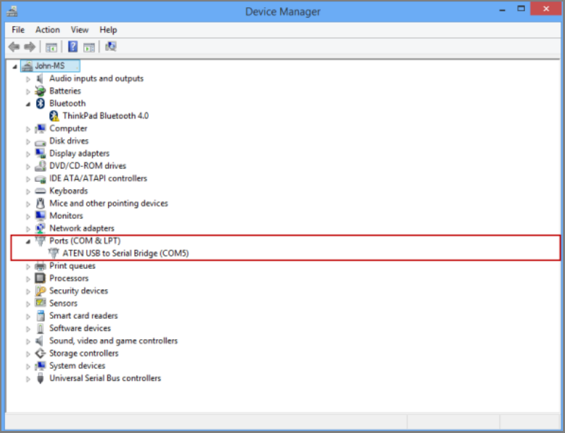
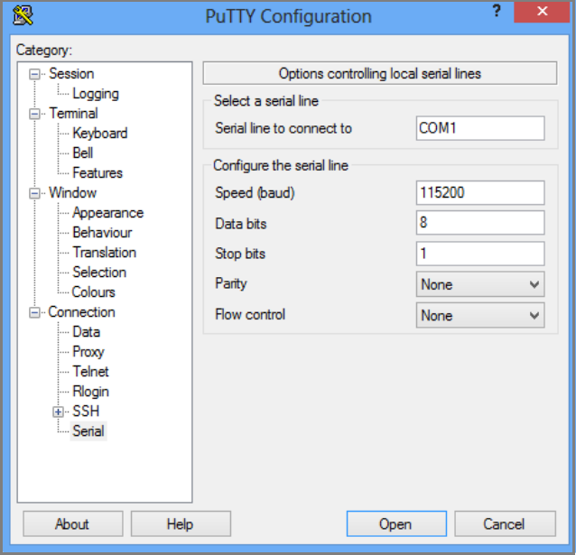
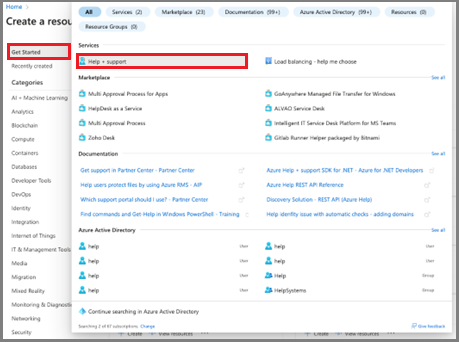
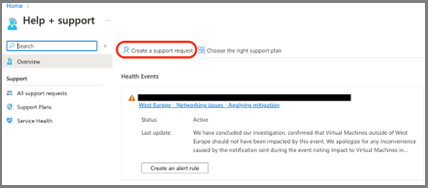
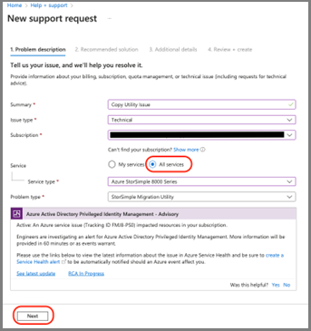
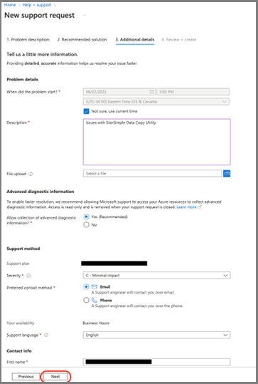
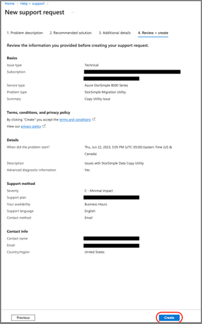

# StorSimple 8000 series: a hybrid cloud storage solution

> [!CAUTION]
> **Action Required:** StorSimple Data Manager, StorSimple Device Manager, StorSimple 1200, and StorSimple 8000 have reached their end of support. We're no longer updating this content. Check the Microsoft Product Lifecycle for information about how this product, service, technology, or API is supported. StorSimple management services have been decommissioned and removed from the Azure platform. 

The following resources are available to help you migrate backup files or to copy live data to your own environment, and to provide documentation to decommission a StorSimple appliance. 

|Resource   |Description   |
|---------------------------|----------------------------|
|[Azure StorSimple 8000 Series Copy Utility](https://aka.ms/storsimple-copy-utility)     |Microsoft is providing a read-only data copy utility to recover and migrate your backup files from StorSimple cloud snapshots. The StorSimple 8000 Series Copy Utility is designed to run in your environment. You can install and configure the Utility, and then use your Service Encryption Key to authenticate and download your metadata from the cloud.|
|[Azure StorSimple 8000 Series Copy Utility documentation](https://aka.ms/storsimple-copy-utility-docs)    |Instructions for use of the Copy Utility. |
|[StorSimple archived documentation](https://aka.ms/storsimple-archive-docs)   |Archived StorSimple articles from Microsoft technical documentation.   |

## Copy data and then decommission your appliance

Use the following steps to copy data to your environment and then decommission your StorSimple 8000 appliance. If your data has already been migrated to your own environment, you can proceed with decommissioning your appliance.

**Step 1: Copy backup files or live data to your own environment.**

- **Backup files.** If you have backup files, use the Azure StorSimple 8000 Series Copy Utility to migrate backup files to your environment. For more information, see [Copy Utility documentation](https://aka.ms/storsimple-copy-utility-docs).
- **Live data.** If you have live data to copy, you can access and copy live data to your environment via iSCSI.

**Step 2: Decommission your device.**

After you complete your data migration, use the following steps to decommission the device. Before you decommission your device, make sure to copy all data from your appliance, using either local host copy operations or using the Utility.

Decommission operations can't be undone. We recommend that you complete your data migration as soon as possible.

1.	Disconnect the iSCSI session on the host – that is, the iSCSI Initiators.
2.	Reset the device to factory default:

    This procedure describes how to reset your Azure StorSimple device to factory default settings using Windows PowerShell for StorSimple. Resetting a device removes all data and settings from the entire cluster by default.

    Use the following steps to reset your device to factory default settings:

    1. Access the device through its serial console. Check the banner message to ensure that you're connected to the **Active** controller.
    2. In the serial console menu, choose option 1: **Log in with full access.**
    3. At the prompt, type the following command to reset the entire cluster, removing all data, metadata, and controller settings:

    ```azurepowershell
    Reset-HcsFactoryDefault
    ```
    To instead reset a single controller, use the [Reset-HcsFactoryDefault](/previous-versions/windows/powershell-scripting/dn688132(v=wps.630)) cmdlet with the *-scope* parameter.

    The system reboots multiple times. You're notified when the reset has successfully completed. Depending on the system model, it can take 45-60 minutes for an 8100 device and 60-90 minutes for an 8600 to finish this process.

**Step 3: Shut down the device.**

This section explains how to shut down a running or a failed StorSimple device from a remote computer. A device is turned off after both the device controllers are shut down. A device shutdown is complete when the device is physically moved or is taken out of service.

**Step 3a:** Use the following steps to identify and shut down the passive controller on your device. Perform this operation in Windows PowerShell for StorSimple.

1. Access the device via the serial console or a telnet session from a remote computer. To connect to Controller 0 or Controller 1, follow these steps to use PuTTY to connect to the device serial console.

   To connect to Windows PowerShell for StorSimple, you need to use terminal emulation software such as PuTTY. You can use PuTTY when you access the device directly through the serial console or by opening a telnet session from a remote computer.
   1. To connect through the serial console, connect your serial cable to the device, directly or through a USB-serial adapter.
   2. Open Control Panel and then open Device Manager.
   3. Identify the COM port as shown in the following illustration.

      

   4. Start PuTTY.
   5. In the right pane, change **Connection type** to **Serial**.
   6. In the right pane, specify the appropriate COM port. Make sure that the serial configuration parameters are set as follows:
   - Speed: 115200
   - Data bits: 8
   - Stop bits: 1
   - Parity: None
   - Flow control: None

    These settings are shown in the following illustration.

    
 
    If the default flow control setting doesn’t work, try setting Flow control to XON/XOFF.

    7. Select **Open** to start a serial session.

2. In the serial console menu, select option 1: **Log in with full access.**
3. In the banner message, make a note of the controller you're connected to, Controller 0 or Controller 1, and whether it’s the active or the passive (standby) controller.

   1. Run the following command to shut down a single controller:

   ```azurepowershell
   Stop-HcsController 
   ```

   This shuts down the controller you're connected to. When you stop the active controller, the device fails over to the passive controller.

   2. To restart a controller, at the prompt, run the following command:

   ```azurepowershell
   Restart-HcsController
   ```

   This restarts the controller you're connected to. When you restart the active controller, it fails over to the passive controller before the restart.

**Step 3b:** Repeat the previous step to shut down the active controller.

**Step 3c:** You must now look at the back plane of the device. After the two controllers are shut down, the status LEDs on both the controllers should be blinking red. To turn off the device completely at this time, flip the power switches on both Power and Cooling Modules (PCMs) to the OFF position. This turns off the device.

## Create a support request

Use the following steps to create a support ticket for StorSimple data copy, data migration, and device decommission operations.

1. In Azure portal, type **help** in the search bar and then select **Help + Support**.

    

1. On the **Help + Support** page, select **Create a support request.**

    

1. On the **New support request** page, provide the required information:
   -	Provide a brief **Summary** of the issue.
   -	Specify **Technical** as the **Issue type**.
   -	Specify the affected **Subscription**.
   -	Specify **All services**. You must specify **All services** because **StorSimple Manager Service** is no longer available.
   -	For **Service type**, specify **Azure StorSimple 8000 Series**. 
   -	For **Problem type**, Specify **StorSimple Migration Utility**.
   - To continue, select **Next**.

         
  
1. If the **Solutions** page appears, select **Return to support request** and then select **Next**.

1. On the **Additional details** tab, provide additional details and contact information:

   - Specify the time when the problem started, a description, and  upload relevant files, if applicable.
   -	Specify **Yes** or **No** for **Advanced diagnostic information** collection.
   -	Your support plan will be generated based on your subscription. Specify severity, your preferred contact method, and language. 
   -	Specify **Contact information**: First name, Last name, Email, Phone, and Country/region.
   -	To continue, select **Next**.

        

1. On the **Review + create** tab, review the summary of your case. To continue, select **Create**. 

    

Microsoft Support will use this information to reach out to you for additional details and diagnosis. A Support engineer will contact you as soon as possible to proceed with your request.

## Next steps

- [StorSimple 8000 series copy utility documentation](https://aka.ms/storsimple-copy-utility-docs).
