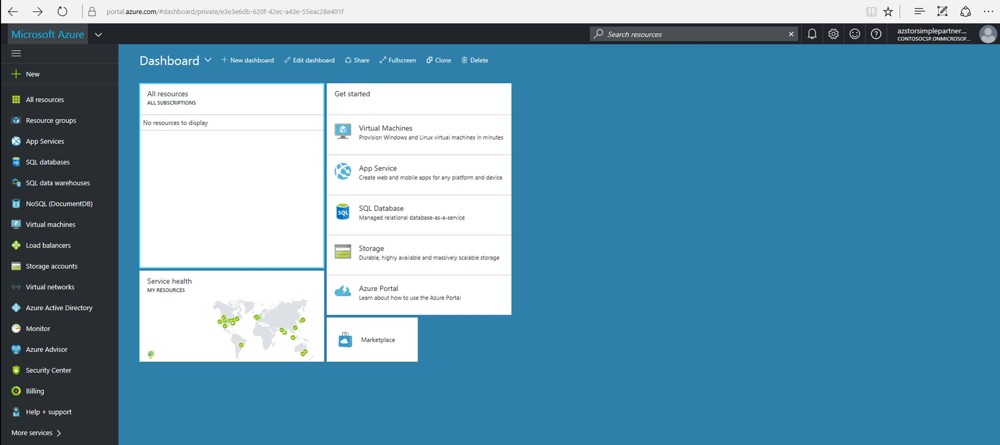

## Overview

Microsoft Azure StorSimple is a unique approach to enterprise storage with true hybrid cloud storage capabilities. It empowers the customers to take advantage of economical cloud storage for the inactive data, while keeping their mission-critical data on-premises for the highest levels of performance. 

StorSimple in CSP enables partners to capitalize on this opportunity. The partners own the end-to-end customer lifecycle with direct provisioning, billing, and support of Microsoft’s cloud services. In short, the partners can  now transact the StorSimple along with their services to customers.

For more information about StorSimple in CSP, visit the [Partner center](http://partnercenter.microsoft.com/).
For more information on billing, pricing, incentives, and getting support in CSP, go to [StorSimple in CSP: FAQ](storsimple-partner-csp-faq.md). 

## Deploy and manage StorSimple in CSP

StorSimple in CSP is available as a seat license service in all the countries where the CSP exists and the StorSimple Device Manager is available. StorSimple in CSP uses the Azure portal and the StorSimple Device Manager service. A CSP partner can create a StorSimple Device Manager to manage StorSimple Virtual Arrays, shares, volumes, and backups. You can administer all virtual arrays registered to your StorSimple Device Manager service via the Azure portal.

For more information, go to [Deploy and manage your StorSimple Virtual Array in the CSP](storsimple-partner-csp-sva-deploy.md).

Overview

StorSimple Virtual Array (SVA) can be deployed by Cloud Solution Provider (CSP) partners for their customers. A CSP partner can create a StorSimple Device Manager service. This service can then be used to deploy and manage StorSimple Virtual Array and the associated shares, volumes, and backups.

## Prerequisites

Before you begin, ensure that the:

- A partner is enrolled under the CSP program.
- A partner has a valid [Partner Center](http://partnercenter.microsoft.com/) login credentials. This will enable him to sign into the Partner portal to add new customers, search for customers, or navigate to a customer account from the Partner dashboard. The CSP can function as a StorSimple administrator on behalf of the customer in the Azure Portal.
                             
## Add customers

Perform the following steps to add customers to the StorSimple subscription.

1. Go to the [Partner Center](http://partnercenter.microsoft.com/) and sign in using your CSP credentials. Click **Dashboard**.

     
                              
2. In the left-pane, click **Customers**. In the right-pane, click **Add customers**. Enter the details of the customer. Click **Next:Subscriptions** to create a customer subscription.

    

3.  Select **Microsoft Azure** offer. Scroll to the bottom of the page and click **Review**.

    
                              
4. Review the information and click **Submit**.

    

5. Save the confirmation information for future reference.

    

6. Find or navigate Customer.

      

7. Under **Administer Services**, click **Microsoft Azure Management Portal**. This would automatically sign you in as an Azure Administrator for your customer.

    

8. Click the **+** symbol and search or navigate to **StorSimple Virtual Device Series** to create a StorSimple Device Manager.

    
 

## Next steps

- If you have more questions regarding the StorSimple in CSP, go to [StorSimple in CSP: Frequently asked questions](storsimple-partner-csp-faq.md).
- If you are ready to deploy your StorSimple, go to [Deploy your StorSimple in CSP](storsimple-partner-csp-sva-deploy.md).
