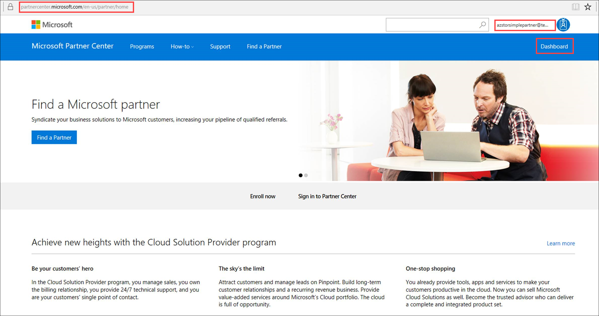
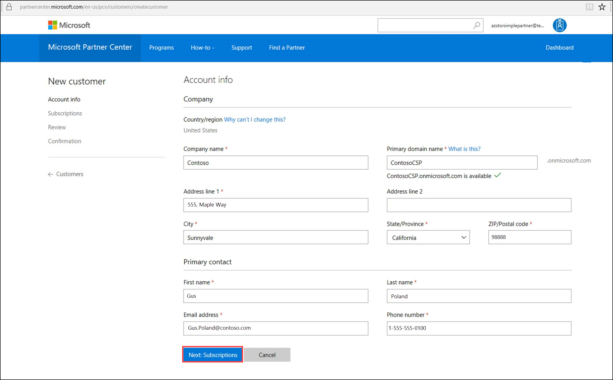
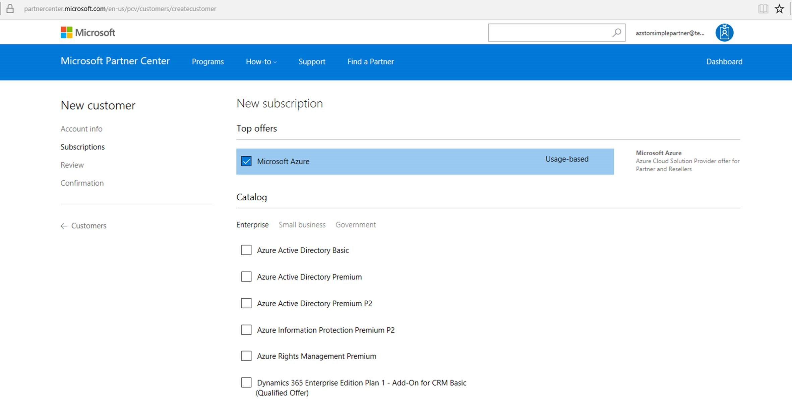
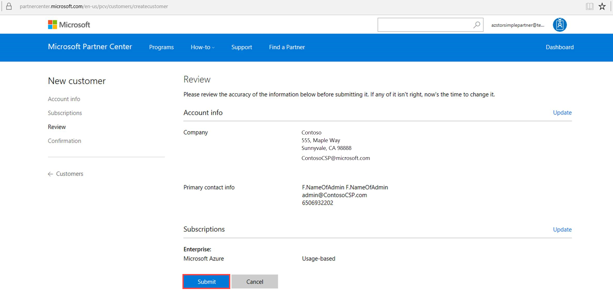
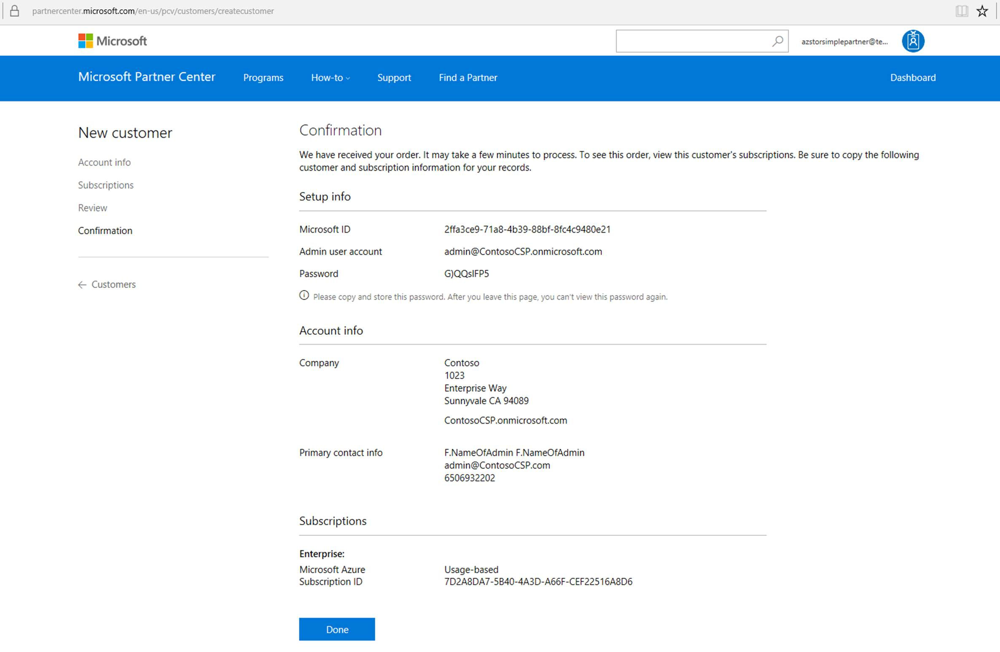
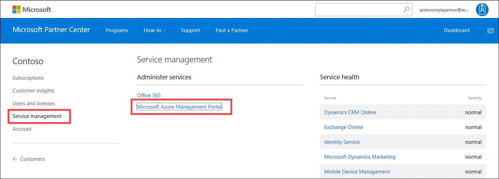
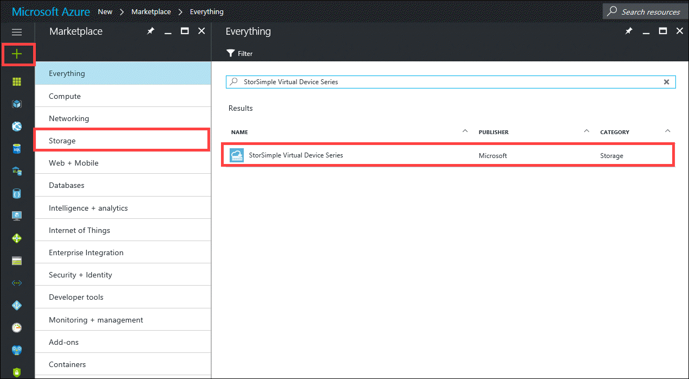
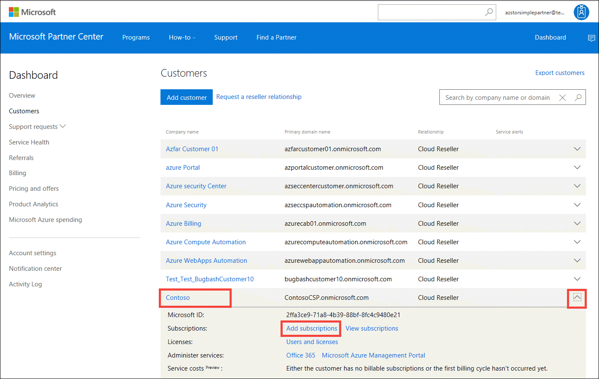
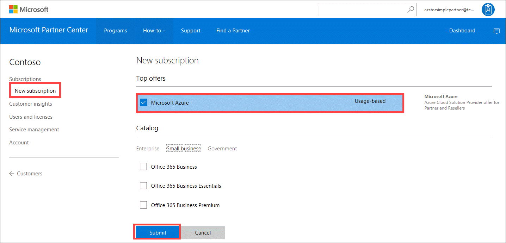

# Deploy StorSimple Virtual Array for Cloud Solution Provider Program

## Overview

StorSimple Virtual Array can be deployed by the Cloud Solution Provider (CSP) partners for their customers. A CSP partner can create a StorSimple Device Manager service. This service can then be used to deploy and manage StorSimple Virtual Array and the associated shares, volumes, and backups.

This article describes how a CSP partner can add a customer or a new subscription to an existing customer and then create a service to deploy a StorSimple Virtual Array in CSP.

## Prerequisites

Before you begin, ensure that:

- You are enrolled under the CSP program.
- You have valid [Partner Center](https://partnercenter.microsoft.com/) login credentials. The credentials enable you to sign in to the Partner portal to add new customers, search for customers, or navigate to a customer account from the Partner dashboard. The CSP can function as a StorSimple administrator on behalf of the customer in the Azure portal.
                             
## Add a customer

If you add a customer, a subscription is automatically created. To add a customer (and automatically create a subscription), perform the following steps in the Partner portal.

1. Go to the [Partner Center](https://partnercenter.microsoft.com/) and sign in using your CSP credentials. Click **Dashboard**.

     
                              
2. In the left-pane, click **Customers**. In the right-pane, click **Add customers**. Enter the details of the customer. Click **Next: Subscriptions** to create a customer subscription.

    

3.  Select **Microsoft Azure** offer. Scroll to the bottom of the page and click **Review**.

    
                              
4. Review the information and click **Submit**.

    

5. Save the confirmation information for future reference.

    

6. Find or navigate to the customer you just added. Click the **Company name** to drill down into the details.

      

7. In the left-pane, select **Service management**. In the right-pane, under **Administer services**, click **Microsoft Azure Management Portal** to sign in as an Azure administrator for your customer.

    

8. To create a StorSimple Device Manager, click **+ New** and search for or navigate to **StorSimple Virtual Device Series**. For more information, go to [Deploy a StorSimple Device Manager service](storsimple-virtual-array-manage-service.md).

    

## Add a subscription

In some instances, you may have an existing customer, and you need to add a subscription. To add a subscription to an existing customer, perform the following steps in the Partner portal.

1. Go to the [Partner Center](https://partnercenter.microsoft.com/) and sign in using your CSP credentials. Click **Dashboard**.

     
                              
2. In the left-pane, click **Customers**. Find or navigate to the customer you want to add a subscription to. Click the  icon to expand the row for the company name for your customer. In the details, click **Add subscriptions**.

    

3. Check **Microsoft Azure** for the **Top offers** in the subscription and click **Submit**. This creates a new subscription.

    

6. After a new subscription is created, click **<-- Customers** in the left-pane to return to the **Customers** page. Search for the customer for whom you just created a subscription. Click the **Company name** to drill down into the details.

      

7. In the left-pane, select **Service management**. In the right-pane, under **Administer services**, click **Microsoft Azure Management Portal** to sign in as an Azure administrator for your customer.

    

8. To create a StorSimple Device Manager, click **+ New** and search for or navigate to **StorSimple Virtual Device Series**. For more information, go to [Deploy a StorSimple Device Manager service](storsimple-virtual-array-manage-service.md).

    

## Next steps

- If you have more questions regarding the StorSimple in CSP, go to [StorSimple in CSP: Frequently asked questions](storsimple-partner-csp-faq.md).
- If you are ready to deploy your StorSimple, go to [Deploy your StorSimple in CSP](storsimple-partner-csp-deploy.md).
