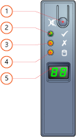
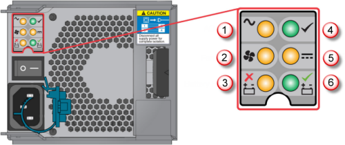
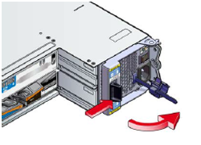
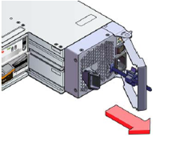
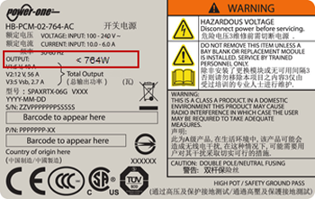
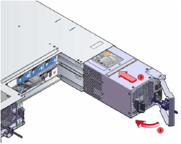

<properties 
   pageTitle="Replace a PCM on your StorSimple device | Microsoft Azure"
   description="Explains how to remove and replace the Power and Cooling Module (PCM) on your StorSimple device"
   services="storsimple"
   documentationCenter=""
   authors="alkohli"
   manager="carmonm"
   editor="" />
<tags 
   ms.service="storsimple"
   ms.devlang="NA"
   ms.topic="article"
   ms.tgt_pltfrm="NA"
   ms.workload="TBD"
   ms.date="05/25/2016"
   ms.author="alkohli" />

# Replace a Power and Cooling Module on your StorSimple device

## Overview

The Power and Cooling Module (PCM) in your Microsoft Azure StorSimple device consists of a power supply and cooling fans that are controlled through the primary and EBOD enclosures. There is only one model of PCM that is certified for each enclosure. The primary enclosure is certified for a 764 W PCM and the EBOD enclosure is certified for a 580 W PCM. Although the PCMs for the primary enclosure and the EBOD enclosure are different, the replacement procedure is identical.

This tutorial explains how to:

- Remove a PCM
- Install a replacement PCM

>[AZURE.IMPORTANT] Before removing and replacing a PCM, review the safety information in [StorSimple hardware component replacement](storsimple-hardware-component-replacement.md).

## Before you replace a PCM

Be aware of the following important issues before you replace your PCM:

- If the power supply of the PCM fails, leave the faulty module installed, but remove the power cord. The fan will continue to receive power from the enclosure and continue to provide proper cooling. If the fan fails, the PCM needs to be replaced immediately.

- Before removing the PCM, disconnect the power from the PCM by turning off the main switch (where present) or by physically removing the power cord. This provides a warning to your system that a power shutdown is imminent.

- Make sure that the other PCM is functional for continued system operation before replacing the faulty PCM. A faulty PCM must be replaced by a fully operational PCM as soon as possible.

- PCM module replacement takes only few minutes to complete, but it must be completed within 10 minutes of removing the failed PCM to prevent overheating.

- Note that the replacement 764 W PCM modules shipped from the factory do not contain the backup battery module. You will need to remove the battery from your faulty PCM and then insert it into the replacement module prior to performing the replacement. For more information, see how to [remove and insert a backup battery module](storsimple-battery-replacement.md).

## Remove a PCM

Follow these instructions when you are ready to remove a Power and Cooling Module (PCM) from your Microsoft Azure StorSimple device.

>[AZURE.NOTE] Before you remove your PCM, verify that you have a correct replacement (764 W for the primary enclosure or 580 W for the EBOD enclosure).

#### To remove a PCM

1. In the Azure classic portal, click **Devices** > **Maintenance** > **Hardware Status**. Check the status of the PCM components under **Shared Components** to identify which PCM has failed:

     - If a power supply in PCM 0 has failed, the status of **Power Supply in PCM 0** will be red.

     - If a power supply in PCM 1 has failed, the status of **Power Supply in PCM 1** will be red.

     - If the fan in PCM 1 has failed, the status of either **Cooling 0 for PCM 0** or **Cooling 1 for PCM 0** will be red.

2. Locate the failed PCM on the back of the primary enclosure. If you are running a 8600 model, identify the primary enclosure by looking at the System Unit Identification Number shown on the front panel LED display. The default Unit ID displayed on the primary enclosure is **00**, whereas the default Unit ID displayed on the EBOD enclosure is **01**. The following diagram and table explain the front panel of the LED display.

    

     **Figure 1** Front panel of the device  

    |Label|Description|
    |:---|:-----------|
    |1|Mute button|
    |2|System power|
    |3|Module fault|
    |4|Logical fault|
    |5|Unit ID display|

3. The monitoring indicator LEDs in the back of the primary enclosure can also be used to identify the faulty PCM. See the following diagram and table to understand how to use the LEDs to locate the faulty PCM. For example, if the LED corresponding to the **Fan Fail** is lit, the fan has failed. Likewise, if the LED corresponding to **AC Fail** is lit, the power supply has failed. 

    

     **Figure 2** Back of PCM with indicator LEDs

    |Label|Description|
    |:---|:-----------|
    |1|AC power failure|
    |2|Fan failure|
    |3|Battery fault|
    |4|PCM OK|
    |5|DC power failure|
    |6|Battery healthy|

4. Refer to the following diagram of the back of the StorSimple device to locate the failed PCM module. PCM 0 is on the left and PCM 1 is on the right. The table that follows explains the modules.

     

     **Figure 3** Back of device with plug-in modules 

    |Label|Description|
    |:---|:-----------|
    |1|PCM 0|
    |2|PCM 1|
    |3|Controller 0|
    |4|Controller 1|

5. Turn off the faulty PCM and disconnect the power supply cord. You can now remove the PCM.

6. Grasp the latch and the side of the PCM handle between your thumb and forefinger, and squeeze them together to open the handle.

    

    **Figure 4** Opening the PCM handle

7. Grip the handle and remove the PCM.

    

    **Figure 5** Removing the PCM

## Install a replacement PCM

Follow these instructions to install a PCM in your StorSimple device. Ensure that you have inserted the backup battery module prior to installing the replacement PCM (applies to 764 W PCMs only). For more information, see how to [remove and insert a backup battery module](storsimple-battery-replacement.md).

#### To install a PCM

1. Verify that you have the correct replacement PCM for this enclosure. The primary enclosure needs a 764 W PCM and the EBOD enclosure needs a 580 W PCM. You should not attempt to use the 580 W PCM in the Primary enclosure, or the 764 W PCM in the EBOD enclosure. The following image shows where to identify this information on the label that is affixed to the PCM.

    

    **Figure 6** PCM label

2. Check for damage to the enclosure, paying particular attention to the connectors. 
										
    >[AZURE.NOTE] **Do not install the module if any connector pins are bent.**

3. With the PCM handle in the open position, slide the module into the enclosure.

    

    **Figure 7** Installing the PCM

4. Manually close the PCM handle. You should hear a click as the handle latch engages. 
										
    >[AZURE.NOTE] To ensure that the connector pins have engaged, you can gently tug on the handle without releasing the latch. If the PCM slides out, it implies that the latch was closed before the connectors engaged.

5. Connect the power cables to the power source and to the PCM.

6. Secure the strain relief bales. 

7. Turn on the PCM.

8. Verify that the replacement was successful: in the Azure classic portal of your StorSimple Manager service, navigate to **Devices** > **Maintenance** > **Hardware Status**. Under **Shared Components**, the status of the PCM should be green. 
										
    >[AZURE.NOTE] It may take a few minutes for the replacement PCM to completely initialize.

## Next steps

Learn more about [StorSimple hardware component replacement](storsimple-hardware-component-replacement.md).
