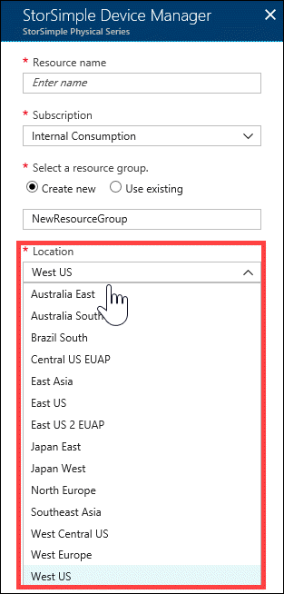

# Available regions for your StorSimple

## Overview

The Azure datacenters operate in multiple geographies around the world to meet customer's demands of performance, requirements, and preferences regarding data location. An Azure geography is a defined area of the world that contains at least one Azure Region. An Azure region is an area within a geography, containing one or more datacenters.

Choosing an Azure region is very important and the choice of region is influenced by factors such as data residency and sovereignty, service availability, performance, cost, and redundancy. For more information on how to choose a region, go to [Which Azure region is right for me?](https://azure.microsoft.com/overview/datacenters/how-to-choose/)

For StorSimple solution, the choice of region is specifically determined by the following factors:

- Regions where the StorSimple Device Manager service is available.
- The countries/regions where the StorSimple physical, cloud, or virtual device is available.
- The regions where the storage accounts that store StorSimple data should be located for optimum performance.

This tutorial describes the region availability for the StorSimple Device Manager service, the on-premises physical and the cloud devices. The information contained in this article is applicable to StorSimple 8000 and 1200 series devices.

## Region availability for StorSimple Device Manager service

StorSimple Device Manager service is currently supported in 12 public regions and 2 Azure Government regions.

You define a region or location when you first create the StorSimple Device Manager service. In general, a location closest to the geographical region where the device is deployed is chosen. But the device and the service can also be deployed in different locations.

Here is a list of regions where StorSimple Device Manager service is available for Azure public cloud and can be deployed.

For Azure Government cloud, the StorSimple Device Manager service is available in US Gov Iowa and US Gov Virginia datacenters.

## Region availability for data stored in StorSimple

StorSimple data is physically stored in Azure storage accounts and these accounts are available in all the Azure regions. When you create an Azure storage account, the primary location of the storage account is chosen and that determines the region where the data resides.

When you first create a StorSimple Device Manager service and associate a storage account with it, your StorSimple Device Manager service and Azure storage can be in two separate locations. In such a case, you are required to create the StorSimple Device Manager and Azure storage account separately.

In general, choose the nearest region to your service for your storage account. However, the nearest Microsoft Azure region might not actually be the region with the lowest latency. It is the latency that dictates network service performance and hence the performance of the solution. So if you are choosing a storage account in a different region, it is important to know what the latencies are between your service and the region associated with your storage account.

If you are using a StorSimple Cloud Appliance, then we recommend that the service and the associated storage account are in the same region. Storage accounts in a different region  may result in poor performance.

## Availability of StorSimple device

Depending upon the model, the StorSimple devices can be available in different geographies or countries/regions.

### StorSimple physical device (Models 8100/8600)

If using a StorSimple 8100 or 8600 physical device, the device is available in the following countries/regions.

| #  | Country/Region        | #  | Country/Region     | #  | Country/Region      | #  | Country/Region             |
|----|-----------------------|----|--------------------|----|---------------------|----|----------------------------|
| 1  | Australia             | 16 | Hong Kong SAR      | 31 | New Zealand         | 46 | South Africa               |
| 2  | Austria               | 17 | Hungary            | 32 | Nigeria             | 47 | South Korea                |
| 3  | Bahrain               | 18 | Iceland            | 33 | Norway              | 48 | Spain                      |
| 4  | Belgium               | 19 | India              | 34 | Peru                | 49 | Sri Lanka                  |
| 5  | Brazil                | 20 | Indonesia          | 35 | Philippines         | 50 | Sweden                     |
| 6  | Canada                | 21 | Ireland            | 36 | Poland              | 51 | Switzerland                |
| 7  | Chile                 | 22 | Israel             | 37 | Portugal            | 52 | Taiwan                     |
| 8  | Colombia              | 23 | Italy              | 38 | Puerto Rico         | 53 | Thailand                   |
| 9  | Czech Republic        | 24 | Japan              | 39 | Qatar               | 54 | Turkey                     |
| 10 | Denmark               | 25 | Kenya              | 40 | Romania             | 55 | Ukraine                    |
| 11 | Egypt                 | 26 | Kuwait             | 41 | Russia              | 56 | United Arab Emirates       |
| 12 | Finland               | 27 | Macao SAR          | 42 | Saudi Arabia        | 57 | United Kingdom             |
| 13 | France                | 28 | Malaysia           | 43 | Singapore           | 58 | United States              |
| 14 | Germany               | 29 | Mexico             | 44 | Slovakia            | 59 | Vietnam                    |
| 15 | Greece                | 30 | Netherlands        | 45 | Slovenia            | 60 | Croatia                    |

This list changes as more countries/regions are added. For a most up-to-date list of the geographies, go to the Storage Array Terms Appendix in the [Product terms](https://www.microsoft.com/en-us/licensing/product-licensing/products).

Microsoft can ship physical hardware and provide hardware spare parts replacement for StorSimple to the geographies in the preceding list.

> [!IMPORTANT]
> Do not place a StorSimple physical device in a region where StorSimple is not supported. Microsoft will not be able to ship any replacement parts to countries/regions where StorSimple is not supported.

### StorSimple Cloud Appliance (Models 8010/8020)

If using a StorSimple Cloud Appliance 8010 or 8020, then the device is supported and available in all the regions where the underlying VM is supported. The 8010 uses a _Standard_A3_ VM which is supported in all Azure regions.

The 8020 uses premium storage and _Standard_DS3_ VM to create a cloud appliance. The 8020 is supported in Azure regions that support Premium Storage and _Standard_DS3_ Azure VMs. Use [this list](https://azure.microsoft.com/regions/services/) to see if both **Virtual Machines > DS-series** and **Storage > Disk storage** are available in your region.

### StorSimple Virtual Array (Model 1200)

If using a 1200 series StorSimple Virtual Array, then the virtual disk image is supported in all Azure regions.

## Next steps

* Learn more about the [pricing for various StorSimple models](https://azure.microsoft.com/pricing/calculator/#storsimple2).
* Learn more about [managing your StorSimple storage account](storsimple-8000-manage-storage-accounts.md).
* Learn more about how to [use the StorSimple Device Manager service to administer your StorSimple device](storsimple-8000-manager-service-administration.md).
