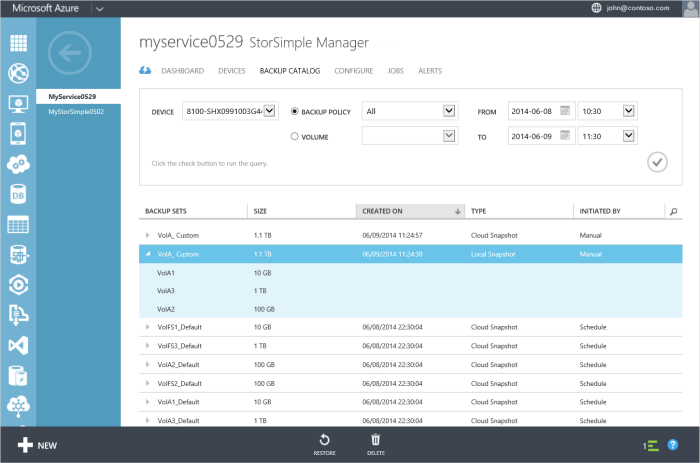
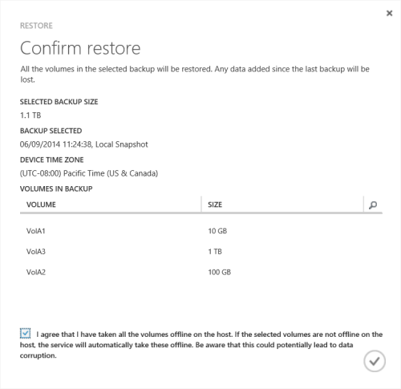

<properties 
   pageTitle="Restore a StorSimple volume from backup | Microsoft Azure"
   description="Explains how to use the StorSimple Manager service Backup Catalog page to restore a StorSimple volume from a backup set."
   services="storsimple"
   documentationCenter="NA"
   authors="SharS"
   manager="carolz"
   editor="" />
<tags 
   ms.service="storsimple"
   ms.devlang="NA"
   ms.topic="article"
   ms.tgt_pltfrm="NA"
   ms.workload="TBD"
   ms.date="08/28/2015"
   ms.author="v-sharos" />

# Restore a StorSimple volume from a backup set

## Overview

The **Backup Catalog** page displays all the backup sets that are created when manual or automated backups are taken. You can use this page to list all the backups for a backup policy or a volume, select or delete backups, or use a backup to restore or clone a volume.

 

This tutorial explains how to use the **Backup Catalog** page to restore your device from a backup set.

## How to use the backup catalog 

The **Backup Catalog** page provides a query that helps you to narrow your backup set selection. You can filter the backup sets that are retrieved based on the following parameters:

- **Device** – The device on which the backup set was created.
- **Backup policy** or **volume** – The backup policy or volume associated with this backup set.
- **From** and **To** – The date and time range when the backup set was created.

The filtered backup sets are then tabulated based on the following attributes:

- **Name** – The name of the backup policy or volume associated with the backup set.
- **Size** – The actual size of the backup set.
- **Created on** – The date and time when the backups were created. 
- **Type** – Backup sets can be local snapshots or cloud snapshots. A local snapshot is a backup of all your volume data stored locally on the device, whereas a cloud snapshot refers to the backup of volume data residing in the cloud. Local snapshots provide faster access, whereas cloud snapshots are chosen for data resiliency.
- **Initiated by** – The backups can be initiated automatically according to a schedule or manually by a user. (You can use a backup policy to schedule backups. Alternatively, you can use the **Take backup** option to take an interactive backup.)

## How to restore your StorSimple volume from a backup

You can use the **Backup Catalog** page to restore your StorSimple volume from a specific backup. Keep in mind, however, that restoring a volume will revert the volume to the state it was in when the backup was taken. Any data that was added after the backup operation will be lost.

> [AZURE.WARNING] Restoring from a backup will replace the existing volumes from the backup. This may cause the loss of any data that was written after the backup was taken.

### To restore from a backup set

1. On the StorSimple Manager service page, click the **Backup catalog** tab.

    

2. Select a backup set as follows:
  1. Select the appropriate device.
  2. In the drop-down list, choose the volume or backup policy for the backup that you wish to select.
  3. Specify the time range.
  4. Click the check icon  to execute this query.
 
    The backups associated with the selected volume or backup policy should appear in the list of backup sets.

3. Expand the backup set to view the associated volumes. These volumes must be taken offline on the host and device before you can restore them. Access the volumes on the **Volume Containers** page, and then follow the steps in [Take a volume offline](storsimple-manage-volumes.md#take-a-volume-offline) to take them offline.

    >  [AZURE.IMPORTANT] Make sure that you have taken the volumes offline on the host first, before you take the volumes offline on the device. If you do not take the volumes offline on the host, it could potentially lead to data corruption.

4. Navigate back to the **Backup Catalog** tab and select a backup set.

5. Click **Restore** at the bottom of the page.

6. You will be prompted for confirmation. 

    

7. Review the restore information and click the check icon . This will initiate a restore job that you can view by accessing the **Jobs** page. 

8. After the restore is complete, you can verify that the contents of your volumes are replaced by volumes from the backup.

## Next steps

Learn how to [Manage StorSimple volumes](storsimple-manage-volumes.md).
