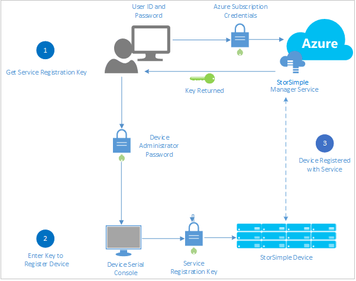
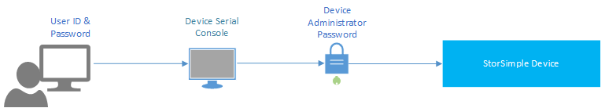
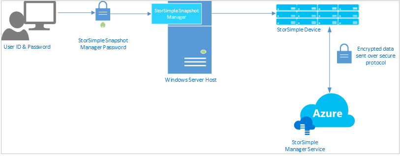
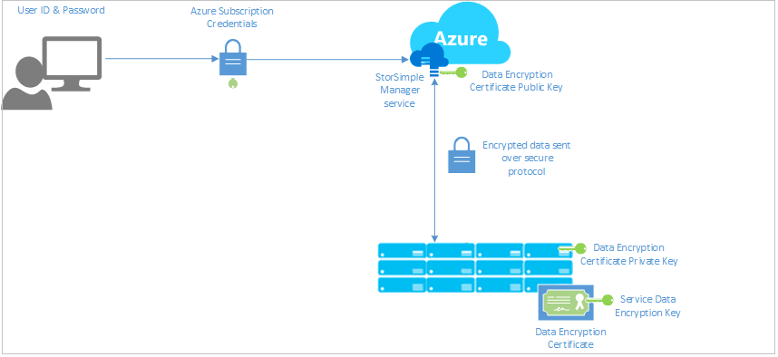
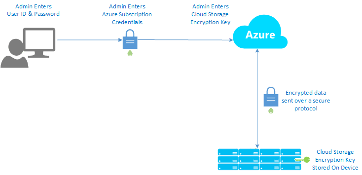

<properties 
   pageTitle="StorSimple security | Microsoft Azure" 
   description="Describes the security and privacy features that protect your StorSimple service, device, and data on premises and in the cloud." 
   services="storsimple" 
   documentationCenter="NA" 
   authors="SharS" 
   manager="carmonm" 
   editor=""/>

<tags
   ms.service="storsimple"
   ms.devlang="NA"
   ms.topic="article"
   ms.tgt_pltfrm="NA"
   ms.workload="TBD" 
   ms.date="05/03/2016"
   ms.author="v-sharos"/>

# StorSimple security and data protection

## Overview

Security is a major concern for anyone who is adopting a new technology, especially when the technology is used with confidential or proprietary data. As you evaluate different technologies, you must consider increased risks and costs for data protection. Microsoft Azure StorSimple provides both a security and privacy solution for data protection, helping to ensure: 

- **Confidentiality** – Only authorized entities can view your data. 
- **Integrity** – Only authorized entities can modify or delete your data.

The Microsoft Azure StorSimple solution consists of four main components that interact with each other:

- **StorSimple Manager service hosted in Microsoft Azure** – The management service that you use to configure and provision the StorSimple device.
- **StorSimple device** – A physical device installed in your datacenter. All hosts and clients that generate data connect to the StorSimple device, and the device manages the data and moves it to the Azure cloud as appropriate.
- **Clients/hosts connected to the device** – The clients in your infrastructure that connect to the StorSimple device and generate data that needs to be protected.
- **Cloud storage** – The location in the Azure cloud where data is stored.

The following sections describe the StorSimple security features that help protect each of these components and the data stored on them. It also includes a list of questions that you might have about Microsoft Azure StorSimple security, and the corresponding answers.

## StorSimple Manager service protection

The StorSimple Manager service is a management service hosted in Microsoft Azure and used to manage all StorSimple devices that your organization has procured. You can access the StorSimple Manager service by using your organizational credentials to log on to the Azure classic portal through a web browser. 

Access to the StorSimple Manager service requires that your organization have an Azure subscription that includes StorSimple. Your subscription governs the features that you can access in the Azure classic portal. If your organization does not have an Azure subscription and you want to learn more about them, see [Sign up for Azure as an organization](../active-directory/sign-up-organization.md). 

Because the StorSimple Manager service is hosted in Azure, it is protected by the Azure security features. For more information about the security features provided by Microsoft Azure, go to the [Microsoft Azure Trust Center](https://azure.microsoft.com/support/trust-center/security/).

## StorSimple device protection

The StorSimple device is an on-premises hybrid storage device that contains solid state drives (SSDs) and hard disk drives (HDDs), together with redundant controllers and automatic failover capabilities. The controllers manage storage tiering, placing currently used (or hot) data on local storage (in the StorSimple device or on-premises servers), while moving less frequently used data to the cloud.

Only authorized StorSimple devices are allowed to join the StorSimple Manager service that you created in your Azure subscription. To authorize a device, you must register it with the StorSimple Manager service by providing the service registration key. The service registration key is a 128-bit random key generated in the Azure classic portal. 

To learn how get a service registration key, go to [Step 2: Get the service registration key](storsimple-deployment-walkthrough.md#step-2-get-the-service-registration-key).

The service registration key is a long key that contains 100+ characters. You can copy the key and save it in a text file in a secure location so that you can use it to authorize additional devices as necessary. If the service registration key is lost after you register your first device, you can generate a new key from the StorSimple Manager service. This will not affect the operation of existing devices. 

After a device is registered, it uses tokens to communicate with Microsoft Azure. The service registration key is not used after device registration.

> [AZURE.NOTE] We recommend that you regenerate the service registration key after every use.

## Protect your StorSimple solution via passwords

Passwords are an important aspect of computer security and are used extensively in the StorSimple solution to help ensure that your data is accessible to authorized users only. StorSimple allows you to configure the following passwords:

- StorSimple device administrator password
- Challenge Handshake Authentication Protocol (CHAP) initiator and target passwords
- StorSimple Snapshot Manager password

### Windows PowerShell for StorSimple and the StorSimple device administrator password

Windows PowerShell for StorSimple is a command-line interface that you can use to manage the StorSimple device. Windows PowerShell for StorSimple has features that allow you to register your device, configure the network interface on your device, install certain types of updates, troubleshoot your device by accessing the support session, and change the device state. You can access Windows PowerShell for StorSimple by connecting to the serial console on the device or by using Windows PowerShell remoting.

PowerShell remoting can be done over HTTPS or HTTP. If remote management over HTTPS is enabled, you will need to download the remote management certificate from the device and install it on the remote client. For more information about PowerShell remoting, go to [Connect remotely to your StorSimple device](storsimple-remote-connect.md).

After you use Windows PowerShell for StorSimple to connect to the device, you will need to provide the device administrator password to log on to the device.

Keep the following best practices in mind:

- Remote management is turned off by default. You can use the StorSimple Manager service to enable it. As a security best practice, remote access should be enabled only during the time period that it is actually needed.
- If you change the password, be sure to notify all remote access users so that they do not experience an unexpected connectivity loss.
- The StorSimple Manager service cannot retrieve existing passwords: it can only reset them. We recommend that you store all passwords in a secure place so that you do not have to reset a password if it is forgotten. If you do need to reset a password, be sure to notify all users before you reset it. 

You can access the Windows PowerShell interface by using a serial connection to the device. You can also access it remotely by using either HTTP or HTTPS, which provide additional security. HTTPS provides a higher level of security than either a serial or HTTP connection. However, to use HTTPS, you must first install a certificate on the client computer that will access the device. You can download the remote access certificate from the device configuration page in the StorSimple Manager service. If the certificate for remote access is lost, you must download a new certificate and propagate it to all clients that are authorized to use remote management.

### Challenge Handshake Authentication Protocol (CHAP) initiator and target passwords

CHAP is an authentication scheme used by the StorSimple device to validate the identity of remote clients. The verification is based on a shared password. CHAP can be one-way (unidirectional) or mutual (bidirectional). With one-way CHAP, the target (the StorSimple device) authenticates an initiator (host). Mutual or reverse CHAP requires that the target authenticate the initiator and then the initiator authenticate the target. Your StorSimple can be configured to use either method.

Be aware of the following when you configure CHAP:

- The CHAP user name must contain fewer than 233 characters.
- The CHAP password must be between 12 and 16 characters. Attempting to use a longer user name or password will result in an authentication failure on the Windows host.
- You cannot use the same password for both the CHAP initiator and the CHAP target.
- After you set the password, it can be changed but it cannot be retrieved. If the password is changed, be sure to notify all remote access users so that they can successfully connect to the StorSimple device.

For more information about CHAP and how to configure it for your StorSimple solution, go to [Configure CHAP for your StorSimple device](storsimple-configure-chap.md).

### StorSimple Snapshot Manager password

StorSimple Snapshot Manager is a Microsoft Management Console (MMC) snap-in that uses volume groups and the Windows Volume Shadow Copy Service to generate application-consistent backups. In addition, you can use StorSimple Snapshot Manager to create backup schedules and clone or restore volumes.

When you configure a device to use StorSimple Snapshot Manager, you will be required to provide the StorSimple Snapshot Manager password. This password is first set in Windows PowerShell for StorSimple during registration. The password can also be set and changed from the StorSimple Manager service. This password authenticates the device with StorSimple Snapshot Manager.

The StorSimple Snapshot Manager password must be 14 to 15 characters and must contain 3 or more of a combination of uppercase, lowercase, numeric, and special characters. After you set the StorSimple Snapshot Manager password, it can be changed but it cannot be retrieved. If you change the password, be sure to notify all remote users.

For more information about StorSimple Snapshot Manager, go to [What is StorSimple Snapshot Manager?](storsimple-what-is-snapshot-manager.md)

### Password best practices

We recommend that you use the following guidelines to help ensure that StorSimple passwords are strong and well-protected:

- Change your passwords every three months. Changing the passwords is enforced annually.
- Use strong passwords. For more information, go to [Create stronger passwords and protect them](http://blogs.microsoft.com/cybertrust/2014/08/25/create-stronger-passwords-and-protect-them/).
- Always use different passwords for different access mechanisms; each of the passwords you specify should be unique.
- Do not share passwords with anyone who is not authorized to access the StorSimple device.
- Do not speak about a password in front of others or hint at the format of a password.
- If you suspect that an account or password has been compromised, report the incident to your information security department.
- Treat all passwords as sensitive, confidential information. 

## StorSimple data protection

This section describes the StorSimple security features that protect data in transit and stored data.

As described in other sections, passwords are used to authorize and authenticate users before they can gain access to your StorSimple solution. Another security consideration is protecting data from unauthorized users while it is being transferred between storage systems and while it is being stored. The following sections describe the data protection features provided with StorSimple.

> [AZURE.NOTE] Deduplication provides additional protection for data stored on the StorSimple device and in Microsoft Azure storage. When data is deduplicated, the data objects are stored separately from the metadata used to map and access them: there is no available storage-level context to reconstruct the data based on volume structure, file system, or file name.

## Protect data flowing through the service

The primary purpose of the StorSimple Manager service is to manage and configure the StorSimple device. The StorSimple Manager service runs in Microsoft Azure. You use the Azure classic portal to enter device configuration data, and then Microsoft Azure uses the StorSimple Manager service to send the data to the device. StorSimple uses a system of asymmetric key pairs to help ensure that a compromise of the Azure service will not result in a compromise of stored information. 

The asymmetric key system helps protect the data that flows through the service as follows:

1. A data encryption certificate that uses an asymmetric public and private key pair is generated on the device and is used to protect the data. The keys are generated when the first device is registered. 
2. The data encryption certificate keys are exported into a Personal Information Exchange (.pfx) file that is protected by the service data encryption key, which is a strong 128-bit key that is randomly generated by the first device during registration.
3. The public key of the certificate is securely made available to the StorSimple Manager service, and the private key remains with the device.
4. Data entering the service is encrypted using the public key and decrypted using the private key stored on the device, ensuring that the Azure service cannot decrypt the data flowing to the device.

The service data encryption key is generated on only the first device registered with the service. All subsequent devices that are registered with the service must use the same service data encryption key. 

> [AZURE.IMPORTANT] 
> 
> It is very important to make a copy of the service data encryption key and save it in a secure location. A copy of the service data encryption key should be stored in such a way that it can be accessed by an authorized person and can be easily communicated to the device administrator.
>
> If the service data encryption key is lost, a Microsoft support person can help you to retrieve it provided that you have at least one device in an online state. We recommend that you change the service data encryption key after it is retrieved. For instructions, go to [Change the service data encryption key](storsimple-service-dashboard.md#change-the-service-data-encryption-key).

You can change the service data encryption key and the corresponding data encryption certificate by selecting the **Change service data encryption key** option on the service dashboard. To ensure that data security is not compromised, you must use a physical StorSimple device to change the service data encryption key. Changing the encryption keys requires that all devices be updated with the new key. Therefore, we recommend that you change the key when all devices are online. If devices are offline, their keys can be changed at a different time. The devices with out-of-date keys will still be able to run backups, but they will not be able to restore data until the key is updated. For more information, go to [Use the StorSimple Manager service dashboard](storsimple-service-dashboard.md).

The service data encryption key and the data encryption certificate do not expire. However, we recommend that you change the service data encryption key annually to help prevent key compromise.

## Protect data at rest

The StorSimple device manages data by storing it in tiers locally and in the cloud, depending on frequency of use. All host machines that are connected to the device send data to the device, which then moves data to the cloud, as appropriate. Data is transferred from the device to the cloud securely over the Internet. Each device has one iSCSI target that surfaces all shared volumes on that device. All data is encrypted before it is sent to cloud storage. 

To help ensure the security and integrity of data moved to the cloud, StorSimple allows you to define cloud storage encryption keys as follows:

- You specify the cloud storage encryption key when you create a volume container. The key cannot be modified or added later. 
- All volumes in a volume container share the same encryption key. If you want a different form of encryption for a specific volume, we recommend that you create a new volume container to host that volume.
- When you enter the cloud storage encryption key in the StorSimple Manager service, the key is encrypted using the public portion of the service data encryption key and then sent to the device.
- The cloud storage encryption key is not stored anywhere in the service and is known only to the device.
- Specifying a cloud storage encryption key is optional. You can send data that has been encrypted at the host to the device.

### Additional security best practices

- Split traffic: isolate your iSCSI SAN from user traffic on a corporate LAN by deploying a totally separated network and using VLANs where physical isolation is not an option. A dedicated network for iSCSI storage will guarantee the safety and performance of your business-critical data. Mixing storage and user traffic over a corporate LAN is not recommended and can increase latency and cause network failures.

- For host-side network security, use network interfaces that support TCP/IP Offload Engine (TOE). TOE reduces CPU load by processing TCP on the network adapter.

## Protect data via storage accounts

Each Microsoft Azure subscription can create one or more storage accounts. (A storage account provides a unique namespace for working with data stored in the Azure cloud.) Access to a storage account is controlled by the subscription and access keys associated with that storage account. 

When you create a storage account, Microsoft Azure generates two 512-bit storage access keys, one of which is used for authentication when the StorSimple device accesses the storage account. Note that only one of these keys is in use. The other key is held in reserve, allowing you to rotate the keys periodically. To rotate keys, you make the secondary key active, and then delete the primary key. You can then create a new key for use during the next rotation. (For security reasons, many datacenters require key rotation.) 

We recommend that you follow these best practices for key rotation:

- You should rotate storage account keys regularly to help ensure that your storage account is not accessed by unauthorized users.
- Periodically, your Azure administrator should change or regenerate the primary or secondary key by using the Storage section of the Azure classic portal to directly access the storage account.

## Protect data via encryption

StorSimple uses the following encryption algorithms to protect data stored in or traveling between the components of your StorSimple solution.

| Algorithm | Key length | Protocols/applications/comments |
| --------- | ---------- | ------------------------------- |
| RSA       | 2048       | RSA PKCS 1 v1.5 is used by the Azure classic portal to encrypt configuration data that is sent to the device: for example, storage account credentials, StorSimple device configuration, and cloud storage encryption keys. |
| AES       | 256        | AES with CBC is used to encrypt the public portion of the service data encryption key before it is sent to the Azure classic portal from the StorSimple device. It is also used by the StorSimple device to encrypt data before the data is sent to the cloud storage account. |

## StorSimple virtual device security

[AZURE.INCLUDE [storsimple virtual device security](../../includes/storsimple-virtual-device-security.md)]

## Frequently asked questions (FAQ)

The following are some questions and answers about security and Microsoft Azure StorSimple.

**Q:** My service is compromised. What should be my next steps?

**A:** You should immediately change the service data encryption key and the storage account keys for the storage account that is being used for tiering data. For instructions, go to: 

- [Change the service data encryption key](storsimple-service-dashboard.md#change-the-service-data-encryption-key)
- [Key rotation of storage accounts](storsimple-manage-storage-accounts.md#key-rotation-of-storage-accounts)

**Q:** I have a new StorSimple device that is asking for the service registration key. How do I retrieve it?

**A:** This key was created when you first created the StorSimple Manager service. When you use the StorSimple Manager service to connect to the device, you can use the service quick start page to view or regenerate the service registration key. Generating a new service registration key will not affect the existing registered devices. For instructions, go to:

- [View or regenerate the service registration key](storsimple-service-dashboard.md#view-or-regenerate-the-service-registration-key)

**Q:** I lost my service data encryption key. What do I do?

**A:** Contact Microsoft Support. They can log on to a support session on your device and help you retrieve the key (provided at least one device is online). Immediately after you obtain the service data encryption key, you should change it to ensure that the new key is known only to you. For instructions, go to:

- [Change the service data encryption key](storsimple-service-dashboard.md#change-the-service-data-encryption-key)

**Q:**  I authorized a device for a service data encryption key change, but did not start the key change process. What should I do?

**A:** If the time-out period has expired, you will need to reauthorize the device for the service data encryption key change and start the process again.

**Q:**  I changed the service data encryption key, but I was not able to update the other devices within 4 hours. Do I have to start again?

**A:** The 4-hour time period is only for initiating the change. After you start the update process on the authorized StorSimple device, the authorization is valid until all devices are updated.

**Q:** Our StorSimple administrator has left the company. What should I do?

**A:** Change and reset the passwords that allow access to the StorSimple device, and change the service data encryption key to ensure that the new information is not known to unauthorized personnel. For instructions, go to:

- [Use the StorSimple Manager service to change your storsimple passwords](storsimple-change-passwords.md)
- [Change the service data encryption key](storsimple-service-dashboard.md#change-the-service-data-encryption-key)
- [Configure CHAP for your StorSimple device](storsimple-configure-chap.md)

**Q:** I want to provide the StorSimple Snapshot Manager password to a host that is connecting to the StorSimple device, but the password is not available. What can I do?

**A:** If you have forgotten the password, you should create a new one. Then, be sure to inform all existing users that the password has been changed and that they should update their clients to use the new password. For instructions, go to:

- [Change the StorSimple Snapshot Manager password](storsimple-change-passwords.md#change-the-storsimple-snapshot-manager-password)
- [Authenticate a device](storsimple-snapshot-manager-manage-devices.md#authenticate-a-device)

**Q:** The certificate for remote access to the Windows PowerShell for StorSimple has been changed on the device. How do I update my remote access clients?

**A:** You can download the new certificate from the StorSimple Manager service, and then provide it to be installed in the certificate store of your remote access clients. For instructions, go to:

- [Import-Certificate cmdlet](https://technet.microsoft.com/library/hh848630.aspx)

**Q:** Is my data protected if the StorSimple Manager service is compromised?

**A:** Service configuration data is always encrypted with your public key when you view it in a web browser. Because the service doesn’t have access to the private key, the service will not be able to see any data. If the StorSimple Manager service is compromised, there is no impact, as there are no keys stored in the StorSimple Manager service.

**Q:** If someone gains access to the data encryption certificate, will my data be compromised?

**A:** Microsoft Azure stores the customer’s data encryption key (.pfx file) in an encrypted format. Because the .pfx file is encrypted and the StorSimple service doesn’t have the service data encryption key to decrypt the .pfx file, simply getting access to the .pfx file will not expose any secrets.

**Q:** What happens if a governmental entity asks Microsoft for my data?

**A:** Because all of the data is encrypted on the service and the private key is kept with the device, the governmental entity must ask the customer for the data. 

## Next steps

[Deploy your StorSimple device](storsimple-deployment-walkthrough.md).
 
