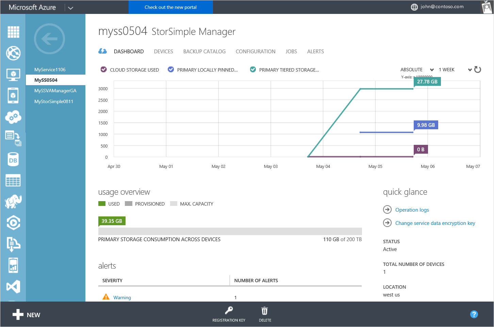

<properties 
   pageTitle="StorSimple Manager service dashboard | Microsoft Azure"
   description="Describes the StorSimple Manager service dashboard and explains how to use it to monitor the health of your StorSimple solution."
   services="storsimple"
   documentationCenter=""
   authors="SharS"
   manager="carolz"
   editor="" />
<tags 
   ms.service="storsimple"
   ms.devlang="na"
   ms.topic="article"
   ms.tgt_pltfrm="na"
   ms.workload="na"
   ms.date="09/02/2015"
   ms.author="v-sharos" />

# Use the StorSimple Manager service dashboard

## Overview

The StorSimple Manager service dashboard page provides a summary view of all the devices that are connected to the StorSimple Manager service, highlighting those that need a system administrator's attention. This tutorial introduces the dashboard page, explains the dashboard content and function, and describes the tasks that you can perform from this page.

**Figure 1: StorSimple Manager service dashboard**

The StorSimple Manager service dashboard displays the following information:

- In the **chart** area, you can see the relevant metrics chart for your devices. You can view the primary storage used across all the devices, as well as the cloud storage consumed by devices over a period of time. Use the controls in the top-right corner of the chart to specify a 1-week, 1-month, 3-month, or 1-year time scale.

- The **usage overview** shows the primary storage that is provisioned and consumed by all devices relative to the total storage available across all devices. **Provisioned** refers to the amount of storage that is prepared and allocated for use, while **Used** refers to usage of volumes as viewed by the initiators that are connected to the devices.

- The **alerts** area provides a snapshot of all the active alerts across all the devices, grouped by alert severity. Clicking the severity level opens the **Alerts** page, scoped to show those alerts. On the **Alerts** page, you can click an individual alert to view additional details about that alert, including any recommended actions. You can also clear the alert if the issue has been resolved.

- The **jobs** area provides a snapshot of recent jobs across all devices that are connected to your service. There are links that you can use to look at jobs that are currently in progress, those that failed in the last 24 hours, or those that are scheduled to run in the next 24 hours. 

- The **quick glance** area provides useful information such as service status, number of devices connected to the service, location of the service, and details of the subscription that is associated with the service. There is also a link to the operations log. Click the link to see a list of all completed StorSimple Manager service operations.

You can use the StorSimple Manager service dashboard page to initiate the following tasks:

- View or regenerate the service registration key.
- Change the service data encryption key.
- View the operation logs.

## View or regenerate the service registration key

The service registration key is used to register a Microsoft Azure StorSimple device with the StorSimple Manager service, so that the device appears in the Microsoft Azure Management Portal for further management actions. The key is created on the first device and shared with the rest of your devices. 

Clicking **Registration Key** (at the bottom of the page) opens the **Service Registration Key** dialog box, where you can either copy the current service registration key to the clipboard or regenerate the service registration key.

Regenerating the key does not affect previously registered devices: it affects only the devices that are registered with the service after the key is regenerated.

For more information about viewing and generating the service registration key, go to [Get the service registration key](storsimple-manage-service.md#get-the-service-registration-key).

## Change the service data encryption key

Service data encryption keys are used to encrypt confidential customer data, such as storage account credentials, that are sent from your StorSimple Manager service to the StorSimple device. You will need to change these keys periodically if your IT organization has a key rotation policy on the storage devices. The key change process can be slightly different depending on whether there is a single device or multiple devices managed by the StorSimple Manager service.

Changing the service data encryption key is a 3-step process:

1. Using the Management Portal, authorize a device to change the service data encryption key.
2. Using Windows PowerShell for StorSimple, initiate the service data encryption key change.
3. If you have more than one StorSimple device, update the service data encryption key on the other devices.

The following steps describe the rollover process for the service data encryption key.

[AZURE.INCLUDE [storsimple-change-data-encryption-key](../../includes/storsimple-change-data-encryption-key.md)]

## View the operations logs

You can view the operation logs by clicking the operation logs link available in the **quick glance** pane of the dashboard. This will take you to the management services page, where you can filter and see the logs specific to your StorSimple Manager service.

## Next steps

[Learn how to troubleshoot a StorSimple device](storsimple-troubleshoot-operational-device.md).