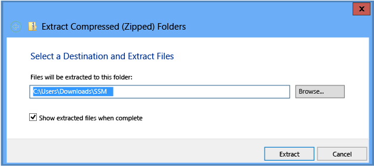
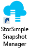
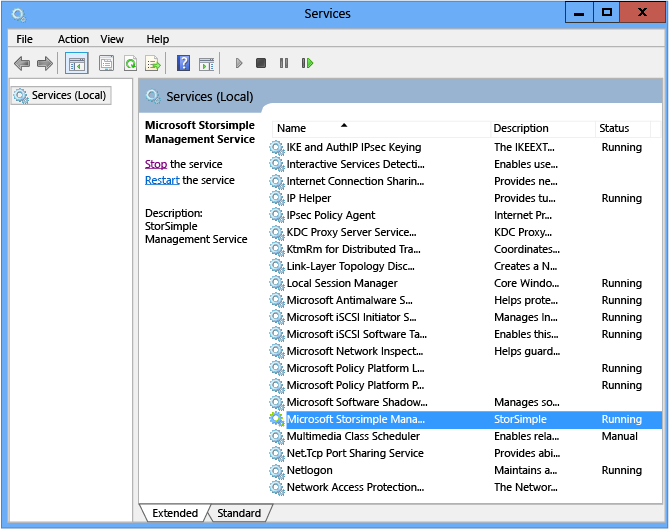

# Deploy the StorSimple Snapshot Manager MMC snap-in

## Overview
The StorSimple Snapshot Manager is a Microsoft Management Console (MMC) snap-in that simplifies data protection and backup management in a Microsoft Azure StorSimple environment. With StorSimple Snapshot Manager, you can manage Microsoft Azure StorSimple on-premises and cloud storage as if it were a fully integrated storage system, thus simplifying backup and restore processes and reducing costs. 

This tutorial describes configuration requirements, as well as procedures for installing, removing, and upgrading StorSimple Snapshot Manager.

> [!NOTE]
> * You cannot use StorSimple Snapshot Manager to manage Microsoft Azure StorSimple Virtual Arrays (also known as StorSimple on-premises virtual devices).
> * If you plan to install StorSimple Update 2 on your StorSimple device, be sure to download the latest version of StorSimple Snapshot Manager and install it **before you install StorSimple Update 2**. The latest version of StorSimple Snapshot Manager is backward compatible and works with all released versions of Microsoft Azure StorSimple. If you are using the previous version of StorSimple Snapshot Manager, you will need to update it (you do not need to uninstall the previous version before you install the new version).

## StorSimple Snapshot Manager installation
StorSimple Snapshot Manager can be installed on computers that are running the Windows Server 2008 R2 SP1, Windows Server 2012, or Windows Server 2012 R2 operating system. On servers running Windows 2008 R2, you must also install Windows Server 2008 SP1 and Windows Management Framework 3.0.

Before you install or upgrade the StorSimple Snapshot Manager snap-in for the Microsoft Management Console (MMC), make sure that the Microsoft Azure StorSimple device and host server are configured correctly.

## Configure prerequisites
The following steps provide a high-level overview of configuration tasks that you must complete before you install the StorSimple Snapshot Manager. For complete Microsoft Azure StorSimple configuration and setup information, including system requirements and step-by-step instructions, see [Deploy your on-premises StorSimple device](storsimple-8000-deployment-walkthrough-u2.md).

> [!IMPORTANT]
> Before you begin, review the [Deployment configuration checklist](storsimple-8000-deployment-walkthrough-u2.md#deployment-configuration-checklist) and
> and [Deployment prerequisites](storsimple-8000-deployment-walkthrough-u2.md#deployment-prerequisites) in [Deploy your on-premises StorSimple device](storsimple-8000-deployment-walkthrough-u2.md).
>  
> 
> 

### Before you install StorSimple Snapshot Manager
1. Unpack, mount, and connect the Microsoft Azure StorSimple device as described in [Install your StorSimple 8100 device](storsimple-8100-hardware-installation.md) or [Install your StorSimple 8600 device](storsimple-8600-hardware-installation.md).
2. Make sure that your host computer is running one of the following operating systems:
   
   * Windows Server 2008 R2 (on servers running Windows 2008 R2, you must also install Windows Server 2008 SP1 and Windows Management Framework 3.0)
   * Windows Server 2012
   * Windows Server 2012 R2
     
     For a StorSimple virtual device, the host must be a Microsoft Azure Virtual Machine.
3. Make sure that you meet all the Microsoft Azure StorSimple configuration requirements. For details, go to [Deployment prerequisites](storsimple-8000-deployment-walkthrough-u2.md#deployment-prerequisites).
4. Connect the device to the host and perform the initial configuration. For details, go to [Deployment steps](storsimple-8000-deployment-walkthrough-u2.md#deployment-steps).
5. Create volumes on the device, assign them to the host, and verify that the host can mount and use them. StorSimple Snapshot Manager supports the following types of volumes:
   
   * Basic volumes
   * Simple volumes
   * Dynamic volumes
   * Mirrored dynamic volumes (RAID 1)
   * Cluster-shared volumes
     
     For information about creating volumes on the StorSimple device or StorSimple virtual device, go to [Step 6: Create a volume](storsimple-8000-deployment-walkthrough-u2.md#step-6-create-a-volume), in [Deploy your on-premises StorSimple device](storsimple-8000-deployment-walkthrough-u2.md).

## Install a new StorSimple Snapshot Manager
Before installing StorSimple Snapshot Manager, make sure that the volumes you created on the StorSimple device or StorSimple virtual device are mounted, initialized, and formatted as described in [Configure prerequisites](#configure-prerequisites).

> [!IMPORTANT]
> * For a StorSimple virtual device, the host must be a Microsoft Azure Virtual Machine. 
> * The host must be running Windows 2008 R2, Windows Server 2012, or Windows Server 2012 R2. If your server is running Windows Server 2008 R2, you must also install Windows Server 2008 SP1 and Windows Management Framework 3.0.
> * You must configure an iSCSI connection from the host to the StorSimple device before you can connect the device to StorSimple Snapshot Manager.

Follow these steps to complete a fresh installation of StorSimple Snapshot Manager. If you are installing an upgrade, go to [Upgrade or reinstall StorSimple Snapshot Manager](#upgrade-or-reinstall-storsimple-snapshot-manager).

* Step 1: Install StorSimple Snapshot Manager 
* Step 2: Connect StorSimple Snapshot Manager to a device 
* Step 3: Verify the connection to the device 

### Step 1: Install StorSimple Snapshot Manager
Use the following steps to install StorSimple Snapshot Manager.

#### To install StorSimple Snapshot Manager
1. Download the StorSimple Snapshot Manager software (go to [StorSimple Snapshot Manager](https://www.microsoft.com/download/details.aspx?id=44220) in the Microsoft Download Center) and save it locally on the host.
2. In File Explorer, right-click the compressed folder, and then click **Extract all**.
3. In the **Extract Compressed (Zipped) Folders** window, in the **Select a destination and extract files** box, type or browse to the path where you would like to file to be extracted.
   
    > [!IMPORTANT]
    > You must install StorSimple Snapshot Manager on the C: drive.
    
4. Select the **Show extracted files when complete** check box, and then click **Extract**.
   
     
5. When the extraction is finished, the destination folder opens. Double-click the application setup icon that appears in the destination folder.
6. When the **Setup Successful** message appears, click **Close**. You should see the StorSimple Snapshot Manager icon on your desktop.
   
     

### Step 2: Connect StorSimple Snapshot Manager to a device
Use the following steps to connect StorSimple Snapshot Manager to a StorSimple device.

#### To connect StorSimple Snapshot Manager to a device
1. Click the StorSimple Snapshot Manager icon on your desktop. The StorSimple Snapshot Manager window appears. The window contains a **Scope** pane, a **Results** pane, and an **Actions** pane. 
   
    
   
   * The **Scope** pane (the left pane) contains a list of nodes organized in a tree structure. You can expand some nodes to select a view or specific data related to that node. Click the arrow icon to expand or collapse a node. Right-click an item in the **Scope** pane to see a list of available actions for that item.
   * The **Results** pane (the center pane) contains detailed status information about the node, view, or data that you selected in the **Scope** pane.
   * The **Actions** pane lists the operations that you can perform on the node, view, or data that you selected in the **Scope** pane.
     
     For a complete description of the StorSimple Snapshot Manager user interface, see [StorSimple Snapshot Manager user interface](storsimple-use-snapshot-manager.md).
2. In the **Scope** pane, right-click the **Devices** node, and then click **Configure a device**. The **Configure a Device** dialog box appears.
   
     
3. In the **Device** list box, select the IP address of the Microsoft Azure StorSimple device or virtual device. In the **Password** text box, type the StorSimple Snapshot Manager password that you created for the device in the Azure portal. Click **OK**.
4. StorSimple Snapshot Manager searches for the device that you identified. If the device is available, StorSimple Snapshot Manager adds a connection. You can [verify the connection to the device](#to-verify-the-connection) to confirm that the connection was added successfully.
   
    If the device is unavailable for any reason, StorSimple Snapshot Manager returns an error message. Click **OK** to close the error message, and then click **Cancel** to close the **Configure a Device** dialog box.
5. When it connects to a device, StorSimple Snapshot Manager imports each volume group configured for that device, provided that the volume group has associated backups. Volume groups that do not have associated backups are not imported. Additionally, backup policies that were created for a volume group are not imported. To see the imported groups, right-click the top-most **Volume Groups** node in the **Scope** pane, and click **Toggle imported groups**.

### Step 3: Verify the connection to the device
Use the following steps to verify that StorSimple Snapshot Manager is connected to the StorSimple device.

#### To verify the connection
1. In the **Scope** pane, click the **Devices** node.
   
     
2. Check the **Results** pane: 
   
   * If a green indicator appears on the device icon and **Available** appears in the **Status** column, then the device is connected. 
   * If a red indicator appears on the device icon and Unavailable appears in the **Status** column, then the device is not connected. 
   * If **Refreshing** appears in the **Status** column, then StorSimple Snapshot Manager is retrieving volume groups and associated backups for a connected device.

## Upgrade or reinstall StorSimple Snapshot Manager
You should uninstall StorSimple Snapshot Manager completely before you upgrade or reinstall the software. 

Before reinstalling StorSimple Snapshot Manager, back up the existing StorSimple Snapshot Manager database on the host computer. This saves the backup policies and configuration information so that you can easily restore this data from backup.

Follow these steps if you are upgrading or reinstalling StorSimple Snapshot Manager:

* Step 1: Uninstall StorSimple Snapshot Manager 
* Step 2: Back up the StorSimple Snapshot Manager database 
* Step 3: Reinstall StorSimple Snapshot Manager and restore the database 

### Step 1: Uninstall StorSimple Snapshot Manager
Use the following steps to uninstall StorSimple Snapshot Manager.

#### To uninstall StorSimple Snapshot Manager
1. On the host computer, open the **Control Panel**, click **Programs**, and then click **Programs and Features**.
2. In the left pane, click **Uninstall or change a program**.
3. Right-click **StorSimple Snapshot Manager**, and then click **Uninstall**.
4. This starts the StorSimple Snapshot Manager Setup program. Click **Modify Setup**, and then click **Uninstall**.
   
   > [!NOTE]
   > If there are any MMC processes running in the background, such as StorSimple Snapshot Manager or Disk Management, the uninstall will fail and you will receive a message to close all instances of MMC before you attempt to uninstall the program. Select **Automatically close applications and attempt to restart them after setup is complete**, and then click **OK**.
   > 
   > 
5. When the uninstall process is finished, a **Setup Successful** message appears. Click **Close**.

### Step 2: Back up the StorSimple Snapshot Manager database
Use the following steps to create and save a copy of the StorSimple Snapshot Manager database.

#### To back up the database
1. Stop the Microsoft StorSimple Management Service:
   
   1. Start Server Manager.
   2. On the Server Manager Dashboard, on the **Tools** menu, select **Services**.
   3. On the **Services** page, select **Microsoft StorSimple Management Service**.
   4. In the right pane, under **Microsoft StorSimple Management Service**, click **Stop the service**.
      
        
2. Browse to C:\ProgramData\Microsoft\StorSimple\BACatalog. 
   
   > [!NOTE]
   > ProgramData is a hidden folder.
  
3. Find the catalog XML file, copy the file, and store the copy in a safe location or in the cloud.
   
    
4. Restart the Microsoft StorSimple Management Service: 
   
   1. On the Server Manager Dashboard, on the **Tools** menu, select **Services**.
   2. On the **Services** page, select the **Microsoft StorSimple Management Service**.
   3. In the right pane, under **Microsoft StorSimple Management Service**, click **Restart the service**. 

### Step 3: Reinstall StorSimple Snapshot Manager and restore the database
To reinstall StorSimple Snapshot Manager, follow the steps in [Install a new StorSimple Snapshot Manager](#install-a-new-storsimple-snapshot-manager). Then, use the following procedure to restore the StorSimple Snapshot Manager database.

#### To restore the database
1. Stop the Microsoft StorSimple Management Service:
   
   1. Start Server Manager.
   2. On the Server Manager Dashboard, on the **Tools** menu, select **Services**.
   3. On the **Services** page, select **Microsoft StorSimple Management Service**.
   4. In the right pane, under **Microsoft StorSimple Management Service**, click **Stop the service**.
2. Browse to C:\ProgramData\Microsoft\StorSimple\BACatalog.
   
   > [!NOTE]
   > ProgramData is a hidden folder.
   > 
   > 
3. Delete the catalog XML file, and replace it with the version that you saved earlier.
4. Restart the Microsoft StorSimple Management Service: 
   
   1. On the Server Manager Dashboard, on the **Tools** menu, select **Services**.
   2. On the **Services** page, select **Microsoft StorSimple Management Service**.
   3. In the right pane, under **Microsoft StorSimple Management Service**, click **Restart the service**.

## Next steps
* To learn more about StorSimple Snapshot Manager, go to [What is StorSimple Snapshot Manager?](storsimple-what-is-snapshot-manager.md).
* To learn more about the StorSimple Snapshot Manager user interface, go to [StorSimple Snapshot Manager user interface](storsimple-use-snapshot-manager.md).
* To learn more about using StorSimple Snapshot Manager, go to [Use StorSimple Snapshot Manager to administer your StorSimple solution](storsimple-snapshot-manager-admin.md).

