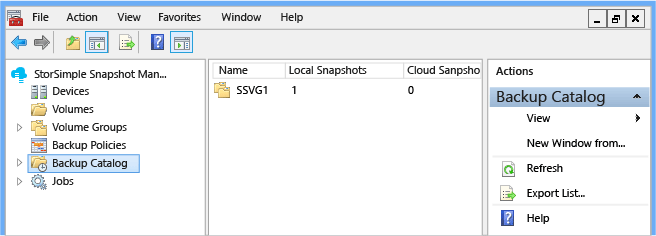
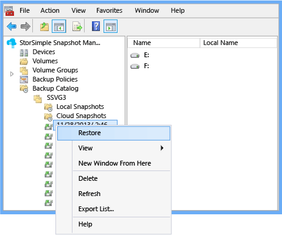
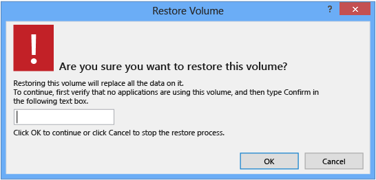
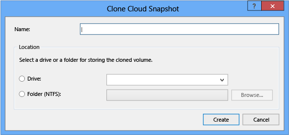
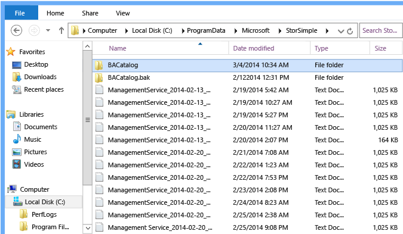

# Use StorSimple Snapshot Manager to manage the backup catalog

## Overview
The primary function of StorSimple Snapshot Manager is to allow you to create application-consistent backup copies of StorSimple volumes in the form of snapshots. Snapshots are then listed in an XML file called a *backup catalog*. The backup catalog organizes snapshots by volume group and then by local snapshot or cloud snapshot.

This tutorial describes how you can use the **Backup Catalog** node to complete the following tasks:

* Restore a volume
* Clone a volume or volume group
* Delete a backup
* Recover a file
* Restore the Storsimple Snapshot Manager database

You can view the backup catalog by expanding the **Backup Catalog** node in the **Scope** pane, and then expanding the volume group.

* If you click the volume group name, the **Results** pane shows the number of local snapshots and cloud snapshots available for the volume group. 
* If you click **Local Snapshot** or **Cloud Snapshot**, the **Results** pane shows the following information about each backup snapshot (depending on your **View** settings):
  
  * **Name** – the time the snapshot was taken.
  * **Type** – whether this is a local snapshot or a cloud snapshot.
  * **Owner** – the content owner. 
  * **Available** – whether the snapshot is currently available. **True** indicates that the snapshot is available and can be restored; **False** indicates that the snapshot is no longer available. 
  * **Imported** – whether the backup was imported. **True** indicates that the backup was imported from the StorSimple Device Manager service at the time the device was configured in StorSimple Snapshot Manager; **False** indicates that it was not imported, but was created by StorSimple Snapshot Manager. (You can easily identify an imported volume group because a suffix is added that identifies the device from which the volume group was imported.)
    
    
* If you expand **Local Snapshot** or **Cloud Snapshot**, and then click an individual snapshot name, the **Results** pane shows the following information about the snapshot that you selected:
  
  * **Name** – the volume identified by drive letter. 
  * **Local Name** – the local name of the drive (if available). 
  * **Device** – the name of the device on which the volume resides. 
  * **Available** – whether the snapshot is currently available. **True** indicates that the snapshot is available and can be restored; **False** indicates that the snapshot is no longer available. 

## Restore a volume
Use the following procedure to restore a volume from backup.

#### Prerequisites
If you have not already done so, create a volume and volume group, and then delete the volume. By default, StorSimple Snapshot Manager backs up a volume before permitting it to be deleted. This precaution can prevent data loss if the volume is deleted unintentionally or if the data needs to be recovered for any reason. 

StorSimple Snapshot Manager displays the following message while it creates the precautionary backup.

 

> [!IMPORTANT]
> You cannot delete a volume that is part of a volume group. The delete option is unavailable.  
> 
> 

#### To restore a volume
1. Click the desktop icon to start StorSimple Snapshot Manager. 
2. In the **Scope** pane, expand the **Backup Catalog** node, expand a volume group, and then click **Local Snapshots** or **Cloud Snapshots**. A list of backup snapshots appears in the **Results** pane.
3. Find the backup that you want to restore, right-click, and then click **Restore**.
   
     
4. On the confirmation page, review the details, type **Confirm**, and then click **OK**. StorSimple Snapshot Manager uses the backup to restore the volume.
   
     
5. You can monitor the restore action as it runs. In the **Scope** pane, expand the **Jobs** node, and then click **Running**. The job details appear in the **Results** pane. When the restore job is finished, the job details are transferred to the **Last 24 hours** list.

## Clone a volume or volume group
Use the following procedure to create a duplicate (clone) of a volume or volume group.

#### To clone a volume or volume group
1. Click the desktop icon to start StorSimple Snapshot Manager.
2. In the **Scope** pane, expand the **Backup Catalog** node, expand a volume group, and then click **Cloud Snapshots**. A list of backups appears in the **Results** pane.
3. Find the volume or volume group that you want to clone, right-click the volume or volume group name, and click **Clone**. The **Clone Cloud Snapshot** dialog box appears.
   
     
4. Complete the **Clone Cloud Snapshot** dialog box as follows: 
   
   1. In the **Name** text box, type a name for the cloned volume. This name will appear in the **Volumes** node. 
   2. (Optional) select **Drive**, and then select a drive letter from the drop-down list.
   3. (Optional) select **Folder (NTFS)**, and type a folder path or click Browse and select a location for the folder. 
   4. Click **Create**.
5. When the cloning process is finished, you must initialize the cloned volume. Start Server Manager, and then start Disk Management. For detailed instructions, see [Mount volumes](storsimple-snapshot-manager-manage-volumes.md#mount-volumes). After it is initialized, the volume will be listed under the **Volumes** node in the **Scope** pane. If you do not see the volume listed, refresh the list of volumes (right-click the **Volumes** node, and then click **Refresh**).

## Delete a backup
Use the following procedure to delete a snapshot from the backup catalog. 

> [!NOTE]
> Deleting a snapshot deletes the backed up data associated with the snapshot. However, the process of cleaning up data from the cloud may take some time. 

#### To delete a backup
1. Click the desktop icon to start StorSimple Snapshot Manager.
2. In the **Scope** pane, expand the **Backup Catalog** node, expand a volume group, and then click **Local Snapshots** or **Cloud Snapshots**. A list of snapshots appears in the **Results** pane.
3. Right-click the snapshot you want to delete, and then click **Delete**.
4. When the confirmation message appears, click **OK**.

## Recover a file
If a file is accidentally deleted from a volume, you can recover the file by retrieving a snapshot that pre-dates the deletion, using the snapshot to create a clone of the volume, and then copying the file from the cloned volume to the original volume.

#### Prerequisites
Before you begin, make sure that you have a current backup of the volume group. Then, delete a file stored on one of the volumes in that volume group. Finally, use the following steps to restore the deleted file from your backup. 

#### To recover a deleted file
1. Click the StorSimple Snapshot Manager icon on your desktop. The StorSimple Snapshot Manager console window appears. 
2. In the **Scope** pane, expand the **Backup Catalog** node, and browse to a snapshot that contains the deleted file. Typically, you should select a snapshot that was created just before the deletion.
3. Find the volume that you want to clone, right-click, and click **Clone**. The **Clone Cloud Snapshot** dialog box appears.
   
     
4. Complete the **Clone Cloud Snapshot** dialog box as follows: 
   
   1. In the **Name** text box, type a name for the cloned volume. This name will appear in the **Volumes** node. 
   2. (Optional) Select **Drive**, and then select a drive letter from the drop-down list. 
   3. (Optional) Select **Folder (NTFS)**, and type a folder path or click **Browse** and select a location for the folder. 
   4. Click **Create**. 
5. When the cloning process is finished, you must initialize the cloned volume. Start Server Manager, and then start Disk Management. For detailed instructions, see [Mount volumes](storsimple-snapshot-manager-manage-volumes.md#mount-volumes). After it is initialized, the volume will be listed under the **Volumes** node in the **Scope** pane. 
   
    If you do not see the volume listed, refresh the list of volumes (right-click the **Volumes** node, and then click **Refresh**).
6. Open the NTFS folder that contains the cloned volume, expand the **Volumes** node, and then open the cloned volume. Find the file that you want to recover, and copy it to the primary volume.
7. After you restore the file, you can delete the NTFS folder that contains the cloned volume.

## Restore the StorSimple Snapshot Manager database
You should regularly back up the StorSimple Snapshot Manager database on the host computer. If a disaster occurs or the host computer fails for any reason, you can then restore it from the backup. Creating the database backup is a manual process.

#### To back up and restore the database
1. Stop the Microsoft StorSimple Management Service:
   
   1. Start Server Manager.
   2. On the Server Manager dashboard, on the **Tools** menu, select **Services**.
   3. On the **Services** window, select the **Microsoft StorSimple Management Service**.
   4. In the right pane, under **Microsoft StorSimple Management Service**, click **Stop the service**.
2. On the host computer, browse to C:\ProgramData\Microsoft\StorSimple\BACatalog. 
   
   > [!NOTE]
   > ProgramData is a hidden folder.
   > 
   > 
3. Find the catalog XML file, copy the file, and store the copy in a safe location or in the cloud. If the host fails, you can use this backup file to help recover the backup policies that you created in StorSimple Snapshot Manager.
   
    
4. Restart the Microsoft StorSimple Management Service: 
   
   1. On the Server Manager dashboard, on the **Tools** menu, select **Services**.
   2. On the **Services** window, select the **Microsoft StorSimple Management Service**.
   3. In the right pane, under **Microsoft StorSimple Management Service**, click **Restart the service**.
5. On the host computer, browse to C:\ProgramData\Microsoft\StorSimple\BACatalog. 
6. Delete the catalog XML file, and replace it with the backup version that you created. 
7. Click the desktop StorSimple Snapshot Manager icon to start StorSimple Snapshot Manager. 

## Next steps
* Learn more about [using StorSimple Snapshot Manager to administer your StorSimple solution](storsimple-snapshot-manager-admin.md).
* Learn more about [StorSimple Snapshot Manager tasks and workflows](storsimple-snapshot-manager-admin.md#storsimple-snapshot-manager-tasks-and-workflows).

