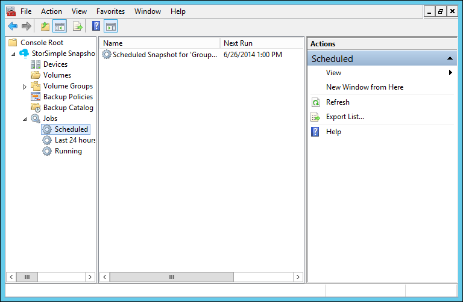
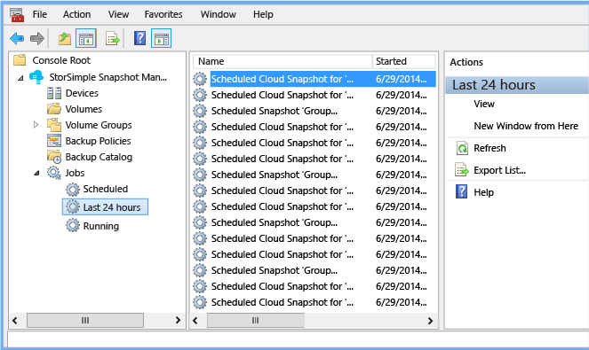
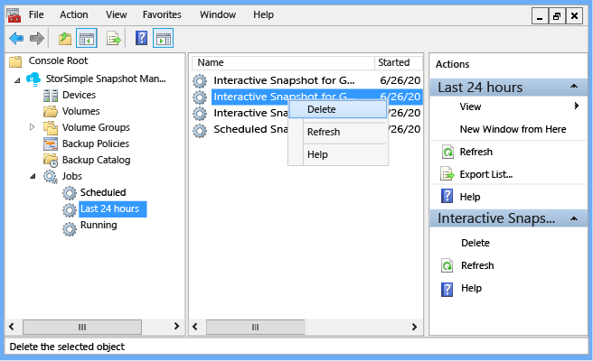
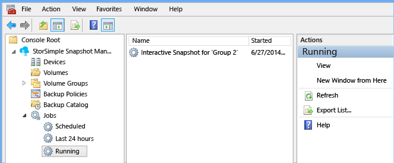

<properties 
   pageTitle="Use StorSimple Snapshot Manager to view and manage backup jobs | Microsoft Azure"
   description="Describes how to use the StorSimple Snapshot Manager MMC snap-in to view and manage scheduled, currently running, and completed backup jobs."
   services="storsimple"
   documentationCenter="NA"
   authors="SharS"
   manager="carolz"
   editor="" />
<tags 
   ms.service="storsimple"
   ms.devlang="NA"
   ms.topic="article"
   ms.tgt_pltfrm="NA"
   ms.workload="TBD"
   ms.date="08/17/2015"
   ms.author="v-sharos" />

# Use StorSimple Snapshot Manager to view and manage backup jobs

## Overview

The **Jobs** node in the **Scope** pane shows the **Scheduled**, **Last 24 hours**, and **Running** backup tasks that you initiated interactively or by a configured policy. 

This tutorial explains how you can use the **Jobs** node to display information about scheduled, recent, and currently running backup jobs. (The list of jobs and corresponding information appears in the **Results** pane.) Additionally, you can right-click a listed job and see a context menu that lists available actions.

## View scheduled jobs

Use the following procedure to view scheduled backup jobs.

#### To view scheduled jobs

1. Click the desktop icon to start StorSimple Snapshot Manager. 

2. In the **Scope** pane, expand the **Jobs** node, and click **Scheduled**. The following information appears in the **Results** pane:

    - **Name** – the name of the scheduled snapshot

    - **Next Run** – the date and time of the next scheduled snapshot

    - **Last Run** – the date and time of the most recent scheduled snapshot

    >[AZURE.NOTE] For one-time only snapshots, the **Next Run** and **Last Run** will be the same. 
 
     
 
3. To perform additional actions on a specific job, right-click the job name in the **Results** pane and select from the menu options.

## View recent jobs

Use the following procedure to view backup and restore jobs that were completed in the last 24 hours.

#### To view recent jobs

1. Click the desktop icon to start StorSimple Snapshot Manager.

2. In the **Scope** pane, expand the **Jobs** node, and click **Last 24 hours**. The **Results** pane shows backup jobs for the last 24 hours (to a maximum of 64 jobs). The following information appears in the **Results** pane, depending on the **View** options you specify:

    - **Name** – the name of the scheduled snapshot.
 
    - **Started** – the date and time when the snapshot began.

    - **Stopped** – the date and time when the snapshot finished or was terminated.

    - **Elapsed** – the amount of time between the **Started** and **Stopped** times.

    - **Status** – the state of the recently completed job. **Success** indicates that the backup was created successfully. **Failed** indicates that the job did not run successfully.

    - **Information** – the reason for the failure.

    - **Bytes processed (MB)** – the amount of data from the volume group that was processed (in MBs). 

     

3. To perform additional actions on a specific job, right-click the job name in the **Results** pane and select from the menu options.

     
     
## View currently running jobs

Use the following procedure to view jobs that are currently running.

#### To view currently running jobs

1. Click the desktop icon to start StorSimple Snapshot Manager.

2. In the **Scope** pane, expand the **Jobs** node, and click **Running**. Depending on the **View** options you specify, the following information appears in the **Results** pane: 

    - **Name** – the name of the scheduled snapshot.

    - **Started** – the date and time when the snapshot began.

    - **Checkpoint** – the current action of the backup.

    - **Status** – the percentage of completion.
    
    - **Elapsed** – the amount of time that has passed since the backup began. 

    - **Average throughput (MB)** – the median amount of data delivered, expressed in megabytes (MBs).

    - **Bytes processed (MB)** – the amount of data from the volume group that was processed (in MBs).

    - **Bytes written (MB)** – the amount of data that was written to the backup (in MBs).

    

3. To perform additional actions on a specific job, right-click the job name in the **Results** pane and select from the menu options.

## Next steps

[Use StorSimple Snapshot Manager to manage the backup catalog](storsimple-snapshot-manager-manage-backup-catalog.md).

            

 

