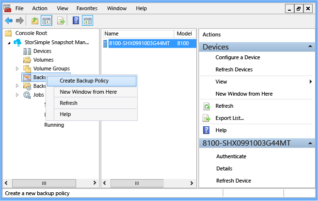
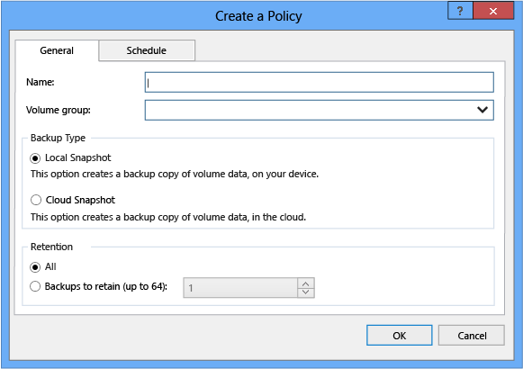
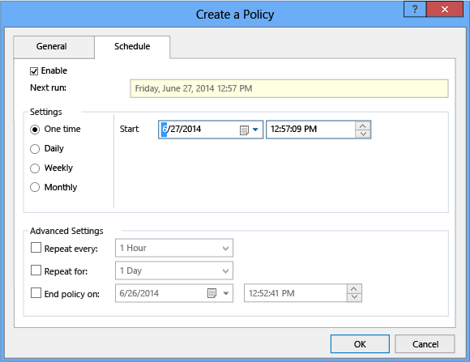
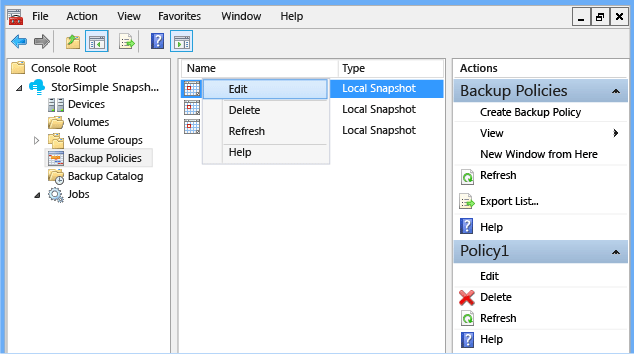
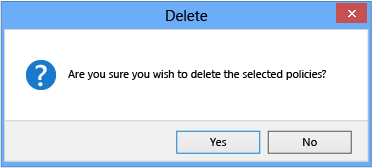

<properties 
   pageTitle="Use StorSimple Snapshot Manager to create and manage backup policies | Microsoft Azure"
   description="Describes how to use the StorSimple Snapshot Manager MMC snap-in to create and manage the backup policies that control scheduled backups."
   services="storsimple"
   documentationCenter="NA"
   authors="SharS"
   manager="carolz"
   editor="" />
<tags 
   ms.service="storsimple"
   ms.devlang="NA"
   ms.topic="article"
   ms.tgt_pltfrm="NA"
   ms.workload="TBD"
   ms.date="08/17/2015"
   ms.author="v-sharos" />

# Use StorSimple Snapshot Manager to create and manage backup policies

## Overview

A backup policy creates a schedule for backing up volume data locally or in the cloud. When you create a backup policy, you can also specify a retention policy. (You can retain a maximum of 64 snapshots.) For more information about backup policies, see [Backup types and backup policies](storsimple-what-is-snapshot-manager.md#backup-types-and-backup-policies).

This tutorial explains how to:

- Create a backup policy 
- Edit a backup policy 
- Delete a backup policy 

## Create a backup policy

Use the following procedure to create a new backup policy.

#### To create a backup policy

1. Click the desktop icon to start StorSimple Snapshot Manager.

2. In the **Scope** pane, right-click **Backup Policies**, and click **Create Backup Policy**.

    

    The **Create a Policy** dialog box appears. 

    

3. On the **General** tab, complete the following information:

   1. In the **Name** text box, type a name for the policy.

   2. In the** Volume group **text box, type the name of the volume group associated with the policy.

   3. Select either **Local Snapshot** or **Cloud Snapshot**.

   4. Select the number of snapshots to retain. If you select **All**, 64 snapshots will be retained (the maximum). 

4. Click the **Schedule** tab.

    

5. On the **Schedule** tab, complete the following information: 

   1. Click the **Enable** check box to schedule the next backup.

   2. Under **Settings**, select **One time**, **Daily**, **Weekly**, or **Monthly**. 

   3. In the **Start** text box, click the calendar icon and select a start date.

   4. Under **Advanced Settings**, you can set optional repeat schedules and an end date.

   5. Click **OK**.

After you create a backup policy, the following information appears in the **Results** pane:

- **Name** – the name of backup policy.

- **Type** – local snapshot or cloud snapshot.

- **Volume Group** – the volume group associated with the policy.

- **Retention** – the number of snapshots retained; the maximum is 64.

- **Created** – the date that this policy was created.

- **Enabled** – whether the policy is currently in effect: **True** indicates that it is in effect; **False** indicates that it is not in effect. 

## Edit a backup policy

Use the following procedure to edit an existing backup policy.

#### To edit a backup policy

1. Click the desktop icon to start StorSimple Snapshot Manager. 

2. In the **Scope** pane, click the **Backup Policies** node. All the backup policies appear in the **Results** pane. 

3. Right-click the policy that you want to edit, and then click **Edit**. 

     

4. When the **Create a Policy** window appears, enter your changes, and then click **OK**. 

## Delete a backup policy

Use the following procedure to delete a backup policy.

#### To delete a backup policy

1. Click the desktop icon to start StorSimple Snapshot Manager. 

2. In the **Scope** pane, click the **Backup Policies** node. All the backup policies appear in the **Results** pane. 

3. Right-click the backup policy that you want to delete, and then click **Delete**. 
e
4. When the confirmation message appears, click **Yes**.

    

## Next steps

[Use StorSimple Snapshot Manager to view and manage backup jobs](storsimple-snapshot-manager-manage-backup-jobs.md).