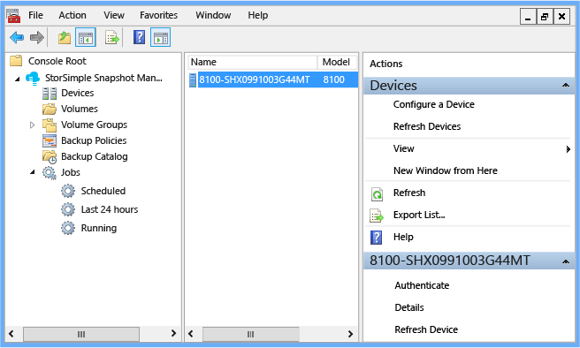
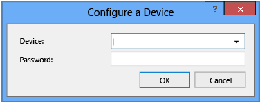
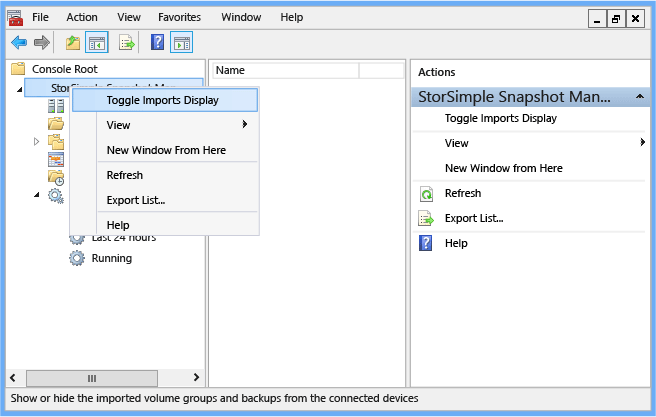
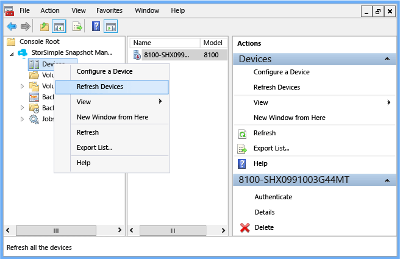
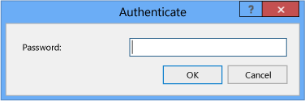
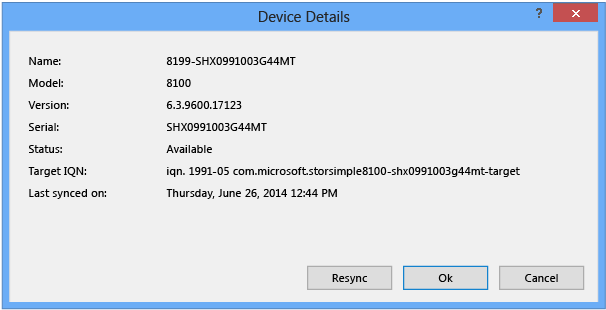
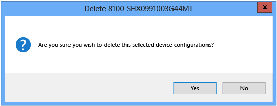

# Use StorSimple Snapshot Manager to connect and manage StorSimple devices
## Overview
You can use nodes in the StorSimple Snapshot Manager **Scope** pane to verify imported StorSimple device data and refresh connected storage devices. Additionally, when you click the **Devices** node, you can see a list of connected devices and corresponding status information in the **Results** pane.

**Figure 1: StorSimple Snapshot Manager connected device** 

Depending on your **View** selections, the **Results** pane shows the following information about each device. (For more information about configuring a view, go to [View menu](storsimple-use-snapshot-manager.md#view-menu).

| Results column | Description |
|:--- |:--- |
| Name |The name of the device as configured in the Azure classic portal |
| Model |The model number of the device |
| Version |The version of the software installed on the device |
| Status |Whether the device is available |
| Last Synced |Date and time when the device was last synchronized |
| Serial No. |The serial number for the device |

If you right-click the **Devices** node in the **Scope** pane, you can select from the following actions:

* Add or replace a device
* Connect a device and verify imports
* Refresh connected devices

If you click the **Devices** node and then right-click a device name in the **Results** pane, you can select from the following actions:

* Authenticate a device
* View device details
* Refresh a device
* Delete a device configuration
* Change a device password

> [!NOTE]
> All of these actions are also available in the **Actions** pane.

This tutorial explains how to use StorSimple Snapshot Manager to connect and manage devices and perform the following tasks:

* Add or replace a device
* Connect a device and verify imports
* Refresh connected devices
* Authenticate a device
* View device details
* Refresh an individual device
* Delete a device configuration
* Change an expired device password
* Replace a failed device

> [!NOTE]
> For general information about using the StorSimple Snapshot Manager interface, go to [StorSimple Snapshot Manager user interface](storsimple-use-snapshot-manager.md).

## Add or replace a device
Use the following procedure to add or replace a StorSimple device.

#### To add or replace a device
1. Click the desktop icon to start StorSimple Snapshot Manager.
2. In the **Scope** pane, right-click the **Devices** node, and then click **Configure a device**. The **Configure a Device** dialog box appears.
   
     
3. In the **Device** drop-down box, select the IP address of the device or virtual device. 
4. In the **Password** text box, type the StorSimple Snapshot Manager password that you created for the device in the Azure classic portal. Click **OK**. StorSimple Snapshot Manager searches for the device that you identified. 
   
   * If the device is available, StorSimple Snapshot Manager adds a connection.
   * If the device is unavailable for any reason, StorSimple Snapshot Manager returns an error message. Click **OK** to close the error message, and then click **Cancel** to close the **Configure a Device** dialog box.

## Connect a device and verify imports
Use the following procedure to connect a StorSimple device and verify that any existing volume groups that have associated backups are imported.

#### To connect a device and verify imports
1. To connect a device to StorSimple Snapshot Manager, follow the instructions in Add or replace a device. When it connects to a device, StorSimple Snapshot Manager responds as follows:
   
   * If the device is unavailable for any reason, StorSimple Snapshot Manager returns an error message. 
   
   * If the device is available, StorSimple Snapshot Manager adds a connection. When you select the device, it appears in the **Results** pane, and the status field indicates that the device is **Available**. StorSimple Snapshot Manager imports any volume groups configured for the device, provided that the volume groups have associated backups. Backup policies are not imported. Volume groups that do not have associated backups are not imported.
2. Click the desktop icon to start StorSimple Snapshot Manager.
3. Right-click the top node in the **Scope** pane, and then click **Toggle Imports Display**.
   
     
4. The **Toggle Imports Display** dialog box appears, showing the status of the imported volume groups and backups. Click **OK**.

After the volume groups and backups are successfully imported, you can use StorSimple Snapshot Manager to manage them, just as you would manage volume groups and backups that you created and configured with StorSimple Snapshot Manager. 

## Refresh connected devices
Use the following procedure to synchronize the connected StorSimple devices with StorSimple Snapshot Manager.

#### To refresh connected devices
1. Click the desktop icon to start StorSimple Snapshot Manager.
2. In the **Scope** pane, right-click **Devices**, and then click **Refresh Devices**. This synchronizes the connected devices with StorSimple Snapshot Manager so that you can view the volume groups and backups, including any recent additions. 
   
    

The **Refresh Devices** action retrieves any new volume groups and any associated backups from connected devices. Unlike the **Rescan volumes** action available for the **Volumes** node, **Refresh Devices** does not restore the backup registry.

## Authenticate a device
Use the following procedure to authenticate a StorSimple device with StorSimple Snapshot Manager.

#### To authenticate a device
1. Click the desktop icon to start StorSimple Snapshot Manager.
2. In the **Scope** pane, click **Devices**.
3. In the **Results** pane, right-click the name of the device, and then click **Authenticate**.
4. The **Authenticate** dialog box appears. Type the device password, and then click **OK**.
   
     

## View device details
Use the following procedure to view the details of a StorSimple device and, if necessary, resynchronize the device with StorSimple Snapshot Manager.

#### To view and resynchronize device details
1. Click the desktop icon to start StorSimple Snapshot Manager.
2. In the **Scope** pane, click **Devices**.
3. In the **Results** pane, right-click the name of the device, and then click **Details**.

4.The **Device Details** dialog box appears. This box shows the name, model, version, serial number, status, target iSCSI Qualified Name (IQN), and last synchronization date and time.

* Click **Resync** to synchronize the device.
* Click **OK** or **Cancel** to close the dialog box.
  
   

## Refresh an individual device
Use the following procedure to resynchronize an individual StorSimple device with StorSimple Snapshot Manager.

#### To refresh a device
1. Click the desktop icon to start StorSimple Snapshot Manager. 
2. In the **Scope** pane, click **Devices**. 
3. In the **Results** pane, right-click the name of the device, and then click **Refresh Device**. This synchronizes the device with StorSimple Snapshot Manager.

## Delete a device configuration
Use the following procedure to delete an individual StorSimple device configuration from StorSimple Snapshot Manager.

#### To delete a device configuration
1. Click the desktop icon to start StorSimple Snapshot Manager.
2. In the **Scope** pane, click **Devices**. 
3. In the **Results** pane, right-click the name of the device, and then click **Delete**. 
4. The following message appears. Click **Yes** to delete the configuration or click **No** to cancel the deletion.
   
    

## Change an expired device password
You must enter a password to authenticate a StorSimple device with StorSimple Snapshot Manager. You configure this password when you use the Windows PowerShell interface to set up the device. However, the password can expire. If this happens, you can use the Azure classic portal to change the password. Then, because the device was configured in StorSimple Snapshot Manager before the password expired, you must re-authenticate the device in StorSimple Snapshot Manager.

#### To change the expired password
1. In the Azure classic portal, start the StorSimple Manager service.
2. Click **Devices** > **Configure** for the device.
3. Scroll down to the StorSimple Snapshot Manager section. Enter a password that is 14-15 characters. Make sure that the password contains a mix of uppercase, lowercase, numeric, and special characters.
4. Re-enter the password to confirm it.
5. Click **Save** at the bottom of the page.

#### To re-authenticate the device
1. Start StorSimple Snapshot Manager.
2. In the **Scope** pane, click **Devices**. A list of configured devices appears in the **Results** pane.
3. Select the device, right-click, and then click **Authenticate**.
4. In the **Authenticate** window, enter the new password.
5. Select the device, right-click, and select **Refresh device**. This synchronizes the device with StorSimple Snapshot Manager.

## Replace a failed device
If a StorSimple device fails and is replaced by a standby (failover) device, use the following steps to connect to the new device and view the associated backups.

#### To connect to a new device after failover
1. Reconfigure the iSCSI connection to the new device. For instructions, go to "Step 7: Mount, initialize, and format a volume" in [Deploy your on-premises StorSimple device](storsimple-8000-deployment-walkthrough-u2.md).

> [!NOTE]
> If the new StorSimple device has the same IP address as the old one, you might be able to connect the old configuration.

1. Stop the Microsoft StorSimple Management Service:
   
   1. Start Server Manager.
   2. On the Server Manager Dashboard, on the **Tools** menu, select **Services**.
   3. On the **Services** window, select the **Microsoft StorSimple Management Service**.
   4. In the right pane, under **Microsoft StorSimple Management Service**, click **Stop the service**.
2. Remove the configuration information related to the old device:
   
   1. In File Explorer, browse to C:\ProgramData\Microsoft\StorSimple\BACatalog.
   2. Delete the files in the BACatalog folder.
3. Restart the Microsoft StorSimple Management Service:
   
   1. On the Server Manager Dashboard, on the **Tools** menu, select **Services**.
   2. On the **Services** window, select the **Microsoft StorSimple Management Service**.
   3. In the right pane, under **Microsoft StorSimple Management Service**, click **Restart the service**.
4. Start StorSimple Snapshot Manager.
5. To configure the new StorSimple device, complete the steps in Step 2: Connect a StorSimple device in [Deploy StorSimple Snapshot Manager](storsimple-snapshot-manager-deployment.md).
6. Right-click the top-level node in the **Scope** pane (StorSimple Snapshot Manager in the example), and then click **Toggle Imports Display**. 
7. A message appears when the imported volume groups and backups are visible in StorSimple Snapshot Manager. Click **OK**.

## Next steps
* Learn how to [use StorSimple Snapshot Manager to administer your StorSimple solution](storsimple-snapshot-manager-admin.md).
* Learn how to [use StorSimple Snapshot Manager to view and manage volumes](storsimple-snapshot-manager-manage-volumes.md).

