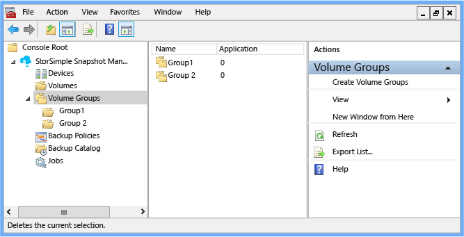
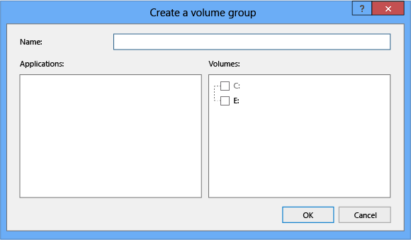
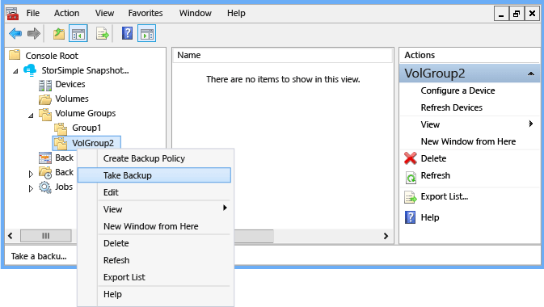
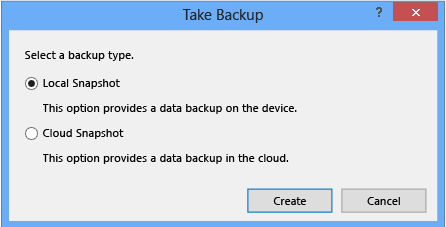

<properties 
   pageTitle="Use StorSimple Snapshot Manager to create and manage volume groups | Microsoft Azure"
   description="Describes how to use the StorSimple Snapshot Manager MMC snap-in to create and manage volume groups."
   services="storsimple"
   documentationCenter="NA"
   authors="SharS"
   manager="carolz"
   editor="" />
<tags 
   ms.service="storsimple"
   ms.devlang="NA"
   ms.topic="article"
   ms.tgt_pltfrm="NA"
   ms.workload="TBD"
   ms.date="08/17/2015"
   ms.author="v-sharos" />

# Use StorSimple Snapshot Manager to create and manage volume groups

## Overview

You can use the **Volume Groups** node on the **Scope** pane to assign volumes to volume groups, view information about a volume group, schedule backups, and edit volume groups. 

Volume groups are pools of related volumes used to ensure that backups are application-consistent. For more information, see [Volumes and volume groups](storsimple-what-is-snapshot-manager.md#volumes-and-volume-groups) and [Integration with Windows Volume Shadow Copy Service](storsimple-what-is-snapshot-manager.md#integration-with-windows-volume-shadow-copy-service).

>[AZURE.IMPORTANT] When you configure volume groups, do not mix cluster-shared volumes (CSVs) and non-CSVs in the same volume group. StorSimple Snapshot Manager does not support a mix of CSVs and non-CSVs in the same snapshot.
 

**Figure 1: StorSimple Snapshot Manager Volume Groups node** 

This tutorial explains how you can use StorSimple Snapshot Manager to:

- View information about your volume groups 
- Create a volume group
- Back up a volume group
- Edit a volume group
- Delete a volume group

All of these actions are also available on the **Actions** pane.
 
## View volume groups

If you click the **Volume Groups** node, the **Results** pane shows the following information about each volume group, depending on the column selections you make. (The columns in the **Results** pane are configurable. Right-click the **Volumes** node, select **View**, and then select **Add/Remove Columns**.)

Results column | Description 
:--------------|:------------ 
Name           | The **Name** column contains the name of the volume group.
Application    | The **Applications** column shows the number of VSS writers currently installed and running on the Windows host.
Selected       | The **Selected** column shows the number of volumes that are contained in the volume group. A zero (0) indicates that no application is associated with the volumes in the volume group.
Imported       | The **Imported** column shows the number of imported volumes. When set to **True**, this column indicates that a volume group was imported from the Microsoft Azure Management Portal and was not created in StorSimple Snapshot Manager.
 
>[AZURE.NOTE] StorSimple Snapshot Manager volume groups are also displayed on the **Backup Policies** tab in the Azure Management Portal.
 
## Create a volume group

Use the following procedure to create a volume group.

#### To create a volume group

1. Click the desktop icon to start StorSimple Snapshot Manager. 

2. In the **Scope** pane, right-click **Volume Groups**, and then click **Create Volume Group**. 

    
 
    The **Create a volume group** dialog box appears. 

     

3.  Enter the following information: 

    1. In the **Name** box, type a unique name for the new volume group. 

    2. In the **Applications** box, select applications associated with the volumes that you will be adding to the volume group. 

        The **Applications** box lists only those applications that use Azure StorSimple volumes and have VSS writers enabled for them. A VSS writer is enabled only if all the volumes that the writer is aware of are Azure StorSimple volumes. If the Applications box is empty, then no applications that use Azure StorSimple volumes and have supported VSS writers are installed. (Currently, Azure StorSimple supports Microsoft Exchange and SQL Server.) For more information about VSS writers, see [Integration with Windows Volume Shadow Copy Service](storsimple-what-is-snapshot-manager.md#integration-with-windows-volume-shadow-copy-service).

        If you select an application, all volumes associated with it are automatically selected. Conversely, if you select volumes associated with a specific application, the application is automatically selected in the **Applications** box. 

    3. In the **Volumes** box, select Azure StorSimple volumes to add to the volume group. 

      - You can include volumes with single or multiple partitions. (Multiple partition volumes can be dynamic disks or basic disks with multiple partitions.) A volume that contains multiple partitions is treated as a single unit. Consequently, if you add only one of the partitions to a volume group, all the other partitions are automatically added to that volume group at the same time. After you add a multiple partition volume to a volume group, the multiple partition volume continues to be treated as a single unit.

      - You can create empty volume groups by not assigning any volumes to them. 

      - Do not mix cluster-shared volumes (CSVs) and non-CSVs in the same volume group. StorSimple Snapshot Manager does not support a mix of CSV volumes and non-CSV volumes in the same snapshot. 

4. Click **OK** to save the volume group.

## Back up a volume group

Use the following procedure to back up a volume group.

#### To back up a volume group

1. Click the desktop icon to start StorSimple Snapshot Manager.

2. In the **Scope** pane, expand the **Volume Groups** node, right-click a volume group name, and then click **Take Backup**. 

    

3. In the **Take Backup** dialog box, select **Local Snapshot** or **Cloud Snapshot**, and then click **Create**. 

     

4. To confirm that the backup is running, expand the **Jobs** node, and then click **Running**. The backup should be listed.

5. To view the completed snapshot, expand the **Backup Catalog** node, expand the volume group name, and then click **Local Snapshot** or **Cloud Snapshot**. The backup will be listed if it finished successfully. 

## Edit a volume group

Use the following procedure to edit a volume group.

#### To edit a volume group

1. Click the desktop icon to start StorSimple Snapshot Manager.

2. In the **Scope** pane, expand the **Volume Groups** node, right-click a volume group name, and then click **Edit**. 

3. The **Create a volume group **dialog box appears. You can change the **Name**, **Applications**, and **Volumes** entries. 

4. Click **OK** to save your changes.

## Delete a volume group

Use the following procedure to delete a volume group. 

>[AZURE.WARNING] This also deletes all backups associated with the volume group.

#### To delete a volume group

1. Click the desktop icon to start StorSimple Snapshot Manager. 

2. In the **Scope** pane, expand the **Volume Groups** node, right-click a volume group name, and then click **Delete**. 

3. The **Delete Volume Group** dialog box appears. Type **Confirm** in the text box, and then click **OK**. 

    The deleted volume group vanishes from the list in the **Results** pane and all backups that are associated with that volume group are deleted from the backup catalog.

## Next steps

[Use StorSimple Snapshot Manager to create and manage backup policies](storsimple-snapshot-manager-manage-backup-policies.md).
