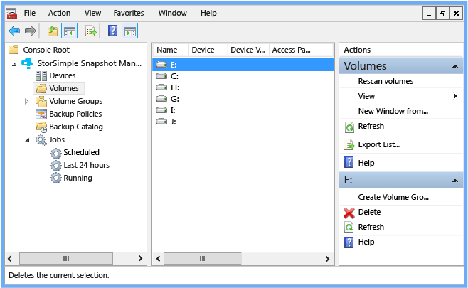
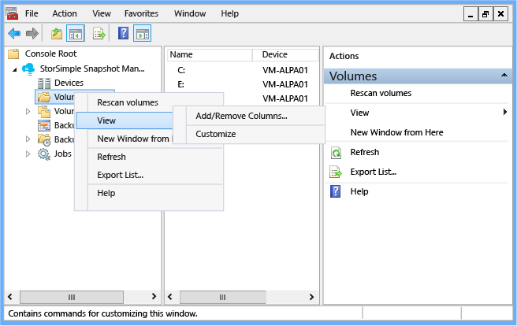
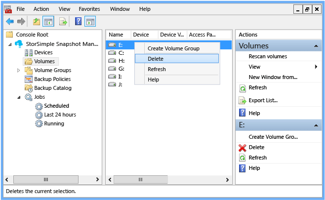
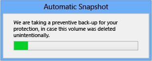
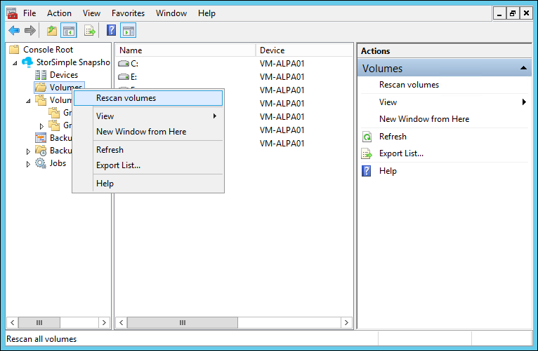
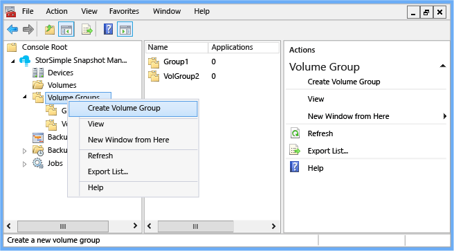
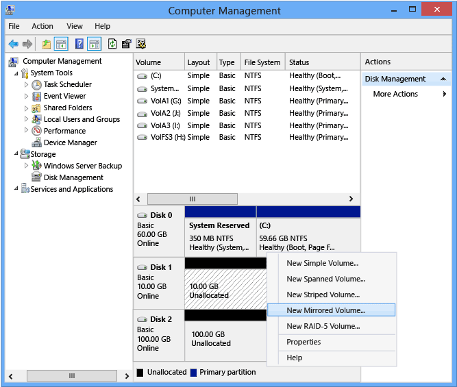
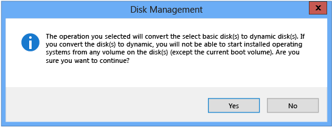
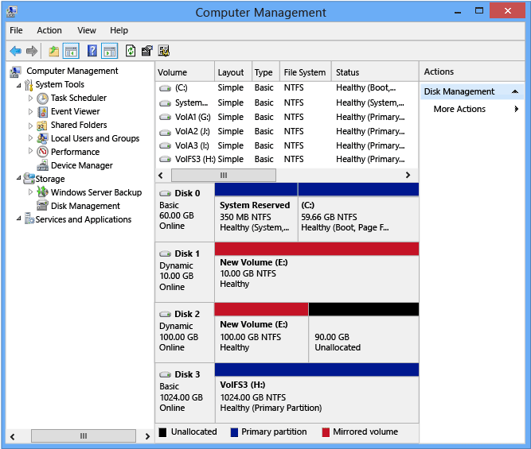

# Use StorSimple Snapshot Manager to view and manage volumes
## Overview
You can use the StorSimple Snapshot Manager **Volumes** node (on the **Scope** pane) to select volumes and view information about them. The volumes are presented as drives that correspond to the volumes mounted by the host. The **Volumes** node shows local volumes and volume types that are supported by StorSimple, including volumes discovered through the use of iSCSI and a device. 

For more information about supported volumes, go to [Support for multiple volume types](storsimple-what-is-snapshot-manager.md#support-for-multiple-volume-types).

The **Volumes** node also lets you rescan or delete volumes after StorSimple Snapshot Manager discovers them. 

This tutorial explains how you can mount, initialize, and format volumes and then use StorSimple Snapshot Manager to:

* View information about volumes 
* Delete volumes
* Rescan volumes 
* Configure a basic volume and back it up
* Configure a dynamic mirrored volume and back it up

> [!NOTE]
> All of the **Volume** node actions are also available in the **Actions** pane.
> 
> 

## Mount volumes
Use the following procedure to mount, initialize, and format StorSimple volumes. This procedure uses Disk Management, a system utility for managing hard disks and the corresponding volumes or partitions. For more information about Disk Management, go to [Disk Management](https://technet.microsoft.com/library/cc770943.aspx) on the Microsoft TechNet website.

#### To mount volumes
1. On your host computer, start the Microsoft iSCSI initiator.
2. Supply one of the interface IP addresses as the target portal or discovery IP address, and connect to the device. After the device is connected, the volumes will be accessible to your Windows system. For more information about using the Microsoft iSCSI initiator, go to the section “Connecting to an iSCSI target device” in [Installing and Configuring Microsoft iSCSI Initiator][1].
3. Use any of the following options to start Disk Management:
   
   * Type Diskmgmt.msc in the **Run** box.
   * Start Server Manager, expand the **Storage** node, and then select **Disk Management**.
   * Start **Administrative Tools**, expand the **Computer Management** node, and then select **Disk Management**. 
     
     > [!NOTE]
     > You must use administrator privileges to run Disk Management.
     > 
     > 
4. Take the volume(s) online:
   
   1. In Disk Management, right-click any volume marked **Offline**.
   2. Click **Reactivate Disk**. The disk should be marked **Online** after the disk is reactivated.
5. Initialize the volume(s):
   
   1. Right-click the discovered volumes.
   2. On the menu, select **Initialize Disk**.
   3. In the **Initialize Disk** dialog box, select the disks that you want to initialize, and then click **OK**.
6. Format simple volumes:
   
   1. Right-click a volume that you want to format.
   2. On the menu, select **New Simple Volume**.
   3. Use the New Simple Volume wizard to format the volume:
      
      * Specify the volume size.
      * Supply a drive letter.
      * Select the NTFS file system.
      * Specify a 64 KB allocation unit size.
      * Perform a quick format.
7. Format multi-partition volumes. For instructions, go to the section, "Partitions and Volumes" in [Implementing Disk Management](https://msdn.microsoft.com/library/dd163556.aspx).

## View information about your volumes
Use the following procedure to view information about local and Azure StorSimple volumes.

#### To view volume information
1. Click the desktop icon to start StorSimple Snapshot Manager. 
2. In the **Scope** pane, click the **Volumes** node. A list of local and mounted volumes, including all Azure StorSimple volumes, appears in the **Results** pane. The columns in the **Results** pane are configurable. (Right-click the **Volumes** node, select **View**, and then select **Add/Remove Columns**.)
   
    
   
   | Results column | Description |
   |:--- |:--- |
   |  Name |The **Name** column contains the drive letter assigned to each discovered volume. |
   |  Device |The **Device** column contains the IP address of the device connected to the host computer. |
   |  Device Volume Name |The **Device Volume Name** column contains the name of the device volume to which the selected volume belongs. This is the volume name defined in the Azure portal for that specific volume. |
   |  Access Paths |The **Access Paths** column displays the access path to the volume. This is the drive letter or mount point at which the volume is accessible on the host computer. |

## Delete a volume
Use the following procedure to delete a volume from StorSimple Snapshot Manager.

> [!NOTE]
> You cannot delete a volume if it is a part of any volume group. (The delete option is not available for volumes that are members of a volume group.) You must delete the entire volume group to delete the volume.

#### To delete a volume
1. Click the desktop icon to start StorSimple Snapshot Manager.
2. In the **Scope** pane, click the **Volumes** node. 
3. In the **Results** pane, right-click the volume that you want to delete.
4. On the menu, click **Delete**. 
   
     
5. The **Delete Volume** dialog box appears. Type **Confirm** in the text box, and then click **OK**.
6. By default, StorSimple Snapshot Manager backs up a volume before deleting it. This precaution can protect you from data loss if the deletion was unintentional. StorSimple Snapshot Manager displays an **Automatic Snapshot** progress message while it backs up the volume. 
   
     

## Rescan volumes
Use the following procedure to rescan the volumes connected to StorSimple Snapshot Manager.

#### To rescan the volumes
1. Click the desktop icon to start StorSimple Snapshot Manager.
2. In the **Scope** pane, right-click **Volumes**, and then click **Rescan volumes**.
   
    
   
    This procedure synchronizes the volume list with StorSimple Snapshot Manager. Any changes, such as new volumes or deleted volumes, will be reflected in the results.

## Configure and back up a basic volume
Use the following procedure to configure a backup of a basic volume, and then either start a backup immediately or create a policy for scheduled backups.

### Prerequisites
Before you begin:

* Make sure that the StorSimple device and host computer are configured correctly. For more information, go to [Deploy your on-premises StorSimple device](storsimple-deployment-walkthrough-u2.md).
* Install and configure StorSimple Snapshot Manager. For more information, go to [Deploy StorSimple Snapshot Manager](storsimple-snapshot-manager-deployment.md).

#### To configure backup of a basic volume
1. Create a basic volume on the StorSimple device.
2. Mount, initialize, and format the volume as described in [Mount volumes](#mount-volumes). 
3. Click the StorSimple Snapshot Manager icon on your desktop. The StorSimple Snapshot Manager window appears. 
4. In the **Scope** pane, right-click the **Volumes** node, and then select **Rescan volumes**. When the scan is finished, a list of volumes should appear in the **Results** pane. 
5. In the **Results** pane, right-click the volume, and then select **Create Volume Group**. 
   
     
6. In the **Create Volume Group** dialog box, type a name for the volume group, assign volumes to it, and then click **OK**.
7. In the **Scope** pane, expand the **Volume Groups** node. The new volume group should appear under the **Volume Groups** node. 
8. Right-click the volume group name.
   
   * To start an interactive (on-demand) backup job, click **Take Backup**. 
   * To schedule an automatic backup, click **Create Backup Policy**. On the **General** page, select a volume group from the list. On the **Schedule** page, enter the schedule details. When you are finished, click **OK**. 
9. To confirm that the backup job has started, expand the **Jobs** node in the **Scope** pane, and then click the **Running** node. The list of currently running jobs appears in the **Results** pane. 

## Configure and back up a dynamic mirrored volume
Complete the following steps to configure backup of a dynamic mirrored volume:

* Step 1: Use Disk Management to create a dynamic mirrored volume. 
* Step 2: Use StorSimple Snapshot Manager to configure backup.

### Prerequisites
Before you begin:

* Make sure that the StorSimple device and host computer are configured correctly. For more information, go to [Deploy your on-premises StorSimple device](storsimple-8000-deployment-walkthrough-u2.md).
* Install and configure StorSimple Snapshot Manager. For more information, go to [Deploy StorSimple Snapshot Manager](storsimple-snapshot-manager-deployment.md).
* Configure two volumes on the StorSimple device. (In the examples, the available volumes are **Disk 1** and **Disk 2**.) 

### Step 1: Use Disk Management to create a dynamic mirrored volume
Disk Management is a system utility for managing hard disks and the volumes or partitions that they contain. For more information about Disk Management, go to [Disk Management](https://technet.microsoft.com/library/cc770943.aspx) on the Microsoft TechNet website.

#### To create a dynamic mirrored volume
1. Use any of the following options to start Disk Management: 
   
   * Open the **Run** box, type **Diskmgmt.msc**, and press Enter.
   * Start Server Manager, expand the **Storage** node, and then select **Disk Management**. 
   * Start **Administrative Tools**, expand the **Computer Management** node, and then select **Disk Management**. 
2. Make sure that you have two volumes available on the StorSimple device. (In the example, the available volumes are **Disk 1** and **Disk 2**.) 
3. In the Disk Management window, in the right column of the lower pane, right-click **Disk 1** and select **New Mirrored Volume**. 
   
     
4. On the **New Mirrored Volume** wizard page, click **Next**.
5. On the **Select Disks** page, select **Disk 2** in the **Selected** pane, click **Add**, and then click **Next**. 
6. On the **Assign Drive Letter or Path** page, accept the defaults, and then click **Next**. 
7. On the **Format Volume** page, in the **Allocation Unit Size** box, select **64K**. Select the **Perform a quick format** check box, and then click **Next**. 
8. On the **Completing the New Mirrored Volume** page, review your settings, and then click **Finish**. 
9. A message appears to indicate that the basic disk will be converted to a dynamic disk. Click **Yes**.
   
     
10. In Disk Management, verify that Disk 1 and Disk 2 are shown as dynamic mirrored volumes. (**Dynamic** should appear in the status column, and the capacity bar color should change to red, indicating a mirrored volume.) 
    
     

### Step 2: Use StorSimple Snapshot Manager to configure backup
Use the following procedure to configure a dynamic mirrored volume, and then either start a backup immediately or create a policy for scheduled backups.

#### To configure backup of a dynamic mirrored volume
1. Click the StorSimple Snapshot Manager icon on your desktop. The StorSimple Snapshot Manager window appears. 
2. In the **Scope** pane, right-click the **Volumes** node and select **Rescan volumes**. When the scan is finished, a list of volumes should appear in the **Results** pane. The dynamic mirrored volume is listed as a single volume. 
3. In the **Results** pane, right-click the dynamic mirrored volume, and then click **Create Volume Group**. 
4. In the **Create Volume Group** dialog box, type a name for the volume group, assign the dynamic mirrored volume to this group, and then click **OK**. 
5. In the **Scope** pane, expand the **Volume Groups** node. The new volume group should appear under the  **Volume Groups** node. 
6. Right-click the volume group name. 
   
   * To start an interactive (on-demand) backup job, click **Take Backup**. 
   * To schedule an automatic backup, click **Create Backup Policy**. On the **General** page, select the volume group from the list. On the **Schedule** page, enter the schedule details. When you are finished, click **OK**. 
7. You can monitor the backup job as it runs. In the **Scope** pane, expand the **Jobs** node, and then click **Running**, The job details appear in the **Results** pane. When the backup job is finished, the details are transferred to the **Last 24** hours job list. 

## Next steps
* Learn how to [use StorSimple Snapshot Manager to administer your StorSimple solution](storsimple-snapshot-manager-admin.md).
* Learn how to [use StorSimple Snapshot Manager to create and manage volume groups](storsimple-snapshot-manager-manage-volume-groups.md).

<!--Reference links-->
[1]: https://msdn.microsoft.com/library/ee338480(v=ws.10).aspx
