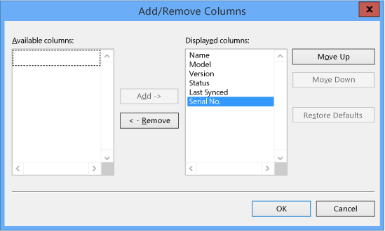
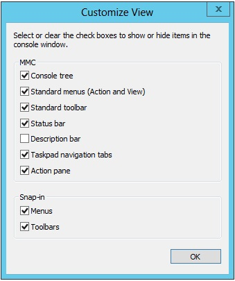
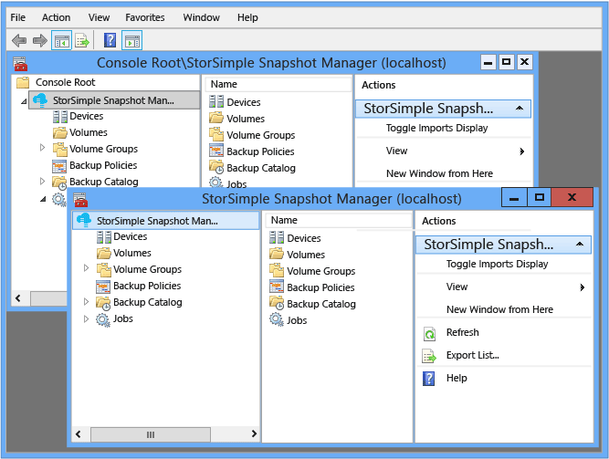
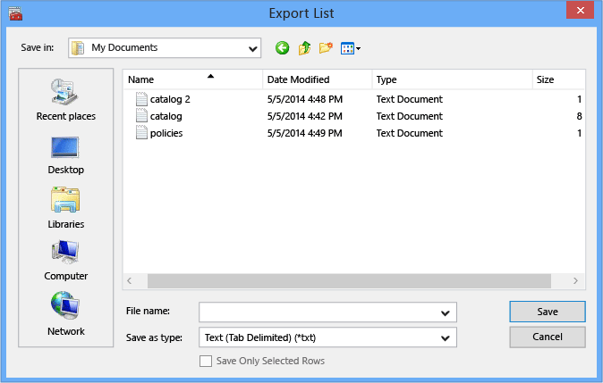

# Use the MMC menu actions in StorSimple Snapshot Manager

## Overview
In StorSimple Snapshot Manager, you will see the following actions listed on all action menus and all variations of the **Actions** pane.

* View
* New Window from Here 
* Refresh 
* Export List 
* Help 

These actions are part of the Microsoft Management Console (MMC) and are not specific to StorSimple Snapshot Manager. This tutorial describes these actions and explains how to use each of them in StorSimple Snapshot Manager.

## View
You can use the **View** option to change the **Results** pane view and to change the console window view. 

#### To change the Results pane view
1. Click the desktop icon to start StorSimple Snapshot Manager.
2. In the **Scope** pane, right-click any node or expand the node and right-click an item in the **Results** pane, and then click the **View** option. 
3. To add or remove the columns that appear in the **Results** pane, click **Add/Remove Columns**. The **Add/Remove Columns** dialog box appears.
   
     
4. Complete the form as follows:
   
   * Select items from the **Available** columns list and click **Add** to add them to the **Displayed columns** list. 
   * Click items in the **Displayed columns** list, and click **Remove** to remove them from the list. 
   * Select an item in the **Displayed** columns list and click **Move Up** or **Move Down** to move the item up or down in the list. 
   * Click **Restore Defaults** to return to the default **Results** pane configuration. 
5. When you are finished with your selections, click **OK**. 

#### To change the console window view
1. Click the desktop icon to start StorSimple Snapshot Manager.
2. In the **Scope** pane, right-click any node, click **View**, and then click **Customize**. The **Customize** dialog box appears.
   
     
3. Select or clear the check boxes to show or hide items in the console window. When you are finished with your selections, click **OK**.

## New Window from Here
You can use the **New Window from Here** option to open a new console window.

#### To open a new console window
1. Click the desktop icon to start StorSimple Snapshot Manager.
2. In the **Scope** pane, right-click any node, and then click **New Window from Here**. 
   
    A new window appears, showing only the scope that you selected. For example, if you right-click the **Backup Policies** node, the new window will show only the **Backup Policies** node in the **Scope** pane and a list of defined backup policies in the **Results** pane. See the following example.
   
     

## Refresh
You can use the **Refresh** action to update the console window.

#### To update the console window
1. Click the desktop icon to start StorSimple Snapshot Manager.
2. In the **Scope** pane, right-click any node or expand the node and right-click an item in the **Results** pane, and then click **Refresh**. 

## Export List
You can use the **Export List** action to save a list in a comma-separated value (CSV) file. For example, you can export the list of backup policies or the backup catalog. You can then import the CSV file into a spreadsheet application for analysis.

#### To save a list in a comma-separated value (CSV) file
1. Click the desktop icon to start StorSimple Snapshot Manager. 
2. In the **Scope** pane, right-click any node or expand the node and right-click an item in the **Results** pane, and then click **Export List**. 
3. The **Export List** dialog box appears. Complete the form as follows: 
   
   1. In the **File name** box, type a name for the CSV file or click the arrow to select from the drop-down list.
   2. In the **Save as type** box, click the arrow and select a file type from the drop-down list.
   3. To save only selected items, select the rows and then click the **Save Only Selected Rows** check box. To save all exported lists, clear the **Save Only Selected Rows** check box.
   4. Click **Save**.
      
       

## Help
You can use the **Help** menu to view available online help for StorSimple Snapshot Manager and the MMC.

#### To view available online help
1. Click the desktop icon to start StorSimple Snapshot Manager.
2. In the **Scope** pane, right-click any node or expand the node and right-click an item in the **Results** pane, and then click **Help**. 

## Next steps
* Learn more about the [StorSimple Snapshot Manager user interface](storsimple-use-snapshot-manager.md).
* Learn more about [using StorSimple Snapshot Manager to administer your StorSimple solution](storsimple-snapshot-manager-admin.md).

