<properties 
   pageTitle="StorSimple Snapshot Manager user interface | Microsoft Azure"
   description="Describes the StorSimple Snapshot Manager user interface and explains how to use it to manage backup jobs and the backup catalog."
   services="storsimple"
   documentationCenter="NA"
   authors="SharS"
   manager="carolz"
   editor="" />
<tags 
   ms.service="storsimple"
   ms.devlang="NA"
   ms.topic="article"
   ms.tgt_pltfrm="NA"
   ms.workload="TBD"
   ms.date="08/18/2015"
   ms.author="v-sharos" />

# StorSimple Snapshot Manager user interface

## Overview

The StorSimple Snapshot Manager has an intuitive graphical user interface (GUI) that you can use to manage backup copies of volume groups, including those stored locally and in the cloud. This tutorial provides an introduction to the interface, and then explains how to use each of the components. (For a detailed description of the StorSimple Snapshot Manager, see [What is StorSimple Snapshot Manager?](storsimple-what-is-snapshot-manager.md)

### Console description

To view the user interface, click the StorSimple Snapshot Manager icon on your desktop. The console window appears, as shown in the following illustration.

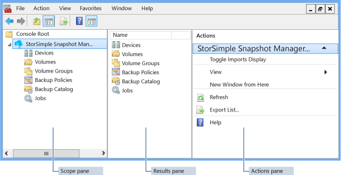

**Figure 1: StorSimple Snapshot Manager UI**

The console window has five major elements. Click the appropriate link for a complete description of each element.

- [Menu bar](#menu-bar) 
- [Tool bar](#tool-bar) 
- [Scope pane](#scope-pane) 
- [Results pane](#results-pane) 
- [Actions pane](#actions-pane) 

Additionally, the StorSimple Snapshot Manager supports [keyboard navigation and a number of shortcuts](#keyboard-navigation-and-shortcuts).

### Console accessibility

The StorSimple Snapshot Manager user interface supports the accessibility features provided by the Windows operating system and the Microsoft Management Console (MMC), as well as some StorSimple Snapshot Manager–specific keyboard shortcuts. 

- For a description of the Windows accessibility features, go to [Keyboard shortcuts for Windows](https://support.microsoft.com/kb/126449). 

- For a description of the MMC accessibility features, go to [Accessibility for MMC 3.0](https://technet.microsoft.com/library/cc766075.aspx)

- For a description of the StorSimple Snapshot Manager accessibility features, go to [Keyboard navigation and shortcuts](#keyboard-navigation-and-shortcuts).

## Menu bar

The menu bar at the top of the console window contains [File](#file-menu), [Action](#action-menu), [View](#view-menu), [Favorites](#favorites-menu), [Window](#window-menu), and [Help](#help-menu) menus.

Click any item on the menu bar to see a list of available commands on that menu. The following example shows the **View** menu selected on the menu bar.

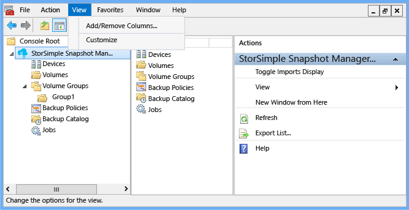

**Figure 2: StorSimple Snapshot Manager menu bar with View selected**

### File menu

The **File** menu contains standard Microsoft Management Console (MMC) commands.

#### Menu access

To view the **File** menu, click **File** on the menu bar. The following menu appears.

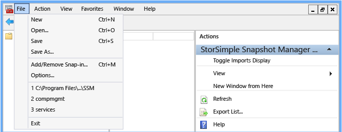 

**Figure 3: StorSimple Snapshot Manager File menu**

#### Menu description

The following table describes items that appear on the **File** menu.

| Menu item | Description |
|:----------|:-------------|
| New       | Click **New** to create a new console based on the StorSimple Snapshot Manager. |
| Open      | Click **Open** to open an existing console. |
| Save      | Click **Save** to save the current console. |
| Save as   | Click **Save As** to create a new, renamed instance of the current console. Use the **Save As** option to customize a view and save it for later retrieval. For example, you could create StorSimple Snapshot Manager snap-ins that point to specific servers. |
| Add/Remove Snap-in | Click **Add/Remove Snap-in** to add or remove snap-ins and to organize nodes in the **Scope** pane. For more information, go to [Add, Remove, and Organize Snap-ins and Extensions in MMC 3.0](https://technet.microsoft.com/library/cc722035.aspx). |
| Options   | Click **Options** to change the console icon, specify user access modes and permissions, or delete console files to increase available disk space. |
| List of file paths | Click a path in the numbered list to reopen a file that you recently opened. |
| Exit      | Click **Exit** to close the **File** menu. |
 
### Action menu

Use the **Action** menu to select from available actions. The items available to you depend on the selection you make in the **Scope** pane or **Results** pane.

#### Menu access

To view the **Action** menu, do one of the following:

- Right-click an item in the **Scope** pane or **Results** pane.

- Select an item in the **Scope** pane or **Results** pane, and then click **Action** on the menu bar. 

For example, if you select the top node in the **Scope** pane, and then right-click or click **Action** in the menu bar, the following menu appears.
 
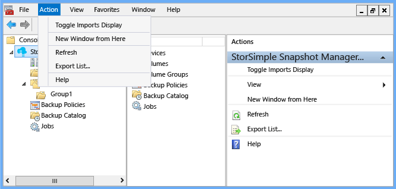

**Figure 4: StorSimple Snapshot Manager Action menu**

The **Actions** pane (on the right of the console) contains the same list of actions as the **Action** menu. Additionally, the **Actions** pane contains the **View** menu options, which enable you to create a custom view of the **Results** pane.

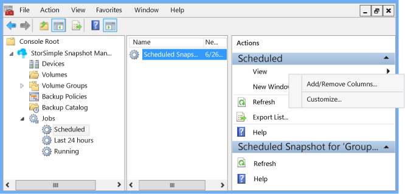

**Figure 5: StorSimple Snapshot Manager Actions pane with View menu** 

#### Menu description

The following table contains an alphabetical list of StorSimple Snapshot Manager actions. 

- The **Action** column lists actions that you can perform on nodes and results. 

- The **Navigation** column explains how to display the appropriate **Action** menu so that you can select the action. Some actions appear in multiple **Action** menus. For these actions, select one **Navigation** option from the bulleted list. 

- The **Description** column describes how to use each action on the **Action** menu or Actions pane, and explains what it does.

>[AZURE.NOTE] The **Actions** pane and **Action** menus contain additional options, such as **View**, **New Window from here**, **Refresh**, **Export List**, and **Help**. These options are available as a part of the MMC, and are not specific to StorSimple Snapshot Manager. The table includes descriptions of these options.
 
| Action  | Navigation  | Description  |
|:--------|:------------|:-------------|
| Authenticate | Click the **Devices** node, and right-click a device in the **Results** pane. | Click **Authenticate** to enter the password that you configured for the device. |
| Clone  | Expand **Backup Catalog**, expand **Cloud Snapshots**, click a dated backup, and then select a volume in the **Results** pane. | Click **Clone** to create a copy of a cloud snapshot and store it in a location that you designate. |
| Configure a Device | Right-click the **Devices** node. | Click **Configure a Device** to configure a single device or multiple devices to connect to the Windows host. |
| Create Backup Policy | Do one of the following:<ul><li>Right-click **Backup Policies**.</li><li>Click or expand **Volume Groups**, and then right-click a volume group.</li><li>Click or expand **Backup Catalog**, and then right-click a volume group.</li></ul> | Click **Create Backup Policy** to configure a scheduled backup for a volume group. |
| Create Volume Group | Do one of the following:<ul><li>Click the **Volumes** node, and then right-click a volume in the **Results** pane.</li><li>Right-click the **Volume Groups** node.</li></ul> | Click **Create Volume Group** to assign volumes to a volume group. |
| Delete | Click a node or result (This item appears on many **Action** menus and  **Actions** panes.) | Click **Delete** to delete the node or result that you selected. When the confirmation dialog box appears, confirm or cancel the deletion. |
| Details | Click the **Devices** node, and then right-click a device in the **Results** pane. | Click **Details** to see the configuration details for a device. |
| Edit | Click **Backup Policies**, and then right-click a policy in the **Results** pane. | Click **Edit** to change the backup schedule for a volume group. |
| Export List | Click any node or result (This item appears on all **Action** menus and **Actions** panes.) | Click **Export List** to save a list in a comma-separated value (CSV) file. You can then import this file into a spreadsheet application for analysis. |
| Help | Click any node or result. (This item appears on all **Action** menus and **Actions** panes.) | Click **Help** to open online Help in a separate browser window. |
| New Window from Here | Click any node or result (This item appears on all **Action** menus and **Actions** panes.) | Click **New Window from Here** to open a new StorSimple Snapshot Manager window.|
| Refresh | Click any node or result (This item appears on all **Action** menus and **Actions** panes.) | Click **Refresh** to update the currently displayed StorSimple Snapshot Manager window. |
| Refresh Device | Click the **Devices** node, and right-click a device in the **Results** pane. | Click **Refresh Device** to synchronize a specific connected device with StorSimple Snapshot Manager. |
| Refresh Devices | Right-click the **Devices** node. | Click **Refresh Devices** to synchronize your list of connected devices with StorSimple Snapshot Manager. |
| Rescan volumes | Right-click the **Volumes** node. | Click **Rescan volumes** to update the list of volumes that appears in the **Results** pane. |
| Restore | Expand **Backup Catalog**, expand a volume group, expand **Local Snapshots** or **Cloud Snapshots**, and then right-click a backup. | Click **Restore** to replace the current volume group data with the data from the selected backup. |
| Take Backup | Do one of the following:<ul><li>Expand **Volume Groups**, and then right-click a volume group.</li><li>Expand **Backup Catalog**, and then right-click a volume group.</li></ul> | Click **Take Backup** to start a backup job immediately. |
| Toggle Imports Display | Right-click the top node in the **Scope** pane (the **StorSimple Snapshot Manager** node in the examples). | Click **Toggle Imports Display** to show or hide the volume groups and associated backups that were imported from the StorSimple Manager service dashboard. |

### View menu

Use the **View** menu to create a custom view of the **Results** pane contents. The **View** menu contains **Add/Remove Columns** and **Customize** options.

#### Menu access

You can access the **View** menu on the menu bar or in the **Actions** pane.

 

**Figure 6: StorSimple Snapshot Manager View menu**

#### Menu description

The following table describes items that appear on the **View** menu.

| Menu item  | Description |
|:-----------|:-------------|
| Add/Remove Columns | Click **Add/Remove Columns** to add or remove columns in the **Results** pane. |
| Customize | Click **Customize** to show or hide items in the StorSimple Snapshot Manager console window. |

### Favorites menu

Use the **Favorites** menu to add, remove, and organize page views and tasks that you use frequently. 

#### Menu access

You can access the **Favorites** menu on the menu bar.

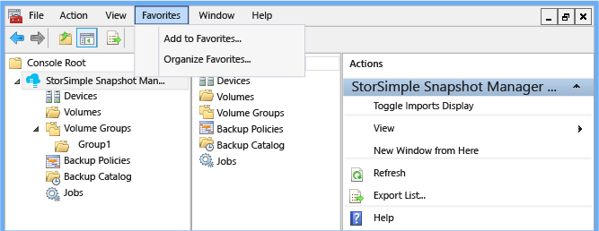

**Figure 7: StorSimple Snapshot Manager Favorites menu**

#### Menu description

The following table describes items that appear on the **Favorites** menu.

| Menu item |  Description |
|:----------|:-------------|
| Add to Favorites | Click **Add to Favorites** to add the current view to your list of favorites. |
| Organize Favorites | Click **Organize Favorites** to organize the contents of your Favorites folder. |

### Window menu

Use the **Window** menu to add and rearrange StorSimple Snapshot Manager console windows.

#### Menu access

You can access the **Window** menu on the menu bar.

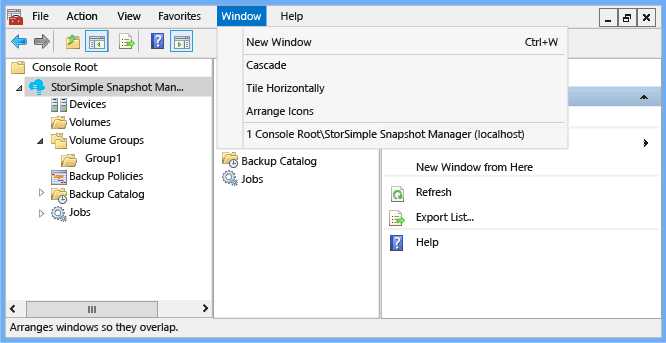

**Figure 8: StorSimple Snapshot Manager Window menu** 

The numbered list at the bottom of the menu shows the windows that are currently open. Click any window in that list to bring the window into the foreground. 

#### Menu description

The following table describes the items that appear on the Window menu.

| Menu item  | Description |
|:-----------|:-------------|
| New Window | Click **New Window** to open a new console window (in addition to the existing window). |
| Cascade   | Click **Cascade** to display the open console windows in a cascading style. |
| Tile Horizontally | Click **Tile Horizontally** to display the open console windows in a tile (or grid) format. |
| Arrange Icons | If you have multiple console windows open and scattered over your desktop, minimize them and then click **Arrange Icons** to arrange them in a horizontal row on the bottom of your screen. |

### Help menu

Use the **Help** menu to view available online help for StorSimple Snapshot Manager and the MMC. You can also view information about the MMC and StorSimple Snapshot Manager software versions that are currently installed on your system. 

You can access the **Help** menu on the menu bar. You can also access StorSimple Snapshot Manager help topics from the **Actions** pane.

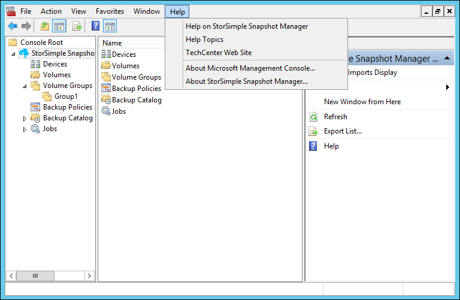

**Figure 9: StorSimple Snapshot Manager Help menu** 

#### Menu description

The following table describes items that appear on the Help menu.

| Menu item  | Description  |
|:-----------|:-------------|
| Help on StorSimple Snapshot Manager | Click **Help on StorSimple Snapshot Manager** to open StorSimple Snapshot Manager help in a separate window. |
| Help Topics |Click **Help Topics** to open MMC online help in a separate window. |
| TechCenter Web Site | Click **TechCenter Web Site** to open the Microsoft TechNet Tech Center home page in a separate window. |
| About Microsoft Management Console | Click **About Microsoft Management Console** to see which version of the Microsoft Management Console is installed on your system. |
| About StorSimple Snapshot Manager | Click **About StorSimple Snapshot Manager** to see which version of the snap-in is installed on your system. |

## Tool bar

The tool bar, located below the menu bar, contains navigation and task icons. Each icon is a shortcut to a specific task.

### Icon descriptions

The following table describes the icons that appear on the tool bar. 

| Icon  | Description  |
|:------|:-------------| 
|  | Click the left arrow icon to return to the previous page. |
|  | Click the right arrow to go the next page (if the arrow is gray, the action is unavailable). |
|  | Click the up icon to go up one level in the console tree (the **Scope** pane). |
|  | Click the show/hide console tree icon to show or hide the **Scope** pane. |
|  | Click the export list icon to export a list to a CSV file that you specify. |
|   |Click the help icon to open an online MMC help topic. |
|  | Click the show/hide **Actions** pane icon to show or hide the **Actions** pane. 
 
## Scope pane

The **Scope** pane is the left pane in the StorSimple Snapshot Manager UI. It contains the console (or node) tree and is the primary navigation mechanism for StorSimple Snapshot Manager. 
 
### Scope pane structure

The **Scope** pane contains a series of clickable objects (nodes) organized in a tree structure. 

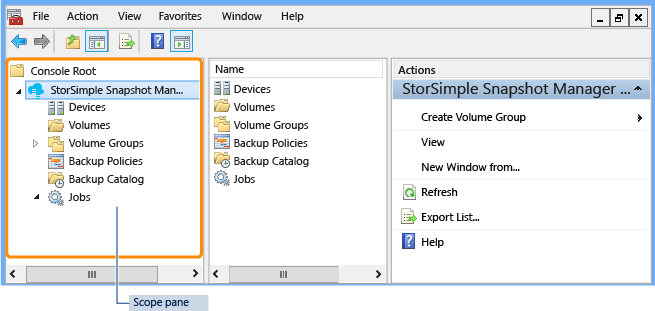 

**Figure 10: StorSimple Snapshot Manager Scope pane**

- To expand or collapse a node, click the arrow icon next to the node name.

- To view the status or contents of a node, click the node name. The information appears in the **Results** pane. 

The **Scope** pane contains the following nodes: 

- [Devices node](#devices-node) 
- [Volumes node](#volumes-node) 
- [Volume Groups node](#volume-groups-node) 
- [Backup Policies node](#backup-policies-node) 
- [Backup Catalog node](#backup-catalog-node) 
- [Jobs node](#jobs-node) 

### Scope pane tasks

You can use the **Scope** pane to complete an action on a specific node. To select a task, do one of the following:

- Right-click the node, and then select the task from the menu that appears.

- Click the node, and then click **Action** on the menu bar. Select the task from the menu that appears.

- Click the node, and then select the action in the **Actions** pane.

When you select a node and use any of these methods to see a task list, only those actions that can be performed on that node are shown.

### Devices node

The **Devices** node represents the StorSimple devices and StorSimple virtual devices that are connected to StorSimple Snapshot Manager. Select this node to connect and configure a device, and import its associated volumes, volumes groups, and existing backup copies. Multiple devices can be connected to a single host.

- To expand the node, click the arrow icon next to **Devices**.

- To see a menu of available actions, right-click the **Devices** node or right-click any of the nodes that appear in the expanded view.

- To see a list of configured devices, click **Devices** in the **Scope** pane. The list of devices, together with information about each device, appears in the **Results** pane.

### Volumes node

The **Volumes** node represents the drives that correspond to the volumes mounted by the host, including those discovered through iSCSI and those discovered through a device. Use this node to view the list of available volumes and assign individual volumes to volume groups.

- To expand the node, click the arrow icon next to **Volumes**.

- To see a menu of available actions, right-click the **Volumes** node or right-click any of the nodes that appear in the expanded view.

- To see a list of volumes, click **Volumes** in the **Scope** pane. The list of volumes, together with information about each volume, appears in the **Results** pane.

### Volume Groups node

Volume groups are also known as consistency groups. Each volume group is a pool of application-related volumes that helps to ensure application consistency during backup operations. Use the **Volume Groups** node to configure these groups and to take interactive backups or create backup schedules. 

- To expand the node, click the arrow icon next to **Volume Groups**.

- To see a menu of available actions, right-click the **Volume Groups** node or right-click any of the nodes that appear in the expanded view.

- To see a list of volume groups, click **Volume Groups** in the **Scope** pane. The list of volume groups, together with information about each volume group, appears in the **Results** pane.

### Backup Policies node

Backup policies are job schedules for local and cloud snapshots. Use the **Backup Policies** node to specify how often a backup is created and how long a backup should be retained. 

- To expand the node, click the arrow icon next to **Backup Policies**.

- To see a menu of available actions, right-click the **Backup Policies** node or right-click any of the nodes that appear in the expanded view.

- To see a list of backup policies, click **Backup Policies** in the **Scope** pane. The list of backup policies, together with information about each policy, appears in the **Results** pane.

>[AZURE.NOTE] You can retain a maximum of 64 backups.

### Backup Catalog node

The **Backup Catalog** node contains lists of on-site and off-site backups of Azure StorSimple volumes. This node is organized by volume group, and each volume group container contains separate structures for local snapshots (the **Local Snapshot**s node) and cloud snapshots (the **Cloud Snapshots** node). When expanded, each volume group container lists all the successful backups that were taken interactively or by a configured policy.

- To expand the node, click the arrow icon next to **Backup Catalog**.

- To see a menu of available actions, right-click the **Backup Catalog** node or right-click any of the nodes that appear in the expanded view.

- To see a list of backup snapshots, click **Backup Catalog** in the **Scope** pane. The list of snapshots, together with information about each snapshot, appears in the **Results** pane.

### Local Snapshots node

The **Local Snapshots** node lists local snapshots for a specific volume group. The node is located under the **Backup Catalog** node in the **Scope** pane. Local snapshots are point-in-time copies of volume data that are stored on the Azure StorSimple device. Typically, this type of backup can be created and restored quickly. You can use a local snapshot as you would a local backup copy.

- To expand the node, click the arrow icon next to **Local Snapshots**.

- To see a menu of available actions, right-click the **Local Snapshots** node or right-click any of the nodes that appear in the expanded view.

- To see a list of local snapshots, click **Local Snapshots** in the **Scope** pane. The list of snapshots, together with information about each snapshot, appears in the **Results** pane.

### Cloud Snapshots node

The **Cloud Snapshots** node lists cloud snapshots for a specific volume group. The node is located under the **Backup Catalog** node in the **Scope** pane. Cloud snapshots are point-in-time copies of volume data that are stored in the cloud. A cloud snapshot is equivalent to a snapshot replicated on a different, off-site storage system. Cloud snapshots are particularly useful in disaster recovery scenarios.

- To expand the node, click the arrow icon next to **Cloud Snapshots**.

- To see a menu of available actions, right-click the **Cloud Snapshots** node or right-click any of the nodes that appear in the expanded view.

- To see a list of cloud snapshots, click **Cloud Snapshots** in the **Scope** pane. The list of snapshots, together with information about each snapshot, appears in the **Results** pane.

### Jobs node

The **Jobs** node contains information about scheduled, running, and recently completed backup jobs. 

- To expand the node, click the arrow icon next to **Jobs**.

- To see a menu of available actions, right-click the **Jobs** node or right-click any of the nodes that appear in the expanded view.

- To see a list of scheduled jobs, expand the **Jobs** node, and then click **Scheduled**. The list of previously configured jobs and information about each job appears in the **Results** pane. 

- To see a list of recently completed jobs, expand the **Jobs** node, and then click **Last 24 Hours**. A list of jobs that were completed in the last 24 hours appears in the **Results** pane. The **Results** pane also contains information about each completed job.

- To see a list of jobs that are currently running, expand the **Jobs** node, and then click **Running**. The list of currently running jobs and information about each job appears in the **Results** pane.

## Results pane

The **Results** pane is the center pane in the StorSimple Snapshot Manager UI. It contains lists and detailed status information for the node you selected in the **Scope** pane.

### Example

To see the following example, click the **Volume Groups** node in the **Scope** pane. The **Results** pane displays a list of volume groups with details about each group.

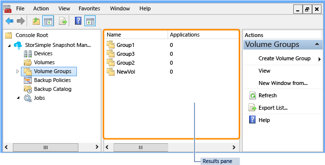 

**Figure 11: StorSimple Snapshot Manager Results pane**

You can configure the details shown in the **Results** pane: right-click a node in the **Scope** pane, click **View**, and then click **Add/Remove Columns**.

## Actions pane

The **Actions** pane is the right pane in the StorSimple Snapshot Manager UI. It contains a menu of operations that you can perform on the node, view, or data that you select in the **Scope** pane or **Results** pane. The **Actions** pane contains the same commands as the **Action** menus that are available for items in the **Scope** pane and **Results** pane. For a description of each action, see the table in the **Action** menu section.

### Examples

To see the following example, in the **Scope** pane, expand the **Jobs** node and click **Scheduled**. The **Actions** pane displays the available actions for the **Scheduled** node.

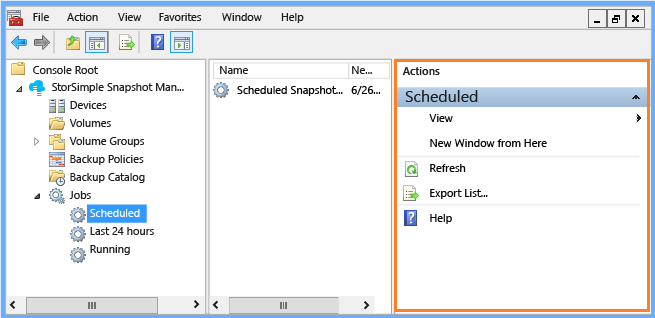 

**Figure 12: StorSimple Snapshot Manager Actions pane (scheduled jobs)** 

To see more options, in the **Scope** pane, expand the **Jobs** node, click **Scheduled**, and then click a scheduled job in the **Results** pane. The **Actions** pane displays the available actions for the scheduled job, as shown in the following example.

**Figure 13: StorSimple Snapshot Manager Actions pane (for a specific job)** 

## Keyboard navigation and shortcuts

StorSimple Snapshot Manager enables the accessibility features of the Windows operating system and the Microsoft Management Console (MMC). It also includes some keyboard navigation features and shortcuts that are specific to the StorSimple Snapshot Manager, as described in the following sections.
 
- [Keyboard navigation keys](#keyboard-navigation-keys) 
- [Menu bar shortcut keys](#menu-bar-shortcut-keys) 
- [Scope pane shortcut keys](#scope-pane-shortcut-keys) 

### Keyboard navigation keys

The following table describes the keys that you can use to navigate the StorSimple Snapshot Manager user interface. 

| Navigation key  | Action  |
|:----------------|:--------| 
| Down arrow key | Use the down arrow key to move vertically to the next item in a menu or pane. |
| Enter | Press the Enter key to complete an action and then proceed to the next step. For example, you can press Enter to select **Next**, **OK**, or **Create**, and then go to the next step in a wizard.|
| Esc | Press the Esc key to close a menu or to cancel and close a page.|
| F1 | Press the F1 key to view a help topic for the currently active window.|
| F5 | Press the F5 key to refresh a node. |
| F6 | Press the F6 key to move from the **Scope** pane to the **Results** pane.|
| F10 | Press the F10 key to go to the menu bar. |
| Left arrow key | Use the left arrow key to move horizontally from a menu bar option to the previous option. When you move to the previous item on the menu bar, the action (or context) menu for the previous item appears. |
| Right arrow key | Use the right arrow key to move horizontally from one menu bar option to the next. When you move to the next item on the menu bar, the action (or context) menu for the new item appears.
| Tab key | Use the Tab key to move to the next pane on the console or to the next selection or text box in a page. |
| Up arrow key | Use the up arrow key to move vertically to the previous item on a menu or pane. |

### Menu bar shortcut keys

The following table describes the shortcut key combinations for the menu bar. After you press the shortcut keys and the menu opens, you can use menu shortcut keys (the underlined keys on the menu). For more information about the menu bar, go to [Menu bar](#menu-bar).

| Shortcut | Result                    | Menu Shortcut Key | Result          |
|:---------|:--------------------------|:------------------|:----------------|
| ALT+F    | Opens the **File** menu.  | N | Opens a new console instance.   |
|          |                           | O | Opens the **Administrative Tools** page. |
|          |                           | S | Saves the StorSimple Snapshot Manager console.|
|          |                           | A | Opens the **Save As** page. |
|          |                           | M | Opens the **Add/Remove Snap-in** page.|
|          |                           | P | Opens the **Options** page. |
|          |                           | H | Opens online Help.|
| ALT+A    | Opens the **Action** menu.| I | Turns the import display option on and off.|
|          |                           | W | Opens a new StorSimple Snapshot Manager console.|
|          |                           | F | Updates the StorSimple Snapshot Manager console.|
|          |                           | L | Opens the **Export List** page. 
|          |                           | H | Opens online Help.|
| ALT+V    | Opens the **View** menu.  | A | Opens the **Add/Remove Columns** page. |
|          |                           | U | Opens the **Customize View** page. |
| ALT+O    | Opens the **Favorites** menu. | A | Opens the **Add to Favorites** page. |
|          |                           | O | Opens the **Organize Favorites** page.|
| ALT+W    | Opens the **Window** menu.| N | Opens another StorSimple Snapshot Manager window.|
|          |                           | C | Displays all open console windows in a cascading style.|
|          |                           | T | Displays all open console windows in a grid pattern. |
|          |                           | I | Arranges icons in a horizontal row at the bottom of your screen.|
| ALT+H    | Opens the **Help** menu.  | H | Opens online Help.|
|          |                           | T | Opens the Microsoft TechNet Tech Center web page.|
|          |                           | A | Opens the **About Microsoft Management Console** page. |
 
### Scope pane shortcut keys

The following tables show the shortcut key combinations for each node in the **Scope** pane. 

- [Devices node shortcut keys](#devices-node-shortcut-keys)
- [Volumes node shortcut keys](#volumes-node-shortcut-keys)
- [Volume Groups node shortcut keys](#volume-groups-node-shortcut-keys)
- [Backup Policies node shortcut keys](#backup-policies-node-shortcut-keys)
- [Backup Catalog node shortcut keys](#backup-catalog-node-shortcut-keys)
- [Jobs node shortcut keys](#jobs-node-shortcut-keys)

#### Devices node shortcut keys

| Menu Shortcut | Result                               |
|:--------------|:-------------------------------------|
| C             | Opens the **Configure a Device** page. |
| D             | Refreshes the list of devices and device details.|
| V             | Opens the **View** menu. |
| W             | Opens a new StorSimple Snapshot Manager console focused on the **Details** node. |
| F             | Updates the StorSimple Snapshot Manager console. |
| L             | Opens the **Export List** page. 
| H             | Opens online Help.|
 

#### Volumes node shortcut keys

| Menu Shortcut   | Result                              |
|:----------------|:------------------------------------|
| V               | Updates the list of volumes.        |
| V (press twice) | Opens the **View** menu.            |
| W               | Opens a new StorSimple Snapshot Manager console focused on the **Volumes** node.|
| F               | Updates the StorSimple Snapshot Manager console.|
| L               | Opens the **Export List** page. 
| H               | Opens online Help.|
 
#### Volume Groups node shortcut keys

| Menu Shortcut   | Result                              |
|:----------------|:------------------------------------|
| G               | Opens the **Create a Volume Group** page. |
| V               | Opens the **View** menu. |
| W               | Opens a new StorSimple Snapshot Manager console focused on the **Volume Groups** node.|
| F               | Updates the StorSimple Snapshot Manager console. |
| L               | Opens the **Export List** page. |
| H               | Opens online Help.|

#### Backup Policies node shortcut keys

| Menu Shortcut   | Result                              |
|:----------------|:------------------------------------|
| B               | Opens the **Create a Policy** page. |
| V               | Opens the **View** menu.            |
| W               | Opens a new StorSimple Snapshot Manager console focused on the **Volume Groups** node.|
| F               | Updates the StorSimple Snapshot Manager console.|
| L               | Opens the **Export List **page. 
| H               | Opens online Help.|
 
#### Backup Catalog node shortcut keys

| Menu Shortcut   | Result                              |
|:----------------|:------------------------------------|
| W               | Opens a new StorSimple Snapshot Manager console focused on the **Volume Groups** node. |
| F               | Updates the StorSimple Snapshot Manager console. |
| H               | Opens online Help.|
 
#### Jobs node shortcut keys

| Menu Shortcut   | Result                              |
|:----------------|:------------------------------------|
| V               | Opens the **View** menu.            |
| W               | Opens a new StorSimple Snapshot Manager console focused on the **Jobs** node.|
| F               | Updates the StorSimple Snapshot Manager console.|
| L               | Opens the **Export List** page.     |
| H               | Opens online Help                   |
 
## Next steps

[Learn how to use StorSimple Snapshot Manager to connect and manage devices](storsimple-snapshot-manager-manage-devices.md).