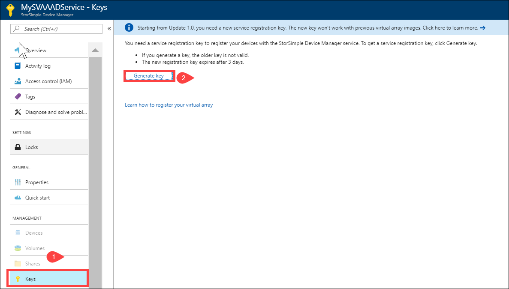
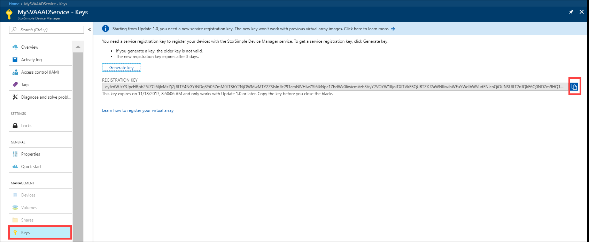

# Use the new authentication for your StorSimple

## Overview

[!INCLUDE [storsimple-virtual-array-eol-banner](../../includes/storsimple-virtual-array-eol-banner.md)]

The StorSimple Device Manager service runs in Microsoft Azure and connects to multiple StorSimple Virtual Arrays. To date, StorSimple Device Manager service has used an Access Control service (ACS) to authenticate the service to your StorSimple device. The ACS mechanism will be deprecated soon and replaced by an Azure Active Directory (AAD) authentication.

The information contained in this article is applicable to both StorSimple 1200 Series Virtual Arrays only. This article describes the details of the AAD authentication and the associated new service registration key and modifications to the firewall rules as applicable to the StorSimple devices.

The AAD authentication occurs in StorSimple Virtual Arrays (model 1200) running Update 1 or later.

Due to the introduction of the AAD authentication, changes occur in:

- URL patterns for firewall rules.
- Service registration key.

These changes are discussed in detail in the following sections.

## URL changes for AAD authentication

To ensure that the service uses AAD-based authentication, all the users must include the new authentication URLs in their firewall rules.

If using StorSimple Virtual Array, ensure that the following URL is included in the firewall rules:

| URL pattern                         | Cloud | Component/Functionality         |
|------------------------------------|-------|---------------------------------|
| `https://login.windows.net`        | Azure Public |AAD authentication service      |
| `https://login.microsoftonline.us` | US Government |AAD authentication service      |

For a complete list of URL patterns for StorSimple Virtual Arrays, go to [URL patterns for firewall rules](storsimple-ova-system-requirements.md#url-patterns-for-firewall-rules).

If the authentication URL is not included in the firewall rules beyond the deprecation date, the users see a critical alert that their StorSimple device could not authenticate with the service. The service will not be able to communicate with the device. If the users see this alert, they need to include the new authentication URL. For more information on the alert, go to [Use alerts to monitor your StorSimple device](storsimple-virtual-array-manage-alerts.md#networking-alerts).

## Device version and authentication changes

If using a StorSimple Virtual Array, use the following table to determine what action you need to take based on the device software version you are running.

| If your device is running  | Take the following action                                    |
|----------------------------|--------------------------------------------------------------|
| Update 1.0 or later and is offline.   You see an alert that the URL is not whitelisted.| 1. Modify the firewall rules to include the authentication URL. See [authentication URLs](#url-changes-for-aad-authentication).   2. [Get the AAD registration key from the service](#aad-based-registration-keys).   3. Perform steps 1-5 to [Connect to the Windows PowerShell interface of the virtual array](storsimple-virtual-array-deploy2-provision-hyperv.md#step-2-provision-a-virtual-array-in-hypervisor).  4. Use `Invoke-HcsReRegister` cmdlet to register the device through the Windows PowerShell. Supply the key you got in the previous step.|
| Update 1.0 or later and the device is online.| No action is required.                                       |
| Update 0.6 or earlier and the device is offline. | 1. [Download Update 1.0 through catalog server](storsimple-virtual-array-install-update-1.md#download-the-update-or-the-hotfix). 2. [Apply Update 1.0 through the local web UI](storsimple-virtual-array-install-update-1.md#install-the-update-or-the-hotfix). 3. [Get the AAD registration key from the service](#aad-based-registration-keys).  4. Perform steps 1-5 to [Connect to the Windows PowerShell interface of the virtual array](storsimple-virtual-array-deploy2-provision-hyperv.md#step-2-provision-a-virtual-array-in-hypervisor). 5. Use `Invoke-HcsReRegister` cmdlet to register the device through the Windows PowerShell. Supply the key you got in the previous step.|
| Update 0.6 or earlier and the device is online | Modify the firewall rules to include the authentication URL.  Install Update 1.0 through the Azure portal. |

## AAD-based registration keys

Beginning Update 1.0 for StorSimple Virtual Arrays, new AAD-based registration keys are used. You use the registration keys to register your StorSimple Device Manager service with the device.

You cannot use the new AAD service registration keys if you are using a StorSimple Virtual Arrays running Update 0.6 or earlier. You need to regenerate the service registration key. Once you regenerate the key, the new key is used for registering all the subsequent devices. The old key is no longer valid.

- The new AAD registration key expires after 3 days.
- The AAD registration keys work only with StorSimple 1200 series virtual arrays running Update 1 or later. The AAD registration key from a StorSimple 8000 series device will not work.
- The AAD registration keys are longer than the corresponding ACS registration keys.

Perform the following steps to generate an AAD service registration key.

#### To generate the AAD service registration key

1. In **StorSimple Device Manager**, go to **Management &gt;** **Keys**.
    
    

2. Click **Generate key**.

    

3. Copy the new key. The older key no longer works.

    

## Next steps

* Learn more about how to deploy [StorSimple Virtual Array](storsimple-virtual-array-deploy1-portal-prep.md)
