# Back up shares or volumes on your StorSimple Virtual Array

## Overview

The StorSimple Virtual Array is a hybrid cloud storage on-premises virtual device that can be configured as a file server or an iSCSI server. The virtual array allows the user to create scheduled and manual backups of all the shares or volumes on the device. When configured as a file server, it also allows item-level recovery. This tutorial describes how to create scheduled and manual backups and perform item-level recovery to restore a deleted file on your virtual array.

This tutorial applies to the StorSimple Virtual Arrays only. For information on 8000 series, go to [Create a backup for 8000 series device](storsimple-manage-backup-policies-u2.md)

## Back up shares and volumes

Backups provide point-in-time protection, improve recoverability, and minimize restore times for shares and volumes. You can back up a share or volume on your StorSimple device in two ways: **Scheduled** or **Manual**. Each of the methods is discussed in the following sections.

## Change the backup start time

> [!NOTE]
> In this release, scheduled backups are created by a default policy that runs daily at a specified time and backs up all the shares or volumes on the device. It is not possible to create custom policies for scheduled backups at this time.

Your StorSimple Virtual Array has a default backup policy that starts at a specified time of day (22:30) and backs up all the shares or volumes on the device once a day. You can change the time at which the backup starts, but the frequency and the retention (which specifies the number of backups to retain) cannot be changed. During these backups, the entire virtual device is backed up. This could potentially impact the performance of the device and affect the workloads deployed on the device. Therefore, we recommend that you schedule these backups for off-peak hours.

 To change the default backup start time, perform the following steps in the [Azure portal](https://portal.azure.com/).

#### To change the start time for the default backup policy

1. Go to **Devices**. The list of devices registered with your StorSimple Device Manager service will be displayed. 
   
    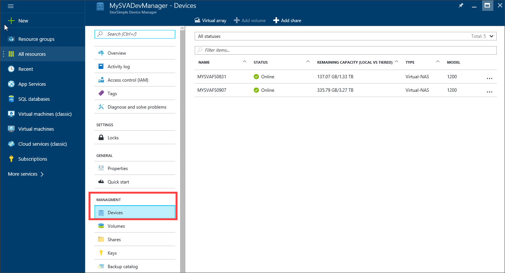

2. Select and click your device. The **Settings** blade will be displayed. Go to **Manage > Backup policies**.
   
    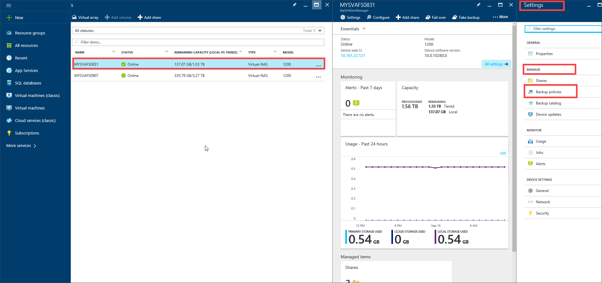

3. In the **Backup policies** blade, the default start time is 22:30. You can specify the new start time for the daily schedule in device time zone.
   
    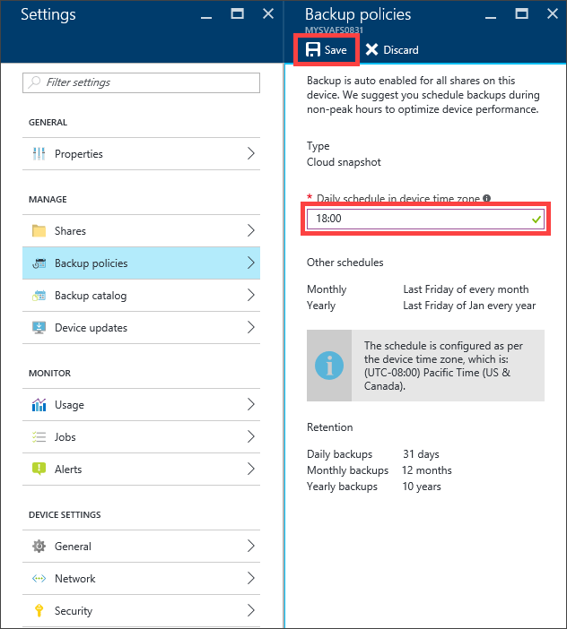

4. Click **Save**.

### Take a manual backup

In addition to scheduled backups, you can take a manual (on-demand) backup of device data at any time.

#### To create a manual backup

1. Go to **Devices**. Select your device and right-click **...** at the far right in the selected row. From the context menu, select **Take backup**.
   
    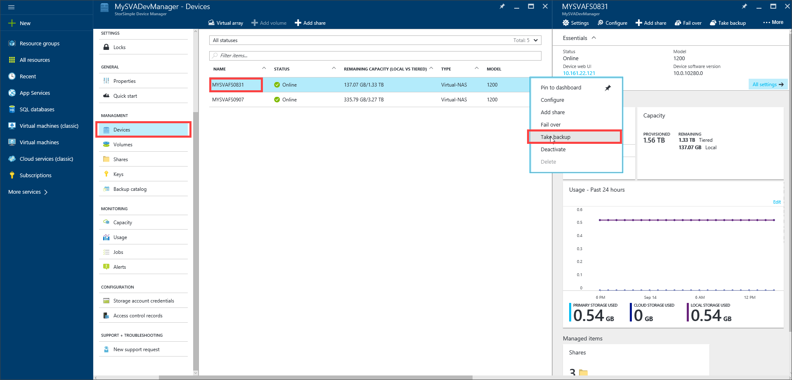

2. In the **Take backup** blade, click **Take backup**. This will backup all the shares on the file server or all the volumes on your iSCSI server. 
   
    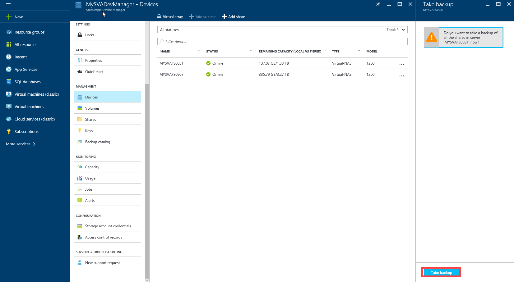
   
    An on-demand backup starts and you see that a backup job has started.
   
     
   
    Once the job has successfully completed, you are notified again. The backup process then starts.
   
    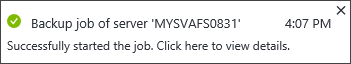

3. To track the progress of the backups and look at the job details, click the notification. This takes you to  **Job details**.
   
     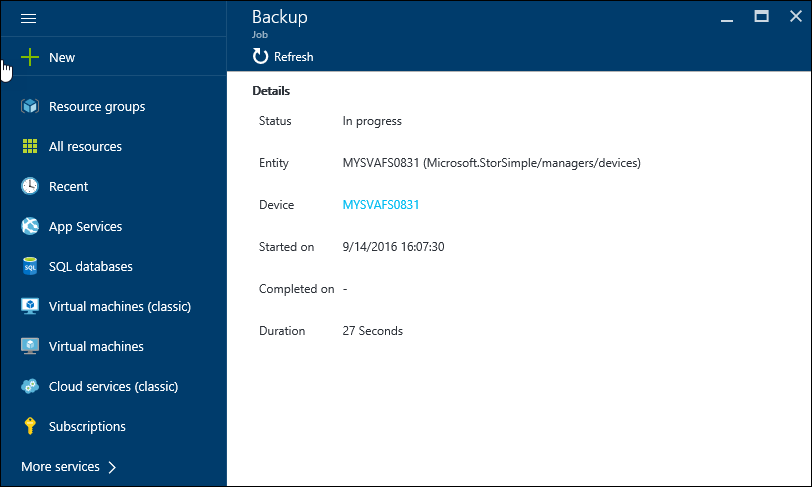

4. After the backup is complete, go to **Management > Backup catalog**. You will see a cloud snapshot of all the shares (or volumes) on your device.
   
    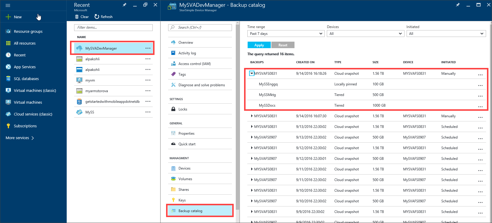 

## View existing backups
To view the existing backups, perform the following steps in the Azure portal.

#### To view existing backups

1. Go to **Devices** blade. Select and click your device. In the **Settings** blade, go to **Management > Backup Catalog**.
   
    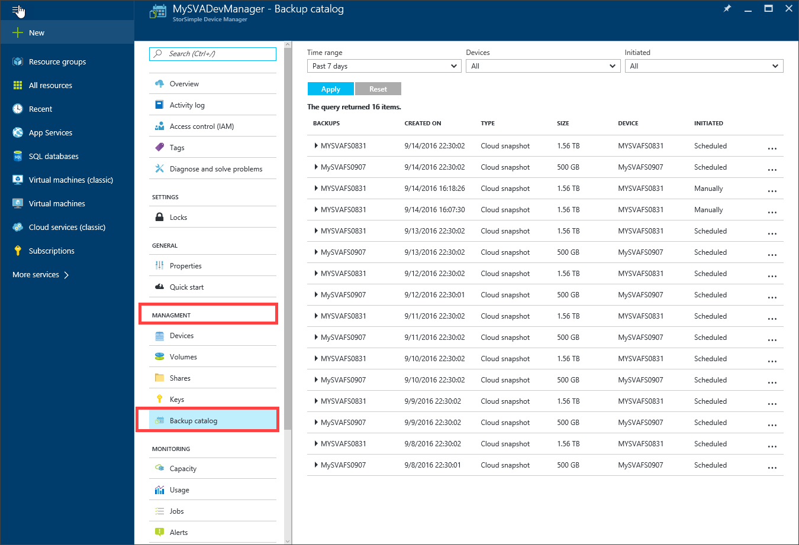
2. Specify the following criteria to be used for filtering:
   
   - **Time range** – can be **Past 1 hour**, **Past 24 hours**, **Past 7 days**, **Past 30 days**, **Past year**, and **Custom date**.
    
   - **Devices** – select from the list of file servers or iSCSI servers registered with your StorSimple Device Manager service.
   
   - **Initiated** – can be automatically **Scheduled** (by a backup policy) or **Manually** initiated (by you).
   
     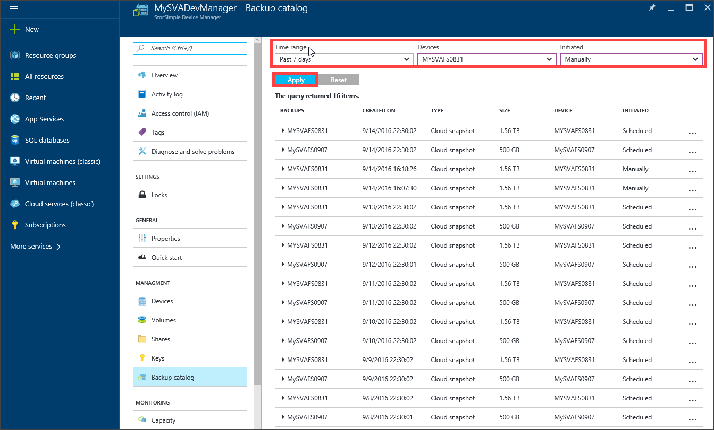

3. Click **Apply**. The filtered list of backups is displayed in the **Backup catalog** blade. Note only 100 backup elements can be displayed at a given time.
   
    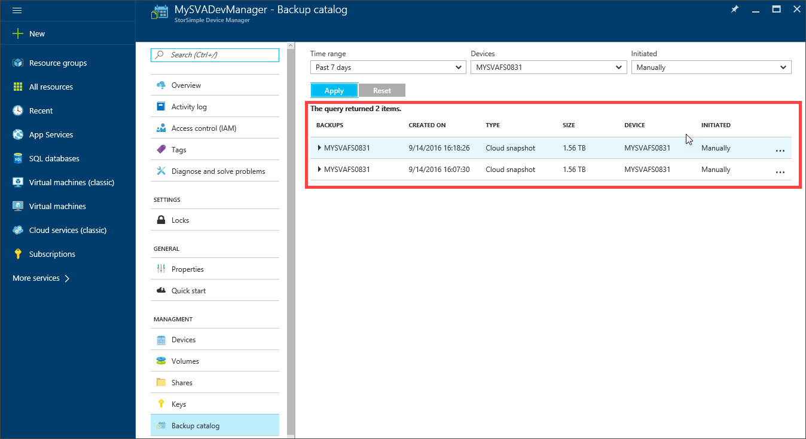

## Next steps

Learn more about [administering your StorSimple Virtual Array](storsimple-ova-web-ui-admin.md).

